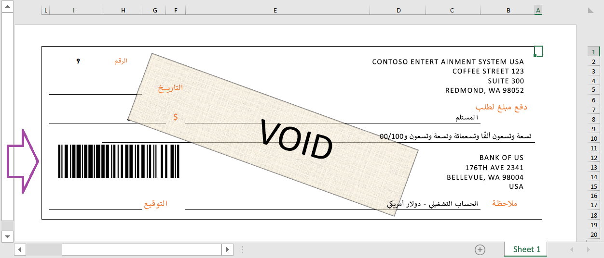

يتم دعم مصادر بيانات الباركود في التقارير الإلكترونية (ER). يمكنك إنشاء صورة تشبه الرمز الشريطي لأي نص. يمكنك استخدام مصادر البيانات من نوع **الرمز الشريطي** لإنتاج صور الرموز الشريطية عند تكوين تنسيق التقارير الإلكترونية. يمكن بعد ذلك إضافة الصور إلى مستندات الشركة مثل الطلبات والفواتير وإيصالات التعبئة والإيصالات التي تم إعدادها. يمكنك أيضاً استخدامها على ملصقات المنتجات والأرفف، بالإضافة إلى ملصقات التعبئة والشحن.

 

باستخدام مصدر بيانات من نوع **الرمز الشريطي** يمكنك إنشاء رموز شريطية بالتنسيقات التالية:

- الرموز الشريطية أحادية البعد:
    - Codabar
    - الكود 39
    - الكود 93
    - الكود 128
    - EAN-8
    - EAN-13
    - ITF-14
    - البريد الذكي (IMB)
    - MSI
    - Plessey
    - PDF417
    - UPC-A
    - UPC-E
- الأكواد الشريطية ثنائية الأبعاد:
    - Aztec
    - مصفوفة البيانات
    - رمز الاستجابة السريعة
          
لمزيد من المعلومات، راجع [استخدام مصادر بيانات الكود الشريطي لإنشاء صور رموز شريطية](/dynamics365/fin-ops-core/dev-itpro/analytics/er-barcode-data-sources?toc=/dynamics365/finance/toc.json/?azure-portal=true).

