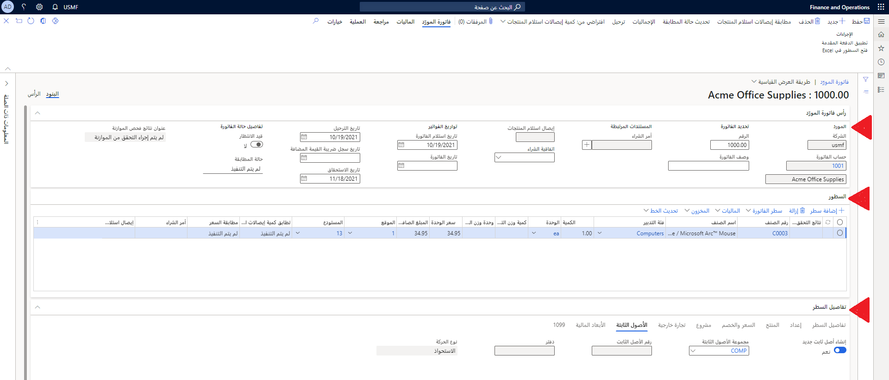

## السيناريو - تكوين مكونات الأصول الثابتة

باستخدام دور **المحاسب**، ستقوم بإعداد ملفات تعريف ترحيل الأصول الثابتة وأنواع الحركات المتعددة.  والأمثلة الموضحة في المعمل خاصة بملف تعريف الترحيل الأساسي، رغم أنه يجب إنشاء ملفات تعريف الترحيل لمخطط محدد للحسابات ومتطلبات التقارير المالية الخاصة بك.

### إعداد ملفات تعريف ترحيل الأصول الثابتة

1.  في الشركة **USMF**، انتقل إلى **الأصول الثابتة > إعداد > ملفات تعريف ترحيل الأصول الثابتة**.
2.  حدد **جديد**.
3.  في الحقل **ملف تعريف الترحيل**، اكتب **FAPP**.
4.  في الحقل **الوصف**، اكتب **ملف تعريف ترحيل الأصول الثابتة**. 

    ستحتاج إلى إنشاء ملف تعريف ترحيل لكل نوع حركة أصل ثابت ستستخدمه عند التعامل مع الأصول الثابتة. ابدأ بنوع حركة **الاستحواذ**.

5.  حدد **إضافة** ضمن **حسابات دفتر الأستاذ**.

6.  في الحقل **الدفتر**، أدخل **SLLR**.
    
    يسمح لك الحقل **التجميعات** بتحديد ملف تعريف الترحيل وصولاً إلى "الجدول" (إعداد حساب واحد لكل أصل ثابت) أو "المجموعة" (إعداد حساب واحد لكل مجموعة أصول ثابتة). بالنسبة إلى هذا المعمل، يتم تعيين القيمة على **الكل** لتطبيقها على كافة الأصول الثابتة باستخدام الدفتر المحدد.
7.  في الحقل **الحساب الرئيسي**، حدد **180100**.
8.  في الحقل **الحساب** **المقابل**، حدد **300160**. 
9.  في الحقل **نوع الحركة** من القائمة المنسدلة الموجود ضمن **حسابات دفتر الأستاذ**، حدد **تسوية الاستحواذ**.
10.  حدد **إضافة** مرة أخرى ضمن **حسابات دفتر الأستاذ**.
11.  في الحقل **الدفتر**، أدخل **SLLR**.
12.  في الحقل **الحساب الرئيسي**، حدد **180100**.
13.  في الحقل **الحساب** **المقابل**، حدد **300160**. 
14. في الحقل **نوع الحركة**، حدد **إهلاك**.
15. حدد **إضافة**.
16. في الحقل **الدفتر**، أدخل **SLLR**.
17. في الحقل **الحساب** **الرئيسي**، حدد **180200**.
18. في الحقل **الحساب المقابل**، حدد **607200**.
19. في القائمة المنسدلة **نوع الحركة**، حدد **تسوية الإهلاك**.
1. حدد **إضافة**.
2. في الحقل **الدفتر**، أدخل **SLLR**.
3. في الحقل **الحساب** **الرئيسي**، حدد **180200**.
4. في الحقل **الحساب** **المقابل**، حدد **607200**.
5. في الحقل **نوع** **الحركة**، حدد **التخلص - بيع**.
6. حدد **إضافة**.
7. في الحقل **الدفتر**، أدخل أو حدد **‎SLLR**.
8. في الحقل **الحساب** **الرئيسي**، حدد **801100**.
9. في الحقل **الحساب** **المقابل**، حدد **801100**.
1. في الحقل **نوع** **الحركة**، حدد **التخلص - خردة**.
2. حدد **إضافة**.
3. في الحقل **الدفتر**، أدخل أو حدد **‎SLLR**.
4. في الحقل **الحساب** **الرئيسي**، حدد **801100**.
5. في الحقل **الحساب** **المقابل**، حدد **801100**.
6. قم بتوسيع علامة التبويب السريعة **التخلص**. إعداد ملفات تعريف ترحيل التخلص لكل من البيع والخردة.
7. البدء بحركات بيع التخلص. حدد **إضافة**.
8. في الحقل **الدفتر**، أدخل أو حدد **‎SLLR**.
9. في الحقل **قيمة** **الترحيل**، حدد **قيمة الاستحواذ**.
    
    ستعالج قيمة الاستحواذ "قيم الاستحواذ وتسوية الاستحواذ" لجميع السنوات. يمكنك أيضاً تحديد الحسابات لأنواع الحركات هذه بشكل منفصل.
    
    يمكنك تحديد عملية التخلص لاستخدام حسابات مختلفة، وذلك وفقاً لما إذا كان التخلص ينتج عنه ربح أو خسارة. يتم تعيين **نوع قيمة المبيعات** على **الكل** لاستخدام الحسابات نفسها لجميع أنواع التخلص.
10. في الحقل **الحساب** **الرئيسي**، حدد **180100**.
11. في الحقل **الحساب** **المقابل**، حدد **180200**.
12. حدد **إضافة**.
13. في الحقل **الدفتر**، أدخل أو حدد **‎SLLR**.
14. في الحقل **قيمة الترحيل**، حدد **الإهلاك (السنوات السابقة)**.
15. في الحقل **الحساب** **الرئيسي**، حدد **180100**.
16. في الحقل **الحساب** **المقابل**، حدد **180200**.
17. حدد **إضافة**.
18. في الحقل **الدفتر**، أدخل أو حدد **‎SLLR**.
19. في الحقل **قيمة** **الترحيل**، حدد **الإهلاك (السنة الحالية)**.
20. في الحقل **الحساب** **الرئيسي**، حدد **180100**.
21. في الحقل **الحساب** **المقابل**، حدد **180200**.
22. حدد **إضافة**.
23. في الحقل **الدفتر**، أدخل أو حدد **‎SLLR**.
24. في الحقل **قيمة الترحيل**، حدد **تسويات الإهلاك (السنوات السابقة)**.
25. في الحقل **الحساب الرئيسي**، حدد **180100**.
26. في الحقل **الحساب المقابل**، حدد **180200**.
27. حدد **إضافة**.
28. في الحقل **الدفتر**، أدخل أو حدد **‎SLLR**.
29. في الحقل **قيمة الترحيل**، حدد **تسويات الإهلاك (السنة الحالية)**.
30. في الحقل **الحساب الرئيسي**، حدد **180100**.
31. في الحقل **الحساب المقابل**، حدد **180200**.
32. حدد **إضافة**.
33. في الحقل **الدفتر**، أدخل أو حدد **‎SLLR**.
34. في الحقل **قيمة** **الترحيل**، حدد **صافي القيمة الدفترية**.
35. في الحقل **الحساب** **الرئيسي**، حدد **180100**.
36. في الحقل **الحساب** **المقابل**، حدد **180200**.
37. في الحقل **البيع** أو **الخردة**، حدد **الخردة**.
38. حدد **إضافة**.
39. في الحقل **الدفتر**، أدخل أو حدد **‎SLLR**.
40. في الحقل **قيمة الترحيل**، حدد **قيمة الاستحواذ**.
41. في الحقل **الحساب** **الرئيسي**، حدد **180100**.
42. في الحقل **الحساب** **المقابل**، حدد **180200**.
43. حدد **إضافة**.
44. في الحقل **الدفتر**، أدخل أو حدد **‎SLLR**.
45. في الحقل **قيمة الترحيل**، حدد **الإهلاك (السنوات السابقة)**.
46. في الحقل **الحساب** **الرئيسي**، حدد **180100**.
47. في الحقل **الحساب** **المقابل**، حدد **180200**.
48. حدد **إضافة**.
49. في الحقل **الدفتر**، أدخل أو حدد **‎SLLR**.
50. في الحقل **قيمة الترحيل**، حدد **الإهلاك (السنة الحالية)**.
51. في الحقل **الحساب** **الرئيسي**، حدد **180100**.
52. في الحقل **الحساب** **المقابل**، حدد **180200**.
53. حدد **إضافة**.
54. في الحقل **الدفتر**، أدخل أو حدد **‎SLLR**.
55. في الحقل **قيمة الترحيل**، حدد **تسويات الإهلاك (السنوات السابقة)**.
56. في الحقل **الحساب** **الرئيسي**، حدد **180100**.
57. في الحقل **الحساب** **المقابل**، حدد **180200**.
58. حدد **إضافة**.
59. في الحقل **الدفتر**، أدخل أو حدد **‎SLLR**.
60. في الحقل **قيمة الترحيل**، حدد **تسويات الإهلاك (السنة الحالية)**.
61. في الحقل **الحساب** **الرئيسي**، حدد **180100**.
62. في الحقل **الحساب** **المقابل**، حدد **180200**.
63. حدد **إضافة**.
64. في الحقل **الدفتر**، أدخل أو حدد **‎SLLR**.
65. في الحقل **قيمة الترحيل**، حدد **صافي القيمة الدفترية**.
66. في الحقل **الحساب** **الرئيسي**، حدد **180100**.
67. في الحقل **الحساب** **المقابل**، حدد **180200**.
68. انقر فوق **حفظ** عند اكتمال جميع التحديثات.

## السيناريو - إنشاء الأصول من الحسابات الدائنة والاستحواذ عليها
ستقوم بإعداد معلمات الأصول الثابتة ثم إنشاء فاتورة مورّد جديدة.

### إعداد معلمات الأصول الثابتة

1.  في USMF، انتقل إلى **الأصول الثابتة > إعداد > معلمات الأصول الثابتة**
2.  قم بتوسيع القسم **أوامر الشراء**.
3.  تأكد من تمكين خيار **السماح بالحصول على الأصل من الشراء**.
4.  تأكد من تمكين خيار **إنشاء أصل أثناء ترحيل إيصال المنتج أو الفاتورة**.
5.  انقر على **حفظ**.

### إنشاء فاتورة مورد جديدة

1.  انتقل إلى **الحسابات الدائنة > مساحات عمل > إدخال فاتورة مورد**.
2.  حدد **فاتورة المورّد الجديدة**.
3.  في حقل **حساب الفاتورة**، حدد زر القائمة المنسدلة لفتح البحث.
4.  في القائمة، حدد حساباً مثل **1001**.
5.  في حقل **الرقم**، اكتب قيمة، مثل 1000.00.
6.  في الحقل **تاريخ الترحيل**، يتم تعيين التاريخ افتراضياً على التاريخ الحالي.
7.  حدد **إضافة سطر**.
8.  في الحقل **رقم الصنف**، حدد زر القائمة المنسدلة لفتح البحث. 

    يمكن استخدام إما الأصناف غير المخزنة أو فئات التدبير لامتلاك الأصل الثابت.

9.  في القائمة، حدد صنفاً مثل **C0003**.
10. في الحقل **كمية**، أدخل رقماً.

    سيقوم بند فاتورة واحد بإنشاء أصل ثابت واحد فقط، بغض النظر عن الكمية. سيتم تحويل قيمة حقل كمية الفواتير إلى كمية الأصل الثابت.

11.  في حقل **سعر الوحدة**، أدخل رقماً.
12.  قم بتوسيع قسم **‎‏‫تفاصيل البند** أو طيه.
13.  حدد علامة التبويب **الأصول الثابتة**.
14.  قم بتمكين الخيار **إنشاء أصل ثابت جديد**.
15.  في الحقل **مجموعة الأصول الثابتة**، حدد زر القائمة المنسدلة لفتح البحث.
16.  في القائمة، حدد مجموعة الأصول الثابتة المطلوب استخدامها عند إنشاء الأصل الثابت الجديد.
17.  في القائمة، انقر على الارتباط في الصف المحدد.
18.  انقر على **نشر**. سيتم إنشاء الأصل الثابت والاستحواذ عليه عند ترحيل الفاتورة.

## السيناريو - إعداد ملف تعريف الإهلاك وإنشاؤه
تحدد ملفات تعريف الإهلاك نوع الإهلاك لأحد الأصول ومدى تكراره.

### إنشاء ملف تعريف الإهلاك

1.  انتقل إلى **الأصول الثابتة > إعداد > ملفات تعريف الإهلاك**.
2.  حدد **جديد‏‎**.
3.  في حقل **ملف تعريف الإهلاك**، اكتب قيمة مثل **175%**.
4.  في الحقل **الاسم**، اكتب اسماً مثل **تقليل الرصيد بنسبة 175%**.
5.  في حقل **الأسلوب**، حدد خياراً، مثل **تقليل الرصيد 175%**.
6.  في الحقل **سنة الإهلاك**، حدد **تقويم**.
7.  في الحقل **تكرار الفترة**، حدد **سنوي**.
8.  اترك تبديل **الإهلاك بالكامل** على **لا**.
9.  حدد **حفظ**.
10. أغلق الصفحة.

    

### إنشاء دفتر

1.  انتقل إلى **الأصول الثابتة > إعداد > الدفاتر**.
2.  حدد **جديد‏‎**.
3.  في حقل **الدفتر**، اكتب قيمة، مثل **175 RB**.
4.  في الحقل **الوصف**، اكتب قيمة مثل **تقليل الرصيد بنسبة 175%**.
5.  حدد **نعم** في شريط التبديل **حساب الإهلاك**. عند تحديد **حساب الإهلاك**، سيتم تضمين دفتر الأصول المرتبط في مقترحات الإهلاك. في حالة عدم تحديد هذا الحقل، لن يتم إهلاك دفتر الأصول تلقائياً.
6.  في حقل **ملف تعريف الإهلاك**، أدخل أو حدد **تقليل الرصيد بنسبة 175%**.
7.  حدد **نعم** في الحقل **إنشاء تعديلات الإهلاك مع التعديلات الأساسية**.
8.  بشكل افتراضي، سيتم ترحيل حركات دفتر الأصول الثابتة إلى دفتر الأستاذ العام. يمكنك تعطيل الترحيل إلى دفتر الأستاذ العام الخاص بالدفتر من خلال تعيين حقل **الترحيل إلى دفتر الأستاذ العام** إلى **لا**. تُستخدم الدفاتر التي لا تقوم بالترحيل إلى دفتر الأستاذ العام عادة لأغراض إعداد التقارير الضريبية. يمنحك هذا مرونة إضافية لحذف الحركات التاريخية الخاصة بدفتر الأصول نظراً لعدم التزامها بدفتر الأستاذ العام.
9.  ويتم اعداد **طبقة الترحيل** افتراضياً على **الطبقة الحالية** إذا كان الدفتر يقوم بالترحيل إلى دفتر الأستاذ العام، وعلى **لا شيء** إذا لم يتم ترحيله إلى دفتر الأستاذ العام. قم بتحديث طبقة الترحيل إذا كنت ترغب في القيام بترحيل حركات لهذا الدفتر إلى طبقة مختلفة.
10. في القائمة المنسدلة **التقويم**، حدد **تقويم** للتقويم.
11. ستقوم الدفاتر المشتقة بترحيل الحركات إلى دفاتر مختلفة في نفس الوقت. يمكنك إنشاء الحركات باستخدام الدفتر الأساسي، وأثناء الترحيل، يتم ترحيل نسخة دقيقة من الحركة إلى الدفتر المشتق. لا تحدث إعادة الحساب مع حركات الدفتر المشتقة، لذلك لا ينبغي استخدامها لحركات الإهلاك.
12. حدد **حفظ**.

### إقران الدفتر بمجموعة الأصول الثابتة

1.  انتقل إلى **الأصول الثابتة > إعداد > مجموعات الأصول الثابتة**.
2.  حدد **جديد‏‎**.
3. في الحقل **مجموعة الأصول الثابتة**، اكتب قيمة، مثل القيمة **المعنوية**.
4.  في حقل **الاسم**، اكتب قيمة، مثل القيمة **المعنوية**.
5.  في القائمة المنسدلة **النوع**، حدد القيمة **المعنوية**.
6. في القائمة المنسدلة **النوع الرئيسي**، حدد النوع الرئيسي المرتبط، إن وجد. لهذا التمرين، حدد **COMP**.
7. حدد **نعم** في شريط التبديل **الترقيم التلقائي للأصول الثابتة**.  عند تعيين **الترقيم التلقائي للأصول الثابتة** إلى القيمة **نعم**، يقوم النظام تلقائياً بتعيين أرقام الأصول الثابتة. وفي حالة تعيين **الترقيم التلقائي للأصول الثابتة** إلى **لا**، سيتعين عليك إدخال رقم يدوياً.
8. في القائمة المنسدلة **كود التسلسل الرقمي**، حدد **< Tes_111**
9. حدد **دفاتر** من جزء الإجراءات.
10. في القائمة المنسدلة **الدفتر**، حدد القيمة **175 RB**.
11. في الحقل **مدة الخدمة**، أدخل **3**. يتم حساب فترات الإهلاك بعد تعيين **مدة الخدمة**.
12. حدد **حفظ**.
13. قم بإغلاق الصفحات.

 

