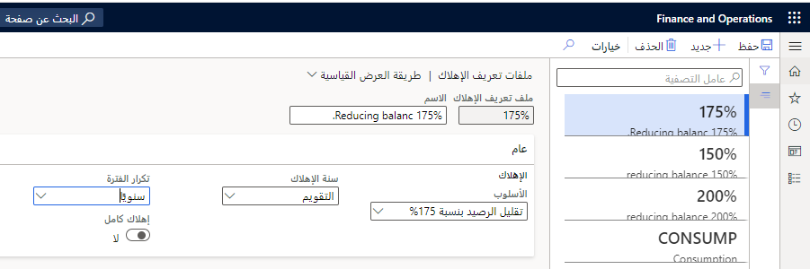

## السيناريو
تحدد ملفات تعريف الإهلاك نوع وتكرار الإهلاك لأحد الأصول.

## إنشاء ملف تعريف الإهلاك

1.  انتقل إلى **الأصول الثابتة > إعداد > ملفات تعريف الإهلاك**.
2.  حدد **جديد‏‎**.
3.  في حقل **ملف تعريف الإهلاك**، اكتب قيمة مثل **175%**.
4.  في الحقل **الاسم**، اكتب اسماً مثل **تقليل الرصيد بنسبة 175%**.
5.  في حقل **الأسلوب**، حدد خياراً، مثل **تقليل الرصيد 175%**.
6.  في الحقل **سنة الإهلاك**، حدد **تقويم**.
7.  في الحقل **تكرار الفترة**، حدد **سنوي**.
8.  اترك تبديل **الإهلاك بالكامل** على **لا**.
9.  حدد **حفظ**.
10. أغلق الصفحة.

    

## إنشاء دفتر

1.  انتقل إلى **الأصول الثابتة > إعداد > الدفاتر**.
2.  حدد **جديد‏‎**.
3.  في حقل **الدفتر**، اكتب قيمة، مثل **175 RB**.
4.  في الحقل **الوصف**، اكتب قيمة مثل **تقليل الرصيد بنسبة 175%**.
5.  حدد **نعم** في شريط التبديل **حساب الإهلاك**. عند تحديد **حساب الإهلاك**، سيتم تضمين دفتر الأصول المرتبط في مقترحات الإهلاك. في حالة عدم تحديد هذا الحقل، لن يتم إهلاك دفتر الأصول تلقائياً.
6.  في حقل **ملف تعريف الإهلاك**، أدخل أو حدد **تقليل الرصيد بنسبة 175%**.
7.  حدد **نعم** في الحقل **إنشاء تعديلات الإهلاك مع التعديلات الأساسية**.
8.  بشكل افتراضي، سيتم ترحيل حركات دفتر الأصول الثابتة إلى دفتر الأستاذ العام. يمكنك تعطيل الترحيل إلى دفتر الأستاذ العام الخاص بالدفتر من خلال تعيين حقل **الترحيل إلى دفتر الأستاذ العام** إلى **لا**. تُستخدم الدفاتر التي لا تقوم بالترحيل إلى دفتر الأستاذ العام عادة لأغراض إعداد التقارير الضريبية. يمنحك هذا مرونة إضافية لحذف الحركات التاريخية الخاصة بدفتر الأصول نظراً لعدم التزامها بدفتر الأستاذ العام.
9.  ويتم اعداد **طبقة الترحيل** افتراضياً على **الطبقة الحالية** إذا كان الدفتر يقوم بالترحيل إلى دفتر الأستاذ العام، وعلى **لا شيء** إذا لم يتم ترحيله إلى دفتر الأستاذ العام. قم بتحديث طبقة الترحيل إذا كنت ترغب في القيام بترحيل حركات لهذا الدفتر إلى طبقة مختلفة.
10. في القائمة المنسدلة **التقويم**، حدد **تقويم** للتقويم.
11. ستقوم الدفاتر المشتقة بترحيل الحركات إلى دفاتر مختلفة في نفس الوقت. يمكنك إنشاء الحركات باستخدام الدفتر الأساسي، وأثناء الترحيل، يتم ترحيل نسخة دقيقة من الحركة إلى الدفتر المشتق. لا تحدث إعادة الحساب مع حركات الدفتر المشتقة، لذلك لا ينبغي استخدامها لحركات الإهلاك.
12. حدد **حفظ**.

## إقران الدفتر بمجموعة الأصول الثابتة

1.  انتقل إلى **الأصول الثابتة > إعداد > مجموعات الأصول الثابتة**.
2.  حدد **جديد‏‎**.
3. في الحقل **مجموعة الأصول الثابتة**، اكتب قيمة، مثل القيمة **المعنوية**.
4.  في حقل **الاسم**، اكتب قيمة، مثل القيمة **المعنوية**.
5.  في القائمة المنسدلة **النوع**، حدد القيمة **المعنوية**.
6. في القائمة المنسدلة **النوع الرئيسي**، حدد النوع الرئيسي المرتبط، إن وجد. لهذا التمرين، حدد **COMP**.
7. حدد **نعم** في شريط التبديل **الترقيم التلقائي للأصول الثابتة**.  عند تعيين **الترقيم التلقائي للأصول الثابتة** إلى القيمة **نعم**، يقوم النظام تلقائياً بتعيين أرقام الأصول الثابتة. وفي حالة تعيين **الترقيم التلقائي للأصول الثابتة** إلى **لا**، سيتعين عليك إدخال رقم يدوياً.
8. في القائمة المنسدلة **كود التسلسل الرقمي**، حدد **< Tes_111**
9. حدد **دفاتر** من جزء الإجراءات.
10. في القائمة المنسدلة **الدفتر**، حدد القيمة **175 RB**.
11. في الحقل **مدة الخدمة**، أدخل **3**. يتم حساب فترات الإهلاك بعد تعيين **مدة الخدمة**.
12. حدد **حفظ**.
13. قم بإغلاق الصفحات.

