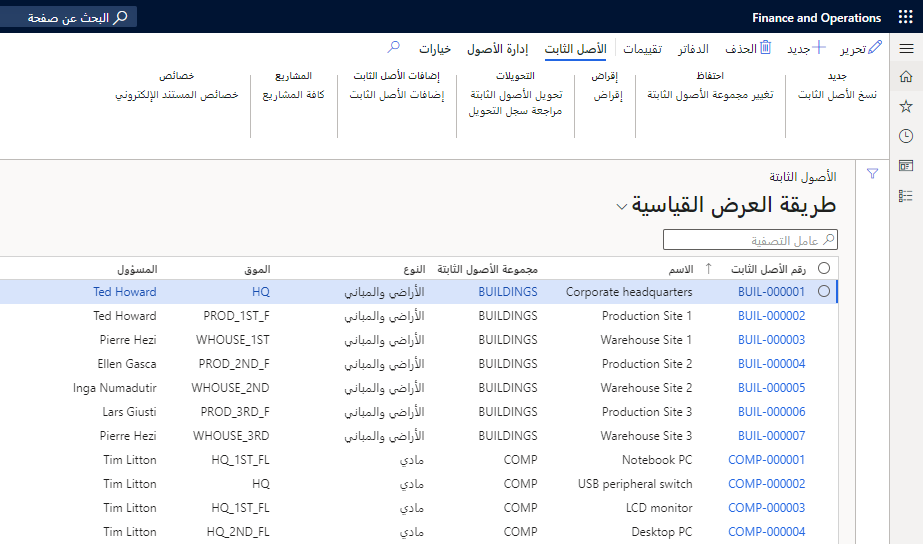

يتم التعامل مع جميع الأصول الثابتة على أنها حركات الميزانية العمومية في السنة التي تم الحصول عليها فيها، ويتم ترحيلها كأصل إلى حساب الميزانية العمومية.

تمثل الأصول الثابتة قيمة دائمة وليست مجرد نفقات في سنة الشراء.

عادة ما يتم استهلاك الأصول الثابتة، أو إنفاقها، على مدار عمرها الإنتاجي. قد تكون التعديلات الأخرى ضرورية أيضاً. التعديل الأكثر شيوعاً، المعروف باسم الإهلاك، هو الإدخال الذي ينفق جزء من سعر الشراء الأصلي للأصل الذي تم استخدامه خلال السنة.

يتم استخدام طرق مختلفة للإهلاك. يتم حساب إحدى الطرق، الخط المستقيم، عن طريق أخذ تكاليف الاستحواذ وقسمة تلك التكاليف على العمر التشغيلي المتوقع للأصل. عادة ما يتم تحديد القواعد التي تحدد حساب الاستهلاك في التشريعات المحلية.

بالنسبة لجميع الأصول، يجب مراجعة قيمة الأصل في الميزانية العمومية (صافي القيمة الدفترية) مرة واحدة على الأقل كل عام. يمكنك القيام بذلك شهرياً أو ربع سنوياً أو نصف سنوياً أو سنوياً. إلى جانب مراجعة القيمة هذه، قد يكون من الضروري تعديل قيمة الأصول في الميزانية العمومية (الشطب أو التسوية بالزيادة).

عادة ما تكون مبالغ الشطب أو التسوية بالزيادة ناتجة عن بعض الأحداث غير العادية في السوق والتي تؤثر على السعر إذا كانت الشركة ستعيد شراء الأصل. على سبيل المثال، قد يكون سبب ارتفاع سعر المبنى هو سوق العقارات. تحظر مبادئ المحاسبة في بعض البلدان أو المناطق تسوية الأصول بالزيادة.

عندما لا يكون لدى الشركة استخدام للأصل، لأنه إما يتم بيعه أو إلغاؤه، يجب إزالة الأصل من دفاتر المحاسبة. لذلك، يتم عكس سعر الشراء الأصلي والاستهلاك المتراكم للأصل، ويتم ترحيل أي فائض أو خسارة ناتجة عن الاستبعاد إلى بيان الربح والخسارة.
