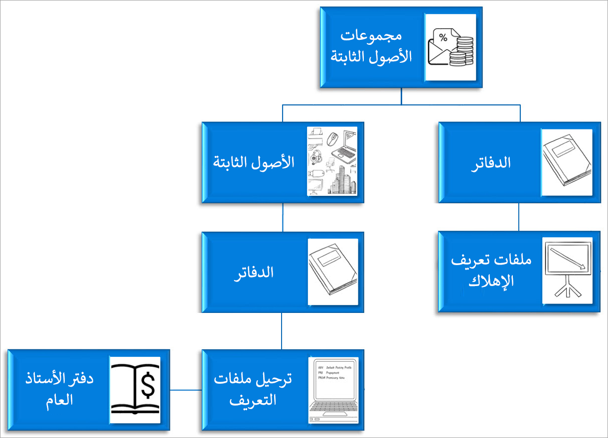

يوضح الشكل التالي العلاقات في الوحدة النمطية للأصول الثابتة في Finance.

تسمح لك مجموعات الأصول الثابتة بتجميع الأصول وتعيين السمات الافتراضية لكل أصل يتم تعيينه إلى مجموعة. ويتم تعيين الدفاتر إلى مجموعات الأصول الثابتة. وتتعقب الدفاتر القيمة المالية لأصل ثابت مع مرور الوقت باستخدام تكوين الإهلاك الذي تم تعريفه في ملف تعريف الإهلاك.

يتم تعيين الأصول الثابتة إلى مجموعة عند إنشائها. بشكل افتراضي، يتم تعيين الدفاتر إلى مجموعة الأصول الثابتة، ثم يتم تعيينها إلى الأصل الثابت. وتقترن الدفاتر التي تم تكوينها للترحيل إلى دفتر الأستاذ العام بملف تعريف ترحيل. ويتم تعريف حسابات دفتر الأستاذ العام لكل دفتر في ملف تعريف الترحيل ويتم استخدامها عند ترحيل حركات الأصول الثابتة.

يجب عليك إعداد ملفات تعريف الإهلاك أولاً. في ملف تعريف الإهلاك، يمكنك تكوين كيفية إهلاك قيمة أحد الأصول مع مرور الوقت. يجب تحديد أسلوب الإهلاك وسنة الإهلاك (السنة التقويمية أو السنة المالية) وتكرار الإهلاك.

بعد إعداد ملفات تعريف الإهلاك، يجب عليك إنشاء الدفاتر المطلوبة للأصول الخاصة بك. يتعقب كل دفتر دورة الحياة المالية المستقلة للأصل. ويمكن تكوين الدفاتر لترحيل الحركات المقترنة بدفتر الأستاذ العام. يُعد هذا التكوين الإعداد الافتراضي، لأنه يُستخدم عادةَ لإعداد التقارير المالية للشركة.
بالنسبة إلى الدفاتر التي لا يتم ترحيلها إلى دفتر الأستاذ العام، يتم ترحيلها فقط إلى دفتر الأستاذ الفرعي للأصول الثابتة وتستخدم عادة لأغراض إعداد التقارير الضريبية.

يتم تعيين ملف تعريف إهلاك أساسي إلى كل دفتر. تتوفر لدى الدفاتر أيضاً ملف تعريف إهلاك بديل، إذا كان نوع ملف التعريف هذا قابلاً للتطبيق. لتضمين دفتر الأصول الثابتة في عمليات تشغيل الإهلاك بشكل تلقائي، قُم بتمكين الخيار **حساب الإهلاك** .

يُعرف أيضاً ملف تعريف الإهلاك البديل بأسلوب تحويل الإهلاك. سيتحوّل مقترح الإهلاك إلى ملف التعريف هذا عندما يحسب ملف التعريف البديل مبلغ إهلاك يساوي ملف تعريف الإهلاك الافتراضي أو أكبر منه.

يُستخدم ملف تعريف الإهلاك الاستثنائي في إهلاك إضافي لأحد الأصول في ظروف غير عادية. على سبيل المثال، قد تستخدم هذا الملف لتسجيل الإهلاك الناتج عن كارثة طبيعية.

إذا تم تحديد الخيار **إنشاء تسويات الإهلاك التي لها تسويات أساسية**، فسيتم إنشاء تسويات الإهلاك تلقائياً عند تحديث قيمة الأصل. وإذا لم يتم تحديد هذا الخيار، فإن قيمة الأصول المحدثة ستؤثر فقط على حسابات الإهلاك المستقبلية.

إذا لم يتم تمكين هذا الخيار لأحد الأصول، فإن مقترح الإهلاك يتخطى الأصل.

يمكنك أيضاً إعداد دفاتر مشتقة. وتُرحّل الحركات المشتقة المحددة كنسخة طبق الأصل من الحركة الأساسية في مقابل الدفاتر المشتقة. وبالتالي، يتم إعداد الحركات المشتقة عادةً لعمليات الاستحواذ والتخلص، وليس لحركات الإهلاك.

بعد إعداد الدفاتر، يمكنك إنشاء ملف تعريف الترحيل. يجب تعريف ملف تعريف الترحيل بواسطة الدفتر، ولكن يمكن أيضاً تعريفه على مستوى أكثر تفصيلاً. على سبيل المثال، يمكنك تعريف ملف تعريف الترحيل لمجموعة من دفتر ومجموعة أصول ثابتة أو حتى لدفتر أصول ثابتة فردي. بشكل افتراضي، يتم استخدام حسابات دفتر الأستاذ المعرّفة لحركات الأصول الثابتة.

يجب تعريف حسابات دفتر الأستاذ المستخدمة في أثناء عمليات التخلص، مبيعات التخلص وخردات التخلص على حدٍ سواء. في وقت إجراء التخلص، يتم عكس حركات الأصول الثابتة التي تم ترحيلها مسبقاً من الحسابات الأصلية. يتم نقل المبالغ الصافية فيما بعد للحساب المناسب للربح والخسارة للتخلص من الأصل.

للمساعدة في ضمان عكس الحركات بشكل صحيح، يجب إعداد حسابات لكل نوع حركة تستخدمها في أعمالك. يجب أن يكون الحساب الرئيسي الحساب الأصلي الذي تقوم بتعيينه على ملف تعريف الترحيل لنوع الحركة، ويجب أن يكون الحساب المقابل حساب الأرباح والخسائر للتخلص من الأصول. الاستثناء هو صافي القيمة الدفترية.
في هذه الحالة، يجب تعيين كل من الحساب الرئيسي والحساب المقابل إلى حساب الأرباح والخسائر للتخلص من الأصول.
