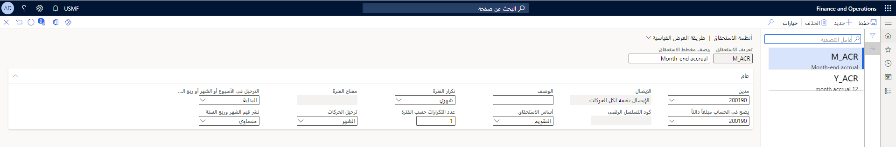
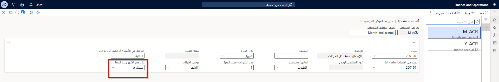
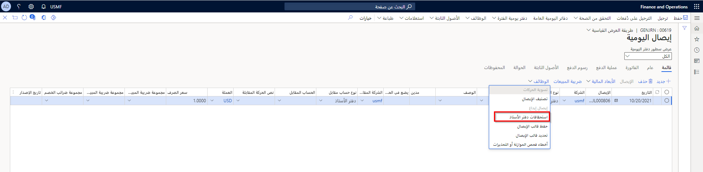
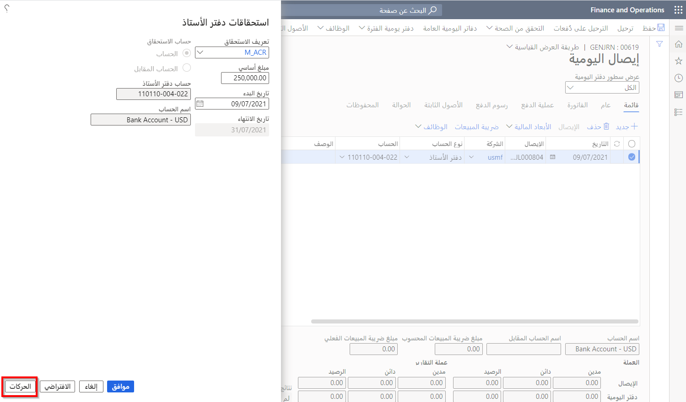
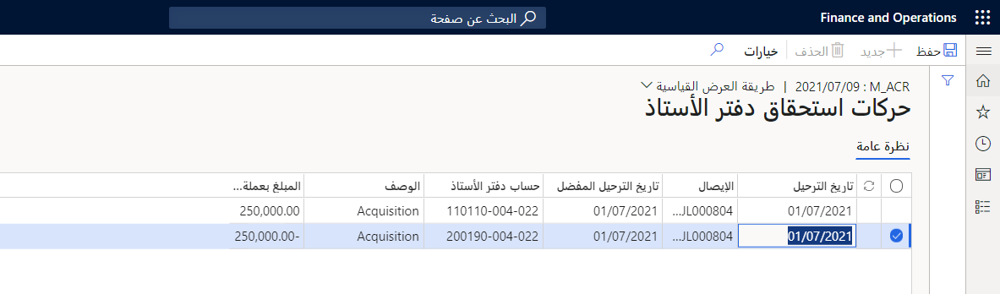

يتم استخدام مخططات الاستحقاق لإعداد الإيرادات والتكاليف المؤجلة، ويمكن استخدام نفس مخطط الاستحقاق لكل من الإيرادات والتكاليف. تقوم مستحقات دفتر الأستاذ بإعادة توزيع الإيرادات أو التكاليف لبند دفتر اليومية بحيث يتم التعرف على الإيرادات والتكاليف في الفترات المناسبة. 

في الصفحة، تحتاج إلى تحديد حسابات الخصم والائتمان التي سيتم استخدامها عند تطبيق نظام الاستحقاق. 

**دفتر الأستاذ العام > إعداد دفتر اليومية > أنظمة الاستحقاق**.

- **الخصم** – سيحل الحساب الرئيسي الذي تحدده محل حساب الخصم الرئيسي في بند إيصال دفتر اليومية. سيتم استخدام هذا الحساب أيضاً لإلغاء التأجيل، بناءً على حركات استحقاق دفتر الأستاذ.
- **الائتمان** – سيحل الحساب الرئيسي الذي تحدده محل حساب الائتمان الرئيسي في بند إيصال دفتر اليومية. سيتم استخدام هذا الحساب أيضاً لإلغاء التأجيل، بناءً على حركات استحقاق دفتر الأستاذ.

بعد تحديد الحسابات المراد استخدامها، يمكنك تحديد كيفية إنشاء رقم الإيصال عند إنشاء حركات الاستحقاق. يمكنك أيضاً تحديد عدد المرات التي تحدث فيها الحركات، وعدد المرات التي تم فيها إنشاء الحركات، ووقت ترحيل الحركات. بعد إنشاء مخطط الاستحقاق، يمكنك استخدامه في بعض المجلات باستخدام وظيفة **استحقاقات دفتر الأستاذ**.

يوزع حقل **قيم الشهر وربع السنة المنتشرة** المبالغ لكل فترة من نظام الاستحقاق إما بالتساوي عن طريق اختيار **بالتساوي** أو تقسيم المبالغ حسب **عدد الأيام**.

**دفتر الأستاذ العام > إعداد دفتر اليومية > نظام الاستحقاق**

## استحقاقات دفتر الأستاذ 

عند إدخال دفتر اليومية، يمكنك تحديد **استحقاقات دفتر الأستاذ** في قائمة **الوظائف**. بعد ذلك، عند تحديد مخطط الاستحقاق، سترى المبلغ الأساسي من دفتر اليومية الذي سيتم توزيعه على مدار الفترة، كما هو محدد بواسطة نظام الاستحقاق. على سبيل المثال، إذا دفعت تأمين موظف للعام بأكمله في شهر يناير، وكان المبلغ 12000 دولار أمريكي (دولار أمريكي)، فأنت بحاجة إلى التعرف على هذه المصروفات كل شهر. 
 
**دفتر الأستاذ العام > إدخالات دفتر اليومية > الدفاتر العامة >حدد دفتر يومية**

يمكنك أيضاً تحديد ما إذا كان المبلغ المستحق يعتمد على الحساب أو حساب الإزاحة. بعد إجراء التحديدات، حدد **الحركات** لإنشاء جميع الحركات التي تم إنشاؤها استناداً إلى نظام الاستحقاق وعرضها. في حالة عدم تحديد **الحركات** وتحديد بدلاً من ذلك **موافق** أو **إلغاء**، لن يتم إنشاء الاستحقاقات. 

**دفتر الأستاذ العام > إدخالات دفتر اليومية > دفاتر اليومية العامة > تحديد دفتر يومية > الوظائف > استحقاقات دفتر الأستاذ**
 

على سبيل المثال، إذا وزعت مبلغ 12000 دولار أمريكي في نفقات التأمين على مدار العام، فسترى 1000 دولار أمريكي لكل شهر. بعد ترحيل دفتر اليومية، يمكنك عرض الحركات باستخدام صفحة **الاستعلام عن حركات الإيصالات**. 

**دفتر الأستاذ العام > إدخالات دفتر اليومية > دفاتر اليومية العامة > تحديد دفتر يومية > الوظائف > استحقاقات دفتر الأستاذ > حركات استحقاقات دفتر الأستاذ**

إذا تعذر تطبيق نظام الاستحقاق (على سبيل المثال، عند تضمين فاتورة أمر المبيعات أو فاتورة أمر الشراء)، يمكنك إضافة المبلغ المدفوع مسبقاً وخصم مبلغ المصروفات. يمكنك بعد ذلك تحديد **إزاحة** عند تطبيق نظام الاستحقاق.

شاهد الفيديو التالي للتعرف على كيفية إعداد واستخدام الاستحقاقات في دفتر الأستاذ العام.

 > [!VIDEO https://www.microsoft.com/videoplayer/embed/RE41x39]

