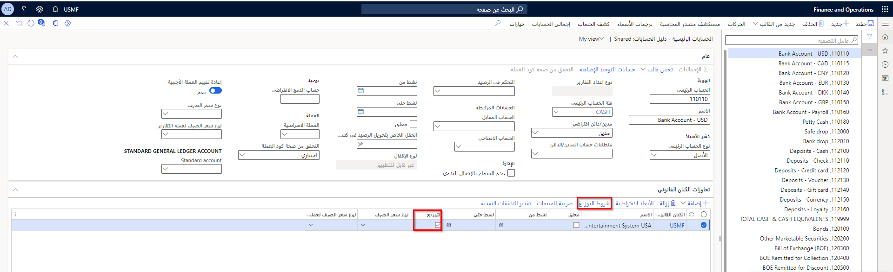
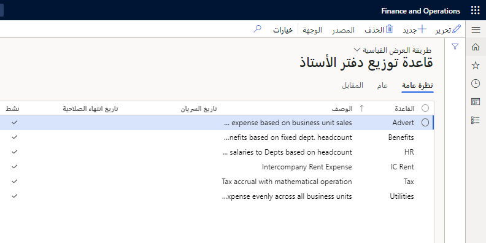
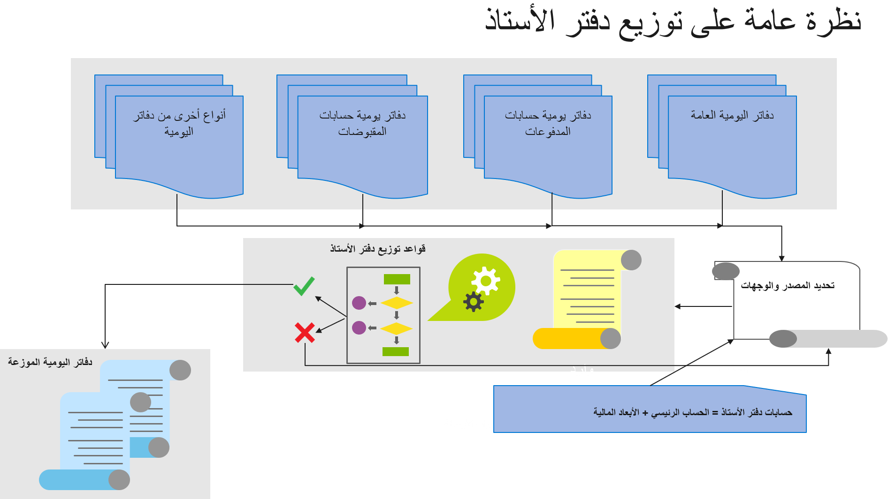
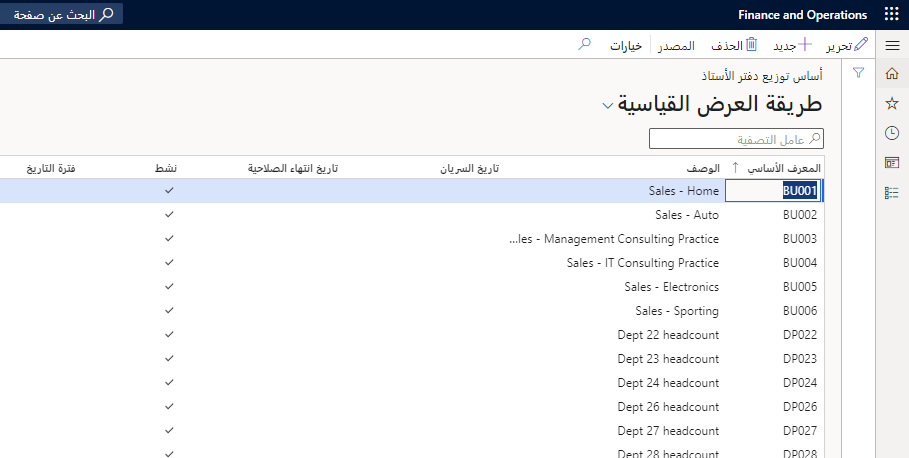
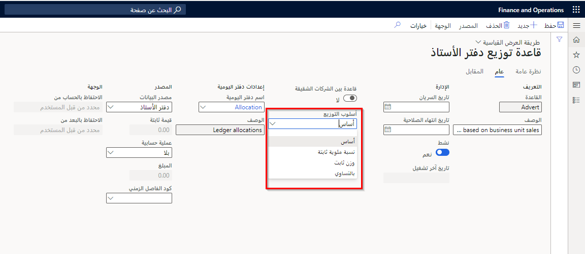

التوزيع هو عملية توزيع المبالغ النقدية على حساب دفتر أستاذ واحد أو أكثر. حساب دفتر الأستاذ هو المصطلح المستخدم في Finance الذي يتكون من الحساب الرئيسي بالإضافة إلى الأبعاد المالية، والتي يمكن أن تكون فارغة.
يمكن إجراء عمليات توزيع دفتر الأستاذ باستخدام إحدى الطرق التالية:

- تم التحديد في الحساب الرئيسي. عند ترحيل حركة إلى هذا الحساب الرئيسي، سيحدث التخصيص كجزء من عملية الترحيل. 
- تم التحديد للتشغيل كعملية دورية.  على سبيل المثال، يمكنك إنشاء قواعد لتوزيع أرصدة في نهاية الشهر.

## شروط توزيع الحسابات الرئيسية 

إذا انتقلت إلى صفحة **دفتر الأستاذ العام > مخطط الحسابات > الحسابات > الحسابات الرئيسية**، ضمن علامة التبويب السريعة **تجاوزات الكيان القانوني**، توجد خانة الاختيار **توزيع**. حدد هذا الخيار لتوزيع الحركات، بناءً على شروط التوزيع، عندما يتم ترحيل الحركات إلى رقم الحساب هذا. تتم معالجة التوزيع تلقائياً باستخدام الإعدادات الموجودة في صفحة **قاعدة التوزيع**.

استخدم زر **شروط التوزيع** لتكوين توزيع الحركات التي تم ترحيلها في هذا الحساب، بناءً على الكيان القانوني الذي يشترك في نفس مخطط الحساب. 

## قواعد توزيع دفتر الأستاذ 

يمكن أن يستخدم Finance قواعد التوزيع المحددة مسبقاً لتنفيذ عمليات التوزيع المُنشأة. التوزيع المُنشأ هو توزيع المبالغ المُرحلة أو الثابتة على مجموعات الحسابات والأبعاد الوجهة في أي وقت، مما يؤدي إلى إنشاء إدخالات دفتر يومية جديدة.

باستخدام صفحة **قواعد توزيع دفتر الأستاذ**، يمكنك إنشاء قواعد لمعالجة عمليات توزيع دفتر الأستاذ لكل قاعدة بشكل دوري.

يمكن أيضاً استخدام قواعد توزيع دفتر الأستاذ لخطط الموازنة. عند استخدام قواعد توزيع دفتر الأستاذ في تخطيط الموازنة، تعمل قواعد التوزيع بالطريقة نفسها التي تعمل بها في دفتر الأستاذ، لكن بيانات المصدر وبيانات الوجهة تأتي من خطة الموازنة. بخلاف دفاتر يومية دفتر الأستاذ العام الأخرى، لا يمكنك استخدام قواعد توزيع دفتر الأستاذ بين الشركات الشقيقة لتخطيط الموازنة.

يمكنك تحديد قواعد توزيع دفتر الأستاذ يدوياً لاستخدامها في خطط الموازنة. بدلاً من ذلك، يمكنك استخدام جدول توزيع يتم تشغيله كجزء من عملية سير العمل. 

لمزيد من المعلومات حول تخطيط الميزانية، راجع [تكوين واستخدام تخطيط الميزانية في Dynamics 365 Finance](/learn/modules/configure-use-budget-planning-dyn365-finance/?azure-portal=true).

يتم توضيح نظرة عامة على عملية توزيع دفتر الأستاذ أدناه.

## مكونات قواعد توزيع دفتر الأستاذ 

تحتوي كل قاعده توزيع علي أربعه مكونات: العام والمصدر والوجهة والإزاحة. يكون المكون الإضافي، القواعد الأساسية لتوزيع دفتر الأستاذ، مطلوباً في حالة استخدام **الأساس** بمثابة أسلوب التوزيع. يوفر كل مكون جزءاً هاماً من المعلومات المطلوبة لمعالجة عمليات التوزيع.

- **عام** – هذا المكون هو المكان الذي يحدد فيه المستخدم خيارات مثل أسلوب التوزيع، وإعدادات القواعد بين الشركات الشقيقة، وما إذا كانت القاعدة نشطة.
- **المصدر** – هذا المكون هو المكان الذي يحدد فيه المستخدم بيانات المصدر للتوزيع. يمكن أن يعتمد التوزيع على أرصدة دفتر الأستاذ (مصدر البيانات = دفتر الأستاذ) أو المبالغ الثابتة (مصدر البيانات = القيمة الثابتة). عند تعيين **مصدر البيانات** إلى **دفتر الأستاذ**، يجب تحديد معايير تصفية المصدر لقاعدة توزيع دفتر الأستاذ (على سبيل المثال، لنفقات الإعلانات).
 
    

- **الوجهة** – يحدد هذا المكون حساب دفتر الأستاذ الذي سيتم فيه توزيع المبلغ. على سبيل المثال، يمكن توزيع مصروف لكل قسم عن طريق إنشاء بند وجهة لكل قيمة قسم. 

    

- **الإزاحة** – يحدد هذا المكون حسابات دفتر الأستاذ المستخدمة كمدخلات إزاحة لموازنة إدخالات الوجهة. تُستخدم الخيارات المحددة بواسطة المستخدم عادةً بدلاً من الحسابات والأبعاد التي تستند إلى المصدر. عند تعيين **مصدر البيانات** إلى **القيمة الثابتة**، لا يمكن استخدام المصدر كخيار.
 
والإعداد الافتراضي هو **المصدر**، مما يعني أنه سيتم ترحيل الإدخالات لتقليل أرصدة الحسابات المصدر. إذا اخترت **محدد من قِبل المستخدم**، لن يتم تخفيض مبالغ الحسابات **المصدر** - بدلاً من ذلك ستبقى مبالغ الحسابات **المصدر**، وسيتم ترحيل المبالغ إلى الحساب المقابل بدلاً من تقليل أرصدة الحسابات المصدر.

على سبيل المثال، بالنسبة لحساب دفتر الأستاذ المقابل المحدد، لتوزيع المبالغ في الحساب الرئيسي فقط التي لا تحتوي على قيمة لبُعد مالي معين، يجب عليك إضافة بند بهذا البعد المالي المحدد ليكون له قيمة فارغة، كما هو موضح أعلاه. إذا حددت الحساب الرئيسي فقط على المصدر دون عامل تصفية البعد المالي، فسيتم توزيع جميع مجموعات الحسابات لهذا الحساب الرئيسي.

- **قواعد أساس توزيع دفتر الأستاذ** - تستخدم هذه القواعد معايير تصفية المصدر الخاصة بها لتحديد أرصدة دفتر الأستاذ التي يجب استخدامها للتوزيع (على سبيل المثال، الإيرادات لكل قسم). يمكن استخدام كل قاعدة أساس توزيع مع قواعد توزيع متعددة.

 
## أساليب توزيع دفتر الأستاذ 

تُستخدم قواعد توزيع دفتر الأستاذ لحساب وإنشاء دفاتر يومية التوزيع وإدخالات الحساب تلقائياً لتوزيع أرصدة دفتر الأستاذ أو المبالغ الثابتة. يمكن أن تكون أساليب التوزيع متغيرة أو ثابتة. يمكن استخدام أساليب التوزيع التالية لقواعد توزيع دفتر الأستاذ:

- **الأساس** – يُستخدم أسلوب المتغير هذا عندما يعتمد التوزيع على رصيد دفتر الأستاذ الفعلي، بناءً على معايير التصفية. على سبيل المثال، يمكن توزيع نفقات الإعلانات بناءً على مبيعات كل قسم بما يتناسب مع إجمالي مبيعات الأقسام.
- **النسبة المئوية الثابتة** و **الوزن الثابت** – بالنسبة لهذه الأساليب، يتم تحديد نسبة التوزيع8 أو الوزن بشكل مباشر للقاعدة. على سبيل المثال، يمكن توزيع مصروفات الإعلانات بحيث يتلقى القسم "أ" 70 بالمائة من مصروفات الإعلانات ويتلقى القسم "ب" 30 بالمائة.
- **بالتساوي** – يقوم هذا الأسلوب بتوزيع المبلغ بالتساوي على كل وجهة محددة. على سبيل المثال، إذا تم تحديد الوجهات للقسم "أ" والقسم "ب"، فيمكن توزيع مصروفات الإعلانات بحيث يتلقى كل من القسم "أ" والقسم "ب" 50 بالمائة من مصروفات الإعلانات.

**دفتر الأستاذ العام > التوزيعات > قواعد توزيع دفتر الأستاذ > تحديد البند > علامة التبويب عام**

يقوم **رمز فترة التاريخ** بتصفية جميع الحركات المرحلة استناداً إلى نطاق التاريخ الذي سيتم تحديده للقاعدة. 

إذا تم استخدام الأساس كأسلوب توزيع لقاعدة توزيع، فستحتاج أيضاً إلى تحديد قواعد أساس توزيع دفتر الأستاذ المنفصل. 

## طلب توزيع العملية 

تتيح لك عملية طلب توزيع العملية معالجة قاعدة توزيع دفتر الأستاذ ومعاينة إدخالات دفتر اليومية للتوزيع الناتجة قبل ترحيل التوزيعات المحسوبة أو حذفها.

**اعتباراً من تاريخ** مهم جداً عندما يكون **دفتر الأستاذ** هو **مصدر البيانات** للقاعدة. يتحكم هذا التاريخ في أرصدة دفتر الأستاذ التي يجب تضمينها للتوزيع.

استخدم القائمة المنسدلة **المصدر صفر** لتحديد ما إذا كنت تريد **معالجة** أو **إيقاف** الطلب إذا كانت مبالغ المصدر صفر.

استخدم صفحة **معالجة طلب التوزيع** لإنشاء دفتر يومية توزيع يمكن مراجعته والموافقة عليه قبل الترحيل إلى **دفتر الأستاذ العام** عن طريق تعيين **خيارات الاقتراح** إلى **الاقتراح فقط**. يمكنك الترحيل مباشرةً إلى **دفتر الأستاذ العام** عن طريق تعيين **خيارات الاقتراح** إلى **ترحيل فقط**. عند تحديد هذا الخيار، لا توجد معاينة لإدخالات المحاسبة التي سيتم ترحيلها كنتيجة لتشغيل قاعدة التوزيع. 
 
لاحظ أن هناك بعض الأدوار التي يمكنها تحرير دفتر يومية التوزيع قبل الترحيل.

شاهد الفيديو التالي لمشاهدة إعداد قواعد التوزيع وعملية طلب معالجة التوزيع. 

 > [!VIDEO https://www.microsoft.com/videoplayer/embed/RE41Hqc]

