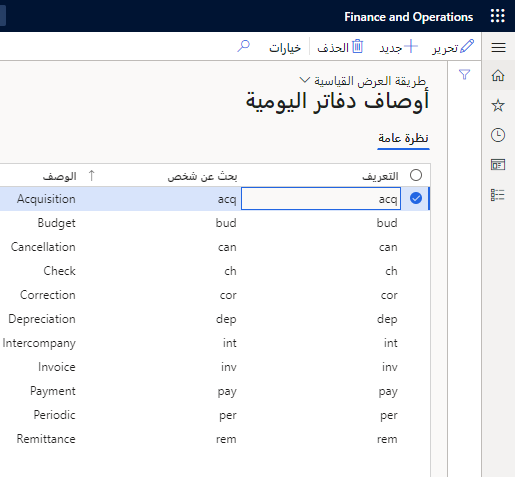

يمكنك استخدام دفاتر اليومية بسرعة وكفاءة بمجرد إعدادها. هناك العديد من المكونات التي يجب إعدادها من أجل استخدام دفاتر اليومية العامة. 

## دفتر الأستاذ 

هناك العديد من المكونات التي يجب إعدادها من أجل استخدام دفاتر اليومية العامة.  يمكن ربط دفاتر الأستاذ المتعددة بنفس مخطط الحسابات، مما يسمح لك بمشاركة نفس مخطط الحسابات مع أكثر من كيان قانوني واحد. تحتاج أيضاً إلى الإشارة إلى بنية الحساب أو البنيات التي تريد إرفاقها بدفتر الأستاذ لكل كيان قانوني. 
 
## البُعد المالي للموازنة 
المحاسبة بين الوحدات هي مطلب أن تقوم بإنشاء ميزانية عمومية متوازنة لبُعد مالي محدد. لذلك، يجب موازنة كافة إدخالات المحاسبة التي تم إجراؤها على دفتر الأستاذ العام لقيم البعد المالي، والذي يشار إليه باسم *البعد المالي لإعداد الموازنة*. يتم تحديد البعد المالي لإعداد الموازنة المستخدم في المحاسبة بين الوحدات في صفحة **دفتر الأستاذ** في **دفتر الأستاذ العام > إعداد دفتر الأستاذ > دفتر الأستاذ**.  عند إدخال البعد المالي لإعداد الموازنة في Finance، يجب أن يوازن كل إدخال محاسبة على المستوى الإجمالي وعلى مستوى قيم الأبعاد المالية.  

 

إذا كان الإدخال المحاسبي لا يوازن عند مستوى قيم الأبعاد المالية، يتم إنشاء إدخالات محاسبية إضافية تلقائياً لموازنة الإدخال المحاسبي.  

بعد إضافة بنيات الحسابات، ستحتاج إلى ربطها بدفتر الأستاذ.  

## أسماء دفاتر اليومية 

من أهم المجالات التي يجب إعدادها هي أسماء دفاتر اليومية. يمكنك تحديد اسم دفتر يومية لمهمة معينة وفقاً لنوعها.

من المستحسن تحديد أسماء دفتر يومية محددة لكل غرض، مثل الشركات الشقيقة، وتعديل الاستحقاق، وتصحيح الأخطاء. يمكنك تخصيص اسم كل دفتر يومية للمساعدة في جعل إدخال البيانات لكل غرض أمراً سهلاً وآمناً. 

في صفحة **أسماء دفاتر اليومية** في **دفتر الأستاذ العام > إعداد دفتر اليومية**، يمكنك إعداد العناصر المختلفة مثل التالية.

- **سير عمل الموافقة** – لزيادة الرقابة الداخلية، حدد تدفقات عمل دفتر اليومية التي تحدد حدود الأهمية النسبية للمراجعة وخطوات الموافقة، استناداً إلى معايير مثل إجمالي مبلغ الخصم. مفهوم الأهمية النسبية هو المبدأ المحاسبي المقبول عالمياً والذي ينص على أنه يجب الإبلاغ عن جميع الأمور المهمة بينما يمكن تجاهل الأمور التافهة 
- تقوم بإعداد مهام سير العمل لدفاتر اليومية العامة في صفحة **مهام سير عمل دفتر الأستاذ العام**.
- **القيم الافتراضية** – حدد القيم الافتراضية للحسابات المقابلة والعملة والأبعاد المالية.
- **عنصر التحكم في دفتر اليومية** – يمكنك إعداد قيود على الشركة ونوع الحساب، وكذلك قيم المقطع.
 

## إعداد دفتر اليومية 

هناك دفاتر يومية يتم إنشاؤها يدوياً ودفاتر يومية يتم إنشاؤها بواسطة النظام في Finance.  

ومن الأمثلة على دفاتر اليومية التي ينشئها النظام دفاتر يومية التوزيع ودفاتر اليومية المستبعدة، والتي يتم إنشاؤها تلقائياً ولا يتم إنشاؤها يدوياً أبداً. 

يتم إنشاء إدخالات دفاتر اليومية اليدوية من خلال الترحيلات التي يتم إدخالها في النظام مثل إدخال دفتر اليومية العام. عند استخدام إدخال دفتر يومية يدوياً، لا يتم ترحيل الحركات على الفور. قبل أن تتمكن من ترحيل إدخال يدوي، قد تكون دفاتر اليومية بالحالات التالية:

-   تم تغييرها  
-   روجعت  
-   معتمدة  
-   محذوفة  

في Finance، يمكنك استخدام دفاتر اليومية للقيام بالمهام التالية. 

- **التحكم في أنواع مختلفة من الإدخالات** - يمكنك تطبيق نظام موافقة بحيث يتم ترحيل دفاتر اليومية الخاصة فقط بعد الموافقة عليها.  
- **مراجعة البيانات المستوردة من أنظمة دفتر الأستاذ الخارجي** - يمكنك التأكد من احتواء جميع الحقول الصالحة على قيمة واستيفاء جميع قيود الحركة. 
 
من المهم التأكد من إعداد سلسلة الإيصالات الضرورية قبل إنشاء دفاتر اليومية. يمكنك إعداد التسلسلات الرقمية وإرفاقها بالمراجع المناسبة.

لا يمكنك استخدام كل من نظام الموافقة اليدوي ونظام الموافقة على سير العمل لنفس اسم دفتر اليومية.
يمكن استخدام طبقات الترحيل التالية.

- **الحالية** - الطبقة الافتراضية المستخدمة.
- **العمليات** – المستخدمة لإدخال الحركات.
- **الضريبة** – حيث تقوم بتسجيل الحركات التي تؤثر على إعداد التقارير الضريبية.

في قائمة **مستوى التفاصيل**، يمكنك تحديد كيفية تلخيص بنود دفتر اليومية.

- **التفاصيل** - يتم ترحيل كل مثيل لرقم حساب في بنود دفتر اليومية كحركة حساب منفصلة.  
- **الملخص** - يتم إجراء تجميع لبنود دفتر اليومية في حركة واحدة تلقائياً أثناء الترحيل إذا كان الإيصال بالتاريخ ورقم الحساب والبُعد ورمز العملة يحتوي على نفس القيم.  

من المهم معرفة أن التجميع لا يتم إجراؤه على الحركات مع ضريبة المبيعات.

## قيود الترحيل 

تحدد قيود الترحيل ما إذا كان يمكن لمستخدمين معينين أو مجموعات مستخدمين الترحيل في دفتر اليومية المحدد.  يمكنك تقييد ترحيل دفتر اليومية إلى المستخدم الذي قام بإنشاء دفتر اليومية لهؤلاء الذين تم تعيين عنصر التحكم لهم. وفي حالة عدم تعيين المستخدم إلى قيد ترحيل، فيمكنه ترحيل جميع دفاتر اليومية الخاصة باسم دفتر اليومية. 

حدد من المعلمات التالية. 
 
- **حسب مجموعة المستخدمين**
- **حسب المستخدم**  
- **لا توجد قيود على الترحيل** - تتيح ميزة قيود الترحيل للمؤسسة تحديد، على أساس اسم دفتر اليومية، ما إذا كان يمكن لمستخدمين معينين أو مجموعات مستخدمين معينة فقط ترحيل دفاتر اليومية التي يقوم المستخدم أو أعضاء مجموعة المستخدمين بإدخالها أو إنشائها. يمكن تحديد قيود الترحيل بواسطة مجموعه مستخدمين أو مستخدم.  

    

    على سبيل المثال، فإن أليشيا Alicia، مديرة حسابات المقبوضات (AR) في Contoso، هي عضو في مجموعة مستخدمي AR. تم تعيين مجموعة مستخدمي AR إلى قيد ترحيل لدفاتر يومية AR. بسبب مهمة تقييد الترحيل هذه، يمكن لأعضاء مجموعة مستخدمي AR ترحيل دفاتر يومية AR التي قاموا بإنشائها بأنفسهم فقط.  
 
    قررت Julia، مديرة المحاسبة، السماح لـ Alicia بترحيل جميع دفاتر يومية AR، وليس فقط تلك التي أنشأتها. يجب على فيليس مسح عنصر تحكم الترحيل الخاص بـ Alicia حتى تتمكن من الترحيل في جميع دفاتر يومية AR. 

شاهد هذا الفيديو لتتعلم كيف يمكنك إنشاء اسم دفتر يومية، والعمل مع أنواع دفتر اليومية، وإعداد قيود الترحيل.

&nbsp;
> [!VIDEO https://www.microsoft.com/videoplayer/embed/RE3V74g]

## عناصر التحكم في دفاتر اليومية 

عنصر التحكم في دفتر اليومية هو إعداد يمكن أن يكون لديك على اسم دفتر اليومية الخاص بك لتحديد القيود أو القيود فيما يتعلق بما يمكن استخدامه وترحيله في دفتر اليومية. يمكنك إعداد خيارات التحكم في دفتر اليومية لإعداد قواعد الترحيل لاسم دفتر اليومية في **دفتر الأستاذ العام > إعداد دفتر اليومية > أسماء دفاتر اليومية > عنصر التحكم في دفتر اليومية**. 

يمكنك تقييد نوع الحسابات التي يمكن للمستخدمين استخدامها في دفتر اليومية، أو أي شركة محددة ونوع الحساب المحدد الذي يمكنهم ترحيله في دفتر اليومية هذا.  

على سبيل المثال، يتم إعداد اسم دفتر اليومية البنكي بحيث يكون من الممكن فقط للمستخدمين إجراء ترحيلات حسابات بنكية، ويسمح دفتر يومية مدفوعات العميل فقط بترحيلات حساب العميل.  على سبيل المثال، إذا قام المستخدم، لسبب ما، بتحديد حساب دفتر الأستاذ أو حساب المورد بطريق الخطأ في دفتر يومية مدفوعات العميل، فسيعرض Finance رسالة خطأ تفيد بأنه لا يمكن للمستخدمين استخدام نوع حساب العميل إلا باستخدام دفتر اليومية مع عنصر التحكم في دفتر اليومية المحدد هذا .  

يمكنك أيضاً تحديد قيم الأبعاد التي يمكن استخدامها مع حساب دفتر الأستاذ، لذلك على الرغم من أن بنية الحساب قد تسمح بتحديد أبعاد متعددة، في دفتر اليومية المحدد، يمكن للمستخدمين استخدام أبعاد معينة فقط.  
 

## أوصاف دفاتر اليومية 

استخدم أوصاف دفتر اليومية لإدخال نص الحركة وإعادة استخدامه عند التسجيل في دفاتر اليومية. كثيراً ما يقوم المستخدمون بإدخال نفس نص الحركة في كل مرة يقومون فيها بترحيل حركة معينة. على سبيل المثال، يقوم المستخدمون بالتحويل من المصروفات النثرية إلى البنك أو دفع رقم الفاتورة. يمكنك حفظ نص الحركة في جدول باسم بحث بحيث يمكنك إعادة استخدام نص الحركة.  
 

تتم مشاركة أوصاف دفتر اليومية المحددة في دفتر الأستاذ العام عبر دفاتر الأستاذ الفرعية في Finance (الوحدات).

## الأوصاف الافتراضية 

يمكن استخدام الأوصاف الافتراضية للترحيلات التلقائية إلى دفتر الأستاذ العام. يمكنك إعداد الأوصاف الافتراضية بلغات مختلفة. يمكن إنشاؤها للحركات مثل مدفوعات الموردين ويمكن تكوينها بطرق مختلفة لتناسب احتياجات العميل. 

لتكوين الوصف الافتراضي الأول، اتبع هذا الإجراء.

1. انتقل إلى **دفتر الأستاذ العام > إعداد دفتر اليومية > الأوصاف الافتراضية**.
2. حدد **جديد** في الجزء العلوي لإنشاء وصف افتراضي جديد. 
3. استخدم القائمة المنسدلة في حقل **الوصف** لتحديد نوع **عكس الحركة**. 
4. حدد **ar-sa** في حقل **اللغة**.
5. في حقل **النص**، يمكنك استخدام متغيرات ثابتة.  ويتم استدعاء هذه في حقل **المرجع** أسفل الشاشة.  على سبيل المثال، إذا كنت تريد رقم الفاتورة، فاكتب "الفاتورة %2" في حقل **النص**.
6. في حقل **النص**، أدخل الوصف الافتراضي. يمكنك كتابة نص في الحقل، أو يمكنك استخدام واحد أو أكثر من متغيرات النص الحر التالية.

    - **%1** – أضف تاريخ الحركة.
    - **%2** – أضف معرفاً يتوافق مع نوع المستند الذي يتم ترحيله إلى دفتر الأستاذ العام. على سبيل المثال، بالنسبة لأنواع الحركات المتعلقة بالفواتير، يضيف المتغير %2 رقم الفاتورة.
    - **%3** – أضف معرفاً مرتبطاً بنوع المستند الذي يتم ترحيله إلى دفتر الأستاذ العام. على سبيل المثال، بالنسبة لأنواع الحركات المتعلقة بالفواتير، يضيف المتغير %3 رقم حساب العميل.

بالنسبة لأنواع حركات معينة في بعض البلدان أو المناطق، يمكنك تضمين نص في الأوصاف الافتراضية الخاصة بك والتي تأتي من الحقول في قاعدة بيانات Finance. ترتبط هذه الحقول بأنواع الحركات. 

## أنواع الحركات 

يمكنك إضافة نص آخر إلى الأوصاف الافتراضية لأنواع الحركات المرتبطة بأنواع المستندات التالية.

- فواتير العميل
- إشعارات ائتمان العملاء
- المدفوعات النقدية للعملاء
- مدفوعات المورّد
- أوامر المبيعات
- أوامر الشراء
- دفاتر يومية المخزون
- التخطيط الرئيسي (MRP)
- الأصول الثابتة

## رموز الأسباب 

رمز السبب هو رمز قياسي يمكن استخدامه في أنواع الحركات المختلفة أو التغييرات في قيم الحقل لتوفير بيانات أساسية حول الحركة.  على سبيل المثال، قد يرغب المدققون أو المديرون في الاطلاع على الأسباب المسجلة للحركات المختلفة مثل تعديلات الشطب أو عمليات إلغاء المدفوعات.  
تقوم بإعداد رموز الأسباب في **إدارة المؤسسة > الإعداد > الأسباب المالية**
 

عند استخدام رموز الأسباب القياسية بدلاً من نص الحركة، يكون لديك إرشادات حول الرموز التي تختار منها.  تسمح رموز الأسباب القياسية أيضاً للإدارة والمدققين بتحليل سجل الحركات حسب سبب محدد.  يمكن استخدام رموز الأسباب مع وحدات دفتر الأستاذ العام، والحسابات الدائنة، وحسابات المقبوضات، وإدارة النقد والبنوك، والأصول الثابتة. يمكن أيضاً تحديد رمز السبب في إدخالات دفتر اليومية العامة وطلبات التوزيع واقتراحات الإبعاد وعمليات الدمج. 
