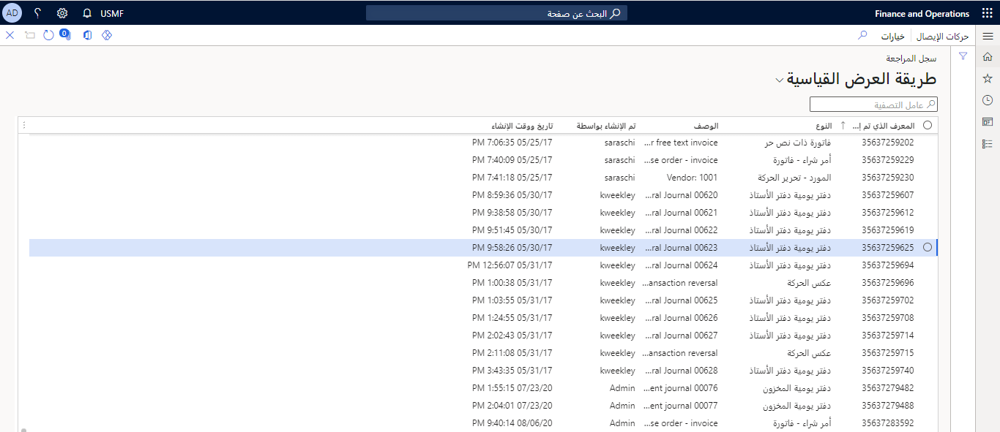
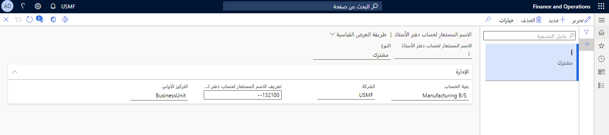
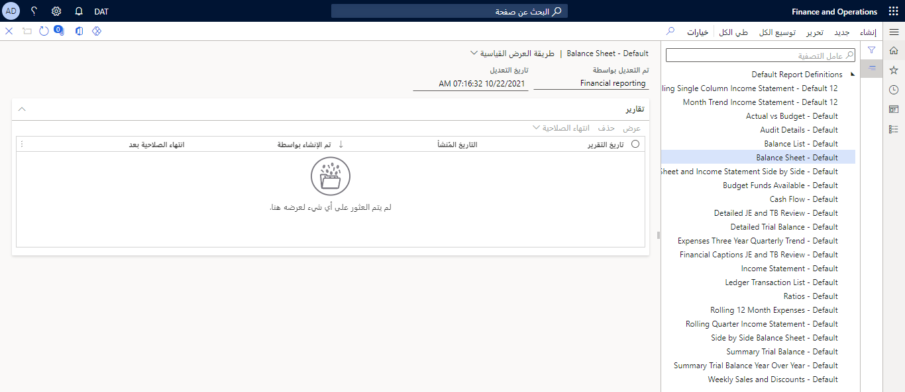

مثل الوحدات النمطية الأخرى في تطبيقات Finance and Operations، توجد صفحة **محددات** في الوحدة النمطية لدفتر الأستاذ العام.  يمكنك إعداد محددات معينة للوحدة النمطية، مثل الطريقة التي تريد بها معالجة عملية إغلاق السنة المالية، والحد الأقصى للفروق النقدية للتقريب، وما ستكون عليه التسلسلات الرقمية الخاصة بك، وكيف تريد نقل الترحيلات إلى دفتر الأستاذ، من بين العديد من الجوانب الأخرى التي قد تؤثر أيضاً على الوحدات النمطية الأخرى ولكن يجب إعدادها في هذه الصفحة.  

قبل استخدام دفاتر اليومية، يجب عليك التأكد من أن صفحة **محددات دفتر الأستاذ العام** الموجودة في **دفتر الأستاذ العام > إعداد دفتر الأستاذ > محددات دفتر الأستاذ العام** التي تم تكوينها بشكل ملائم لمتطلبات العميل. 

علي سبيل المثال، ضع في الاعتبار بعض القيم التالية لحقل **التحقق من الإيصال المستخدم**.

- **رفض التكرار** - يمنع استخدام تواريخ حركات مختلفة لنفس رقم الإيصال.  
- **رفض التكرارات في السنة المالية** - يتيح ذلك لتواريخ الحركات المختلفة لنفس رقم الإيصال بالسنوات المالية المختلفة.  
- **قبول التكرارات** - يستخدم تواريخ حركة مختلفة لنفس رقم الإيصال في حقل تاريخ الحركة في سطور دفتر اليومية.  
- **تحذير في حالة وجود تكرارات** - يقوم بإعداد النظام لإبلاغك إذا كانت سطور دفتر اليومية بتواريخ الحركات المختلفة لها نفس رقم الإيصال
 
‎

## العمل باستخدام دفاتر اليومية 

الخطوات التالية توضح إطار العمل مع دفاتر اليومية. 

1. قم بإنشاء دفتر يومية جديد
1. أضف سطور دفتر اليومية
1. التحقق
1. ترحيل

**إنشاء دفتر يومية جديد** - العديد من الوحدات النمطية في Finance تستخدم دفاتر اليومية لإدخال الحركات. في دفتر الأستاذ العام، استخدم دفاتر اليومية الخاصة بترحيل دفتر الأستاذ. في حسابات المقبوضات، استخدم دفاتر اليومية لعمليات الترحيل. عند فتح مربع الحوار "دفتر اليومية"، قم بإنشاء دفاتر يومية جديدة باستخدام القالب المرتبط بنوع دفتر اليومية.  

**إنشاء سطور دفتر اليومية وترحيل الحركات** - عند إنشاء دفتر يومية جديد، أدخل حركات الترحيل في دفتر اليومية وقم بترحيلها أو نقل دفتر اليومية الخاص بشخص آخر لمراجعته واعتماده.

 
 > [!VIDEO https://www.microsoft.com/videoplayer/embed/RE3UMcl]

## عرض إدخالات دفاتر اليومية والحركات 

يمكنك عرض إدخالات دفتر اليومية والحركات بطرق عديدة. يمكنك استخدام صفحات الاستعلام التي توفر إمكانيات التصفح لأسفل، أو يمكنك استخدام العديد من خيارات الإبلاغ في دفتر الأستاذ العام.

يمكنك عرض الحركات التي تم ترحيلها بطرق عديدة باستخدام الاستعلامات مثل ميزان المراجعة وسجل المراجعة وحركات الإيصال.

يمكنك التصفية على قيمة واحدة أو نطاق. عند تحديد نطاق، تأكد من استخدام الصيغة الصحيحة. يجب فصل القيم بواسطة نقطة مزدوجة (..).

## حركات الإيصالات 

**حركات الإيصالات** في **دفتر الأستاذ العام > الاستعلامات والتقارير** هي صفحة يمكنك فيها التحديد من الجداول والحقول المختلفة لتحديد معايير للرصيد أو الحركة التي تقوم بالبحث عنها.
 
علي سبيل المثال، يمكنك عرض كافة الحركات لتاريخ أو حساب محدد، أو كافة الحركات الخاصة **بنوع الترحيل** الموجودة في **طبقة ترحيل** معينة. 
 

بشكل افتراضي، تعرض الصفحة رقم دفتر اليومية والإيصال والتاريخ والحساب الرئيسي، ولكن يمكنك إضافة جداول وحقول ومعايير إضافية لتضييق نطاق البحث.

## سجل المراجعة 

**سجل المراجعة** عبارة عن صفحة في **دفتر الأستاذ العام > الاستعلامات والتقارير** التي تعرض أنواع الحركات والأوصاف والأشخاص الذين تم إنشاء الحركات بهم ووقت إنشائها. في صفحة **سجل المراجعة**، يمكنك عرض حركات الإيصال.

تعد كل حركة من حركات دفتر الأستاذ جزءاً من إيصال. عند ترحيل إيصال أو مجموعة من الإيصالات، ينشأ النظام إدخال سجل مراجعة بمُعرّف رقمي فريد. يشتمل الإدخال على نَص حركة تم إنشاؤه تلقائياً والذي يحدد أصل الإدخال.  

انقر على زر **الإيصال** لعرض الإيصالات المضمنة في إدخال سجل المراجعة. يتضمن الإدخال أيضاً مراجع إلى المستخدم الذي قام بإنشاء الإدخال ووقت وتاريخ الإدخال.
 
يمكنك استخدام قائمة **حركة دفتر الأستاذ** لعرض قائمة بكافة الحركات المُرحلة في الحساب الحالي. تنتج الإدخالات من ترحيل الحركات في دفاتر اليومية والمبيعات وأوامر الشراء وأي وحدات نمطية أخرى يتم ترحيلها إلى دفتر الأستاذ.  

لا يمكن تعديل المعلومات الموجودة في الحقول في حركات دفتر الأستاذ. لتصحيح إدخال، قم بإجراء تحويل يظهر بعد ذلك في صفحة استعلام **سجل المراجعة**.  

## الاسم المستعار لحساب دفتر الأستاذ 

يمكنك ربط اختصار لحساب دفتر الأستاذ باستخدام الاسم المستعار لحساب دفتر الأستاذ في **دفتر الأستاذ العام > مخطط الحسابات > الحسابات**. عند كتابتك الاختصار والضغط علي المفتاح "Tab"، يتم ملء الحساب والأبعاد، ويكون حقل التركيز الأولي هو المكان الذي سينتقل فيه المؤشر أو التركيز إليه.
 

## التقارير المالية 

يمكنك أيضاً استكشاف حركات دفتر الأستاذ العام وتحليلها بإدارة التقارير المالية في **دفتر الأستاذ العام > الاستعلامات والتقارير**. نظراً لأن تصميم التقارير المالية يمكن أن يعتمد على الحسابات أو الأبعاد أو فئات الحساب أو مزيج من الثلاثة، فيمكنك عرض الحركات من خلال التنقل لأسفل بطرق مختلفة. 
 

إذا كنت تريد مزيداً من المعلومات حول حركات دفتر الأستاذ العام، فيمكنك أيضاً تضمين خصائص حركات متعددة كجزء من تصميم التقرير. إذا كنت ترغب في رؤية الحركات التي تشكل رصيد دفتر الأستاذ العام، فيمكنك التنقل لأسفل لحركات الحساب، تماماً كما يمكنك من صفحة قائمة **ميزان المراجعة**.

## تقارير دفتر الأستاذ 

بالإضافة إلى التقارير المالية، يمكنك استخدام تقارير دفتر الأستاذ التالية لعرض حركات دفتر الأستاذ العام.

- **بيان البُعد‎** - يعرض الحركات حسب اليوم والحساب، وهناك أيضاً خيارات لإظهار الحركات حسب البُعد والفترة.
- **قائمه حركات دفتر الأستاذ** - يعرض الحركات في الحركات والحسابات وعملات التقارير لأحد الحسابات.
- **طباعة دفتر اليومية** - تظهر نتيجة دفتر اليومية المُرحل. يمكنك إدارة التقرير بواسطة رقم دُفعة دفتر اليومية أو نوع دفتر اليومية أو إضافة حقول إضافية.
- **الحركات المُرحلة حسب دفتر اليومية** - تُظهر الحركات التي تم ترحيلها إلى دفتر يومية، مجمعة حسب الإيصال. عند إدارة هذا التقرير، ستحتاج إلى إدخال "من تاريخ" و"إلى تاريخ"، والذي يجب أن يكون في نفس السنه المالية. 
- **قائمة الحركات حسب التاريخ** - تعرض كافة الحركات حسب التاريخ، بالإضافة إلى رقم دفتر اليومية والإيصال وحساب دفتر الأستاذ. كما تعرض أيضاً الحركات في الحركات والمحاسبة وعملات التقارير.
- **أصل الحركة** - يعرض الحساب حسب دفتر اليومية، وبحسب الحركة، والمحاسبة، وعملة التقارير. كما يعرض أيضاً كل سطر في دفتر اليومية تم استخدامه كإزاحة.

## نشر سطور دفاتر اليومية والمستندات من Microsoft Excel 

توفر وظيفة Microsoft Excel الإضافية لإدخال دفتر اليومية مستوى إضافياً من الأتمتة وتجعل إدخال البيانات أسهل. يتوفر إجراء **فتح السطور في Excel‎** في صفحات **دفتر اليومية العام** و **إيصال دفتر اليومية**.
 
يمكنك إدخال سطور لدفاتر اليومية المالية من Excel ونشرها. بعد إنشاؤك لدفتر يومية، يعرض زر **فتح السطور في Excel** القوالب المتوفرة. صُممت القوالب لدعم سيناريوهات محددة، ومع ذلك لا يتم دعم كل مجموعة من أنواع الحسابات في دفتر اليومية.

عند نشر السطور، يتم التحقق من صحتها للتأكد من مدى توافقها مع القواعد التي يتم إعدادها في دفاتر اليومية المالية. يمكنك تحرير أو ترحيل الإيصالات من Finance.

لإضافة أبعاد مالية إلى قالب، يلزم إجراء تغييرات إضافية. بعد إضافة الأبعاد إلى الكيان، تكون متوفرة في مصمم Excel ويمكن إضافتها إلى القالب.

