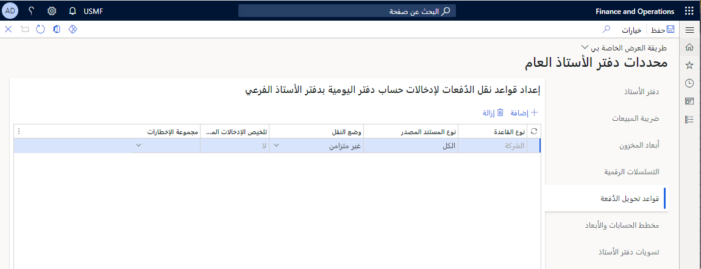
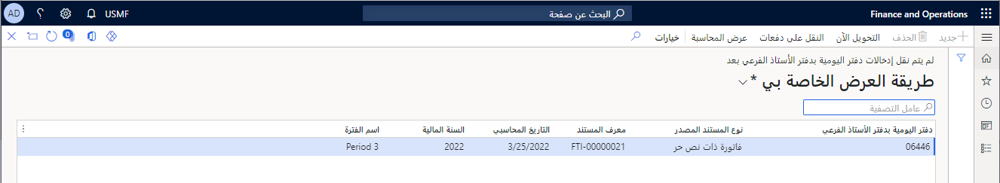
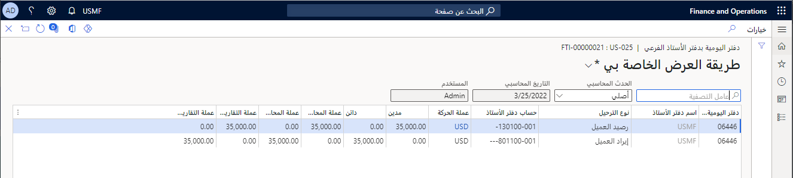
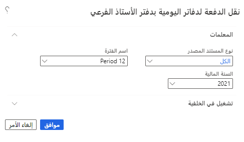
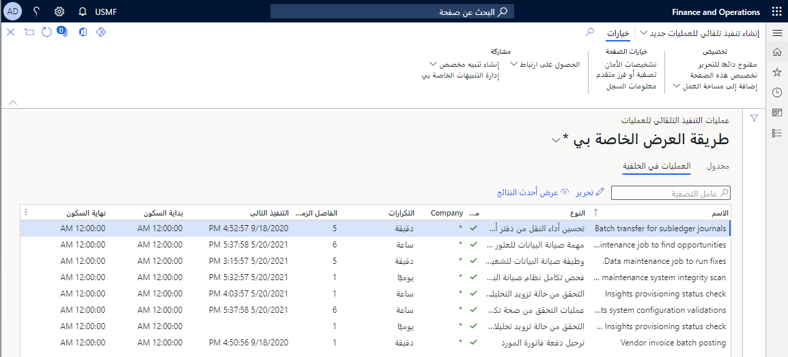

الحركات التي تتم داخل وحدة نمطية يتم نشرها أولاً فِي دفتر الأستاذ الفرعي. على سبيل المثال، سيتم ترحيل فاتورة المورد إلى دفتر الأستاذ الفرعي للحسابات الدائنة (AP). 

يحدد دفتر الأستاذ الفرعي لـ AP الحسابات التي تؤثر على الحركة والمبلغ الذي سيتم ترحيله إلى كل حساب.  يؤثر دفتر الأستاذ الفرعي لـ AP أيضًا على أرصدة الكيانات التي يدعمها دفتر الأستاذ الفرعي مثل أرصدة البائعين وأرصدة العملاء والأرصدة المصرفية. يتم الاحتفاظ بهذه الأرصدة داخل دفاتر الأستاذ الفرعية فقط، وليس فِي دفتر الأستاذ. 

يتم تسجيل الحركات فِي دفتر الأستاذ الفرعي فورًا عند النشر. يقوم دفتر الأستاذ الفرعي بتغذية دفتر الأستاذ العام ولكنه ليس دفتر الأستاذ العام. يجب تحويل الحركات التي تم ترحيلها إلى دفتر الأستاذ الفرعي إلى دفتر الأستاذ العام. 

## خيارات الإعداد
نظرًا لمقدار النشاط عبر جميع الوحدات فِي النظام، يمكن أن تصبح عمليات التحويل إلى دفتر الأستاذ العام عنق الزجاجة. لهذا السبب، لا تحدث عمليات التحويل فِي نفس وقت الترحيلات إلى دفتر الأستاذ الفرعي. تحدث فِي وقت لاحق. يمكنك تكوين إعدادات التحويل للتحكم فِي مقدار عمليات التحويل اللاحقة.

هناك خياران متاحان للترحيل إلى دفتر الأستاذ العام، وهما **غير المتزامنة** و **الدُفعة المجدولة**. 

- **غير المتزامنة** - فِي الوقت الفعلي تقريبًا. سينقل دفتر الأستاذ الفرعي الإدخالات إلى دفتر الأستاذ العام قبل أن يتمكن أي شخص من الاطلاع على دفتر الأستاذ العام وإدراك عدم وجوده. يحدث التحويل فِي أقرب وقت ممكن.
- **الدُفعة المجدولة** - عمليات التحويل إلى دفتر الأستاذ العام فِي فاصل زمني مجدول بانتظام. يمكنك تكوين التكرار الذي يتم تشغيل وظيفة الدُفعات عنده لإجراء عمليات التحويل.

### كيف تختار أفضل تكوين لبيئتك؟ 
يعتمد الأمر حقًا على ما إذا كان بإمكانك تحمل تأخير تحويل المعلومات وعدم توفرها فِي دفتر الأستاذ العام. إذا كنت تستخدم الدُفعة المجدولة وجدولة الدُفعة كل خمس دقائق، فقد لا تظهر الحركات فِي دفتر الأستاذ العام لمدة تصل إلى خمس دقائق. من ناحية أخرى، كلما جمعت الحركات لتحويلها معًا، كان أداء نظامك أفضل. 

أفضل خيار لك هو استخدام **غير متزامنة** والتبديل إلى **الدُفعة المجدولة** فقط إذا كنت تواجه خلافًا فِي دفتر الأستاذ العام الخاص بك بسبب عمليات التحويل المتكررة.

انتقل إلى **دفتر الأستاذ العام** ثم حدد **إعداد دفتر الأستاذ**. في الصفحة **معلمات دفتر الأستاذ العام**، حدد **قواعد تحويل الدُفعات** لتكوين الحقل **وضع التحويل**. 

> [!div class="mx-imgBorder"]
>
 
قد تلاحظ وجود خيار تحويل **متزامن**. كان هذا الخيار متاحًا فِي الإصدارات السابقة من المنتج ولكنه لم يعد متاحًا. إذا حاولت تحديد **متزامن** ، فسيتم إخطارك بأن هذا الخيار لم يعد مدعومًا. يتم ترحيل الخيار **متزامن** مباشرةً إلى دفتر الأستاذ العام فِي كل مرة يتم فيها نشر المنشور فِي دفتر الأستاذ الفرعي. يؤدي هذا إلى تأخير نشر دفتر الأستاذ الفرعي ويمكن أن يتسبب فِي حدوث خلاف فِي دفتر الأستاذ العام.

يمكنك تكوين الخيارات التالية فِي صفحة **قواعد تحويل الدُفعة**.

|      العمود                      |      الخيارات                                                                                                                                                                                                                     |      الوصف                                                                                                                                                                                                                                                                                                    |
|----------------------------------|----------------------------------------------------------------------------------------------------------------------------------------------------------------------------------------------------------------------------------|---------------------------------------------------------------------------------------------------------------------------------------------------------------------------------------------------------------------------------------------------------------------------------------------------------------------|
|     نوع القاعدة                    |     **شركة**،   **وثيقة**                                                                                                                                                                                                          |     يمكنك استخدام طرق تحويل مختلفة لشركات مختلفة ووحدات نمطية مختلفة. في هذا العمود، حدد ما إذا كانت هذه القاعدة تنطبق على مستند معين، أو شركة معينة، أو جميع الشركات. 
قد لا تحتاج شركة الدمج أو الإلغاء إلى النشر فِي كثير من الأحيان مثل شركة تشغيلية.    |
|     نوع الوثيقة المصدر         |     إذا كان نوع القاعدة هو شركة، فيمكنك تحديد **الكل** أو شركة / كيان قانوني معين.     إذا كان نوع القاعدة هو **مستند**، فيجب عليك تحديد نوع مستند مصدر معين بما فِي ذلك **أمر الشراء** أو **فاتورة المشروع**.    |     يتم نشر سجلات الدوام فِي نهاية فترة الجدول الزمني. ليست هناك حاجة لمعالجة الجداول الزمنية على الفور. يمكنك اختيار استخدام الدُفعة المجدولة للجداول الزمنية لتحقيق أقصى استفادة من تجميع الجداول الزمنية معًا.                                                                                 |
|     تلخيص إدخالات الحساب    |     **نعم**،/ **لا**                                                                                                                                                                                                                      |     إذا حددت **نعم** ، يمكنك تلخيص أي إدخالات حساب فِي دفتر الأستاذ العام يتم ترحيلها إلى نفس سلسلة الحساب فِي نفس التاريخ بنفس العملة ونفس الترحيل. هذا يقلل من عدد إدخالات   دفتر الأستاذ فِي النظام؛ التفاصيل لا تزال متاحة فِي   دفاتر الأستاذ الفرعية.               |
|     مجموعة الإعلامات           |     مجموعة المستخدمين                                                                                                                                                                                                                   |     في بعض الأحيان تحدث أخطاء ولا يتم تحويل الإدخالات بنجاح. في حالة حدوث ذلك، سيتم إخطار المجموعة المحددة. إذا كنت تريد إعلام مجموعات منفصلة من المستخدمين لأنواع **مستندات** مختلفة، فاستخدم نوع قاعدة المستند، وأدخل قواعد تحويل متعددة.                                          |

يوضح الفيديو كيفية استخدام قواعد تحويل الدفعات فِي فواتير البائع. سيغطي الإعداد معلمات دفتر الأستاذ العام، وكيفية إنشاء فاتورة المورد لمعالجة أمر الشراء. عندما يتم ترحيل الفاتورة، يمكن استخدام **التحويل الآن** لتشغيل الدُفعة المحددة. 

> [!VIDEO https://www.microsoft.com/videoplayer/embed/RE49AuP] 

## قم بمراجعة الإدخالات التي لا يتم ترحيلها إلى دفتر الأستاذ العام
في ظل ظروف نادرة، قد لا يتم تحويل الإدخالات من دفتر الأستاذ الفرعي إلى دفتر الأستاذ العام. يوجد نموذج لمراجعة الحركات العالقة. انتقل إلى **دفتر الأستاذ العام > المهام الدورية > إدخالات دفتر اليومية فِي دفتر الأستاذ الفرعي الذي لم يتم نقله بعد** لعرض هذه الإدخالات.

إذا كان لديك إدخال لم يتم نقله إلى دفتر الأستاذ العام، فسيبدو مثل لقطة الشاشة التالية.

> [!div class="mx-imgBorder"]
> 

ربما لم يتم تحويل الإدخالات بسبب تغيير فِي بنية الحساب أو تعليق حساب أو بُعد. يمكنك مراجعة إدخالات دفتر الأستاذ الفرعي لمساعدتك فِي تحديد سبب عدم تحويل الإدخالات عن طريق تحديد **عرض المحاسبة** من القائمة.

> [!div class="mx-imgBorder"]
> 

عندما تحدد سبب عدم تحويل الإدخال إلى دفتر الأستاذ العام. يمكنك تحديد **تحويل الآن** أو **تحويل** دفعة واحدة لتحويل الإدخالات إلى دفتر الأستاذ العام. 

تتيح لك صفحة **نقل الدُفعات لدفاتر اليومية الفرعية** تحديد نوع مستند مصدر معين (أو جميع الأنواع) وسنة / فترة مالية للتحويل. بناءً على ما إذا كنت قد قمت بتعيين الخيار **الملخص** إلى **نعم** أو **لا**، فقد يؤدي تحويل دفعة إلى تقليل عدد الإدخالات فِي دفتر الأستاذ العام الخاص بك.

> [!div class="mx-imgBorder"]
> 

## نقل دفتر الأستاذ الفرعي إلى تحسين أداء دفتر الأستاذ العام
هناك ميزة يمكنك تمكينها فِي مساحة العمل **إدارة الميزات** باسم **تحويل دفتر الأستاذ الفرعي إلى تحسين أداء دفتر الأستاذ العام**. تعمل هذه الميزة على تغيير وضع التحويل **غير المتزامن** للعمل مثل وضع تحويل **الدُفعة المجدولة**. يتم تجميع الحركات الأصغر ونقلها إلى دفتر الأستاذ العام معًا. يتم تمكين هذه الميزة بشكل افتراضي. 
 
انتقل إلى **إدارة النظام > الإعداد > أتمتة العمليات** لتكوين عمليات التشغيل المجمعة. قم بتغيير الفاصل الزمني للتكرار فِي هذه المهمة، إذا لم يتم تحويل دفتر الأستاذ الفرعي الخاص بك بالسرعة التي تتوقعها. قد ترغب فِي تغيير هذا لتشغيل الدُفعات فِي كثير من الأحيان.

> [!div class="mx-imgBorder"]
>

لتشغيل عملية التنفيذ التلقائي للعملية، يجب تشغيل وظيفة الدفعة **وظيفة نظام اقتراع أتمتة العملية**. يجب تشغيل هذه الوظيفة كل دقيقة للبحث عن عمل جديد لمعالجته. قد تتأخر عمليات تحويل الإدخالات من دفاتر الأستاذ الفرعية إلى دفتر الأستاذ العام إذا لم يتم تشغيل هذه الوظيفة بشكل كافٍ.
