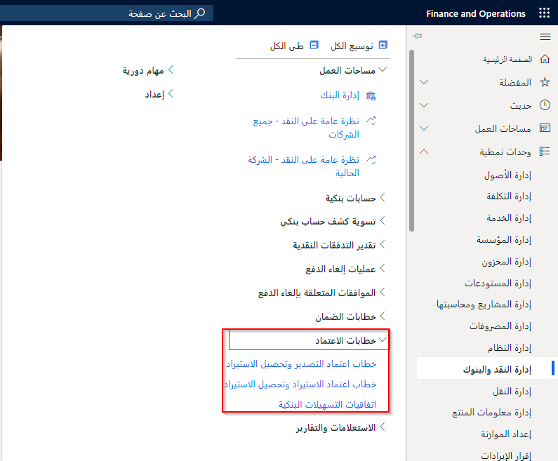

خطابات الاعتماد هي مستندات مصرفية تُستخدم عادة لشراء وبيع البضائع عبر الحدود الدولية.

تُستخدم خطابات الاعتماد للمعاملات الدولية لضمان سداد المدفوعات. خطاب الاعتماد هو اتفاقية صادرة عن أحد البنوك، يوافق فيها البنك على ضمان الدفع نيابة عن المشتري، إذا تم استيفاء شروط الاتفاقية بين المشتري والبائع. لاحظ أن خطاب الاعتماد يشار إليه أيضاً باسم الاعتماد المستندي (DC).

بالنسبة لخطاب اعتماد الاستيراد، تكون المنظمة هي المشتري أو مقدم الطلب لخطاب الاعتماد. بالنسبة لخطاب الاعتماد للتصدير، فإن المؤسسة هي البائع أو المستفيد من خطاب الاعتماد. الأطراف التالية معنية بخطاب الاعتماد:

- مقدم الطلب (المشتري) الذي ينوي دفع ثمن البضائع.
- المستفيد (البائع) الذي سيتسلم الدفعة.
- البنك المصدر لخطاب الاعتماد.
- البنك المبلغ الذي ينفذ الحركة نيابة عن مقدم الطلب.

يتضمن خطاب الاعتماد وصفاً للبضائع وأي مستندات مطلوبة وتاريخ الشحن وتاريخ انتهاء الصلاحية الذي لن يتم الدفع بعده. يقوم البنك المُصدر بتحصيل هامش لخطاب الاعتماد.

يمكن أن يكون خطاب الاعتماد *قابلاً للإلغاء* أو *غير قابل للإلغاء*. يمكن أن تكون طبيعة خطاب الاعتماد قابلة للتحويل أو غير قابلة للتحويل أو متجددة. عادةً ما يكون خطاب الاعتماد اتفاقية غير قابلة للإلغاء ومؤكدة على أن السداد سيتم إلى مستفيد معين عند تقديم مستندات شحن كاملة ودقيقة.

خطاب الاعتماد يسمح لك بما يلي:

- إنشاء تقرير عن التسهيلات البنكية واستخداماتها.
- إنشاء إدخالات خطاب الاعتماد.
- طباعة صفحة طلب الاعتماد المستندي.
- إدخال تفاصيل خطاب الاعتماد.
- تعديل خطاب الاعتماد.
- تسجيل مدفوعات هامش خطاب الاعتماد.
- تخصيص مبلغ هامش للشحنات.
- إرفاق إيصال تعبئة في أمر الشراء بتفاصيل شحن خطاب الاعتماد.
- معالجة دفع الفاتورة.
- عرض توقعات التدفق النقدي حسب خطاب الاعتماد.
- طباعة التقارير والاستفسارات المختلفة المتعلقة بخطاب الاعتماد.
- إنشاء بيان مورد.

**إدارة النقد والبنوك > خطابات الاعتماد**

