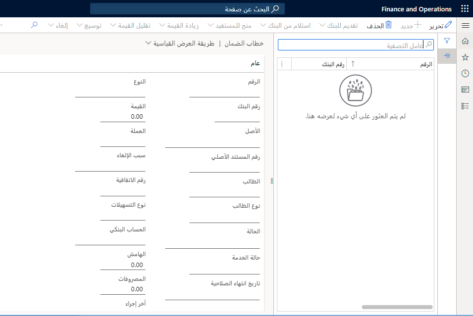

خطاب الضمان هو اتفاق من قِبل البنك (الضامن) على دفع مبلغ محدد من المال إلى شخص ما (المستفيد) إذا تخلف عميل البنك (الرئيسي) عن السداد أو التزام تجاه المستفيد. خطابات الضمان غير قابلة للتحويل. تنطبق فقط على المستفيد المذكور اسمه في الاتفاقية. يمكن للمدير أن يطلب زيادة أو نقصان في قيمة خطاب الضمان، وفقاً لشروط الاتفاقية.

لتصفية خطاب الضمان، يجب على المستفيد تقديم خطاب الضمان الأصلي وإبلاغ البنك بالتخلف عن السداد قبل تاريخ انتهاء الصلاحية. يقوم البنك بعد ذلك بدفع المبلغ المستحق لحساب المستفيد، وفقاً لشروط خطاب الضمان. يحتفظ البنك بنسبة مئوية من الدفع كهامش. النسبة متفق عليها ومحددة في شروط الاتفاقية.

يمكنك إنشاء رمز لتتبع الغرض من خطاب الضمان. بالإضافة إلى ذلك، يمكنك تحديد الأسباب التي يمكن أن ترتبط بخطاب الضمان عند إلغاء الخطاب. يمكنك عرض رموز الغرض والأسباب البنكية في صفحتي **رموز الأغراض من الدفع** و **الأسباب البنكية**.

يمكنك استخدام صفحة **خطاب الضمان** لإكمال هذه المهام:

- إنشاء إدخالات دفتر الأستاذ الصحيحة والتخلص من الإدخال اليدوي.
- تسجيل جميع المعاملات النقدية وغير النقدية، وتتبع أرصدة خطابات الضمان.
- تسجيل وتتبع حالة وانتهاء صلاحية خطابات الضمان.
- إنشاء تقرير يسرد البنوك التي لديها خطابات الضمان.

فيما يلي وصف للإجراءات التي يمكنك تنفيذها على خطاب الضمان:

- **إرسال إلى البنك**- إرسال طلب خطاب الضمان إلى البنك.
- **استلام من البنك** - بعد موافقة البنك على الطلب المقدم، استلم خطاب الضمان من البنك.
- **منح للمستفيد** - بعد استلامك لخطاب الضمان من البنك، قم بتزويد المستفيد بخطاب الضمان.
- **زيادة القيمة** - إذا وافق المستفيد والمدير، فقم بزيادة القيمة النقدية.
- **خفض القيمة** – إذا وافق المستفيد والمدير، فخفّض القيمة النقدية.
- **تمديد** - بعد تقديم خطاب الضمان للمستفيد، قم بتمديد فترة الصلاحية، إذا كان التمديد مطلوباً.
- **إلغاء** - عندما لم يعد الغرض من طلب خطاب الضمان سارياً، فقم بإلغاء الاتفاقية.
- **تصفية** - عندما يقدم المستفيد خطاب الضمان للبنك، يصرف خطاب الضمان.

**إدارة النقد والبنوك > خطابات الضمان > خطابات الضمان**
