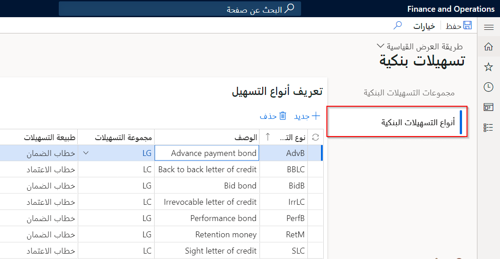

قبل استيراد خطابات الاعتماد، يجب إكمال إعداد التسهيلات البنكية وملفات تعريف الترحيل واتفاقية تسهيلات بنكية وتفاصيل بنكية للمورّد.

لا يمكن أن تحتوي اتفاقيات التسهيلات على تواريخ متداخلة. 

فعلى سبيل المثال، إذا كانت إحدى الاتفاقيات تمتد من 01 يناير 2019 إلى 31 أغسطس 2019، فلا يمكنك إبرام اتفاقية تسهيل أخرى في بداية أو نهاية تلك الفترة.

تعرض الصورة التالية مجموعات التسهيلات في صفحة **التسهيلات البنكية** في **إدارة النقد والبنوك > إعداد**.
 

## تنشيط خطاب الاعتماد كمستند بنكي 

تنشيط خطاب الاعتماد كمستند بنكي قبل البدء في الحركات التي تنطوي على خطابات اعتماد.

1.  انتقل إلى **‏‫إدارة النقد والبنوك‬ > الإعداد > معلمات إدارة البنك والنقد**.
2.  قم بتوسيع علامة التبويب السريعة **المستند البنكي**.
3.  قمّ بتعيين خيار **تمكين استيراد خطاب الاعتماد** إلى **نعم** لتنشيط خطاب الاعتماد.
4.  أغلق الصفحة لحفظ التغييرات التي أجريتها.

عند تعيين حقل **نوع المستند البنكي** باعتباره **خطاب اعتماد**، فسيتم عرض أمر الشراء في قائمة خطابات الاعتماد في الوحدة النمطية لإدارة النقد والبنوك. 

**إدارة النقد والبنوك > إعداد > محددات إدارة النقد والبنوك**
 

## إعداد التسهيلات البنكية وملفات تعريف الترحيل 

يمكنك إعداد أنواع التسهيلات البنكية ومجموعات التسهيلات البنكية في صفحة **التسهيلات البنكية**. بعد إعداد ملف تعريف الترحيل البنكي، يمكنك إبرام اتفاقيات تسهيلات.

1.  حدد **‏إدارة النقد والبنوك > إعداد > التسهيلات البنكية**.
2.  في الارتباط **مجموعات التسهيلات**، حدد **جديد** لإنشاء مجموعة تسهيلات بنكية جديدة.
3.  في حقلي **مجموعة التسهيلات** و **الوصف**، أدخل اسم مجموعة التسهيلات البنكية ووصفها.
4.  حدد الارتباط **أنواع التسهيلات**، ثم حدد **جديد** لإنشاء نوع تسهيل جديد.
5.  أدخل كوداً فريداً في حقل **نوع التسهيلات**، ثمّ في حقلي **مجموعة التسهيلات** و **طبيعة التسهيلات**، حدد مجموعة التسهيلات البنكية وطبيعتها.
6.  أغلق الصفحة لحفظ التغييرات التي أجريتها.
7.  حدد **‏إدارة النقد والبنوك > إعداد > المستندات البنكية > ملف تعريف ترحيل المستندات البنكية**.
8.  في الحقل **تسوية الحساب** حدد الحساب الرئيسي لإجراء التسوية. يُستخدم هذا الحساب عند حساب تقدير التدفقات النقدية.
9.  في الحقل **حساب التكاليف** حدد الحساب الخاص بحركات المصروفات.
10. في الحقل **حساب الهامش** حدد الحساب الخاص بحركة الهامش. يتم خصم هذا الحساب عند ترحيل الهامش الافتتاحي وقيده عند ترحيل الدفع. يعتبر الهامش دفعة مقدمة للبنك الذي تم تسويتها بواسطة البنك عند إجراء المشتري للتسوية النهائية.  
11. أغلق الصفحة لحفظ التغييرات التي أجريتها.

 **‏إدارة النقد والبنوك > إعداد > التسهيلات البنكية > أنواع التسهيلات**. 

  

## إنشاء إتفاقية تسهيل بنكي 

يمكنك إبرام اتفاقيات تسهيلات بنكية تسجل التسهيلات المختلفة التي يقدمها البنك. يمكن استخدام المستندات البنكية في الحركات فقط بعد إنشاء اتفاقيات التسهيلات. يعين البنك حداً لخطاب الاعتماد، والذي تتم إعادة حسابه في كل مره يتم فيها تسجيل حركة خطاب الاعتماد.

عندما تنتهي اتفاقية التسهيلات، يمكنك إنشاء إصدار جديد من الاتفاقية بتواريخ بداية ونهاية جديدة، بتمديد مدة الاتفاقية القديمة.

1.  انتقل إلى **‏‫إدارة النقد والبنوك > خطابات الاعتماد > اتفاقيات التسهيلات البنكية**.
2.  حدد **جديد‎**.
3.  في حقل **رقم الاتفاقية**، أدخل رقم الاتفاقية وفقاً للاتفاقية مع البنك.
4.  في حقل **الحساب البنكي**، أدخل رقم الحساب في بنك الإصدار.
5.  في الحقل **تاريخ البدء** أدخل تاريخاً ووقتاً.
6.  في الحقل **تاريخ الإنهاء** أدخل تاريخاً ووقتاً.
7.  قُم بتوسيع قسم **‎‏‫عام** أو طيه.
8.  حدد **إضافة سطر**.
9.  في الحقل **نوع التسهيلات** حدد زر القائمة المنسدلة لفتح البحث.
10. في القائمة، قم بالبحث عن السجل المطلوب وحدده. يعرض حقل **المبلغ المستخدم** المبلغ المستخدم حالياً لخطاب الاعتماد.
11. في حقل **الحد**، أدخل مبلغ التسهيل الذي تم التفاوض عليه مع البنك.
12. حدد **حفظ**.
13. في صفحة **اتفاقيات التسهيلات البنكية**، حدد اتفاقية التسهيلات التي لم تعد نشطة.
14. حدد **توسيع** لفتح مربع الحوار المنسدل.
 
    
**‏إدارة النقد والبنوك > خطابات الاعتماد > اتفاقيات التسهيلات البنكية > تمديد**

 

15. في الحقل **رقم الاتفاقية الجديد** اكتب قيمةً.
16. في الحقل **تاريخ الإنهاء** أدخل تاريخاً ووقتاً.
17. حدد **تمديد**.
18. القيمة الموجودة في حقل **تاريخ البدء** للاتفاقية الممتدة هي اليوم الذي يلي تاريخ انتهاء الاتفاقية المحددة. 
19. يُعين حقل **المبلغ المستخدم** إلى صفر لأن هذه الاتفاقية تم إبرامها حديثاً.
20. أغلق الصفحة لحفظ التغييرات التي أجريتها.

## إعداد الحسابات البنكية للموردين 

يجب تحديد الحسابات البنكية للموردين حتى يتم تسجيل حركات خطاب الاعتماد بشكل ملائم.

لمعرفة كيفية إعداد حسابات المورّدين، انتقل إلى [تكوين الحسابات الدائنة‏‎ في Dynamics 365 Finance](/learn/modules/configure-accounts-payable-in-dynamics-365-finance-ops//?azure-portal=true). 
