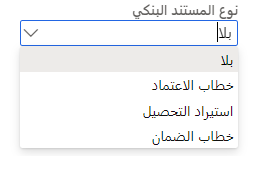
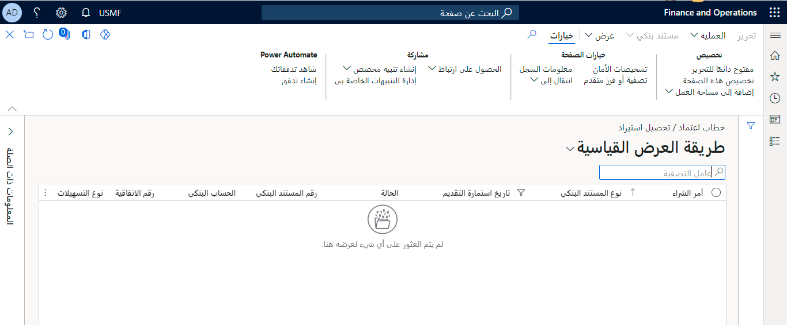
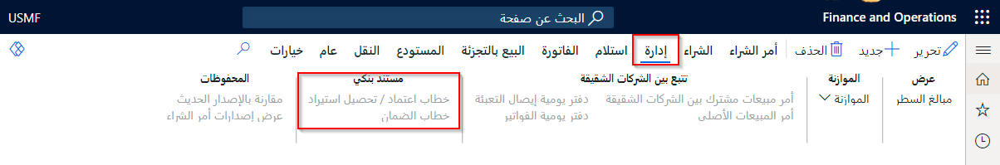

توضح هذه الوحدة كيفية معالجة خطاب اعتماد بعد تطبيق التكوين.

## إنشاء أمر شراء وإدخال تفاصيل خطاب الاعتماد 

ويتم ربط خطاب الاعتماد بأمر شراء لمعالجة حركات المورد بأقل تدخل يدوي. وتكون الأطراف المعنية المشتري (مقدم الطلب) والبائع (المستفيد) وبنك الإصدار (بنك المشتري) والبنك المُبلغ (بنك المستفيد). 

وعندما تكون الشركة هي المشتري ومقدم الطلب لخطاب الاعتماد، فسيُسمى خطاب الاعتماد خطاب اعتماد الاستيراد. لا يُنظَر إلى أوامر الشراء المرتبطة بخطابات الاعتماد فيما يخص فوترة الملخص.

1.  حدد **التدبير وتحديد الموارد > أوامر الشراء > كافة أوامر الشراء**.
2.  حدد **أمر شراء** لإنشاء أمر شراء جديد.
3.  في الصفحة **إنشاء أمر شراء**، حدد حساب المورد في حقل **حساب المورد**.
4.  وفي حقل **نوع المستند البنكي**، حدد **خطاب الاعتماد**، ثم حدد **موافق**. 
 
    

5.  انتقل إلى **إدارة النقد والبنوك > خطابات الاعتماد > خطاب اعتماد الاستيراد وتحصيل الاستيراد** لعرض خطابات الاعتماد.

 

6.  يمكنك النقر نقراً مزدوجاً فوق رقم الأمر المرتبط بخطاب الاعتماد المراد تحديثه. وبدلاً من ذلك، في صفحة **أمر الشراء**، حدد علامة التبويب **إدارة**، ثم حدد **خطاب اعتماد / تحصيل استيراد**.

    

7.  حدد علامة التبويب السريعة **عام**، وفي الحقل **الحساب البنكي**، حدد البنك الذي يقوم بتعيين خطاب الاعتماد. في الحقل **رقم المستند البنكي**، أدخل رقم المستند الذي حدده البنك.
8.  حدد علامة التبويب السريعة **السطور**، ثم حدد **إضافة سطر** لإضافة تفاصيل الشحن. أدخل القيم الضرورية في حقول **المبلغ** و **تاريخ الاستحقاق المتوقع** و **تاريخ الاستحقاق الفعلي** و **حالة المستند**. 
9.  حدد **إحضار عمليات الشحن من أمر الشراء** لعرض تفاصيل الشحن المحددة بالفعل في سطور أمر الشراء أو جدول التسليم. 
10. حدد **حركات هامش الشحنة** لفتح صفحة **هامش الشحنة** لعرض حركات هامش الشحنة للشحنة المحددة.
11. *اختياري*: حدد علامة التبويب السريعة **المستند البنكي**، ثم حدد التفاصيل في حقول **نوع الاعتماد المستندي** و **طبيعة الاعتماد المستندي** و **تاريخ انتهاء الصلاحية**. 
12. يمكن أن يكون خطاب الاعتماد إما **غير قابل للإلغاء** أو **قابل للإلغاء**. كما يمكن أن تكون طبيعته **غير قابل للتحويل** أو **قابل للتحويل** أو **متجدد**.
13. *اختياري*: حدد علامة التبويب السريعة **تفاصيل البنك**، ثم أدخل تفاصيل البنك المُبلغ في حقلي **البنك المُبلغ** و **تاريخ الإصدار**.
14. *اختياري*: حدد علامة التبويب السريعة **الشروط**، ثم حدد شروط الشحن وشروط الدفع الخاصة بخطاب الاعتماد.
15. *اختياري*: حدد علامة التبويب السريعة **التأمين** لتحديد تفاصيل طلب التأمين الذي قام بتقديمه المورد في حقول **حالة التأمين** و **رقم مورد التأمين** و **رقم التأمين**.
16. حدد **معالجة > تأكيد** لتأكيد خطاب الاعتماد. 
17. يتم تحديث حقل **رصيد التسهيلات** استناداً إلى القيمة الموجودة في حقل **مبلغ خطاب الاعتماد / تحصيل الاستيراد**.
18. يتم تحديث حقل **المبلغ المستخدم** في صفحة **تفاصيل اتفاقية التسهيلات البنكية** بمبلغ خطاب الاعتماد.
19. يتم تأكيد تفاصيل خطاب الاعتماد فقط إذا كانت إجمالي مبالغ السطر تساوي **مبلغ خطاب الاعتماد / تحصيل الاستيراد** ولا تتجاوز المبلغ المتاح لنوع التسهيلات.
20. حدد **طباعة استمارة التقديم** لطباعة صفحة استمارة التقديم الخاصة بخطاب الاعتماد التي سيتم إرسالها إلى البنك.

## تعديل تفاصيل خطاب الاعتماد 

إذا تغيرت تفاصيل أمر الشراء، فأنت بحاجة إلى تحديث تفاصيل خطاب الاعتماد قبل فوترة أمر الشراء بالكامل. ويمكنك تعديل خطاب اعتماد مؤكد فقط عندما يحمل خطاب الاعتماد حالة **مؤكد**. قد يفرض عيك البنك رسوماً مقابل تعديل خطاب اعتماد موجود.

1.  حدد **إدارة النقد والبنوك > خطابات الاعتماد > خطاب اعتماد الاستيراد وتحصيل الاستيراد**. 
2.  انقر نقراً مزدوجاً فوق خطاب اعتماد الاستيراد أو تحصيل الاستيراد المراد تعديله.
3.  حدد **معالجة > تعديل**، ثم قم بتعديل تفاصيل خطاب الاعتماد. 
4.  يمكنك تغيير مبلغ خطاب الاعتماد أو عدد الشحنات به، إذا كان ذلك مطلوباً. 
5.  حدد **تأكيد** لتأكيد التغييرات التي أُجريت على خطاب الاعتماد. 
6.  حدد **استعلامات** لفتح صفحة **محفوظات خطاب الاعتماد/تحصيل الاستيراد**، ثم اعرض محفوظات التعديل الخاصة بخطاب الاعتماد.
7.  أغلق الصفحات لحفظ التغييرات التي أجريتها.

يمكنك تغيير مبلغ خطاب الاعتماد أو عدد الشحنات به، إذا كان ذلك مطلوباً. يمكنك تحرير تفاصيل الشحن فقط إذا لم يتم ترحيل إيصال التعبئة أو الفاتورة. 

إذا قمت بحذف تفاصيل سطر الشحنة التي تم تخصيص الهامش لها بالفعل، فيتم إرجاع المبلغ الموزّع إلى مبلغ غير موزّع في صفحة **حركات هامش خطاب الاعتماد**.

يجب تأكيد التغييرات لحفظها كتعديلات. يؤدي كل تعديل مؤكد إلى إصدار جديد من خطاب الاعتماد. ويساعد ذلك على تتبع محفوظات المراجعة لخطاب الاعتماد. 

إذا تم تغيير تفاصيل سطر الشحن، فلن يتم تأكيد تفاصيل خطاب الاعتماد إلا إذا لم يتجاوز مبلغ الشحن الإجمالي مبلغ خطاب الاعتماد.

## ترحيل دفع هامش لخطاب اعتماد 

عند استلام إشعار خطاب اعتماد من البنك، يمكنك فحص الهامش الذي تم تحصيله بواسطة البنك وترحيله في **دفتر يومية عام** من النوع **يومياً**. لترحيل الحركة مقابل ملف تعريف الترحيل المناسب، يجب تحديد حقل **نوع الحركة** على أنه **الهامش**.

1.  حدد **دفتر الأستاذ العام > إدخالات دفتر اليومية > دفاتر اليومية العامة**.
2.  حدد **جديد** لإنشاء دفتر يومية جديد.
3.  في الحقل **الاسم**، حدد دفتر يومية يومياً، ثم حدد **السطور** لفتح صفحة **إيصال اليومية**.
4.  في حقل **مدين**، أدخل مبلغ الهامش الذي قام البنك بتحصيله.
5.  حدد علامة التبويب **المدفوعات**، ثم في الحقل **نوع الحركة**، حدد **الهامش**. 
6.  يتم عرض القيم الموجودة في حقول **نوع الحساب**، و **الحساب** و **نوع حساب مقابل** و **الحساب المقابل** وفقاً لملف تعريف الترحيل.
7.  في الحقل **خطاب الاعتماد وتحصيل الاستيراد**، حدد رقم المستند البنكي المرتبط بخطاب الاعتماد.
8.  حدد **ترحيل > ترحيل** لترحيل دفتر اليومية.
9.  أغلق الصفحة لحفظ التغييرات التي أجريتها. يتم تسجيل مبلغ الهامش الخاص بخطاب الاعتماد في صفحة **حركات هامش خطاب الاعتماد**.

## توزيع مبلغ الهامش للشحن 

لتعديل مبلغ الهامش في وقت الفوترة (جزئياً أو كلياً)، يجب توزيع مبلغ الهامش لكل شحن. يمكنك استخدام الصفحة **حركات هامش خطاب الاعتماد** لتوزيع مبلغ الهامش عبر عمليات الشحن الخاصة بخطاب اعتماد.

1.  انتقل إلى **إدارة النقد والبنوك > خطابات الاعتماد > خطاب اعتماد الاستيراد وتحصيل الاستيراد**. 
2.  انقر نقراً مزدوجاً فوق خطاب اعتماد الاستيراد أو تحصيل الاستيراد الذي يجب توزيع مبلغ الهامش للشحن له.
3.  حدد **هامش مستند البنك** لفتح صفحة **حركات هامش خطاب الاعتماد**.
4.  حدد سطر مبلغ الهامش الذي سيتم توزيعه، ثم حدد **توزيع على الشحنات** لفتح مربع الحوار المنسدل **توزيع في**.
5.  في الحقل **نوع التوزيع**، حدد **مخصص** لتوزيع مبلغ الهامش لشحنة معينة، أو حدد **موزّع** لتوزيع مبلغ الهامش بالتناسب بين جميع الشحنات التي لم تتم فوترتها. 
6.  حدد رقم الشحن في الحقل **رقم الشحن**.

    يمكنك توزيع مبالغ الهامش فقط إذا كانت القيمة في الحقل **الرصيد** أكبر من الصفر ولم تتم فوترة الشحنة التي تقوم بالتوزيع إليها بالفعل. إذا حددت **موزّع** في حقل **نوع التوزيع**، يتم حساب نسبة الشحن من مبلغ الهامش كما يلي:

    نسبة الشحنة = مبلغ الهامش مضروباً في (مبلغ الشحنة/مبلغ خطاب الاعتماد).
7.  حدد **موافق** للعودة إلى صفحة **حركات هامش خطاب الاعتماد**. 
8.  يتم تحديث الحقل **موزع** بمبلغ الهامش الذي تم توزيعه، ويتم تحديث الحالة على أنها **مرحل**.
9.  أغلق الصفحة لحفظ التغييرات التي أجريتها.
10. في صفحة **خطاب الاعتماد وتحصيل الاستيراد**، حدد علامة التبويب السريعة **السطور**، ثم حدد **حركات هامش الشحنة** لفتح صفحة **هامش الشحنة** وعرض مبلغ الهامش الذي تم توزيعه للشحنة.

## ترحيل إيصال تعبئة وفاتورة لأمر الشراء 

بعد توزيع الهامش للشحن، يمكنك ترحيل إيصال تعبئة وتسجيل فاتورة لأمر الشراء. عند ترحيل إيصال تعبئة، يمكنك تحديد رقم الشحن لربط الشحنة بالتسليم. لا يمكنك ترحيل الفاتورة أو تحديث إيصال التعبئة ما لم يساوِ مبلغ سطر الشحن الخاص بخطاب الاعتماد مبلغ الفاتورة، أو يقع تباين الشحن في حد التفاوت المحدد في حقل **النسبة المئوية للاختلاف** في صفحة **خطاب الاعتماد وتحصيل الاستيراد**.

1.  انتقل إلى **التدبير وتحديد الموارد > أوامر الشراء > كافة أوامر الشراء**.
2.  حدد أمر الشراء الخاص بخطاب الاعتماد الذي يجب فوترته، ثم انقر نقراً مزدوجاً فوق سطر الشراء لفتح صفحة **أمر الشراء**.
3.  حدد علامة التبويب **استلام**، ثم حدد **إيصال استلام المنتجات** لفتح الصفحة **ترحيل إيصال استلام المنتجات**. 
4.  حدد رقم الشحن في الحقل **رقم الشحن**، ثم حدد **موافق** لترحيل إيصال التعبئة.
5.  حدد علامة التبويب **الفاتورة**، ثم حدد **الفاتورة** لفتح صفحة **فاتورة المورد**. 
6.  حدد رقم الشحن في حقل **رقم الشحن**، ثم حدد **موافق** لترحيل الفاتورة. يجب أن يكون مبلغ الفاتورة مساوياً لمبلغ الشحن. ويتم تعيين حالة الشحن على أنها **مفوتر**.
7.  أغلق الصفحات لحفظ التغييرات التي أجريتها.

## إجراء دفع للفاتورة 

بعد أن تتم فوترة أمر الشراء، يمكنك إجراء الدفع وتسوية الحسابات. يجب أن تساوي المدفوعات لخطاب الاعتماد المبلغ المستحق ناقص مبلغ الهامش؛ نظراً لأن مبلغ الهامش قد قام البنك بتحصيله بالفعل. ويجب أن يكون الدفع ضمن حد التفاوت الوارد في خطاب الاعتماد.

1.  انتقل إلى **دفتر الأستاذ العام > إدخالات دفتر اليومية > دفتر اليومية العام**.
2.  حدد **جديد** لإنشاء دفتر يومية جديد.
3.  في الحقل **الاسم**، حدد دفتر يومية يومياً، ثم حدد **السطور** لفتح صفحة **إيصال اليومية**.
4.  أدخل المعلومات المطلوبة.
5.  حدد علامة التبويب **المدفوعات**، ثم في الحقل **نوع الحركة**، حدد **التسوية**.
6.  في الحقلين **خطاب الاعتماد وتحصيل الاستيراد** و **رقم الشحن**، حدد رقم المستند البنكي المرتبط بخطاب الاعتماد ورقم الشحن.
7.  حدد **ترحيل > ترحيل** لترحيل دفتر اليومية. 

بعد ترحيل فاتورة التسوية، يتم تعيين حالة خطاب الاعتماد على أنها **مُقفل**. ويكون الحساب البنكي دائناً بالمبلغ. ويتم تعيين حالة الشحن على أنها **مدفوع**. لا يمكنك إغلاق خطاب اعتماد إلا بعد تسوية جميع السطور مقابل المدفوعات.  

