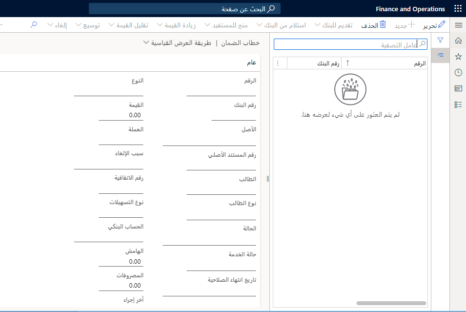
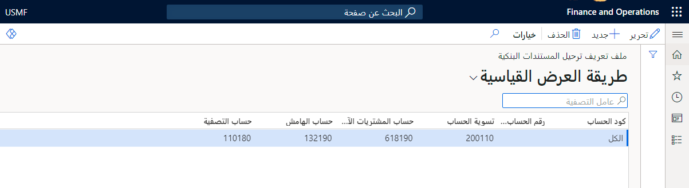

يجب تنشيط خطاب الضمان كمستند بنكي قبل التمكن من البدء في الحركات التي تشتمل على خطابات اعتماد.

1.  انتقل إلى **‏‫إدارة النقد والبنوك‬ > الإعداد > معلمات إدارة البنك والنقد**.
2.  قم بتوسيع علامة التبويب السريعة **المستند البنكي**.
3.  قم بتعيين خيار **تمكين خطاب الضمان** إلى **نعم** لتنشيط خطاب الضمان.
4.  في الحقل **دفتر يومية الحركات** حدد الزر المنسدل لتحديد اسم دفتر يومية الحركة.
5.  حدد علامة التبويب **التسلسلات الرقمية** ثم قم بتحديد كود تسلسل رقمي من أجل **رقم خطاب الضمان** ومراجع **حركة خطاب الضمان**.
6.  أغلق الصفحة لحفظ التغييرات التي أجريتها.

عند تعيين الحقل **نوع المستند البنكي** باعتباره **خطاب ضمان**، فسيتم عرض أمر المبيعات في قائمة خطابات الضمان في الوحدة النمطية لإدارة البنك والنقد. 

## إعداد ملفات تعريف الترحيل والتسهيلات البنكية لخطابات الضمان 

يتعين عليك إنشاء **تسهيل بنكي** و **ملف تعريف الترحيل** اللازم لمعالجة خطاب ضمان.

## إنشاء تسهيل بنكي 

1.  انتقل إلى **‏‫إدارة النقد والبنوك‬ > إعداد > التسهيلات البنكية**.
2.  حدد **جديد‏‎**.
3.  في الحقل **مجموعة التسهيلات** أدخل اسم مجموعة التسهيلات البنكية لحركة خطاب الضمان.
4.  في حقل **الوصف** أدخل قيمة.
5.  حدد **حفظ**.
6.  حدد علامة التبويب **أنواع التسهيلات**.
7.  حدد **جديد‏‎**.
8.  في الحقل **نوع التسهيلات** أدخل اسم نوع التسهيلات البنكية المرتبطة بإتفاقية التسهيلات البنكية.
9.  في حقل **الوصف** أدخل قيمة.
10. في الحقل **مجموعة التسهيلات** حدد زر القائمة المنسدلة لفتح البحث.
11. في القائمة، قم بالبحث عن السجل المطلوب وحدده.
12. في الحقل **طبيعة التسهيلات** حدد خيارً.
13. حدد **حفظ**.
14. أغلق الصفحة.

## إعداد ملف تعريف ترحيل البنك 

1.  انتقل إلى **‏‫إدارة النقد والبنوك‬ > إعداد > ملف تعريف المستندات البنكية**.
 
      

2.  حدد **جديد‏‎**.
3.  في الحقل برقم **المجموعة/الحساب** حدد زر القائمة المنسدلة لفتح البحث.
4.  في القائمة، قم بالبحث عن السجل المطلوب وحدده.
5.  في الحقل **تسوية الحساب** حدد الحساب الرئيسي لإجراء التسوية.
6.  في الحقل **حساب التكاليف** حدد الحساب الخاص بحركات المصروفات.
7.  في الحقل **حساب الهامش** حدد الحساب الخاص بحركة الهامش.
8.  في الحقل **حساب التصفية** حدد حساب التصفية لحركة خطاب الضمان.
9.  حدد **حفظ**.
10. أغلق الصفحة.

## إنشاء إتفاقية تسهيل بنكي 

1.  انتقل إلى **‏‫إدارة النقد والبنوك‬ > خطابات الضمان > اتفاقيات التسهيلات البنكية**.
2.  حدد **جديد‏‎**.
3.  في الحقل **رقم الاتفاقية** أدخل رقم اتفاقية البنك الخاص بالحركة.
4.  في الحقل **حساب البنك** حدد رقم الحساب البنكي الذي يُفتح من أجله خطاب الضمان.
5.  في القائمة، انقر على الارتباط في الصف المحدد.
6.  في الحقل **تاريخ البدء** أدخل تاريخاً ووقتاً.
7.  في الحقل **تاريخ الإنهاء** أدخل تاريخاً ووقتاً.
8.  قم بتبديل توسيع القسم **عام**.
9.  حدد **إضافة سطر**.
10. في الحقل **نوع التسهيلات** حدد زر القائمة المنسدلة لفتح البحث.
11. في القائمة، قم بالبحث عن السجل المطلوب وحدده.
12. في القائمة، انقر على الارتباط في الصف المحدد.
13. في الحقل **الحد** أدخل المبلغ الذي تم التفاوض عليه مع البنك.
14. حدد **حفظ**.
15. قم بتبديل توسيع القسم **خطاب الضمان**.
16. في الحقل **أسلوب الحساب** حدد خيارً.
أدخل تفاصيل النسبة المئوية وطريقه الحساب لـ **الهامش النقدي** أو **عمولة الإصدار** أو **عمولة المد أو زيادة عمولة القيمة** أو **خفض عمولة القيمة** كما هو مناسب.
17. حدد **حفظ**.

## تمديد اتفاقية التسهيلات البنكية 

1.  حدد **توسيع** لفتح مربع الحوار المنسدل.
2.  في الحقل **رقم الاتفاقية الجديد** اكتب قيمةً.
3.  في الحقل **تاريخ الإنهاء** أدخل تاريخاً ووقتاً.
4.  حدد **تمديد**.
5.  حدد **حفظ**.
6.  أغلق الصفحة.

