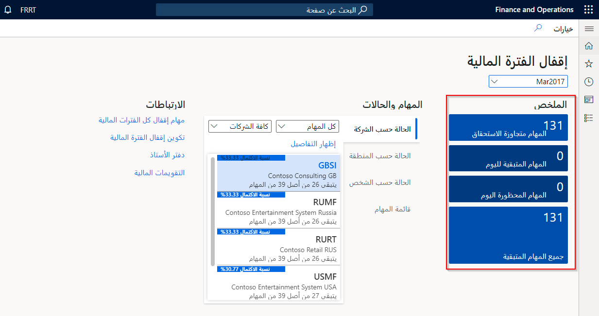
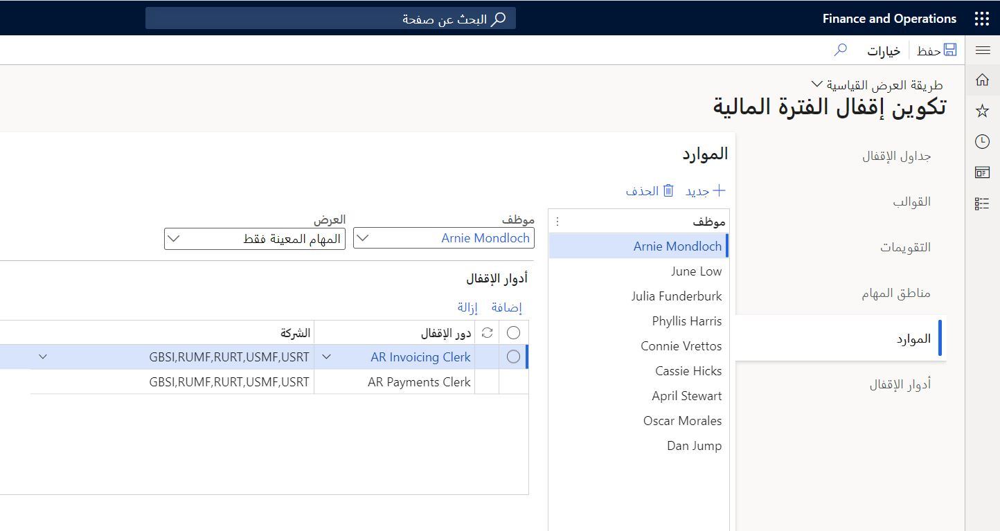
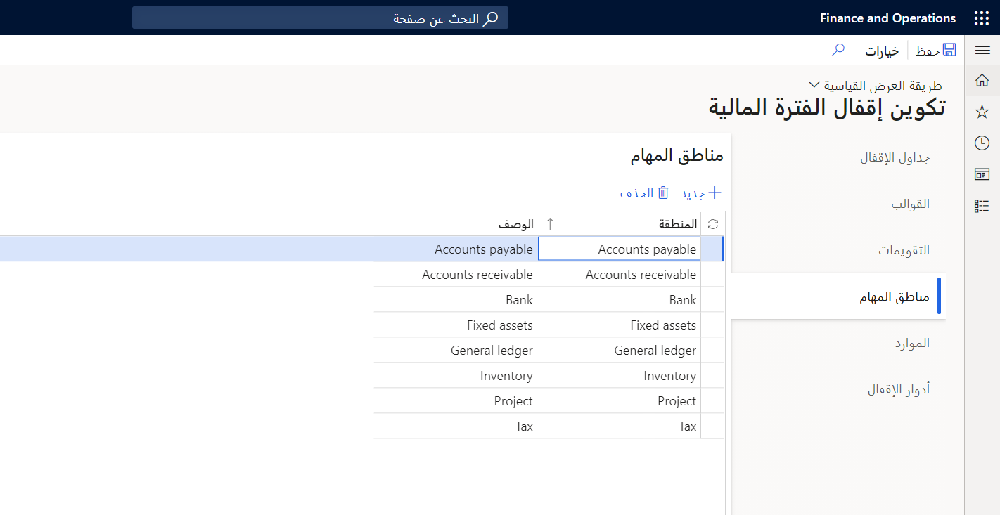

في Dynamics 365 Finance، يمكنك إكمال إجراءات الإقفال لفترة مٌحددة أو سنة.

تمتلك كل مؤسسة عمليات وخطوات مختلفة تنفذها في نهاية الفترة. وفيما يلي بعض الخطوات الاختيارية لنهاية الفترة:

-   تسوية الفواتير والمدفوعات.
-   ترحيل جميع معاملات نهاية الفترة.
-   التحقق من ترحيل جميع دفاتر اليومية.
-   إجراء إعادة تقييم العملة الأجنبية لدفتر الأستاذ العام، لإنشاء أية مبالغ أرباح أو خسارة غير محققة.
-   إجراء إعادة تقييم للعملة الأجنبية، وذلك للحسابات الدائنة، وحسابات المقبوضات.
-   تسوية حركات دفتر الأستاذ.
-   معالجة أي توزيعات مطلوبة.
-   تسويه دفتر الأستاذ الفرعي بدفتر الأستاذ العام.
-   ترحيل تسويات نهاية الفترة يدوياً.
-   تسجيل دفتر يومية الحركات ومراجعة تقرير **دفتر يومية دفتر الأستاذ** .
-   تنفيذ تجميع من خلال شركة تجميع أو من خلال إعداد التقارير المالية.
-   إنشاء القوائم المالية لنهاية الفترة من خلال إعداد التقارير المالية.
-   قم بتعيين فترات دفتر الأستاذ علي **قيد الانتظار** بحيث لا يحدث أي ترحيل آخر. وللتحكم بشكل أفضل، يمكنك أيضاً تقييد فترة لمجموعة مستخدمين محددة أثناء حدوث أنشطة نهاية الفترة. وكخيار أمثل، نوصي بعدم استخدام الحالة  **تمّ الإقفال بشكل دائم** لأنه لا يمكنك أعاده فتح فترة تم تعيينها على **تمّ الإقفال بشكل دائم**. ويُمكنك استخدام هذه الحالة في وقت لاحق.

يمكنك الوصول إلى مساحة عمل **إقفال الفترة المالية** عن طريق الوصول إلى **دفتر الأستاذ العام > مساحة العمل > إقفال الفترة المالية**، كما يُمكنك استخدام مساحة العمل لتنظيم وتعقّب المهام المطلوبة لعمليات نهاية الفترة المختلفة.

## مساحة عمل إقفال الفترة المالية

تسمح لك مساحة عمل **إقفال الفترة المالية** بتعقب عمليات الإقفال المالي عبر الشركات والمناطق والأشخاص. وبحسب طريقة عرض مساحة عمل **إقفال الفترة المالية**، سيظهر لك ترى إما كافة المهام والحالات الخاصة بجدول إقفال، أو يقتصر الأمر على المهام التي تم تعيينها لك.

يجب أولاً تحديد جدول إقفال أعلى مساحة العمل.
وتتم عندئذٍ تصفية كافة البيانات المعروضة في مساحة العمل حسب جدول الإقفال المحدد.

### إطارات الملخص المتجانبة

توفّر لك إطارات **الملخص** المتجانبة نظرة عامة حول العملية، وتساعدك المؤشرات في إبقاء عملية الإقفال على المسار الصحيح. ويمكنك رؤية المهام المتجاوزة لتاريخ الاستحقاق، والمهام المتبقية لليوم الحالي، والمهام المستحقة اليوم ولكنها محظورة بسبب التبعيات، بالإضافة إلى كافة المهام المتبقية للعملية. وتختص هذه المعلومات بكافة الشركات التي تم تضمينها في جدول الإقفال المحدد.

 

### قسم الحالات والمهام

في قسم **الحالات والمهام** تكون حالة جدول الإقفال الكُلّي مقسّمة بطرق مختلفة: الحالة حسب الشركة، والحالة حسب المنطقة، والحالة حسب الشخص المسؤول.

ويمكنك عرض حالة كافة المهام في جدول الإقفال، أو الاقتصار على المهام المستحقة اليوم، أو المهام التي تجاوزت تاريخ الاستحقاق عن طريق تغيير عامل التصفية أعلى قائمة البطاقات. يمكنك أيضاً تحديد عامل تصفية الشركة لعرض حالة شركة بعينها. وتوفر كل علامة من علامات تبويب الحالة تصنيفاً بحسب النسبة المئوية للاكتمال وعدد المهام المتبقية.

حدد البطاقة أو إجراء **عرض التفاصيل** لتصفية قائمة المهام التفصيلية بحسب البطاقة المحددة.

تعرض قائمه المهام التفصيلية قائمة بالمهام كاملة، ويُمكن تصفيتها بحيث تعرض المهام التي تهمك فقط. ويمكنك تصفية قائمة المهام بطرق عديدة.

على سبيل المثال، يُمكنك التصفية بحسب تاريخ استحقاق المهمة، والشركة المقترنة، والمنطقة المقترنة. ويمكنك أيضاً اختيار إظهار أو إخفاء المهام المُكتملة في قائمة المهام.‬

ويتم استخدام مؤشرين للمهام:

-   تشير أيقونة علامة التعجب إلى أن المهمة قد تجاوزت تاريخ الاستحقاق. وبالنسبة إلى المهام التي تجاوزت تاريخ الاستحقاق، يتم تمييز تاريخ الاستحقاق باللون الأحمر أيضاً.‬

-   تشير أيقونة القفل إلى أن المهمة تعتمد على مهام أخرى لم تكتمل بعد. ولا يمكن وضع علامة على المهام التي تم حظرها بواسطة التبعيات كمهام مكتملة. ويمكنك تعيين التبعيات لمهمة باستخدام الإجراء **تعيين تبعية** .

يكون اسم المهمة عبارة عن ارتباط تشعبي يؤدي إلى صفحة **التمويل** أو صفحه ويب أخرى يجب علي المستخدم الانتقال إليها لإكمال العمل. ويمكنك تعيين هذا الارتباط التشعبي باستخدام الحقل **ارتباط المهمة** عند تحرير مهمة أو إنشائها.

يُمكنك إرفاق الملفات والصور والملاحظات وعناوين URL إلى مهمة باستخدام إجراء **المرفقات** .

على سبيل المثال، يمكنك الإشارة إلى أرقام دفتر اليومية التي يتم استخدامها كجزء من مهمة، أو إضافة تعليقات بشأن مهمة معينة، أو إرفاق ملف تقرير تمت طباعته لمهمة. وتظهر أيقونة في عمود **المرفق** للمهمة في حالة وجود مرفق.

يجب تحديد الخيار **مهمة مكتملة** يدوياً بعد اكتمال المهمة. وعند وضع علامة على مهمة كمكتملة، يتم تحديث حقل **تاريخ الإكمال** تلقائياً إلى التاريخ والوقت الحاليين.
ويتم أيضاً تحديث مؤشرات التبعية حسب الاقتضاء.

## صفحة قائمة مهام إقفال كل الفترات المالية

يمكنك عرض كل مهام إقفال الفترات الحالية والسابقة من صفحة قائمة **مهام إقفال كل الفترات المالية**. ويتم استخدام قائمة الصفحة هذه على أفضل وجه لإجراء تحليل تاريخي لعملية الإقفال، لأنها تتضمن معلومات حول تاريخ الاستحقاق المجدول، وتاريخ الإكمال الفعلي، والشخص الذي قام بإكمال المهمة. ويمكنك تصدير المعلومات الموجودة في صفحة القائمة هذه بصيغة Microsoft Excel لأغراض الإبلاغ والتدقيق.

## صفحة تكوين إقفال الفترة المالية

حتى يتسنى لك استخدام مساحة عمل **إقفال الفترة المالية**، يجب عليك تكوين العملية في Finance باستخدام صفحة **دفتر الأستاذ العام > إقفال الفترة > تكوين إقفال الفترة المالية**.

### الموارد

في علامة التبويب **الموارد**، يمكنك تعريف الأشخاص الذين يشاركون في عمليات الإقفال. ويجب أولاً تعيين الموظف الذي سيكون مسؤولاً عن مهمة إقفال، في علامة التبويب هذه.‬ ويجب عليك أيضاً تحديد طريقة عرض مساحة العمل للموظف.

 

يتوفّر الخياران التاليان في علامة التبويب **الموارد**:

-   **المهام المعينة فقط** - سوف يرى المستخدم المهام التي تم تعيينها فقط.

-   **كافة المهام والحالة** - سوف يرى المستخدم كافة مهام الإقفال وحالة العملية الشاملة.

لن يتمكن المستخدمون الذين لديهم أذونات لعرض المهام المعينة لهم فقط من إضافة مهام إلى قائمة المهام، أو تحرير المهام، أو إزالة المهام من قائمة المهام.

### مناطق المهام

يمكنك استخدام مناطق المهام لتجميع المهام الإقفال في المناطق المنطقية للملكية داخل المؤسسة. على سبيل المثال، قد يتم استخدام الحسابات الدائنة أو الحسابات المدينة أو دفتر الأستاذ العام كمناطق المهام.

### التقويمات

يمكنك إنشاء تقويمات الإقفال المالي وتحريرها باستخدام علامة التبويب **تقويمات**. وهذا هو المكان الذي يمكنك من خلاله تحديد أيام العمل لعمليات الإقفال والتي يتم استخدامها لجدولة مهام الإقفال. وفي علامة التبويب هذه، يُمكنك إنشاء تقويم جديد والإشارة إلى أيام العمل المراد استخدامها لجدولة المهام.

 

من الأفضل إنشاء تقويم لفترة طويلة من الوقت، مثل عام أو أعوام متعددة، نظراً لعدم إمكانية تحريره بعد إنشائه. وبعد إنشاء التقويم، حدد الزر **تحرير** لتحديث التقويم في أيام معينه، مثل العطلات. وستتم جدولة مهام الإقفال في الأيام التي يتم فيها تعيين قيمة **عنصر التحكم** على **مفتوح**. وإذا كان لا ينبغي جدولة مهام الإقفال في يوم معين، فيجب أن تكون قيمة **عنصر التحكم** مُعيّنة على **مُقفل**.

### القوالب

يُمكنك استخدام قالب **إقفال مالي** لتحديد كافة المهام التي تُشكل جزءاً من عمليه إقفال. وتُعد مهمة الإقفال بمثابة جهد عمل متكرر يتم تعيينه لأحد الأشخاص لكي يُكمله كجزء من كل عملية إقفال.
وفي القالب، يجب تحديد تاريخ الاستحقاق النسبي لكل مهمة إقفال. ويُمثل تاريخ الاستحقاق النسبي عدد الأيام التي تسبق أو تلي تاريخ انتهاء الفترة المحددة، حيث تكون المهمة مستحقة كل فترة. يتم أيضاً تعيين وقت استحقاق لكل مهمة. ويتم تعيين وقت الاستحقاق في سياق منطقتك الزمنية وسيتم تحويله إلى المنطقة الزمنية المناسبة لكل مستخدم.

يمكنك تعيين مهمة في القالب إلى شركة أو أكثر من الشركات التي تنطبق عليها هذه المهمة. وإذا تم تعيين شخص آخر لإكمال جهد العمل هذا في كل شركة، فقد تجد أنه من المفيد إنشاء مهام متعددة لجهد العمل نفسه.‬ ويُمكنك إنشاء مهمة واحدة لكل شركة.

يرتبط **عنصر القائمة ارتباط المهمة** بجهد عمل المهمة، ويُمكن استخدامه للانتقال مباشرةً إلى الصفحة المقترنة من ارتباط المهام في مساحة العمل. على سبيل المثال، يُمكن ربط مهمة إقفال لتنفيذ عملية إعادة تقييم العملة للحسابات الدائنة بصفحة **إعادة تقييم عملة أجنبية** في Finance. كما يمكنك الربط بعنوان URL خارجي.

إذا أردت ربط تقرير معين من أداة **Management Reporter** بمهمة إقفال فترة مالية، فيمكنك استخدام عنوان URL للتقرير. وللوصول إلى عنوان URL للتقرير، افتح التقرير في مصمم التقرير، ثم حدد **ملف > عرض التقرير** لفتح التقرير في مستعرض ويب. ويمكنك نسخ عنوان URL في شريط عنوان مستعرض الإنترنت ولصقه في حقل **عنوان URL ارتباط المهمة**.

يُمكنك تعريف تبعيات المهام في القالب. وإذا تم إعداد مهمة بحيث تعتمد على مهمة واحدة أو أكثر، فلا يمكن وضع علامة على هذه المهمة كمكتملة حتى تكتمل كافة التبعيات.

يُمكنك إنشاء قوالب إقفال مالي متعددة. وبعد ذلك، يمكنك استخدام القوالب المتنوعة لتعقب عمليات الإقفال لأنواع الفترات المختلفة، مثل نهاية الشهر أو نهاية العام، أو لتعقب الشركات التي تستخدم عمليات الإقفال المختلفة. وبعد إنشاء قالب واحد، يمكنك نسخه إلى قالب جديد وإجراء التغييرات المطلوبة. ويمكنك تعيين قالب واحد فقط لكل جدول إقفال.

### جداول الإقفال

يمكنك استخدام جدول إقفال لتعيين قالب إقفال مالي لفترة مالية معينة يجب إقفالها. وبعد ذلك، يتم إنشاء المهام من القالب تلقائياً لفترة محددة، ويُضاف جدول الإقفال الجديد إلى مساحة العمل. وعندما تنشئ جدول إقفال جديداً، يتم استخدام حقل **تاريخ انتهاء الفترة‬‏‫** لتحديد تواريخ الاستحقاق الفعلية لمهام الإقفال، على أساس تاريخ الاستحقاق النسبي المعيَّن في قالب الإقفال المالي.

عيّن التقويم المناسب لجدول الأقفال، للإشارة إلى أيام العمل التي يجب استخدامها في جدولة المهام. وإذا لم تحدد تقويماً معيناً، فستستخدم تواريخ استحقاق المهمة كافة أيام الأسبوع.‬

يجب عليك أيضاً تحديد الشركات التي سيتم إقرانها بجدول الإقفال. وإذا تم تعيين مهام قالب إلى شركات متعددة، فسيتم إنشاء مهام منفصلة لكل شركة في جدول الإقفال وتعيينها إلى مهمة القالب.‬

بعد اكتمال جدول إقفال، حدد الخيار **مُقفل** له. وسوف تبقى محفوظات المهمة متوفرة من صفحة قائمة **مهام إقفال كل الفترات المالية**، ولكن ستتم إزالة جدول الإقفال من مساحة العمل. بعد وضع علامة **مُقفل** على جدول إقفال، لن تتمكن من إضافة مهام إليه أو تحرير المهام أو إزالة مهام منه.
