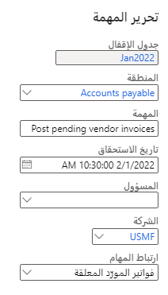

تعتبر نهاية الفترة ونهاية السنة أوقاتاً مزدحمة للموظفين الماليين في كل شركة. خلال الأيام القليلة الأولى لكل فترة وسنة مالية جديدة، هناك جهد تم بذله لإقفال الفترة/السنة السابقة لبدء الفترة/السنة التالية. يوفر Microsoft Dynamics 365 Finance مساحة عمل سهلة الاستخدام لإنشاء عمليات الإقفال وإدارتها.

## إعداد عمليات الإقفال

لإعداد عمليات الإقفال، يجب عليك:

- تنفيذ معالجة إقفال الفترة.
- تحديد فريقك وتقويم العمل.
- إنشاء قوالب الإقفال.

### معالجة إقفال الفترة
تقوم المؤسسات عادةً بإقفال دفاتر الأستاذ الفرعية ودفتر الأستاذ العام في نهاية كل فترة وسنة مالية لإعداد من التقارير المالية الداخلية والقوائم المالية الخارجية. الهدف من عملية الإقفال هو إكمال جميع الحركات المالية الجارية وترحيل الحركة إلى دفتر الأستاذ العام. يحتوي كل قسم على مهام لإكمالها كجزء من عملية الإقفال. يجب إكمال جميع المهام لإقفال فترة بحلول التاريخ المطلوب. بعد اكتمال الإقفال، لن يتمكن أي شخص من نشر حركات أخرى لتلك الفترة أو السنة.

يتيح لك Finance تحديد جدول إقفال في قالب ثم تطبيق القالب على فترة. توفر هذه الميزة رؤية لحالات المهام للأفراد المسؤولين عن المهام والمديرين الذين يشرفون على عمليات الإقفال. سيتمكن المسؤولون عن جدول الإقفال الكلي من تتبع التقدم بشكل أكثر كفاءة.

#### متطلبات الإعداد
تتضمن عملية الإقفال المهام التي ينفذها أشخاص محددون في أيام محددة. غالباً ما يعتمد الجدول على يوم الأسبوع لليوم الأول من الفترة. لكي يساعدك Dynamics 365 Finance في إدارة إقفال الفترة، يجب عليك التأكد من تحديد كل معلمة من المعلمات التالية:

- **التقويمات** - الإشارة إلى الأيام التي تعتبر أيام عمل لعملية الإقفال.
- **مناطق المهام** - تمثيل المجموعات المشاركة في عملية الإقفال مثل الحسابات الدائنة والحسابات المدينة وإدارة المخزون.  
- **المهام** - الأنشطة التي تحدث أثناء إقفال.
- **أدوار الإقفال** - أدوار الأشخاص المسؤولين عن العمل في المهام. يمكنك تعيين شخص واحد فقط لدور إقفال.
- **الموارد** - الأشخاص الذين يؤدون المهام. يتم تعيين دور إقفال واحد أو أكثر لكل مورد.

يتم وصف كل معلمة بالتفصيل في الأقسام القليلة التالية. يمكنك إعداد معلمات الإقفال عن الانتقال إلى **دفتر الأستاذ العام > إقفال الفترة > إقفال الفترة المالية**.

### تحديد فريقك وتقويم العمل
يتضمن تحديد فريقك وتقويم العمل تحديد أدوار الأقفال والموارد ومجالات المهام والتقويم.

#### أدوار الإقفال
أدوار الإقفال هي أوصاف عامة للشخص الذي يدير مهمة معينة. يقوم النظام بتعيين أدوار الإقفال للمهام، بدلاً من موارد محددة للمهام، لتسهيل تغيير الشخص الذي ينفذ مهمة في المستقبل. سيؤدي تغيير الشخص الذي تم تعيينه لدور إقفال إلى تغيير جميع المهام المعينة لهذا الدور للجداول التي تم إنشاؤها حديثاً.

> [!div class="mx-imgBorder"]
> 

#### الموارد
الموارد هي الأشخاص الذين يقومون بالعمل من أجل الإقفال. لإضافة مورد لعملية إقفال الفترة، يجب عليك أولاً تحديد المورد كعامل في النظام. يمكنك تعيين العديد من أدوار الإقفال للمورد.

إذا انتقل أحد الموارد إلى قسم جديد أو ترك مؤسسة، فيمكنك تعيين أدوار الإقفال الخاصة به إلى مورد مختلف. سيتم تعيين جميع المهام التي تم تعيينها لدور الإقفال هذا إلى المورد الجديد للجداول المستقبلية. يساعد هذا الأسلوب في تسهيل تغيير الشخص المسؤول عن مجموعة من المهام. إذا قمت بالفعل بإنشاء جدول إقفال، فستحتاج إلى تغيير التعيينات يدوياً إلى مورد جديد.

على سبيل المثال، قد يكون لدى الموظف دوران من أدوار الإقفال (**كاتب فوترة الواقع المعزز** و **كاتب دفعات الواقع المعزز**) وسيتم له تعيين جميع المهام التي تم تعيينها لأي دور إقفال.

يجوز لأي شخص أن يشرف على إقفال الفترة، ولكن لا يجوز له تنفيذ المهام الفردية في الإقفال. لذلك، تحتاج إلى تعريف هذا الشخص كمورد حتى يتمكن من عرض معلومات الحالة لإقفال الفترة. 
 
#### مناطق المهام
تسمح مناطق المهام للمستخدمين بالتصفية استناداً إلى المهام لمجموعة معينة. على سبيل المثال، قد يرغب مدير الحسابات الدائنة في التحقق من حالة جميع مهام الحسابات الدائنة أثناء إقفال معين.
 
يمكنك تحديد العديد من مناطق المهام كما تشاء. ويمكنك تعيين كل مهمة إلى منطقة مهمة واحدة. في المثال التالي، تم إعداد مناطق المهام لمطابقة وحدات Finance.

> [!div class="mx-imgBorder"]
> 

#### التقويم
لا يستخدم Dynamics 365 Finance التقويمات المالية لإنشاء جدول إقفال. بدلاً من ذلك، تحتوي ميزة إقفال الفترة على التقويمات الخاصة بها. في بعض المؤسسات، يعمل الفريق المالي خلال عطلة نهاية الأسبوع لإكمال الإقفال. في المؤسسات الأخرى، يعتمد يوم الإقفال الأخير للشهر على اليوم الذي يوافق اليوم الأول من الشهر. 

تتيح لك وظيفة التقويم إنشاء جدول شامل قد يتضمن عطلات نهاية الأسبوع أو لا. يمكنك تعديل التقويمات لإضافة الإجازات وعطلات نهاية الأسبوع حسب الحاجة.

عند تحديد التقويم الخاص بك، عليك التفكير فيما يحدث في نهاية السنة المالية. نادراً ما يحدث إقفال فترة أو سنة مالية في اليوم الأخير من الفترة أو السنة المالية. يحدث إقفال الفترة الأخيرة وإقفال نهاية السنة في السنة المالية التالية. نوصي بإنشاء تقويم بتاريخ انتهاء بعيد في المستقبل. يمكنك إنشاء تقويم يتم تشغيله لسنوات واستخدام التقويم لكلٍّ من مهام إقفال الفترة والسنة المالية. 

تُظهر لقطة الشاشة أدناه تقويماً مدته خمسة أيام ويمتد ليشمل سنتين ماليتين.

> [!div class="mx-imgBorder"]
> 

لإنشاء تقويم، أكمل الحقول المطلوبة في صفحة **التقويمات لجدولة المهام**، كما هو موضح في الصورة التالية.

> [!div class="mx-imgBorder"]
> 

يمكنك استخدام صفحة **تحرير التقويم** لتغيير الأيام التي يجب اعتبارها أيام عمل. تتيح لك هذه الصفحة تغيير أيام عطلات نهاية الأسبوع إلى يوم عمل أثناء إقفال الفترة أو نهاية السنة أو يمكنك تغيير أيام العطلات إلى أيام غير العمل. 

> [!div class="mx-imgBorder"]
> 
 
### إنشاء قوالب الإقفال
يمكنك استخدام قوالب الإقفال لإنشاء قائمة عامة للمهام، جنباً إلى جنب مع المسؤول عن المهمة وتاريخ الاستحقاق النسبي للمهمة. بالإضافة إلى ذلك، يمكنك إنشاء ارتباط اختياري للانتقال إلى صفحة داخل Finance أو عنوان URL خارجي حيث يمكن للمورد إكمال المهمة.

#### تحديد المهام
المهمة هي نشاط أو عمل محدود يجب إكماله في يوم محدد ضمن جدول الإقفال. يمكن تعيين كل مهمة لشخص واحد فقط. إذا كان نشاط يتطلب شخصين، فستحتاج إلى تقسيم العمل إلى مهمتين أو أكثر.

عندما تقوم بإنشاء مهام، فستتحدد مستوى التفاصيل والكلمات التي تريد استخدامها لوصف كل مهمة والتبعيات بين المهام. على سبيل المثال، قد تطلب إحدى المؤسسات أن يتم ترحيل جميع فواتير الموردين المعلقة ودفاتر يومية مدفوعات الحسابات الدائنة قبل إكمال إعادة تقييم عملة الحسابات الدائنة. 

ستظهر قائمة **التبعيات** وقائمة **المرفقات** عند قيامك بتحديد زر علامة الحذف (**...**) أعلى شبكة المهام.

#### إنشاء جدول القالب
يسحب جدول القالب كل الإعداد معاً. إنها قائمة المهام أو الأنشطة. بالنسبة لكل مهمة في القائمة، ستُكمل المكونات التالية:

- **منطقة المهام** – تحديد منطقة مهام لتجميعها معاً وتصفية قائمة المهام.
- **تاريخ الاستحقاق** – تحديد التاريخ من حيث صلته بنهاية الفترة (**0** هو اليوم الأخير من الفترة التالية و **1** هو اليوم الأول من الفترة التالية). أدخل قيمة موجبة أو سالبة أو صفراً (0). يمكنك أيضاً تحديد وقت من اليوم لتاريخ الاستحقاق.
- **دور الإقفال** – يتم تعيين دور الإقفال لمورد واحد في أي مرحلة زمنية. عند إنشاء جدول من القالب، سيتم تعيين أي مورد تم تعيينه لدور الإقفال للمهمة التي تم إنشاؤها من القالب.
- **الشركة** – تعيين شركة واحدة أو أكثر للمهمة. قد يلزم إكمال بعض المهام لجميع الشركات، بينما ستكون المهام الأخرى فريدة لشركة واحدة. ضع في اعتبارك الجدول الذي يجب أن تكتمل فيه المهمة لكل شركة. إذا كان تاريخ الاستحقاق النسبي مختلفاً لشركة واحدة أو أكثر، فقد تحتاج إلى إنشاء مهمة فريدة. 
- **ارتباطات المهام** – يساعد الارتباط المستخدمين على الانتقال مباشرةً إلى الصفحة الموجودة داخل Dynamics 365 Finance أو الانتقال إلى عنوان URL الذي يتم استخدامه لإكمال المهمة. يمكنك تحديد ارتباط واحد فقط لكل مهمة. في حالة وجود صفحات أو عناوين URL متعددة، ففكر في تقسيم المهمة إلى مهام متعددة. 

    اخترت الارتباطات من عناصر القائمة المجمعة حسب الوحدة. لا يمكنك إنشاء الارتباطات الخاصة بك دون إضافة عنصر القائمة إلى صفحة قائمة الوحدة. يمكنك ربط تقارير Financial Reporting بمهمة ما باستخدام عنوان URL المعروض أثناء عرض التقرير. يتم عرض عناصر القائمة التي يمكنك الاختيار من بينها حسب الوحدة.

    > [!div class="mx-imgBorder"]
    > 

- **التبعية** - تحديد مهمة واحدة أو أكثر يجب إكمالها قبل هذه المهمة. 
- **المرفقات** – تضمين المرفقات التي تتضمن إرشادات محددة، أو نماذج خارجية لإكمالها، أو مصنفات Microsoft Excel للمساعدة على تبسيط المهمة. سيتم نسخ المرفقات المعينة لمهمة القالب إلى الجدول الذي تم إنشاؤه. لدى كل شركة تستخدم Dynamics 365 Finance مجموعة مهام خاصة بها لإقفال فترة أو سنة مالية. 

    تعرض القائمة التالية المهام الشائعة التي قد تختار استخدامها:
    - ترحيل جميع حركات نهاية الفترة.
    - التحقق من ترحيل جميع دفاتر اليومية. 
    - تسوية الفواتير والمدفوعات ضمن الحسابات الدائنة والحسابات المدينة.
    - تسوية حركات دفتر الأستاذ (اختياري).
    - تشغيل إعادة تقييم العملة الأجنبية للحسابات الدائنة، والحسابات المدينة، وإدارة النقد والبنوك، ودفتر الأستاذ العام لإنشاء مبالغ أرباح أو خسائر غير محققة.
    - معالجة التوزيعات المطلوبة. 
    - تسوية دفاتر الأستاذ الفرعية بدفتر الأستاذ العام. 
    - ترحيل تسويات نهاية الفترة يدوياً. 
    - تسجيل دفتر يومية الحركات ومراجعة تقرير **دفتر يومية دفتر الأستاذ**. 
    - تنفيذ تجميع من خلال شركة تجميع أو من خلال إعداد التقارير المالية. 
    - إنشاء القوائم المالية لنهاية الفترة من خلال إعداد التقارير المالية. 
    - قم بتعيين فترات دفتر الأستاذ إلى **قيد الانتظار** بحيث لا يحدث أي ترحيل آخر. يمكنك أيضاً تقييد فترة لمجموعة معينة من المستخدمين أثناء حدوث أنشطة نهاية الفترة، من أجل تحكم أفضل. من أفضل الممارسات عدم استخدام حالة **تم الإقفال بشكل دائم**، لأنه لا يمكنك إعادة فتح فترة إذا قمت بإقفالها نهائياً.

يمكنك أن تكون دقيقاً كما تشاء في جدول الإقفال الخاص بك. 
 
## إنشاء جداول إقفال الفترة

عندما تقوم بإعداد قوالب الإقفال، فستُنشئ جدول إقفال. يمكنك إنشاء جدول جديد من صفحة **تكوين إقفال الفترة المالية** عن طريق تحديد **جداول الإقفال**. تتضمن المعلومات التي ستقدمها لجدول ما يلي:

- اسم قصير للجدول (يمكن أن يكون بسيطاً مثل 2022-02).
- اسم وصفي للجدول.
- تاريخ بداية الفترة وانتهائها. 
    > [!NOTE]
    > بالنسبة لإقفال السنة المالية، ستستخدم السنة بأكملها.
- نموذج إقفال لاستخدامه في إنشاء الجدول.
- التقويم الذي يحدد أيام العمل.
- الشركات المراد إنشاء الجدول لها. استخدم القائمة المنسدلة لتحديد شركة واحدة أو أكثر. سيتم إنشاء جدول بالمهام لكل شركة محددة.

تحدث الإجراءات التالية عند إنشاء جدول إقفال:
 
- ستتم إضافة كل مهمة مدرجة في القالب إلى الجدول. سيتم وضع منطقة المهمة المعينة للمهمة في بند الجدول.
- سيتم حساب تاريخ/وقت الاستحقاق للمهمة بناءً على تاريخ الانتهاء الذي حددته للفترة عند إنشاء الجدول.
- سيتم تعيين الموارد لكل مهمة من خلال النظر في دور الإقفال المعيَّن للمهمة والمورد المعيَّن حالياً لدور الإقفال هذا.
- سيتم إنشاء تبعيات المهام استناداً إلى القالب.

سيتم عرض تاريخ الاستحقاق للمهام لم تكتمل بحلول **تاريخ الاستحقاق** باللون الأحمر، وسيظهر رمز تحذير. 

### مراجعة الجدول وتعديله 
يجب على الشخص المسؤول عن الجدول العام مراجعة الجدول الذي تم إنشاؤه ثم تعديله حسب الحاجة. على سبيل المثال، إذا كان الشخص المسؤول عن مهمة ما لا يعمل عندما يحين موعد المهمة، فيمكنك إعادة تعيين المهمة إلى شخص آخر. سيتوفر فقط الأشخاص المدرجون كموارد في تكوين نهاية الفترة المالية للتحديد. يمكنك إضافة شخص كمورد دون تعيين دور إقفال له، إذا احتاج إلى ملء هذا الدور لشخص آخر.

قد ترغب في تعديل تواريخ الاستحقاق يدوياً فيما يتعلق بغياب الشخص أو الأنشطة الأخرى التي قد تحدث في الوقت المحدد.

عندما تحدد **تحرير** لتعديل مهمة، فتقوم بإجراء التغييرات في صفحة **تحرير المهمة**.

> [!div class="mx-imgBorder"]
> 

الجدول متاح عند إنشائه. لا يمكنك الإنشاء والتحرير ثم الإصدار للفريق. خطط لإجراء تغييراتك في نفس جلسة العمل التي تم فيها إنشاء الجدول لأول مرة.

## إدارة عملية الإقفال
لإدارة عملية الإقفال، ستحتاج إلى مراجعة المهام وتحديثها ومراجعة الحالة وإكمال الإقفال. 

### مراجعة المهام وتحديثها
تتوفر عدة طرق لمراجعة حالة المهام المحددة لإقفال الفترة. أسهل طريقة هي استخدام مساحة عمل **إقفال الفترة المالية**. عند فتح مساحة عمل، لن يتم عرض أي شيء حتى تحدد جدول الإقفال. 

بعد تحديد الجدول، ستعرض مساحة العمل المهام بناءً على حقوق الأمان الخاصة بك. سيرى بعض المستخدمين المهام التي تم تعيينها لهم فقط، بينما قد ترى الأدوار الأخرى (مثل المديرين) جميع مهام الجدول، مما يسمح لهم بإدارة مهام الإقفال لفريقهم. تُظهر الإطارات المتجانبة المهام المستحقة السابقة، والمهام المستحقة اليوم، والمهام التي لا يمكن تنفيذها بعد بسبب التبعيات، والمهام المفتوحة أو غير المكتملة.
 
يمكنك تعديل الجدول في مساحة عمل **إقفال الفترة المالية** عن طريق إضافة المهام، وتغيير التعيينات. عند إكمال مهمة ما، يتم تسجيل الوقت ومعرف المستخدم الخاص بك للإشارة إلى الاكتمال. تجلب كل مهمة معها أي مرفقات من القالب. يمكنك تضمين المرفقات أثناء قيامك بتنفيذ مهمة لتقديم دليل على الإكمال أو الوثائق التي يجب الاحتفاظ بها للمهام.

يمكنك أيضاً استخدام صفحة **جميع مهام إقفال الفترة المالية** المتوفرة من مجموعة **إقفال الفترة** من قائمة وحدة دفتر الأستاذ العام. تتيح لك هذه الصفحة عرض المزيد من الأعمدة على الصفحة وإضافة التنبيهات وتعيين عوامل التصفية المخصصة. بالإضافة إلى ذلك، تتيح لك هذه الصفحة عرض المهام عبر جداول إقفال متعددة. في بداية كل سنة مالية، قد تتداخل المهام من الفترة الأخيرة من السنة السابقة وإقفال نهاية العام.

لعرض التفاصيل الخاصة بأي مهمة واحدة، حدد اسم المهمة من صفحة **جميع مهام إقفال الفترة المالية** في مساحة عمل **إقفال الفترة المالية**. سيعرض هذا الإجراء الصفحة المحددة المستخدمة لإكمال المهمة. على سبيل المثال، سيؤدي تحديد مهمة **ترحيل فواتير الموردين المعلقة** إلى عرض صفحة **فواتير الموردين المعلقة** كما هو موضح في لقطة الشاشة التالية.

توفر مساحات العمل وجميع صفحات مهام إقفال الفترة المالية تحذيرات ضمن الجدول. ستظهر علامة تعجب (**!**) إذا تأخرت المهمة. سيظهر قفل إذا تعذر إكمال المهمة لأن التبعيات لم تكتمل بعد.

> [!div class="mx-imgBorder"]
> 

#### الحالة
أفضل طريقة لعرض الحالة هي استخدام الإطارات المتجانبة في مساحة عمل **إقفال الفترة المالية**. توفر هذه المربعات عرضاً سريعاً عالي المستوى لجدول الإغلاق ومعلومات مثل عدد المهام المكتملة والمهام المتأخرة والمهام التي لا يمكن إكمالها بسبب التبعيات غير المكتملة. يمكنك إنشاء الإطارات المتجانبة الخاصة بك لإضافتها إلى مساحة العمل هذه لمراقبة حالة مناطق/أقسام المهام الفردية أو يمكنك استخدام أي عوامل تصفية ذات معنى لعملية الإقفال.

#### إكمال الإقفال
عند اكتمال الإقفال، فسيتم قفل الجدول ولا يمكن تغييره. يمكنك قفل الجدول، حتى إذا لم تكتمل جميع المهام. عند قفل جدول، فلن يظهر بعد الآن في مساحة عمل **إقفال الفترة المالية**. يمكنك فتح صفحة **كل مهام إقفال الفترة المالية** لعرض السجل. يمكنك فتح الجدول، إذا لزم الأمر.

> [!div class="mx-imgBorder"]
> 
