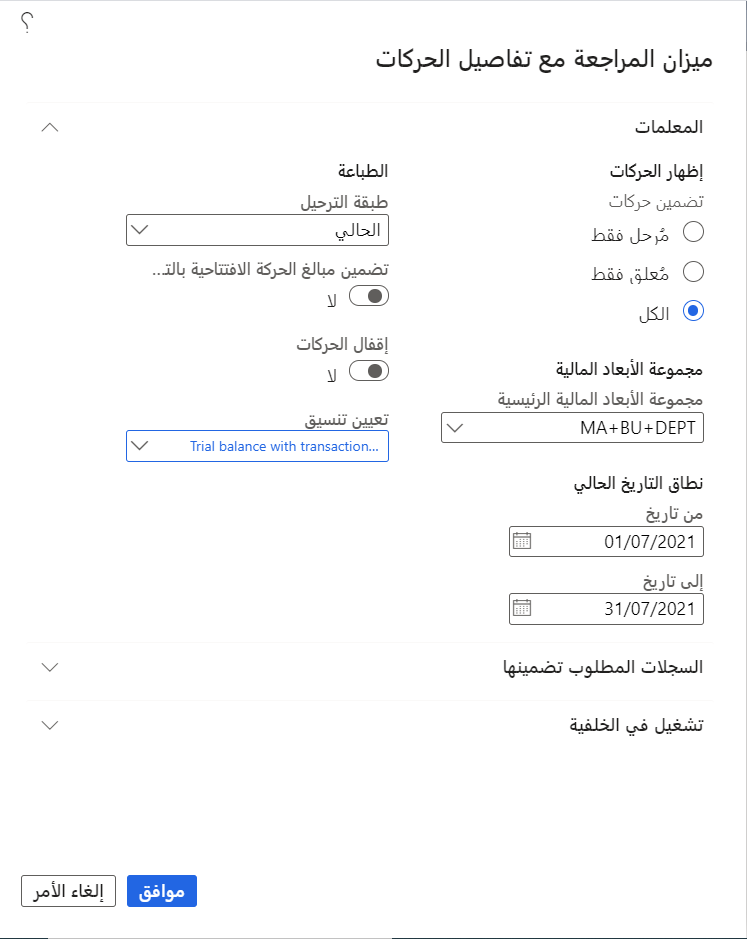
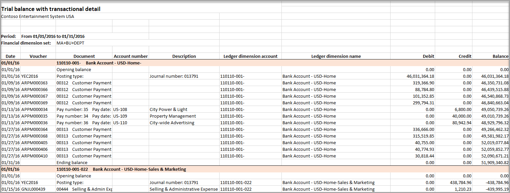
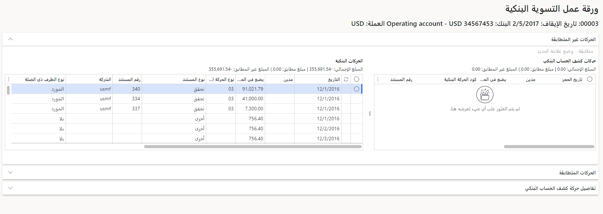
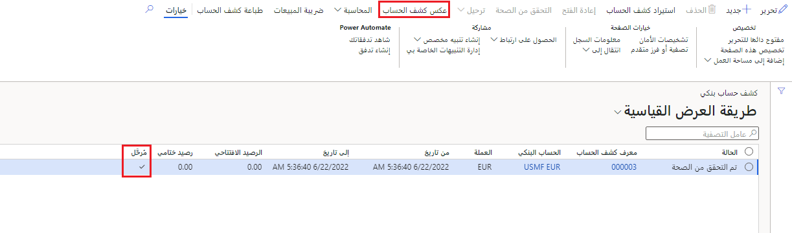
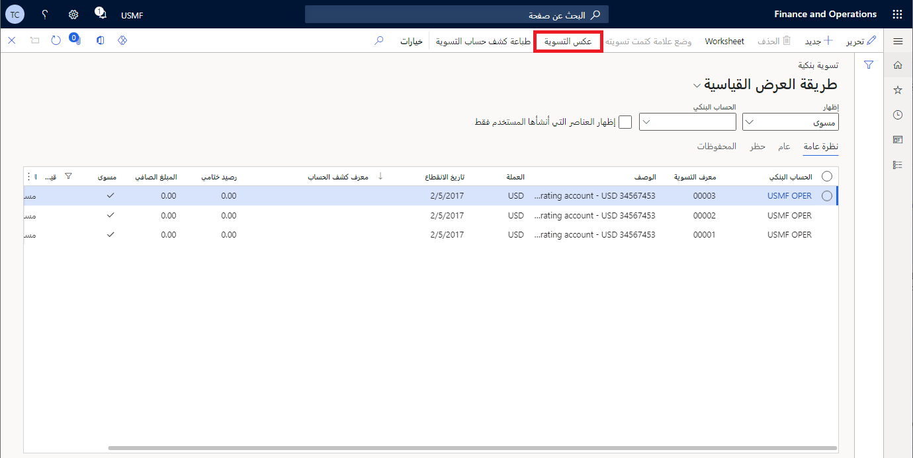

في المؤسسات الكبيرة، تكون التسوية البنكية عملية شاقة ومستهلكة للوقت عند إجرائها يدوياً.

تُتيح لك ميزة التسوية البنكية المُتقدمة استيراد كشوف الحسابات البنكية. ويُمكن بعد ذلك تسوية كشف الحساب البنكي الذي تم استيراده تلقائياً، وذلك من داخل الحركات البنكية. وفيما يلي الخطوات الموجودة في تدفق التسوية البنكية المتقدمة:

1.  إعداد استيراد كشف الحساب البنكي.
    -   استيراد كشوف الحسابات البنكية من خلال إطار كيان البيانات.
    -   تتوفّر ثلاثة تنسيقات نموذجية لكشف الحساب البنكي مضمنة في Finance وهي: ISO20022، وBAI2، وMT940.
    -   يمكن توسيع الوظيفة لتناسب أي تنسيق.

2.  قم بإعداد تسلسل رقمي لاستخدامه في التسوية البنكية المتقدمة، وحدّد قواعد مطابقة التسوية البنكية. قاعدة مطابقه التسوية هي مجموعة من المعايير المُستخدمة لتصفية بنود كشف الحساب البنكي، وبنود الحركة البنكية في Finance أثناء عملية التسوية. ووفقا للممارسة التجارية، يُمكن إعداد أكثر من قاعدة مطابقة لتحسين عملية التسوية وإجرائها تلقائياً.

3.  قم بتسوية كشوف الحسابات البنكية مع الحركات البنكية في Dynamics 365 Finance.
    -   إنشاء دفاتر يومية للتسوية ومطابقتها تلقائياً.
    -   عرض كشوف الحسابات البنكية والحركات البنكية في Finance جنباً إلى جنب.
    -   ترحيل الحركات البنكية في Finance تلقائياً إذا كانت تظهر في كشف حساب بنكي ولكن لا تظهر في تطبيق Finance.
    -   إنشاء كشف تسوية.

> [!NOTE]
> يمكنك تعطيل وظيفة التسوية البنكية المتقدمة وتقليل تعقيد التسوية البنكية للمستخدمين باستخدام تسوية بنكية بسيطة. إذا كانت هناك حركات تمت تسويتها بالفعل لحساب أو كشوف حساب بنكية تم ترحيلها، فلن تتمكن من الرجوع إلى تسوية بنكية بسيطة.

## أكواد الحركات

يُمكن استخدام أكواد الحركات كجزء من قواعد مطابقه التسوية البنكية. وستساعدك أكواد الحركات على مطابقة نفس أنواع الحركات بين Finance وكشف حسابك البنكي لديك. ولإجراء هذا النوع من المطابقة، يجب عليك أولاً تحديد أنواع الحركات المستخدمة للحركات البنكية من Finance، ثم تعيين هذه الأنواع إلى أكواد حركات كشف الحساب البنكي التي يستخدمها البنك الذي تتبعه. تُحدد أنواع الحركات لـ Finance على صفحة **نوع الحركة البنكية**. وفي هذه الصفحة أيضاً، يُمكنك تحديد الحساب الرئيسي المُراد استخدامه لعمليات الترحيل المقترنة بكل نوع من أنوع الحركة.

بمجرد تحديد أكواد الحركات في Finance، يُمكنك تعيين هذه الأكواد إلى أكواد الحركات المستخدمة في كشوفات حساباتك البنكية الإلكترونية. ويتم إجراء عملية التعيين هذه عبر صفحة **تعيين كود الحركة**. وقد تم اكتمال تعيين كود الحركة لكل حساب بنكي على حدة.

## قواعد المطابقة ومجموعات قواعد المطابقة

يُمكنك إعداد قواعد مطابقة التسوية ومجموعات قواعد مطابقة التسوية للمساعدة في عملية التسوية البنكية. قاعدة مطابقه التسوية هي مجموعة من المعايير المُستخدمة لتصفية بنود كشف الحساب البنكي، وبنود الحركة البنكية في Finance أثناء عملية التسوية. ويُمكنك استخدام صفحة **قواعد مطابقة التسوية** لإعداد قواعد مطابقة التسوية. ويُمكنك إعداد أكثر من قاعدة مطابقة، ثم إنشاء مجموعة قواعد مطابقة تسويه في صفحة **مجموعات قواعد مطابقة التسوية** .

## محددات إدارة البنك والنقد

تتوفر العديد من المُحددات الخاصة بعملية التسوية البنكية المتقدمة في صفحة **مُحددات إدارة البنك والنقد**. يعمل الخيار **إظهار مبلغ بند كشف الحساب في المدين/الدائن** طريقة عرض المبالغ في صفحة **كشف الحساب البنكي**. إذا تم تحديد هذا الخيار، ستظهر مبالغ حركات كشف الحساب في أعمدة دائن ومدين منفصلة. وإذا لم يتم تحديد هذا الخيار، فسيتم عرض مبالغ حركة كشف الحساب البنكي في عمود مبالغ واحد بالعلامة المناسبة.

تتجاوز خيارات التحقق من الصحة المُعينة على صفحة المُحددات، الاختيارات المحددة في قواعد المطابقة.

على سبيل المثال، لا يُمكنك مطابقة المستندات يدوياً أو تلقائياً مع تجاوز فَرق التاريخ المحدد على صفحة المحددات.

أيضاً، في حالة تحديد الخيار **التحقق من تعيين نوع الحركة**، فبناءً عليه يجب تعيين أنواع الحركة بين الحركة البنكية في Finance وحركة كشف الحساب البنكي من أجل مطابقة الحركات يدوياً أو تلقائياً.

يجب عليك أيضاً تكوين التسلسلات الرقمية في صفحة **مُحددات إدارة البنك والنقد**. في علامة تبويب **التسلسلات الرقمية**، قم بتعيين أكواد التسلسلات الرقمية لمُعرف **التنزيل**، و **مُعرّف كشف الحساب**، و **مُعرف التسوية**، ومَرَاجع **التسوية البنكية**.

## خيارات تسوية الحساب البنكي

يجب عليك أولاً تمكين خيار **التسوية البنكية المتقدمة** للحساب البنكي.
ويتوفر العديد من الخيارات في صفحة **الحساب البنكي** عند تمكين وظيفة **التسوية البنكية المتقدمة**:

-   يعمل الخيار **استخدام كشوف الحسابات البنكية كتأكيد للدفع الإلكتروني** على التكامل بين وظيفة التسوية البنكية مع حالات الدفع إلكترونية. عندما يتم تمكين هذه الوظيفة، سيتم إنشاء مستند بنكي تلقائياً للدفع الإلكتروني عند تعيين الحالة على **مُرسل**. وبالإضافة إلى ذلك، سوف يتم تحديث حالة الدفع الإلكتروني من **مُرسل** إلى **مُستلَم** بعد مطابقة الدفع وتسويته وترحيله.

-   حقل **اسم الحساب البنكي في كشوف الحسابات** هو الاسم المستخدم للحساب البنكي في كشوف الحسابات البنكية إلكترونية. ويُمكنك استخدام هذا الاسم عند تحديد الحركات التي ينبغي استيرادها لحساب بنكي من كشف حساب بنكي قد يحتوي معلومات حول حسابات بنكية متعددة.

-   يتولى خيار **التسوية بعد الاستيراد** التحقق تلقائياً من صحة كشف الحساب البنكي، وإنشاء تسوية بنكية جديدة وورقة عمل، وتشغيل مجموعة قواعد المطابقة الافتراضية. وتقوم هذه الوظيفة بتنفيذ العملية بشكل تلقائي وصولاً إلى الحركات التي تجب مطابقتها يدوياً. وسيكون الإعداد موجوداً في الحساب البنكي بشكل افتراضي عند الاستيراد.

## تقرير ميزان المراجعة مع تفاصيل الحركات 
يتولّى **تقرير ميزان المراجعة مع تفاصيل الحركات** في **دفتر الأستاذ العام > الاستعلامات والتقارير** إضافة تفاصيل الحركات لحسابات دفتر الأستاذ إلى المبالغ المُلخّصة في **ميزان المراجعة**. يجب أن يكون لجميع الحسابات أرصدة مدينة ودائنة. يمكنك استخدام هذا التقرير لتحديد الأخطاء في أرصدة الحساب غير المتساوية.

ويمكن تصفية بيانات التقرير بحسب:

- الحركات المُرحّلة
- الحركات المُعلّقة (تتضمن هذه الحركات جميع الحركات التي لم يتم ترحيلها.)
- جميع الحركات

> [!NOTE] 
> يجب إعداد التقارير إلكترونية لتشغيل هذا التقرير. وإذا لم يتم ذلك، فسيصبح حقل **تعيين التنسيق** فارغاً.

يشمل **تقرير ميزان المراجعة مع تفاصيل الحركة** أيضاً معلومات من إدخالات دفتر اليومية العام، والأرصدة الافتتاحية، والمدين، والدائن، والأرصدة الناتجة لنطاق زمني محدد. 

بالنسبة للحركات، يتضمن التقرير تاريخ الحركة، ورقم الإيصال، ووصف الحركات، والمدين أو الدائن، والرصيد الجاري للسنة حتى تاريخه استناداً إلى السنة المالية الحالية. وإذا كانت الحركة تشمل أبعاداً مالية أيضاً، فسيعرضها التقرير. وإلا سيتم تجميعها في أعلى الصفحة. ويخرج التقرير في شكل مستند Microsoft Excel. قد يلزمك تعطيل حظر النوافذ المنبثقة حتى يظهر التقرير.

 
لمزيد من المعلومات حول المعلومات المعروضة في التقارير، راجع [ميزان المراجعة مع تقرير تفاصيل الحركات](/dynamics365/finance/public-sector/general-ledger-public-sector-trial-balance/?azure-portal=true).

## استيراد كشف حساب بنكي إلكتروني

يمكنك استيراد كشوف الحسابات البنكية باستخدام الإجراء **استيراد كشف الحساب** في صفحة **كشوف الحسابات البنكية**. ويتم تحديد الحساب البنكي في كشف الحساب البنكي من خلال مجموعة من القيم التي تم تعيينها على تفاصيل الحساب البنكي. وتشمل هذه القيم اسم البنك، ورقم الحساب البنكي، ورقم التوجيه، وكود جمعية الاتصالات المالية العالمية ما بين البنوك (SWIFT)، ورقم الحساب البنكي الدولي (IBAN).

يُمكنك تحميل كشف حساب بنكي يحتوي على معلومات لحساب واحد أو عدة حسابات. وإذا كانت هناك عدة حسابات، فيُمكن أن تكون الحسابات في كيانات قانونية مختلفة.

-   لاستيراد ملف كشف حساب بنكي واحد لحساب واحد، عليك تعيين الخيار **استيراد كشف الحساب لحسابات بنكية متعددة في جميع الكيانات القانونية** على **لا**، ثم حدد الحساب البنكي المرتبط بكشف الحساب. حدد **استعراض** لتحديد ملف كشف الحساب البنكي المقترن، ثُم حدد **تحميل**.

-   لاستيراد ملف كشف حساب بنكي واحد لحسابات متعددة، عليك تعيين الخيار **استيراد كشف الحساب لحسابات بنكية متعددة في جميع الكيانات القانونية‬‬** على **نعم**. حدد **استعراض** لتحديد ملف كشف الحساب البنكي المقترن، ثُم حدد **تحميل**.

إذا تعذر إقران أي كشوف في الملف الإلكتروني بحساب بنكي باستخدام حقول التعريف، فلن يتم استيرادها.
ومع ذلك، يُمكن استيراد الكشوف الأخرى في الملف. وفي هذه الحالة يتلقى المستخدم رسالة تفيد بأن عملية استيراد كشوف الحسابات البنكية لم تتم بنجاح لحسابات بنكية محددة. ويجب أن يتمتع المستخدم الذي يقوم باستيراد ملف كشف الحساب البنكي بإمكانية الوصول إلى كيان قانوني لاستيراد كشوف الحسابات البنكية لهذا الكيان القانوني.

يُمكنك استخدام ملف مضغوط (zip) لتحميل ملفات كشوف حسابات متعددة في عملية واحدة. ولاستيراد عدة ملفات كشوف حسابات بنكية لحسابات متعددة، عليك دمج جميع ملفات كشوف الحسابات البنكية في ملف مضغوط واحد. في مربع الحوار **استيراد كشوف الحسابات البنكية** عليك تعيين الخيار **استيراد كشف الحساب لحسابات بنكية متعددة في جميع الكيانات القانونية** على **نعم**. حدد **استعراض** لتحديد الملف المضغوط الذي يحتوي على ملفات كشوفات الحسابات البنكية، ثم حدد **تحميل**. وستتعرف عملية الاستيراد بدورها على الملف المضغوط لتقوم بتحميل كل كشف حساب مضمن فيه، بصرف النظر عن الكيان القانوني للحساب البنكي.

يتوفّر خيار **التسوية بعد الاستيراد**. وعند تعيين هذا الخيار على **نعم**، يقوم النظام بشكل تلقائي بالتحقق من كشف الحساب البنكي، وإنشاء تسوية بنكية وورقة عمل تسوية جديدة، وتشغيل مجموعة قواعد المطابقة الافتراضية عند تحميل كشف الحساب البنكي. وتقوم هذه الوظيفة بتنفيذ العملية بشكل تلقائي وصولاً إلى المرحلة التي تقتضي مطابقة الحركات يدوياً.

## التحقق من صحّة كشف الحساب البنكي

ويجب التحقق من صحة كشوف الحسابات البنكية حتى تتمكن من تسويتها. للتحقق من صحة كشف الحساب، في صفحة **كشوف الحسابات البنكية**، حدد **التحقق من الصحة**. يتم إتمام هذه الخطوة تلقائياً إذا قمت بتعيين خيار **التسوية بعد الاستيراد** على **نعم** في وقت الاستيراد.

تتولّى عملية التحقق من صحة كشوف الحسابات البنكية التحقق من التفاصيل التالية:

-   تطابُق كشف الحساب البنكي مع الحساب البنكي المحدد.
-   تتطابق عُملة كشف الحساب البنكي مع عملة الحساب البنكي.
-   مساواة الرصيد الافتتاحي لكشف الحساب البنكي لرصيد إقفال كشف الحساب البنكي السابق.
-   لا توجد ثغرات في تواريخ كشوف الحساب البنكي.
-   وقوع التواريخ الموجودة في بنود كشف الحساب بين تاريخ البدء وتاريخ الانتهاء في كشف الحساب البنكي.
-   أن حاصل جميع الرصيد الافتتاحي ومبالغ البند المُلخصة يساوي الرصيد الختامي.

قد تتداخل التواريخ بين كشوف حسابات التسوية البنكية. ويُمكنك تعيين تاريخ الانتهاء لكشف حساب واحد ليتداخل مع بداية كشف الحساب البنكي التالي. على سبيل المثال، لنفترض أنك قمت بتعيين النطاق الخاص بكشف الحساب رقم 1 من منتصف ليل الأول من يوليو حتى منتصف ليل الثاني من يوليو. في هذه الحالة، يمكنك تحديد نطاق كشف الحساب رقم 2 من منتصف ليل الثاني من يوليو إلى منتصف ليل الثالث من يوليو.

عند اكتمال عملية التحقق من الصحة، يتم تحديث حالة كشف الحساب البنكي إلى **تمّ التحقق من الصحة**.

## تسوية كشف الحساب البنكي

بعد استيراد كشف حساب بنكي إلكتروني والتحقق من صحة الكشف في صفحة **كشوف الحسابات البنكية** يمكنك تسوية كشف الحساب البنكي باستخدام صفحتي **التسوية البنكية** و **ورقة عمل التسوية البنكية**.

في صفحة **التسوية البنكية**، حدد **جديد** لإنشاء تسوية جديدة، ثم حدد الحساب البنكي لكشف الحساب الذي تم استيراده. ويُمكن للحساب البنكي أن يحصل على تسوية بنكية مفتوحة واحدة فقط.
ويُحدد تاريخ الإيقاف حركات كشف الحساب البنكي وحركات Operations البنكية المُضمّنة في ورقة عمل التسوية. وبشكل افتراضي، يتم استخدام تاريخ النظام الحالي كتاريخ إيقاف، ولكن يمكنك تغيير التاريخ للتسوية. يتم أخذ معلومات الرأس المتبقية من كشف الحساب بشكل تلقائي. يتم إتمام هذه الخطوة تلقائياً إذا قمت بتعيين خيار **التسوية بعد الاستيراد** على **نعم** في وقت الاستيراد.

في صفحة **التسوية البنكية**، حدد **ورقة عمل** لفتح صفحة **ورقة عمل التسوية البنكية**. إذا قمت بتعيين الخيار **التسوية بعد الاستيراد** على **نعم**، فسيتم تشغيل مجموعة قواعد المطابقة الافتراضية‬ للتسوية بشكل تلقائي. لتشغيل قواعد المطابقة يدوياً، حدد **تشغيل قواعد المطابقة** لتحديد مجموعات قواعد المطابقة أو قواعد المطابقة لتشغيلها في مقابل الحركات البنكية. في حال وجود عدد كبير من الحركات التي تجب معالجتها، يُمكنك إكمال هذه كمعالجة دُفعة‬.

تتضمّن صفحة **ورقة عمل التسوية البنكية** أربع شبكات تحتوي على حركات. تُظهر الشبكتان العلويتان الحركات التي لم تتم مطابقتها حتى الآن من كشف الحساب البنكي وOperations. أما الشبكتان السفليتان فتُظهران الحركات التي تمت مطابقتها. تُظهر علامة التبويب **تفاصيل حركة كشف الحساب البنكي** تفاصيل حركة كشف الحساب البنكي التي لم تتم مطابقتها والتي تم تحديدها في الشبكة العلوية.

توجد ثلاث طرق لمطابقة حركات كشف الحساب البنكي أو تسويتها:

-   مطابقة الحركات مع حركات Operations البنكية.
-   مطابقة الحركات مع حركة كشف حساب بنكي معكوسة.
-   وضع علامة على الحركات باعتبارها **جديدة** بحيث يمكن ترحيلها لاحقاً كحركة بنكية في Finance.

لمطابقة الحركات يدوياً، حدد الحركات في شبكة **حركات كشف الحساب البنكي**، وحدد الحركات المقابلة في شبكة **حركات Operations البنكية**، ثم حدد **مطابقة**. يتم نقل الحركات المحددة من الشبكات العليا للحركات غير المتطابقة إلى الشبكات السفلى للحركات المتطابقة. 

لإلغاء مطابقة الحركة المُطابقة، حدد إما "إلغاء مطابقة" لإلغاء مطابقة حركة واحدة، أو حدد **إلغاء مطابقة الكل** لإلغاء مطابقة جميع الحركات المُطابقة مرة واحدة. يتم نقل جميع الحركات المرتبطة مرة أخرى إلى الشبكات العليا للحركات غير المطابقة، ويتم تحديث المبالغ الإجمالية المطابقة وغير المطابقة. 

ويمكنك الحصول على مطابقات حركات ذات علاقة واحد بواحد، وعديد إلى واحد، وعديد إلى عديد. يجب أن تتبع عمليات المطابقة القواعد الخاصة بفروق التاريخ المسموحة وتعيين نوع الحركة المسموح. وقد تمّ تعيين هذه القواعد في صفحة **محددات إدارة البنك والنقد**.

قد تحدث بعض الفروق النقدية في التسوية. يمكنك مطابقة حركة كشف حساب بنكي واحد وحركة واحدة لحركة Operations بنكية لديها فروق نقدية، إذا وقعت هذه الفروق النقدية ضمن المبلغ المسموح المحدد في حقل **الفروق النقدية المسموحة** في الحساب البنكي. ويظهر المبلغ في حقل **مبلغ التصحيح** على حركة Operations البنكية المطابقة.
وعندما توضع علامة على التسوية البنكية تشير إلى أن تسويتها قد تمت، فسيتم ترحيل التصحيحات تلقائياً باستخدام الحساب الرئيسي الذي تم تعريفه على نوع الحركة البنكية المقترنة به. ستؤدي التصحيحات التي تم إجراؤها على الحركة البنكية إلى إنشاء بندين للحركات البنكية في تقرير **تسوية البنك لدفتر الأستاذ‬**. البند الأول هو الحركة الأصلية، والآخر هو التصحيح. سيتطابق البندان من الحركة المصرفية مع البندين من حركة دفتر الأستاذ العام. 

ولا يتم دعم التصحيحات للمستندات من النوع **شيك** و **إيداع**.

تتم مطابقة عمليات عكس حركات كشوف الحسابات البنكية باستخدام ورقة عمل التسوية. ويُمكن مطابقة بندين من بنود كشف الحساب البنكي إذا كانت المبالغ عكسية، وإذا تم وضع علامة على إحدى الحركات باعتبارها عملية معكوسة. يمكنك أيضاً إعداد قاعدة مطابقة لإجراء **مسح بنود كشف الحساب المعكوسة**.

يجب تسوية حركات Operations البنكية المعكوسة باستخدام صفحة **حركات Operations البنكية**. يمكنك تسوية حركتين بنكيتين من حركات Operations البنكية معاً إذا كان للمستندات نفس الحساب البنكي ونوع المستند ومرجع الدفع، وإذا كانت لديها مبالغ معكوسة.
يمكنك أيضاً تسوية شيك ملغيّ واحد لمنع ظهور تلك الحركات في ورقة عمل التسوية.

في حالة حدوث حركات جديدة بدأها البنك (مثل الفوائد والرسوم والمصروفات) ولكنها ليست موجودة بعد في Finance، يُمكنك إضافتها إلى دفتر يومية يرتبط بتسوية كشف الحساب البنكي المحدد. حدد حركة كشف الحساب البنكي في شبكة **حركات كشف الحساب البنكي** للحركات غير المطابقة، ثم حدد **وضع علامة كجديد**. يتم تعيين حالة الحركة على **جديد**، ويتم نقل الحركة إلى شبكة **حركات كشف الحساب البنكي** للحركات المتطابقة. ستقوم بترحيل الحركات التي تم وضع علامة **جديد** عليها في وقت لاحق من صفحة **كشف الحساب البنكي**.

عندما يتم ترحيل كشوف الحسابات المصرفية دون حركات جديدة، يمكنك إلغاؤها طريق تحديد الخيار **إلغاء كشف الحساب** في الجزء العلوي من صفحة **كشف الحساب البنكي**، ثم يمكنك مشاهدة حقل حالة **تم الترحيل** لضمان إلغاء الترحيل.

> [!div class="mx-imgBorder"]
> 

بعد إكمال عملية التسوية، ضع علامة "تمت التسوية" على ورقة عمل **التسوية البنكية**. ستقوم هذه العملية تلقائياً بترحيل مبالغ التصحيح باستخدام الحسابات التي تم تعيينها في صفحة **نوع الحركة البنكية**. وقد يتم وضع علامة "تمت تسويتها" على التسوية البنكية لكشف حساب في أي وقت، حتى في حال وجود بنود كشف حساب بنكي لم تتم مطابقتها بعد. وسوف تنتقل الحركات غير المتطابقة بشكل تلقائي إلى ورقة عمل التسوية التالية كحركات كشف حساب بنكي غير متطابقة تجب تسويتها.
مع العلم بأنه بمجرد وضع علامة "تمت تسويتها" على تسوية كشف حساب بنكي، لا يمكن التراجع عن هذا الإجراء؛ فلن تعود التسوية قابلة للتحرير.

بالإضافة إلى عكس بيان، يمكنك أيضاً عكس التسوية. لعكس كشف حساب بنكي تم تسويته بالفعل، حدد الحساب المصرفي، ثم حدد **عكس التسوية**.

> [!div class="mx-imgBorder"]
> 
 
