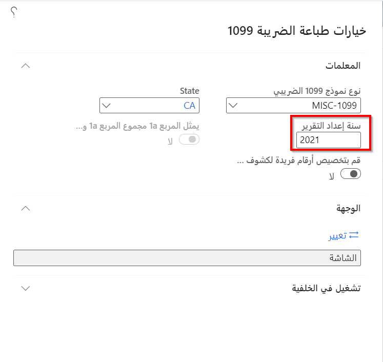

إذا كنت تتعامل مع الموردين الذين يخضعون لضريبة الولايات المتحدة 1099، فيجب تعقب المبلغ الذي تدفعه لكل مورد وإبلاغ هيئات الضرائب الأمريكية بهذه المعلومات في نهاية سنة التقويم. وعادة ما يكون الموردون أفراداً ليسوا موظفين ويقدمون خدمات لمؤسستك. عليك أيضاً إرسال كشف حساب إلى كل مورد خاضع لضريبة 1099 تتعامل معه، لإخطاره بالمبلغ الذي تقوم بالإبلاغ عنه إلى هيئات الضرائب.

بالنسبة لكل مورد أعددته ليكون مورد خاضع لضريبة 1099، يتم تعقب المبالغ ضمن "الأمور المالية" على مدار السنة. في بنود الفاتورة، يمكنك استخدام الحقلين **مربع 1099** و **مبلغ 1099** لتعقب مبالغ 1099. وحتى في حالة عدم إدخال قيمة في حقل **مبلغ 1099**، تساهم أي دفعة تم ترحيلها لمبلغ الفاتورة في إجمالي 1099 الخاص بـ **مربع 1099** المحدد. إذا قمت بإدخال مبلغ 1099، فسيتم استخدام المبلغ الذي أدخلته بدلاً من مبلغ الدفع المرحل.

يمكن للمالية معالجة معلومات 1099-MISC و1099-DIV و1099-INT و1099-S (عائدات الحركات العقارية) و1099-G (بعض المدفوعات الحكومية). يمكنك دفع فاتورة بمعلومات 1099-G و1099-S ومعالجة الكشوف الضريبية 1099-G و1099-S.

## 1099-G

تتطلب دائرة الإيرادات الداخلية (IRS) أن يتم الإعلان عن أي مدفوعات حكومية يتم سدادها من قبل أي كيان حكومي فيدرالي أو دولي أو محلي إلى دائرة الإيرادات الداخلية والمورد الذي تم الدفع له. يمكنك الإبلاغ عن المدفوعات التي تم إجراؤها بواسطة كيان حكومي باستخدام صفحة ضريبة 1099-G.

ويمكن أن تكون هذه المدفوعات تعويضات البطالة، أو استرداد ضريبة الدخل المحلية أو الحكومية، أو ائتمانات أو تعويضات، أو مدفوعات مساعدة تعديل التجارة البديلة (ATAA)، أو المنح الخاضعة للضريبة، أو المدفوعات الزراعية. ويمكن أن يتم الدفع لأغراض مثل الخدمة بعمولة حكومية، أو مدفوعات العمل اليومية، أو استرداد المبالغ الدولية الخاضع للضريبة.

## 1099-S

تطلب دائرة الإيرادات الداخلية من الشركات أو الوكالات أو الأفراد في الولايات المتحدة المسؤولين عن إغلاق حركة عقارية الإبلاغ عن عائدات العقارات إلى دائرة الإيرادات الداخلية والفرد أو الشركة أو المورد الذي اشترى العقار. ويمكنك الإبلاغ عن جميع الحركات العقارية إلى الأطراف المطلوبة باستخدام صفحة ضريبة 1099-S.

تعرض صفحة **1099-S** عائدات العقارات للحركات العقارية المغلقة وتتضمن معلومات الحركات مثل تاريخ الإغلاق أو إجمالي العائدات أو العنوان أو الوصف القانوني للممتلكات أو رقم الحساب أو الضمان وجزء المشتري من ضريبة العقارات.

## معالجة الكشف الضريبي 1099

وفقاً للوائح الحكومة الأمريكية، عليك تقديم كشف ضريبي 1099-G إلى دائرة الإيرادات الداخلية وإرسال نسخة من الكشف الضريبي 1099-G إلى المورد المعني مرة واحدة سنوياً. وبالمثل، يمكنك إرسال نسخة مطبوعة من حركات 1099-S إلى دائرة الإيرادات الداخلية أو الموردين المعنيين.

ومع ذلك، قبل معالجة صفحة ضرائب 1099-G أو 1099-S، عليك التحقق من الحد الأدنى لمبالغ التقارير والأوصاف المرتبطة بالحقلين **1099-G** أو **1099-S**. يمكنك بعد ذلك التحقق من الحد الأدنى لمبالغ التقارير وتحديثها في صفحة **حقول 1099**.

تتيح لك صفحة **تسوية الموارد في 1099s** طباعة معلومات 1099-G أو 1099-S لكل مورد. في هذه الصفحة، يمكنك عرض جميع الحركات الـ 1099 المرتبطة بمورد معين في شبكة "نظرة عامة" لهذه الصفحة، وحساب القيم الإجمالية لجميع الموردين، وتحديد ما إذا كانت المبالغ قابلة للتقرير أم لا بناءً على الإدخالات الموجودة في صفحة **حقول 1099**.

استخدم صفحة **خيارات طباعة الضريبة 1099** لطباعة النوع المطلوب من حركات 1099 لمورد معين، مثل 1099-G أو 1099-S. يمكنك أيضاً تحديد سنة إعداد التقارير وتعيين أرقام فريدة لكشوف 1099 في هذه الصفحة.

استخدم **تقرير تفاصيل الضريبة 1099** لطباعه قائمة تفصيلية بحركات كشف الحساب 1099 لكل مورد. يمكنك تشغيل هذا التقرير حسب السنة ويمكنك تصفيته حسب المورد. يمكن استخدام هذا التقرير من قبل مديري التحصيل والمحاسبين ومديري ومشرفي الحسابات. 

شاهد الفيديو التالي لمعرفة كيفية تحضير كشوفات حساب 1099 للموردين ومعالجتها وطباعتها.

 > [!VIDEO https://www.microsoft.com/videoplayer/embed/RE4aiKc]
