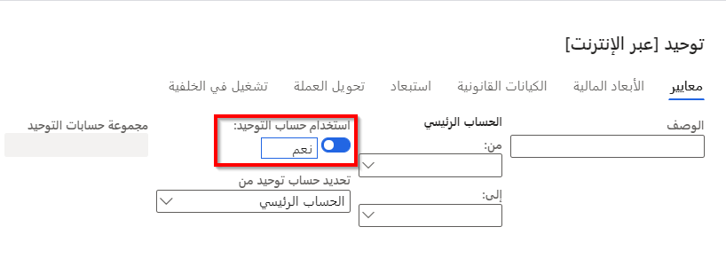

في عملية الدمج، يمكن تجميع الحركات من عدة حسابات للشركة في مجموعة واحدة من حسابات الشركة. ويمكنك طباعة تقارير مثل القوائم المالية، من الشركة الموحدة، ولكن لا تستخدم هذه الشركة للحركات اليومية.

قبل إجراء الدمج في إقفال الفترة تأكد من تنفيذ الأنشطة التمهيدية لإقفال الفترة، ولكن لا تقم بإقفال حسابات الشركة التابعة حتى تكتمل عملية الدمج.

ويمكنك دمج البيانات من الشركات التي لديها قواعد بيانات خارجية لقاعدة بيانات الشركة الموحدة أو لدمج البيانات من الشركات الموجودة في قاعدة البيانات نفسها، حيث تسمى عملية الدمج "عبر الإنترنت".

لا تتطلب عمليات الدمج بالضرورة أن تقوم بإعداد الشركة الموحدة مقدماً. ومع ذلك، إذا كنت ترغب في استخدام قواعد تحويل الدمج بهدف تحويل بيانات الشركة التابعة بعملات أجنبية، فيجب إعداد الحسابات الرئيسية للشركة الموحدة.

لتجهيز شركة موحدة (الشركة التي تجمع النتائج والأرصدة الخاصة بالشركات التابعة) لعملية الدمج، يجب أن يتوفر لديك كيان قانوني تم إنشاؤه عن طريق تمكين خيار **استخدام عملية الدمج المالي**. مثل أي كيان قانوني آخر، يجب إكمال تكوين وحدة دفتر الأستاذ العام للشركة الموحدة. لمعرفة المزيد حول تكوين وحدة دفتر الأستاذ العام، راجع الرابط الموجود في الوحدة الموجزة في نهاية هذه الوحدة التدريبية.

بعد إكمال عملية الإعداد في الشركة الموحدة، يمكنك التركيز على الشركة التابعة. ويعتمد مقدار الإعداد المطلوب في شركة تابعة على مدى توافق مخطط الحسابات والأبعاد للشركة الموحدة والشركة التابعة.

## إجراء عملية دمج باستخدام دليل الحسابات المشترك

إذا كانت حسابات دفتر أستاذ الشركة التابعة لها نفس أرقام الحساب ومخطط بنية الحساب كحسابات دفتر أستاذ الشركة الموحدة، فلن تحتاج إلى تعيين حسابات الشركة الرئيسية يدوياً إلى حسابات الشركة الموحدة.

في صفحة **عمليات الدمج > الدمج عبر الإنترنت** الخاصة بالشركة الموحدة، تأكد من تمكين خيار **استخدام حساب الدمج** قبل إجراء عملية الدمج. تحدث عملية تحويل الحركات والأرصدة إلى الحساب الصحيح تلقائياً في أثناء الدمج.

وفي حالة عدم توافق أرقام الحساب في أثناء عملية الدمج، يتم إيقاف العملية ويقوم النظام بإنشاء رسالة خطأ.

إذا تم تعيين خيار **استخدام حساب الدمج** إلى **نعم**، فسيتم تحويل الحركات والأرصدة إلى الحساب الرئيسي المحدد في الكيان القانوني الموحد. ويتم تحديد هذا الحساب الأساسي في حقل **حساب الدمج** في صفحة **الحسابات الرئيسية - دليل الحسابات** لكل حساب رئيسي تابع.

 

إذا تم تعيين خيار **استخدام حساب الدمج** إلى **لا**، فسيتم تحويل الحركات والأرصدة الخاصة بكل حساب شركة تابعة إلى الحساب الموجود في الكيان القانوني الموحد والذي له نفس رقم الحساب الخاص بحساب الشركة التابعة. إذا لم يكن الحساب الرئيسي المقابل موجوداً في الكيان القانوني الموحد، فيتم إنشاء الحساب الرئيسي تلقائياً أثناء الدمج.

## إجراء عملية دمج باستخدام دليل الحسابات الفارغ

يمكنك إجراء عملية دمج دون إنشاء دليل حسابات شركة موحدة مقدماً.

إذا كنت قد قمت بتخطيط البنية التي ترغب في استخدامها في الشركة الموحدة، فيمكنك تعيين حسابات الشركة التابعة إلى هذه البنية. عند إجراء عملية الدمج، يتم إنشاء الحسابات الموحدة التي قمت بالإشارة إليها في حقل **حساب الدمج** تلقائياً في أثناء عملية الدمج.

إذا لم تقم بإجراء إي تعيينات إلى حسابات الشركة التابعة، فسيتم إنشاء حسابات الشركة الموحدة تلقائياً عند نقل بيانات الشركة التابعة إلى الشركة الموحدة. يتم تكديس البيانات اللاحقة، من الشركة الثانية الجاري دمجها مثلاً، في حسابات الشركة الموحدة بنفس رقم الحساب مثل حساب الشركة التابعة.

بغض النظر عما إذا كنت قد قمت بالتعيين أم لا، قم بتعطيل خيار **استخدام حساب الدمج** في صفحة **الدمج** الخاصة بالشركة الموحدة قبل تشغيل هذا النوع من الدمج.

## تعيين دليل الحسابات الخاص بالشركة التابعة والموحدة

إذا لم يتبع دليل حسابات الشركة التابعة دليل الحسابات الخاص بالشركة الموحدة، فيمكنك تعيين حسابات الشركة التابعة إلى حسابات الشركة الموحدة.

في الشركة التابعة، انتقل إلى صفحة **دفتر الأستاذ العام > دليل الحسابات > الحسابات > الحسابات الرئيسية**. بعد ذلك، حدد كل حساب دفتر أستاذ خاص بشركة تابعة سيتم نقله إلى الشركة الموحدة.

في علامة التبويب السريعة **عام** في حقل **حساب الدمج**، أدخل الحساب في الشركة الموحدة التي سيتم نقل الرصيد أو الحركات الخاصة بحساب دفتر أستاذ الشركة التابعة المحدد إليه.

إذا كان دليل حسابات الشركة الموحدة أبسط من بنية حساب الشركة التابعة، فأدخل نفس حساب دفتر أستاذ الشركة الموحدة في عدة حسابات للشركة التابعة.

لإعداد التقارير والقوائم المالية التي تستند إلى الأبعاد المتوفرة في الشركة الموحدة، قم بتعيين الأبعاد المستخدمة في حسابات الشركة التابعة إلى أبعاد الشركة الموحدة.

إذا كانت أنواع الحسابات في حسابات الشركة التابعة التي يتم نقلها مختلفة عن الشركة الموحدة، فإن قيم حسابات الحركات تتجاوز قيم إجمالي الحسابات والحسابات الأصلية في أثناء عملية الدمج.

## إجراء عملية دمج

يدعم Finance عمليات الدمج في صورة دمج عبر الإنترنت، حيث توجد الشركات التابعة في نفس قاعدة بيانات الشركة الموحدة.

إذا كانت الشركات التابعة موجودة في قاعدة بيانات مختلفة عن الشركة الموحدة، اتبع الخطوات الآتية:

1.  في الشركة التابعة، انتقل إلى **عمليات الدمج > تصدير أرصدة الشركة > دمج [تصدير إلى]**.

2.  حدد القيم في علامة التبويب **معايير**.

     

3.  تعيين البُعد المالي بتسلسلات مناسبة.

     

4.  قم بتضمين الكيانات القانونية التي لدى هذه الشركة التابعة حركات مالية معها وتضمين الشركة الموحدة أيضاً. يمكنك تحديد **الأرباح والخسائر** أو **الرصيد** لكل كيان قانوني، وليس كلاهما.

     
5.  حدد **موافق**.

عند تصدير البيانات، قم بإجراء المهام الآتية في الشركة الموحدة:

1.  انتقل إلى صفحة **عمليات الدمج > الدمج باستخدام الاستيراد**.

2.  حدد القيمة في علامة التبويب **معايير**.

3.  حدد الكيان القانوني التابع وحدد الملف الذي سيتم استيراده.

4.  حدد إما **الأرباح والخسائر** أو **الرصيد** لكل ملف.

    

5.  في **تحويل العملة**، حدد نوع سعر الصرف الذي سيتم استخدامه في عملية الدمج لكل شركة تابعة.

     

6.  حدد **موافق**.

## عمليات الاستبعاد بين الشركات الشقيقة

وتكون حركات الاستبعاد مطلوبة عندما تجري شركة الأم أعمالاً مع شركة فرعية واحدة أو أكثر وتستخدم تقارير مالية موحدة.

يجب استبعاد بعض الحركات التي تحدث بين الشركات لأن القوائم المالية الموحدة يجب أن تتضمن فقط الحركات التي تقع بين الكيان الموحد والكيانات الأخرى الموجودة خارج المجموعة الموحدة. وبسبب هذا المتطلب، تجب إزالة الحركات بين الشركة الأم والشركات التابعة لها أو استبعادها.

وتقوم قواعد الاستبعاد المحددة سابقاً بإنشاء حركات استبعاد في الشركة التي تم تحديدها باعتبارها الشركة الوجهة لعمليات الاستبعاد. يمكن إنشاء دفاتر يومية الاستبعاد في أثناء عملية الدمج أو باستخدام مقترح دفتر يومية الاستبعاد.
