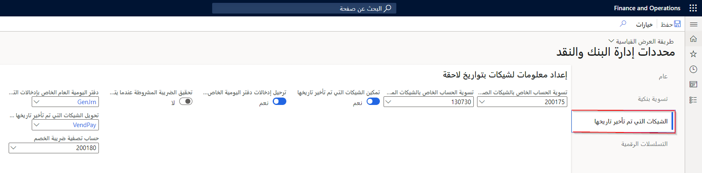

يتم إصدار الشيكات المؤجلة لمساعدتك في إجراء المدفوعات واستلامها في تاريخ لاحق. يمكنك تحديد ما إذا كان يجب أن ينعكس الشيك في دفاتر المحاسبة قبل تاريخ استحقاقه.

تحتاج إلى التأكد من قيامك بإعداد طريقة دفع جديدة وتحديد روتين الدفع لتصفية الحسابات للشيكات الصادرة والشيكات المستلمة وضريبة الخصم.

يمكنك أيضاً تحديد حسابات المقاصة للشيكات الصادرة والشيكات المستلمة وضريبة الخصم. 

شاهد هذا الفيديو للتعرف على كيفية إعداد الشيكات المؤجلة في Finance:

> [!VIDEO https://www.microsoft.com/videoplayer/embed/RE3TYJd]

لإعداد الشيكات المؤجلة، اتبع هذا الإجراء:

1.  انتقل إلى **‏‫إدارة النقد والبنوك‬ > الإعداد > معلمات إدارة البنك والنقد**.
2.  حدد علامة التبويب **الشيكات التي تم تأخير تاريخها**.
3.  حدد خيار **تمكين الشيكات التي تم تأخير تاريخها**.
4.  تمكين خيار **ترحيل إدخالات دفتر اليومية الخاص بالشيكات التي تم تأخير تاريخها**.
5.  في حقل **حساب المقاصة للشيكات الصادرة**، حدد القيم المطلوبة.
6.  في حقل **حساب المقاصة للشيكات المستلمة**، حدد أو أدخل القيم المطلوبة.
7.  في حقل **دفتر اليومية العام الخاص بإدخالات التسوية**، حدد أو أدخل دفتر اليومية لإدخالات المقاصة.
8.  في حقل **تحويل الشيكات المؤجلة إلى دفتر يومية دفع المورد هذا**، حدد أو أدخل دفتر يومية مدفوعات المورد الذي تم تعيينه إليه.
9.  في حقل **حساب مقاصة ضريبة الخصم**، حدد أو أدخل حساب مقاصة الخصم من الحساب الذي سيتم تعيينه إليه.
10. حدد **حفظ**.
11. أغلق الصفحة.
12. انتقل إلى **الحسابات الدائنة > إعداد الدفع > طرق الدفع**.
13. حدد **جديد**.
14. في حقل **الطريقة الخاصة بالدفع**، اكتب اسم طريقة الدفع. ستلاحظ ظهوره في القائمة الموجودة على اليسار.
15. ضمن القسم **عام**، حدد خيار **ترحيل تسوية الشيك الذي تم تأخير تاريخه** للإشارة إلى أن مبلغ الشيك تم تأخير تاريخه إلى حساب مقاصة.
16. في الحقل **نوع الحساب**، حدد **البنك**. سيكون الحساب المقابل لطريقة الدفع بنكاً.
17. في حقل **حساب المدفوعات**، حدد الحساب البنكي المستخدم لخصم مبلغ الفاتورة.
18. انقر على **حفظ**.
18. أغلق الصفحة.
19. انتقل إلى **الحسابات المدينة > إعداد المدفوعات > طرق الدفع**.
20. حدد **جديد‎**.
21. في حقل **الطريقة الخاصة بالدفع**، اكتب اسم طريقة الدفع. ستلاحظ ظهوره في القائمة الموجودة على اليسار.
22. ضمن القسم **عام**، حدد خيار **ترحيل تسوية الشيك الذي تم تأخير تاريخه** للإشارة إلى أن مبلغ الشيك تم تأخير تاريخه إلى حساب مقاصة.
23. في الحقل **نوع الحساب**، حدد **البنك**. سيكون الحساب المقابل لطريقة الدفع بنكاً.
24. في حقل **حساب المدفوعات**، حدد الحساب البنكي المستخدم لإيداع مبلغ الفاتورة.
25. انقر على **حفظ**.
25. أغلق الصفحة.

