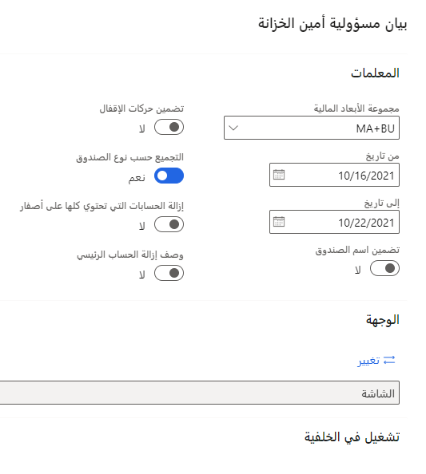

الصندوق عبارة عن مجموعة من الدفاتر المالية ذاتية التوازن تُستخدم للتحكم في الاستخدام المخطط للموارد ومراقبته، غالباً وفقاً للمتطلبات القانونية والإدارية. تستخدم مؤسسات القطاع العام الأموال لإثبات مسؤوليتها المالية.

تُستخدم أرقام الصناديق كقيم أبعاد في أرقام الحسابات المالية حيث تم تعيين بُعد للصندوق. عادة ما تتطلب مؤسسات القطاع العام إدخالات متوازنة للأبعاد المالية المتعلقة بالصناديق.

يمكنك استخدام صندوق للتحكم في الاستخدام المخطط للموارد ومراقبته، غالباً بما يتوافق مع المتطلبات القانونية والإدارية. يتم إنشاء الصناديق للقيام بأنشطة محددة أو لتحقيق أهداف معينة للجهة الحكومية وفقاً لتشريعات أو أنظمة خاصة أو قيود أخرى.

## تفاصيل الأرصدة

يجب أن يكون لكل صندوق رقم بحث فريد (على الرغم من أن الحقل يسمح بقيم غير رقمية). تشير بعض المؤسسات إلى رقم الصندوق على أنه صندوق أو رمز صندوق أو رقم حساب صندوق أو حساب صندوق.

في Finance، يتم استخدام أرقام الصناديق كقيم أبعاد في أرقام الحسابات المالية حيث تم تعيين بُعد إلى صندوق.
عندما يكون رقم الحساب مرتبطاً بصندوق، فإنه ينتمي إلى مجموعة الدفاتر المالية التي يتضمنها هذا الصندوق.

عادة ما تتطلب مؤسسات القطاع العام إدخالات متوازنة للأبعاد المالية المتعلقة بالصناديق. عندما يتم وضع علامة على بُعد مالي أو مجموعة من الأبعاد لطلب إدخالات متوازنة، لن يقوم النظام بترحيل معاملة حيث لا تساوي الديون أرصدة للبعد المالي.

## فئات وأنواع الصناديق للقطاع العام

يوصي مجلس معايير المحاسبة الحكومية (GASB) بمجموعة من مبادئ المحاسبة المقبولة عموماً (GAAP) للمحاسبة الحكومية المحلية والحكومية. تحدد مبادئ المحاسبة المقبولة عموماً ثمانية أنواع من الصناديق يتم تصنيفها ضمن فئات الصناديق الثلاثة:

-   **الحكومية** - الصناديق الحكومية هي محاسبة الصناديق للأنشطة الحكومية التي لا تعتبر ملكية (نوع أعمال) أو ائتمانية. الصندوق العام هو مثال على الصندوق الحكومي. هذا هو صندوق التشغيل الرئيسي للحكومة. تعتبر صناديق الإيرادات الخاصة وصناديق المشاريع الرأسمالية وصناديق خدمة الديون أمثلة أخرى على الصناديق الحكومية.
-   **الملكية** - صناديق الملكية هي صناديق من نوع الأعمال التجارية تستخدم طريقة المحاسبة على أساس الاستحقاق لتسجيل الإيرادات والمصروفات في الفترات المحاسبية التي تختلف عن الفترات المستخدمة في الصناديق الحكومية. تشمل أمثلة الصناديق الخاضعة للملكية صناديق المؤسسات وصناديق الخدمات الداخلية.
-   **الائتمانية** - تمثل الصناديق الائتمانية "أموال الآخرين". نظراً لأن الحكومة لا تمتلك الأصول والالتزامات في هذا الصندوق، فإنها تحتفظ بمجموعة منفصلة من الدفاتر لتعقب أنشطة الصندوق والإبلاغ عنها. تشمل أمثلة الصناديق الائتمانية الصناديق الاستئمانية وصناديق الوكالات.

أنواع الصناديق هي الفئات التي يمكنك استخدامها لتجميع الأموال من أجل التتبع المالي التفصيلي وإعداد التقارير. يمكن تضمين العديد من الصناديق في تقرير واحد عالي المستوى، ولكن يظل كل صندوق كياناً مالياً ومحاسبياً منفصلاً مع دفتر الأستاذ العام وبيانات الدخل وتقارير الميزانية العمومية الخاصة به.

توفر مبادئ المحاسبة المقبولة عموماً (GAAP) للمحاسبة الحكومية المحلية والمحلية المعايير التي يمكنك اتباعها عند إعداد نظام الصناديق وأنواع الصناديق.

يمكن لمؤسسات القطاع العام إنشاء أنواع الصناديق وفقاً لمتطلباتها التشغيلية.

تتضمن أمثلة أنواع الصناديق المحتملة ما يلي:

-   الصندوق العام
-   الإيراد الخاص
-   خدمة الدين
-   المشاريع الرأسمالية
-   المؤسسة
-   الخدمة الداخلية
-   الدين العام طويل الأجل (GASB 34)
-   الوكالة
-   وحدة المكون
-   الثقة القابلة للتغيير
-   الأصول الرأسمالية (GASB 34)
-   صندوق الاستثمار
-   الدائم
-   الثقة غير القابلة للتغيير
-   صندوق التقاعد
-   صندوق الأغراض الخاصة

فيما يلي قائمة بالصناديق التي يمكن أن تستخدمها حكومة المدينة:

-   الصندوق العام
-   مدرسة التكنولوجيا
-   تكنولوجيا المعلومات
-   سوق المزارعين
-   لجنة المرافق
-   خدمة شركة النقل
-   صندوق تعويض العمال
-   خطة طبية كبرى شاملة
-   التعويض المؤجل
-   تحصيلات ضرائب المبيعات المحلية
-   كاتب المحاكم

يوضح الجدول التالي هذه الصناديق مجمعة حسب فئة الصندوق ونوع الصندوق.

| فئة الصندوق | **نوع الصندوق** |  **رقم الصندوق** | **اسم الصندوق** |
 | ------------- | ------------- | ------------- | ------------- |
 | حكومي  | الصندوق العام  |  1103 | الصندوق العام |
 |  | صناديق الإيرادات الخاصة | 1343  | مدرسة التكنولوجيا |
|  |  | 1372  | تكنولوجيا المعلومات |
 | خاص | صناديق المؤسسات  | 2501  | سوق المزارعين |
 |  |  | 2541  | لجنة المرافق |
|   | صناديق الخدمة الداخلية  |  2723 | خدمة شركة النقل |
|   |   |  2738  | صندوق تعويض العمال |
| ائتماني | أموال صندوق التقاعد  |  3320  |  خطة طبية كبرى شاملة |
|   |   |  3324  | التعويض المؤجل |
|  | صناديق الوكالات  |  3912  | تحصيلات ضرائب المبيعات المحلية |
|   |  |  3914  | كاتب المحاكم |

يمكنك عرض تقرير سيكون عبارة عن ميزان مراجعة خاص بأموال أمين الصندوق بالانتقال إلى **دفتر الأستاذ العام > الاستعلامات والتقارير > تقارير دفتر الأستاذ > بيان مساءلة أمين الصندوق**. يمكن إجراء ذلك بشكل يومي لمراجعة النشاط في حسابات الصندوق لأموال أمين الصندوق ومقارنتها بالصناديق الأخرى. يمكنك البحث عن التعارضات والأرصدة غير المتوقعة وأي تعديلات قد تكون مطلوبة.  

