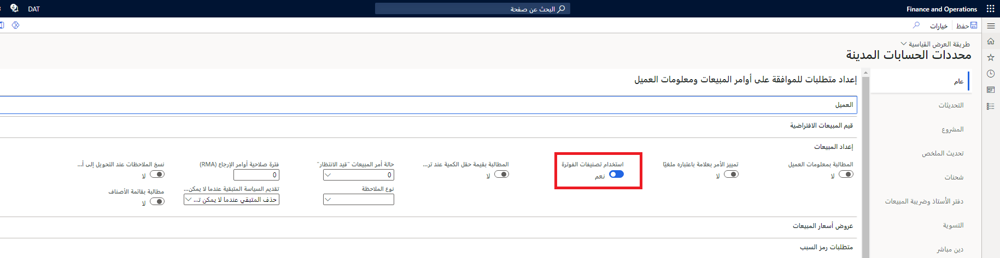

يمكن لمؤسسات القطاع العام استخدام تصنيفات الفوترة وأكواد الفوترة للمساعدة في إدارة الفواتير ذات النص الحر. تشرح هذه الوحدة كيفية تكوين أكواد الفوترة والاختبار للفواتير ذات النص الحر.

تحدد أكواد الفوترة مصاريف صنف سطر محددة، بما في ذلك حسابات وحقول معدلات قابلة للتعريف؛ وتنظم تصنيفات الفوترة مقبوضات الفاتورة ذات النص الحر. ويسمح هذا للنظام بمعالجة المستندات وفق تصنيفات الفوترة.

تدعم الوحدة النمطية لحسابات المقبوضات في المالية أيضاً التسويات في إعداد نقدية مجمعة. يمكنك إعداد تعريفات الترحيل الخاصة بتسويات الفواتير لإنشاء إدخالات "مستحق لـ" و"مستحق من" تلقائياً بين الأموال المختلفة.

## تصنيفات الفوترة

تُستخدم تصنيفات الفوترة لتجميع الفواتير ذات النص الحر المتشابهة للمعالجة والعرض.

على سبيل المثال، قد تقوم وكالة ترانزيت بتأجير مساحة في كل محطة ترانزيت لمقاهٍ صغيرة وغيرها من الموردين. ومن خلال إنشاء تصنيف فوترة للتأجيرات، يمكن للوكالة تطبيق شروط الدفع نفسها تلقائياً واستخدام تسلسل خطابات التحصيل نفسه لجميع التأجيرات. كما يمكن لهذه الوكالة أيضاً عرض الفواتير لجميع التأجيرات معاً، حتى إذا لم تتشارك التأجيراتُ الأبعاد المالية نفسها.

تشمل تصنيفات الفوترة المعلومات التالية:

-   كود تصنيف الفوترة (حتى 15 حرفاً أبجدياً ورقماً)
-   الوصف (حتى 60 حرفاً)
-   شروط الدفع
-   معلومات الفائدة
-   التسلسل الرقمي لرقم الفاتورة
-   التسلسل الرقمي للإشعارات الدائنة
-   التسلسل الرقمي لخطابات التحصيل
-   أكواد الفوترة التي يمكن تعيينها إلى فواتير تستخدم تصنيف الفوترة هذا

يمكنك استخدام تصنيفات الفوترة للتحكم في أولوية التسوية الخاصة بالفواتير ذات النص الحر. يمكن أن يشتمل تصنيف الفوترة على الكثير من أكواد الفوترة، لكن يمكن تعيين كل كود فوترة لتصنيف فوترة واحد فقط.

عند تحديد تصنيف فوترة في فاتورة نص حر، تتوفر أكواد الفوترة الواردة في تصنيف الفوترة فقط للفاتورة. قبل إعداد تصنيفات الفوترة، تأكد أنك قمت بإعداد شروط الدفع وأكواد الفائدة وملفات تعريف الترحيل وتسلسلات خطابات التحصيل والتسلسلات الرقمية وأكواد الفوترة التي تنوي استخدامها على تصنيفات الفوترة.

## أكواد الفوترة

تحدد أكواد الفوترة تكلفة صنف سطر معينة، بما في ذلك حسابات وحقول معدلات قابلة للتعريف. وهي توفر مجموعة من القيم الافتراضية لسطر فاتورة ذات نص حر لخصائص مثل مبالغ الرسوم وحسابات دفتر الأستاذ ومجموعات ضريبة المبيعات.

تحتاج كيانات القطاع العام إلى فوتره مكونات الخدمات المقدمة دورياً. وغالباً، يتم تقسيم احتياجات الفوترة حسب القسم، ويتم تقسيمها أكثر إلى نوع التكلفة التي تتم فوترتها على نحو متكرر. تخفف عنك أكواد الفوترة الاضطرار إلى البحث عن تفاصيل تكلفة معينة وكيفية حساب مؤسستك للإيراد، وبالتالي توفير الاتساق والدقة في سطور الفاتورة.

فيما يلي بعض أمثلة أكواد الفوترة:

-   تكاليف تراخيص العمل
-   تكاليف قانون التوفيق بين الموازنة العامة الموحدة (COBRA)
-   الموظفون السابقون
-   الغرامات وتكاليف الفحص لإدارات الشرطة والمطافئ
-   تكاليف الإنذار ضد السرقة والتسجيل في الإنذار بالحرائق والإنذارات الخاطئة
-   تكاليف ركن السيارات وحصص الترفيه
-   التكاليف المباشرة للنُّسخ والخرائط

توفر أكواد الفوترة مجموعة قيم وأسعار فوترة افتراضية لنوع محدد من الخدمة أو التكلفة. يتم إدخال القيم التي تقوم بتعريفها لكل كود فوترة تلقائياً في سطر الفاتورة ذات النص الحر عند تحديد كود الفاتورة.

على سبيل المثال، قد يقوم قسم إدارة مخلفات بفوترة عملاء معينين مقابل حاويات جديدة. وسيكون لديهم كود فاتورة "حاوية جديدة" يحتوي على معلومات الفوترة الخاصة بهذه الحاويات. وعندما تنشئ الإدارة فاتورة ذات نص حر وتحدد **حاوية جديدة** في سطر فاتورة، يتم إدخال القيم الافتراضية من كود الفوترة تلقائياً.

تشمل أكواد الفوترة المعلومات التالية:

-   **كود الفوترة** (حتى 10 أحرف أبجدية وأرقام)
-   **الوصف** (حتى 60 حرفاً؛ وسيُطبَع هذا على الفاتورة)
-   **تاريخ السريان وتاريخ انتهاء الصلاحية** - يمكنك إضافة سريان تاريخ إلى أكواد الفوترة. عند تحديد أكواد الفوترة في سطور فاتورة ذات نص حر، يحدد النظام تلقائياً القيم الافتراضية للسطر باستخدام سجل تاريخ كود الفوترة الذي يقابل تاريخ الفوترة.
-   معلومات **ضريبة المبيعات**
-   معلومات **الفائدة**
-   **التوزيع المحاسبي**
-   **معلومات سعر الصرف** - يمكنك تحديد تعبير سعر بكود فوترة وتقييمه. عند استخدام كود الفوترة في سطر فاتورة ذات نص حر، يقيِّم النظام سعر الكود ويقدم مبلغاً افتراضياً للسطر. يمكنك كتابة برنامج نصي للسعر باستخدام لغة برمجة C# أو Visual Basic.
-   **معلومات المشروع** (في حالة تمكينها في صفحة **‏‏محددات الحسابات المدينة**)
-   **الحقول** **المخصصة**

بشكل عام، يمكن تغيير القيم الافتراضية من كود الفاتورة في الفاتورة ذات النص الحر. ولكن، يمكنك تعيين كود الفاتورة للسماح بالتغييرات في حقول معينة أو منعها. 

ويمكن أيضاً ربط أكواد الفوترة بتعريفات الترحيل. عند استخدام كود فاتورة في سطر فاتورة، يتم استخدام تعريف الترحيل المرتبط بكود الفوترة لترحيل الحركة إلى دفتر الأستاذ.

## الحقول المخصصة

ويمكنك إنشاء حقول مخصصة لأكواد الفوترة بفتح صفحة **الحسابات المدينة > الإعداد > الحسابات المدينة > الحقول المخصصة لكود الفوترة**. تُستخدَم الحقول المخصصة لتجميع البيانات المتعلقة بتكاليف فوترة محددة. على سبيل المثال، يمكن لقسم مراقبة الحيوانات بإحدى المدن استخدام حقول مخصصة لتسجيل نوع الحيوان وتاريخ آخر تلقيح ضد السعار أُعطي له.

نظراً لتعيين حقول مخصصة إلى أكواد الفوترة، عليك إنشاء الحقول المخصصة قبل إنشاء أكواد الفوترة. توجد ستة أنواع من الحقول المخصصة، ويمكنك تعيين قيمة افتراضية لأي منها. ويمكن تغيير القيم الافتراضية في الفاتورة ذات النص الحر.

-   **العملة** - تقبل حقول العملة الأرقام التي تحتوي على منزلتين عشريتين فقط. يمكنك تحديد قيمة الحد الأدنى والحد الأقصى للحقل.
-   **عشري** - تقبل الحقول العشرية الأرقام العشرية ذات أربعة منازل عشرية فقط. يمكنك تعيين قيمة الحد الأدنى والحد الأقصى للحقل.
-   **النص** - يمكن أن تحتوي الحقول النصية على أي نوع نصوص، وسيتم تفسير أي إدخال تتم كتابته فيه على أنه نص. يمكنك تعيين أقصى طول حقل للحقل.
-   **عدد صحيح** - تقبل هذه الحقول الأعداد الصحيحة فقط. يمكنك تعيين قيمة الحد الأدنى والحد الأقصى للحقل.
-   **منطقي** - تسمح حقول "منطقي" بتحديد خيارات "نعم/لا".
-   **التاريخ** - تقبل حقول التاريخ تواريخ فقط. يُخزَّن التاريخ بتنسيق mm/dd/yyyy.

وعلى الرغم من أنه ليس من الضروري تمكين تصنيفات الفوترة، إلا أننا نوصي بتنفيذ ذلك.

تتوفر العديد من إمكانيات القطاع العام في تطبيق الحسابات المدينة، عند تمكين تصنيفات الفوترة فقط. ولكن بعد تمكين تصنيفات الفوترة، يعد تصنيف الفوترة حقلاً مطلوباً في الفواتير ذات النص الحر

يمكنك تمكين تصنيفات الفوترة في صفحة **محددات الحسابات المدينة** . في قسم **عام** ، ضمن علامة التبويب السريعة **إعداد المبيعات** ، حدد **استخدام تصنيفات الفوترة**.

تتوفر الصفحات التي تقوم فيها بإنشاء تصنيفات فوترة وأكواد فوترة قبل تمكين تصنيفات الفوترة. وستحتاج إلى إعداد جميع تصنيفات الفوترة وأكواد الفوترة قبل تمكينها.

ولكن بعد تمكين تصنيفات الفوترة، فيجب أن تحتوي كل فاتورة ذات نص حر على تصنيف فوترة. 

إذا كنت تنوي استخدام تصنيفات الفوترة لتحديد أولوية التسوية الخاصة بالفواتير ذات النص الحر، فقم بتمكين سمة **الفوترة** في صفحة **أولوية التسوية** بعد تمكين تصنيفات الفوترة.

حدد الأولوية التي تحدد كيفية تسوية سطور الفاتورة.
تتوفر الخيارات التالية:

-   **بلا** - سيتم دفع سطور الفاتورة بترتيب ظهورها في الفاتورة.
-   **كود الفوترة** - سيتم دفع سطور الفاتورة بالترتيب المحدد في صفحة **تصنيفات الفوترة**
-   **التناسب** - سيتم دفع جزء من كل سطر فاتورة، حسب الخيار المحدد في الحقل **نوع التناسب**. لا يتوفر هذا الحقل إلا في حالة تحديد الخيار **وضع علامة على السطور في الفواتير ذات النصوص الحرة وإشعارات الفائدة** في صفحة **محددات الحسابات المدينة**.

في حالة الحاجة إلى تحديث أكواد الفوترة، لن تحتاج إلى إنشاء أكواد فوترة جديدة. وإنما يمكنك إنشاء إصدارات متعددة من كود الفوترة، بتواريخ سريان وانتهاء صلاحية لكل إصدار. وفي تاريخ السريان، سيبدأ النظام استخدام الإصدار المحدث تلقائياً.

لا يمكنك تعيين كود الفوترة نفسه إلى أكثر من تصنيف فوترة واحد، ولكن توجد طريقة للحصول على النتائج التي تحتاجها على أيه حال.
فكر في السيناريو الذي تستخدم فيه مؤسستك تصنيف فوترة منفصلاً لكل قسم إداري. تحتاج ثلاثة أقسام إدارية إلى كود فوترة لاتفاقيات الترخيص.
