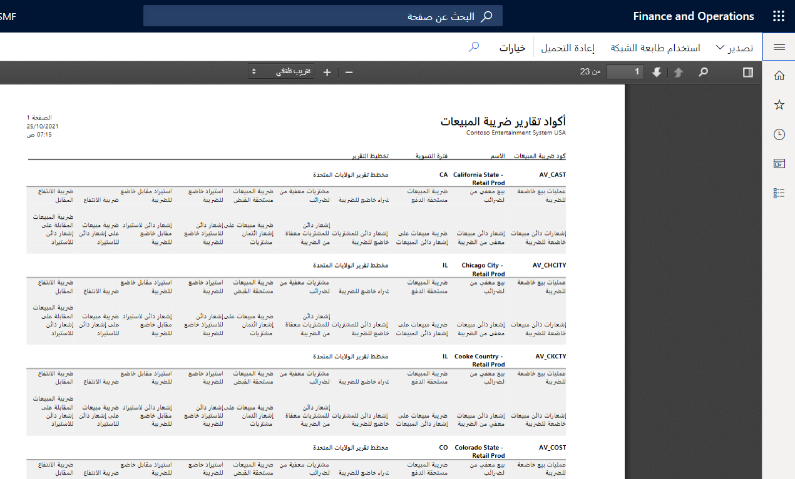

تشير أكواد تقارير ضريبة المبيعات إلى رقم الحقل في تقرير ضريبة المبيعات. ويتم استخدامها في تخطيطات التقرير الخاصة بالبلد أو المنطقة وتقرير **دفع ضريبة المبيعات حسب الكود** لطباعة مبالغ ضريبة المبيعات لفترة التسوية التي يتم تلخيصها لكل كود تقرير.  

ويجب الإبلاغ عن ضريبة المبيعات ودفعها إلى هيئات الضرائب على فترات منتظمة (شهرياً وربع سنوياً وهكذا). يوفر Finance الوظائف التي تتيح لك تسوية الحسابات الضريبية للفاصل الزمني وإزاحة الأرصدة إلى حساب تسوية الضريبة، كما هو محدد في مجموعات ترحيل دفتر الأستاذ. ويمكنك الوصول إلى هذه الوظيفة من خلال الصفحة **تسوية ضريبة المبيعات وترحيلها**. وتأكد من تحديد فترة تسوية ضريبة المبيعات التي يجب تسوية ضريبة المبيعات لها.

وبعد إنشاء أكواد تقارير ضريبة المبيعات، يمكنك الإشارة إليها في علامة التبويب السريعة **إعداد التقرير** في الصفحة **كود ضريبة المبيعات**.

ويستخدم هذا التخطيط لتصفية أكواد التقارير المتاحة لكود ضريبة المبيعات. وينتمي كل كود ضريبة مبيعات إلى فترة تسوية تنتمي إلى هيئة ضريبة المبيعات التي تستخدم تخطيط التقرير.

بعد دفع ضريبة المبيعات، تجب موازنة الرصيد الموجود في حساب تسوية ضريبة المبيعات مع الحساب البنكي. 

وإذا كانت هيئة ضريبة المبيعات التي تم تحديدها في فترة تسوية ضريبة المبيعات مرتبطة بحساب المورد، فإنه يتم ترحيل رصيد ضريبة المبيعات كفاتورة مورد مفتوحة ويمكن تضمينها في اقتراح الدفع العادي.

وفيما يأتي نموذج لتقرير **كود ضريبة المبيعات**:

