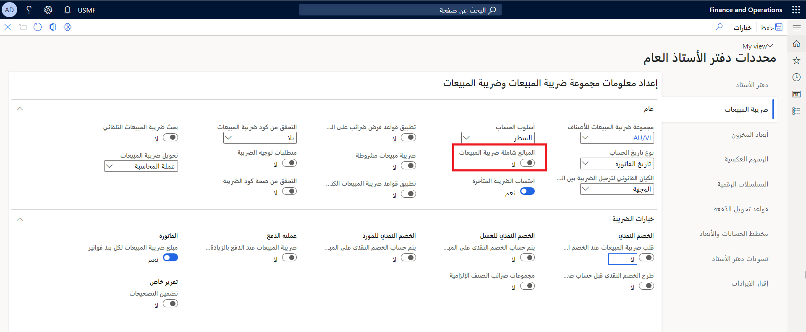

ضريبة المبيعات المشروطة هي ضريبة مبيعات يتم دفعها بشكل متناسب إلى المبلغ الفعلي المدفوع على الفاتورة. 

وعلى العكس من ذلك، يتم حساب ضريبة المبيعات القياسية في وقت الفوترة.  

يجب أن يتم دفع ضريبة المبيعات المشروطة إلى هيئة ضريبة المبيعات عند ترحيل الدفع، وليس عند ترحيل الفاتورة. عند ترحيل الفاتورة، يجب الإبلاغ عن الحركة في تقرير دفتر ضريبة المبيعات. ومع ذلك، يجب استبعاد الحركة من تقرير دفع ضريبة المبيعات.

إذا قمت بتحديد خانة الاختيار **ضريبة المبيعات المشروطة** في الصفحة **معلمات دفتر الأستاذ العام**، لا يمكن خصم ضريبة المبيعات حتى يتم دفع الفاتورة. يعد هذا طلباً قانونياً في بعض البلدان أو المناطق.

عند تحديد الخيار **ضريبة المبيعات المشروطة**، يلزم إعداد أكواد ضريبة المبيعات ومجموعات ضريبة المبيعات، ثم إنشاء مجموعات ترحيل لدفتر الأستاذ لدعم الوظيفة.

يمكنك تكوين ضريبة مبيعات مشروطة على الصفحة معلمات دفتر الأستاذ العام من خلال الانتقال إلى **دفتر الأستاذ العام > إعداد دفتر الأستاذ > معلمات دفتر الأستاذ العام.**

