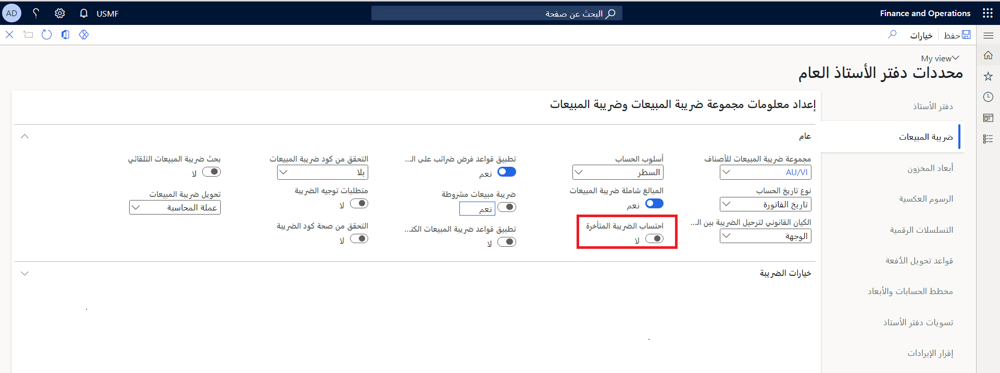
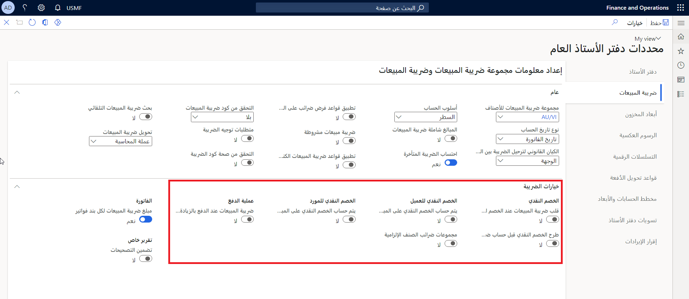

تتحكم مجموعات ترحيل دفتر الأستاذ في الترحيل التلقائي لضرائب المبيعات في Finance. تحتاج إلى إنشاء الحسابات التي يستخدمها دفتر الأستاذ العام في مخطط الحسابات قبل استخدامها لإعداد مجموعات ترحيل دفتر الأستاذ.
 
تنطبق الخصائص التالية على مجموعات ترحيل دفتر الأستاذ:

- يتم تحديث حساب دفتر الأستاذ تلقائياً عندما يحسب النظام الضرائب ويحدّث ترحيل الفاتورة.
- نظراً لأن كل حساب في دفتر الأستاذ يمكن أن يستخدم عدة أكواد ضريبية، فإن مجموعة ترحيل دفتر الأستاذ تحدد الترحيل.
- يمكن أن تحتوي كل مجموعة ترحيل لدفتر الأستاذ على العديد من حسابات دفتر الأستاذ. 
- يمكنك إعداد حسابات دفتر الأستاذ التي لها نوع ترحيل ضريبة المبيعات لتحديد الحسابات في صفحة **مجموعة الحساب**.
- التغييرات التي تجريها على أرقام حساب دفتر الأستاذ في **مجموعات ترحيل دفتر الأستاذ** تؤثر فقط على الحركات التي لم يتم ترحيلها بعد.

شاهد هذا الفيديو للتعرف على كيفية إعداد **مجموعات ترحيل دفتر الأستاذ**:

 > [!VIDEO https://www.microsoft.com/videoplayer/embed/RE47ZyZ]

يعتمد عدد الحسابات التي تحتاج إلى إنشائها على استخدام المجموعة والقانون الوطني. على سبيل المثال، يمكنك إعداد حسابات لما يلي:

- ضريبة المبيعات مستحقة الدفع
- ضريبة الانتفاع مستحقة الدفع
- حساب التسوية
- ضريبة المبيعات مستحقة القبض

يتم حساب ضريبة المبيعات وترحيلها إلى الحسابات الرئيسية المحددة في **مجموعات ترحيل دفتر الأستاذ**. يتم إرفاق مجموعات ترحيل دفتر الأستاذ بكل رمز ضريبة مبيعات. يمكنك إعداد مجموعات ترحيل دفتر الأستاذ الفردية لكل رمز ضريبة مبيعات، أو استخدام مجموعة ترحيل دفتر أستاذ واحدة لجميع رموز ضريبة المبيعات، أو تعيين مجموعات ترحيل متعددة لدفتر الأستاذ إلى رموز ضريبة المبيعات.
 

حساب دفتر الأستاذ في قائمة **ضريبة المبيعات مستحقة الدفع** هو المكان الذي تقوم فيه بترحيل ضريبة المبيعات الصادرة كجزء من التزام الشركة.

يقوم قسم Finance بخصم الضريبة الصادرة في حساب العميل ثم يضيف إلى هذا الحساب. يتم تسجيل الديون تلقائياً في الحساب وتسويتها عند دفع الضرائب. حسابات دفتر الأستاذ المتاحة في قائمة **ضريبة المبيعات محستحقة الدفع** هي نوع ترحيل ضريبة المبيعات في دليل الحسابات.

أدخل حساب دفتر الأستاذ الذي يعوض مصروف ضريبة الانتفاع للضرائب التي لا يطالب بها الموردون في قائمة **ضريبة الانتفاع مستحقة الدفع**. تعتمد طريقة استخدامك لهذا الحساب على نوع النظام الضريبي الذي تختاره شركتك:

- **الضرائب غير الأمريكية** – في هذا الحساب، ستشير إلى حساب مصروف ضريبة الانتفاع لمجموعة ترحيل دفتر الأستاذ. بالنسبة إلى أي مجموعات ضرائب مبيعات تساهم بمبالغ في حساب دفتر الأستاذ هذا، حدد حقل **ضريبة الانتفاع** في علامة التبويب **إعداد** في صفحة **مجموعة ضريبة المبيعات**.
- **الضرائب الأمريكية** - يعوض المبلغ الموجود في هذا الحساب الضرائب التي تم ترحيلها كمصروفات في حالة تمكين **تطبيق قواعد ضريبة المبيعات** في صفحة **معلمات دفتر الأستاذ العام**. المورد غير مطالب بتحصيل الضريبة. ومع ذلك، قد تظل الشركة مدينة بضرائب لمصلحة ضريبة المبيعات ويجب أن تتعقب هذه الضرائب.

في حالة تمكين **تطبيق قواعد ضرائب ضريبة المبيعات‬‏‫** في صفحة **معلمات دفتر الأستاذ العام** في علامة التبويب **ضريبة المبيعات**، لا يتوفر حقل **ضريبة المبيعات مستحقة القبض**. بدلاً من ذلك، يقوم النظام بخصم ضرائب المبيعات المدفوعة للموردين كنفقات (تكاليف) إلى نفس حسابات المشتريات.

فذا حددت حساباً رئيسياً في **الخصومات النقدية للمورد** التي تتضمن مبلغ ضريبة المبيعات، فتأكد أيضاً من تحديد شريطي التمرير **عكس ضريبة المبيعات على الخصم النقدي** و **حساب الخصم النقدي المفروض على المبلغ متضمناً ضريبة المبيعات‬‏‫** في صفحة **معلمات دفتر الأستاذ العام**.
 

