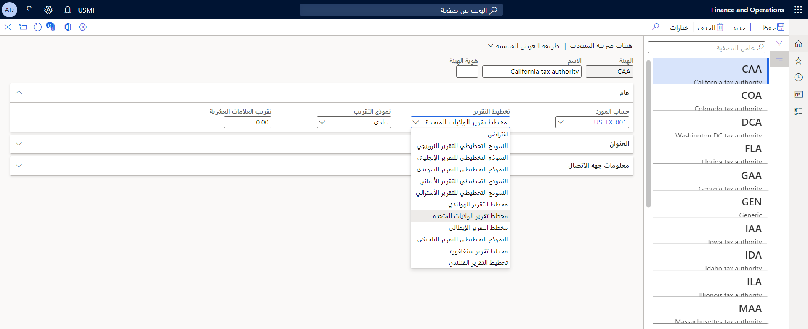

تقوم الشركات بدفع الضرائب وإبلاغ السلطات عنها. تحدد السلطات متى وأين تدفع الشركة ضرائبها. يمكن أن تكون السلطات الضريبية دولاً والولايات والمناطق والمدن.

يمكنك دفع ضريبة المبيعات من خلال المورد أو مباشرة إلى مصلحة ضريبة المبيعات.  

لدفع ضريبة المبيعات من خلال المورد، حدد رقم حساب المورد مع سلطة ضريبة المبيعات الصحيحة. يتم تحويل مدفوعات ضريبة المبيعات بواسطة النظام إلى المورد الذي يقوم بالدفع. لإجراء مدفوعات إلى مصلحة ضريبة المبيعات، أدخل معلومات عنوان مصلحة ضريبة المبيعات. إذا كنت تدفع من خلال المورد، فيمكن للشركة استخدام إجراءات الدفع القياسية الخاصة بها للدفع لمصلحة ضريبة المبيعات في الوقت المحدد. 

إذا لم تقم بإعداد مصلحة الضرائب كمورد، فأنت بحاجة إلى إعداد دفعة يدوية لمصلحة الضرائب في تاريخ الاستحقاق المناسب لتجنب العقوبات التي تفرضها السلطات الضريبية.

حدد نوع التقريب المراد استخدامه لتقريب مبلغ ضريبة المبيعات في قائمة **نموذج التقريب**.

- **عادي** – على يمين الوحدة المحددة، قم بتقريب الأرقام خمسة وما فوق وتقريب الأرقام الأقل من خمسة.
- **لأسفل** - قم بتقريب أي رقم على يمين الوحدة المحددة.
- **التقريب لأعلى** - قم بتقريب أي رقم مجاور للوحدة المحددة.
- **الصالح الخاص** - تقريب أي رقم لصالح الشركة. عندما يقوم النظام بتسوية ضريبة المبيعات، يتم تقريب إجمالي مبلغ ضريبة المبيعات تلقائياً وفقاً للإعداد في مصلحة ضريبة المبيعات.

إنشاء أكبر عدد ممكن من سلطات ضريبة المبيعات حسب الحاجة، ولكل منها عنوان محدد ومعلومات الاتصال وتخطيط التقرير. يمكن للشركة دفع ضرائب المبيعات للسلطة مباشرة أو من خلال حساب مورد تم إنشاؤه لمصلحة ضريبة المبيعات.

شاهد هذا الفيديو للتعرف على كيفية إعداد سلطات ضريبة المبيعات:

 > [!VIDEO https://www.microsoft.com/videoplayer/embed/RE489Xx]

