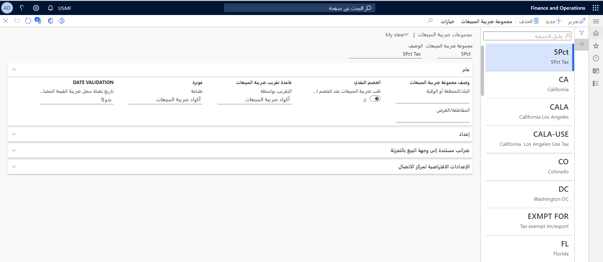
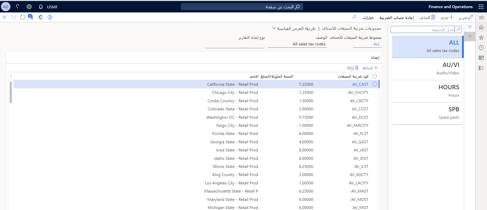

## مجموعات ضريبة المبيعات 

مجموعات ضريبة المبيعات هي مجموعات من أكواد ضريبة المبيعات المرفقة بالعملاء والموردين. كما يتم إرفاقها بحسابات دفتر الأستاذ الخاصة بالحركات التي لم يتم ترحيلها إلى المورد أو العميل. 
 
تشتمل مجموعه ضريبة المبيعات على كافة أكواد ضريبة المبيعات التي تنطبق عندما تقوم بتداول البضائع أو الخدمات مع العملاء والموردين.

تنطبق قواعد ضريبية مختلفة في معظم البلدان أو المناطق عند التداول مع العملاء المحليين والخارجيين. في الكثير من الأحيان، تنقسم القواعد الضريبية للتجارة الخارجية بناءً على اتفاقيات التجارة الثنائية والمتعددة الأطراف. وبالتالي، يجب عليك إنشاء مجموعات ضريبية بالاعتماد على الضرائب التي قد تنطبق على مجموعة معينة من العملاء أو الموردين. 

يعد التحليل الدقيق للأنواع المختلفة من العملاء والموردين ممن تتداول معهم الشركة بمثابة نقطة انطلاق جيدة لتحديد أنواع مجموعات ضريبة المبيعات المطلوبة وإعداد مجموعات ضريبة المبيعات هذه.

نظراً لأن الموقع الجغرافي للعميل أو المورد يحدد الضرائب، فإنك عادةً ما ستقوم بتعيين نفس مجموعة ضريبة المبيعات للشركاء التجاريين المشابهين في النظام. يتم إرفاق الأكواد الضريبية الصحيحة التي يستخدمها النظام بمجموعة ضريبة المبيعات هذه.

## مجموعات ضريبة المبيعات للأصناف 

علماً بأن الأصناف هي التي تحدد الضرائب بشكل عام، فأنت بحاجة إلى الإشارة إلى كيفية حساب الضرائب لكل صنف. 

مجموعات ضريبة مبيعات الصنف هي عبارة عن مجموعات من الأكواد الضريبية للمبيعات المرفقة بموارد مثل المنتجات.

تتضمن مجموعة ضريبة مبيعات الصنف جميع أكواد ضريبة المبيعات التي تنطبق عند بيع ذلك الصنف. قد تتضمن مجموعة ضريبة مبيعات الصنف أيضاً معظم أكواد ضريبة المبيعات في النظام. عند إنشاء مجموعات ضريبة مبيعات الصنف، فإنك تقوم بإرفاق المجموعة بالأصناف.

يتم تحديد ضرائب المبيعات التي تنطبق على معاملة معينة من خلال أكواد ضريبة المبيعات المضمنة في كل من مجموعة ضريبة المبيعات ومجموعة ضريبة مبيعات الصنف للحركة. يمكن حساب ضريبة المبيعات فقط إذا تم تحديد مجموعة ضريبة المبيعات ومجموعة ضريبة مبيعات الصنف لكل حركة تستلزم حساب أو تسجيل ضريبة المبيعات لها.

 

يجب أن تشتمل كل حركة تستلزم حساب ضريبة المبيعات لها وترحيلها على مجموعة ضريبة مبيعات ومجموعة ضريبة مبيعات صنف. 

ترتبط مجموعات ضريبة المبيعات بطرف الحركة (على سبيل المثال، العميل أو المورد)، بينما ترتبط مجموعات ضريبة مبيعات الصنف بمورد الحركة (على سبيل المثال، الصنف أو فئة الشراء). تشتمل مجموعات الضرائب على قائمة بأكواد الضرائب. تعتبر أكواد الضرائب الموجودة في كل من مجموعة ضريبة المبيعات ومجموعة ضريبة مبيعات الصنف لحركة بمثابة أكواد الضريبة التي تنطبق على تلك المعاملة.

شاهد هذا الفيديو للتعرف على كيفية إعداد مجموعات ضريبة المبيعات ومجموعات ضريبة مبيعات الصنف:
 
> [!VIDEO https://www.microsoft.com/videoplayer/embed/RE487o6]

