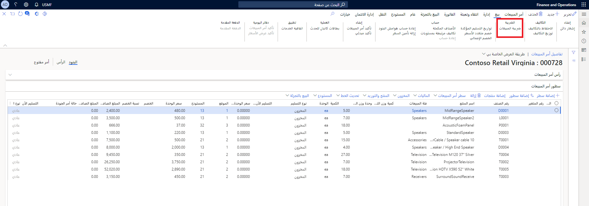

تحتاج في كل حركة (بنود مستند المبيعات/الشراء، ودفاتر اليومية، وما إلى ذلك)، إلى إدخال مجموعة ضريبة المبيعات ومجموعة ضريبة مبيعات للصنف لحساب ضريبة المبيعات. 

يتم تحديد المجموعات الافتراضية في البيانات الرئيسية (على سبيل المثال، العميل والمورد والبند وفئة التدبير)، ولكن يمكنك تغيير المجموعات يدوياً في إحدى الحركات، إذا لزم الأمر. تحتوي كلتا المجموعتين على قائمة بأكواد ضريبة المبيعات، ويحدد تقاطع قائمتين من أكواد ضريبة المبيعات قائمة أكواد ضريبة المبيعات القابلة للتطبيق على الحركة.

في كل حركة، يمكنك البحث عن ضريبة المبيعات المحسوبة بفتح صفحة **حركة ضريبة المبيعات**. يمكنك البحث عن ضريبة المبيعات لبند في مستند أو للمستند بأكمله.

بالنسبة لمستندات معينة (على سبيل المثال، فاتورة المورد ودفاتر اليومية العامة)، يمكنك ضبط ضريبة المبيعات المحسوبة إذا كان المستند الأصلي يعرض مبالغ غير صحيحة.

## مواعيد حساب الضريبة
تواجه العديد من البلدان والمناطق تعديلات منتظمة في معدلات الضرائب، ويمكن لمعدل الضريبة في النظام أن يمثل هذه التعديلات بدقة اعتماداً على تاريخ الشحن. توجد أربعة خيارات للتاريخ لتحديد معدل الضريبة المناسب: 

- تاريخ التسليم
- تاريخ الفاتورة
- تاريخ المستند
- تاريخ إيصال التعبئة

عند قيام المستخدمين بإنشاء إيصال تعبئة لبند أمر مبيعات، فإنهم سيحددون تاريخ إيصال التعبئة في الفاتورة، ويمكن للنظام استخدام هذا التاريخ لاستخراج معدل الضريبة من جدول قيمة كود الضريبة.

## حركة العكس
يمكنك وراثة معلومات الضريبة مثل أكواد الضريبة، وأسعار الضريبة، ومبلغ الضريبة من الحركات الأصلية على حركات العكس. كما يمكنك إعادة حساب الضريبة استنادًا إلى آخر إعداد للضريبة. يمكنك أيضًا بدء إعادة الحساب لتحديث معلومات الضريبة على حركات العكس، ما قد يحسّن من دقة التسوية في بعض السيناريوهات.

توريث معلومات الضريبة الأصلية مدعوم بواسطة الحركات التالية:

- أمر مبيعات – أمر الإرجاع
- أمر مبيعات - إشعار الدائن
- أمر التحويل – إلغاء
