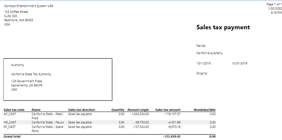

يتم تجميع الضرائب بشكل منتظم ويجب إبلاغ وكالة (هيئه ضريبة المبيعات) التي تتطلب تحصيل هذه الضرائب. وعادةً ما تكون الوكالات هي حكومات المحافظات أو الحكومات المحلية. 

ويجب الإبلاغ عن ضريبة المبيعات ودفعها إلى هيئات الضرائب على فترات منتظمة (شهرياً وربع سنوياً وهكذا). يوفر Dynamics 365 Finance الوظائف التي تتيح لك تسوية الحسابات الضريبية للفاصل الزمني وإزاحة الأرصدة إلى حساب تسوية الضريبة، كما هو محدد في مجموعات ترحيل دفتر الأستاذ. ويمكنك الوصول إلى هذه الوظيفة من خلال صفحة **تسوية ضريبة المبيعات وترحيلها**. 

## مراجعة الضرائب المستحقة لهيئة ضريبة المبيعات
عند تكوين ضريبة المبيعات بشكل صحيح، ستحصل الحركات على الضرائب المستحقة لكل كود ضريبة يتم تطبيقه. تحدد فترة التسوية المحددة في كود ضريبة المبيعات الفترات المطلوبة للتسوية ومن يقوم بدفع الضرائب التي تم تحصيلها لهذه العملية. 

قد تطلب الهيئات إجراء تسوية شهرية بينما قد يطلب البعض الآخر مدفوعات ربع سنوية. تتطلب كل هيئة فريدة وفترة تسوية تحديد فترة التسوية.

يحتوي النظام على صفحة استعلام يمكنك استخدامها لمراجعة كافة الحركات التفصيلية لكود الضريبة بشكل دوري. لعرض هذه الصفحة، انتقل إلى صفحة كود ضريبة المبيعات وحدد عنصر القائمة **كود ضريبة المبيعات**. بعد ذلك، حدد عنصر القائمة **ضريبة المبيعات المُرّحلة** في مجموعة **الاستعلامات**. يمكنك مراجعة الحركات الخاصة بكود ضريبة واحد أو كافة أكواد الضريبة. 
 
لتحديد المبلغ الذي يجب دفعه لهيئة ضريبة المبيعات لفترة تسوية معينة، انتقل إلى **الضريبة**، وحدد **الإقرارات** و **ضريبة المبيعات**، ثم حدد **تقرير ضريبة المبيعات لفترة التسوية**. لا ينشئ التقرير دفتر يومية أو يقوم بترحيله، بل يعرض المبلغ الذي سيتم دفعه فقط. تعرض لقطة الشاشة التالية نموذج للتقرير:

> [!div class="mx-imgBorder"]
> 

## تسوية الضرائب المستحقة لهيئة ضريبة المبيعات
يتم ربط هيئة ضريبة المبيعات بحساب مُورّد يتم استخدامه لإنشاء مدفوعات إلى هيئة ضريبة المبيعات. 

حدد عنصر القائمة **تسوية ضريبة المبيعات وترحيلها** من الوحدة النمطية للضريبة لإنشاء دفتر يومية وترحيله لتسوية الضرائب.

عند قيامك بتشغيل التسوية، يجب تحديد **فترة التسوية** و **تاريخ البدء** و **وتاريخ الحركة**. تاريخ الحركة هو اليوم الأخير من فترة التسوية. يصبح تاريخ الحركة هو تاريخ الاستحقاق للدفع لهيئة ضريبة المبيعات. يمكنك تشغيل تسوية أو تصحيحات أصلية إذا قمت بإجراء أي نوع من التغييرات التي تؤثر على الضرائب المستحقة. وعند إكمال العملية، ستتلقى تقرير التسوية وحركة المُورّد التي تسجل التزام المُورّد المرتبط بهيئة ضريبة المبيعات.
 
عند مراجعة حركات ضريبة المبيعات في صفحة **مدفوعات ضريبة المبيعات**، إذا كان لعمود **الإيصال** الخاص بحركة الضريبة يحتوي على قيمة، فهذا يعني أن الحركة قد تمت تسويتها وأنها متاحة لدفعها (أو تم دفعها بالفعل). لا يُظهر النظام أنه تم دفع الحركة. وبمجرد تسجيل الالتزام للتسوية، فإنها تظل في حساب المٌورّد لهيئة ضريبة المبيعات حتى يتم دفعها.

## دفع ضرائب المبيعات إلى هيئة ضريبة المبيعات
ويكون الدفع لهيئة ضريبة المبيعات مثل الدفع لأي مُورّد. وتسجل الحركة الموجودة في حساب المُورّد التزام ضريبية المبيعات. إذا قمت بإنشاء اقتراح دفع، فسيتم تحديد هذه الحركة للدفع. يمكنك الدفع لهيئة ضريبة المبيعات بالإضافة إلى المُورّدين الآخرين.

