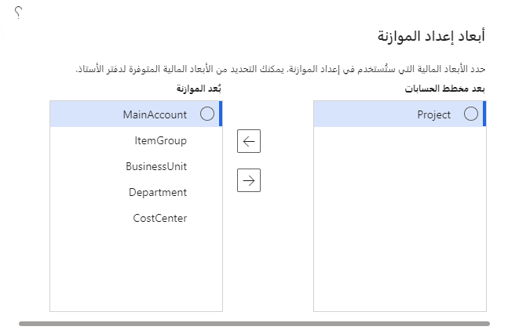
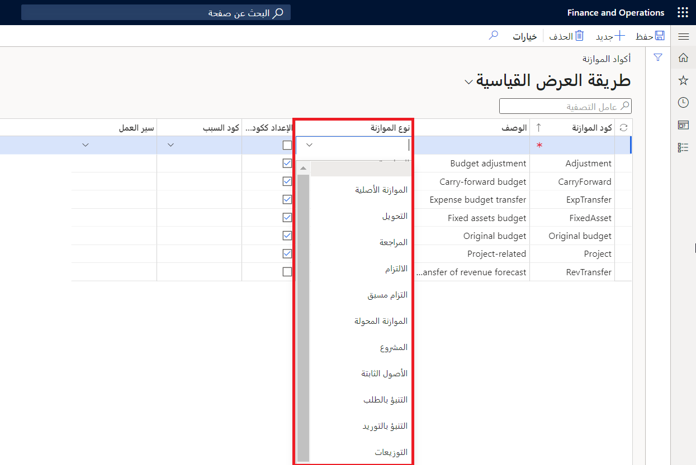
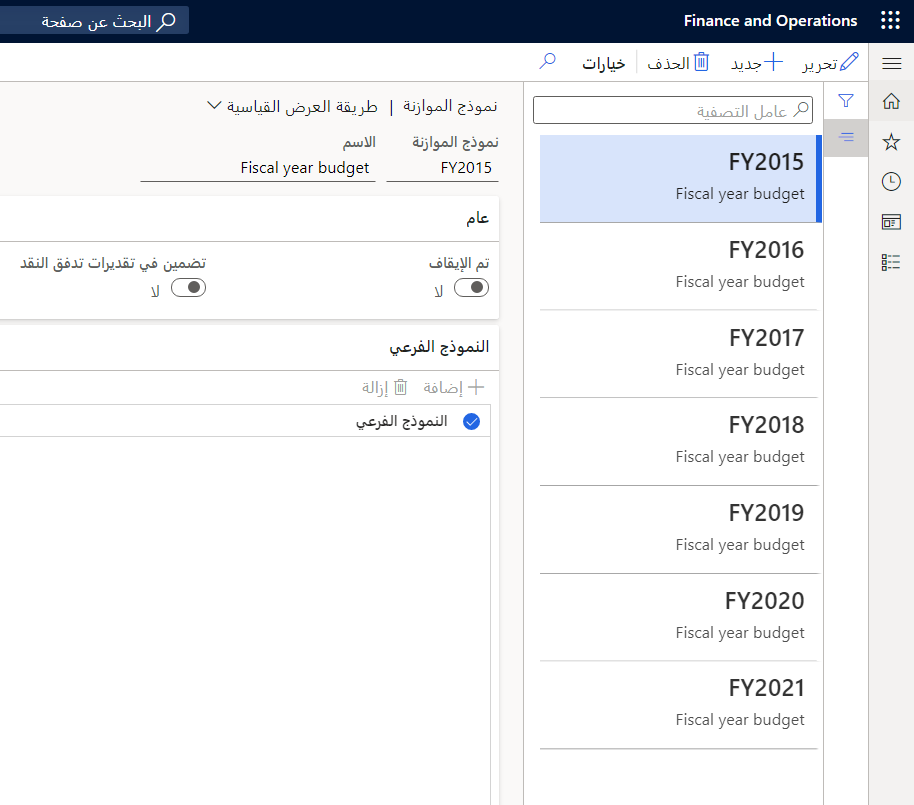
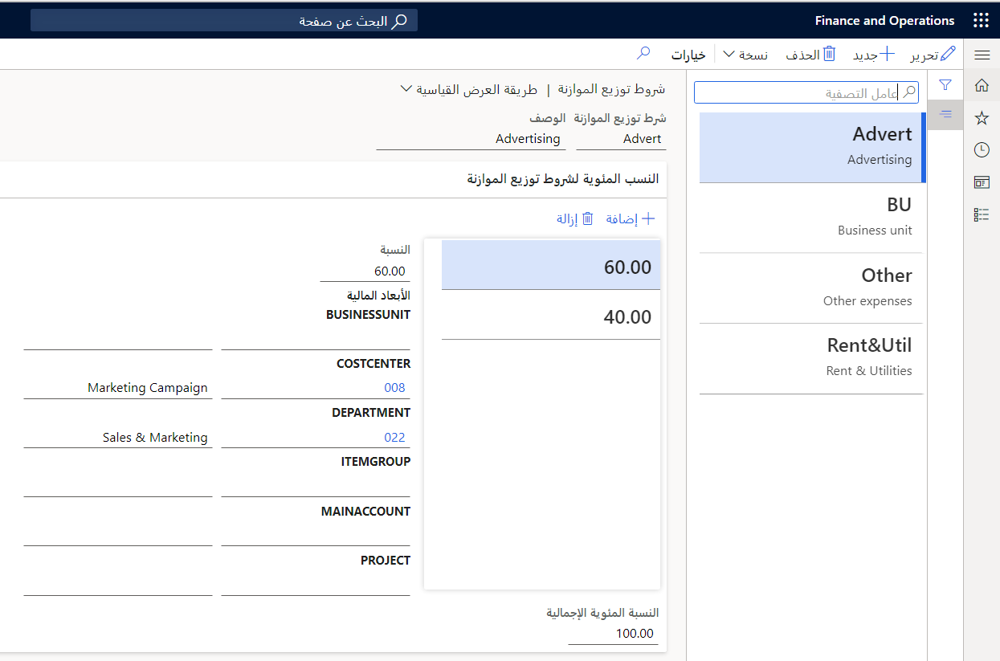

شاهد هذا الفيديو للتعرف على كيفية تكوين إعداد الموازنات الأساسية:

> [!VIDEO https://www.microsoft.com/videoplayer/embed/RE4blBJ] 

عند تكوين إعداد الموازنة، ابدأ في صفحة **إعداد الموازنة > الإعداد > تخطيط الموازنة > محددات إعداد الموازنة** . في هذه الصفحة، يمكنك تحديد دفتر يومية الموازنة والتسلسل الرقمي لإدخالات سجل الموازنة والسلوك الافتراضي في مساحات العمل.

وبعد ذلك، إذا كانت توجد سياسات تحكم اعتماد إدخالات سجل الموازنة، استناداً إلى نوع الموازنة (على سبيل المثال، تحويلات أو مراجعات)، فإنك تحتاج إلى إنشاء مهام سير عمل لإدخال سجل الموازنة في صفحة **عمليات سير عمل إعداد الموازنة** . إذا حدثت سيناريوهات يمكن فيها السماح بالتحويلات بدون اعتماد سير العمل، فيمكنك تحديد قواعد تحويل الموازنة لدعم تلك السيناريوهات.

استخدم الصفحة **أبعاد إعداد الموازنة** لتحديد الأبعاد المالية في بنى الحساب المرتبطة بمخطط الحسابات المتوفرة لإعداد الموازنة.

قد لا تحدد بعض المؤسسات أبعاداً مالية معينة، بما في ذلك الحساب الرئيسي لإعداد الموازنة، والذي قد يوفر مزيداً من المرونة. على سبيل المثال، قد تكون لبنية الحساب الخاصة بمخطط الحسابات الأبعاد المالية: القسم ومركز التكلفة والحساب الرئيسي. إذا حددت البُعدين الماليين القسم ومركز التكلفة لإعداد الموازنة، فيمكن للأقسام ومراكز التكلفة احتجاز مبالغ الموازنة بصرف النظر عن الحساب الرئيسي المستخدم.

في الصفحة **أبعاد إعداد الموازنة** ، حدد الأبعاد المالية المستخدمة لإعداد الموازنة استناداً إلى الأبعاد المستخدمة في مخطط الحسابات. يمكنك تحديد جميع الأبعاد المالية أو مجموعة فرعية منها لإعداد الموازنة.

حدد نموذج موازنة يتوافق مع جميع الموازنات أو بعضها.
يمكنك استخدام نموذج موازنة مفرد لجميع إدخالات سجل الموازنة.
وبدلاً من ذلك، يمكنك إنشاء نماذج منفصلة تستند إلى نوع الموازنة أو الموقع الجغرافي أو طريقه أخرى يمكن من خلالها تصنيف الموازنة.

في حالة استخدام التحكم في الموازنة، يمكنك إقران نموذج موازنة واحد فقط بنطاق زمني لدورة موازنة معين.

أنشئ **أكواد موازنة**  تحدد نوع حركات الموازنة المراد تسجيلها وأي عمليات سير عمل مرتبطة. يمكن أن تدعم أكواد الموازنة أنواع الموازنة التالية:

-   الموازنة الأصلية
-   التحويل
-   المراجعة
-   الالتزام
-   التزام مسبق
-   الموازنة المحولة

تتيح لك أكواد الموازنة الحصول على سجل مراجعة لتعديلات الموازنة المعتمدة طوال دورة الموازنة. إذا كان سير العمل مرتبطاً بكود موازنة، فسيتم تمكينه لجميع إدخالات سجل الموازنة التي تستخدم كود الموازنة هذا، وسيكون عليك إكمال خطوات سير العمل قبل أن يستطيع إدخال سجل الموازنة الوصول إلى مرحلة "مكتمل".
 

يمكنك أيضاً إعداد **قواعد تحويل الموازنة** اختيارياً. لاستخدام قواعد تحويل الموازنة، حدد **استخدام القواعد لتحويلات الموازنة** في صفحة **محددات الموازنة** . عند استخدام قواعد تحويل موازنة، إذا أنشأ مستخدم مستنداً باستخدام كود موازنة من نوع "التحويل"، فلن يتم تحديث أرصدة الموازنة في حالة خرق قواعد تحويل الموازنة. على سبيل المثال، يمكنك السماح بمستندات تحويل الموازنة حيث يتم تحويل موازنة المصروفات بين الحسابات الرئيسية لقسم المبيعات والتسويق، ولكن يمكنك منع تحويل الموازنة من هذا القسم أو إليه إلا إذا مُنح اعتماد سير العمل لهذا النوع من إدخال حساب الموازنة.

يمكنك استخدام صفحة **نماذج الموازنة** لإنشاء نماذج موازنة متنوعة.
يمكنك استخدام نموذج موازنة واحد لجميع الموازنات أو بعضها، أو يمكنك إنشاء نموذج موازنة لكل موازنة.

يمكن أن يحتوي نموذج الموازنة على العديد من النماذج الفرعية، والتي يتم إرفاقها بنموذج الموازنة على علامة التبويب السريعة **النموذج الفرعي**. على سبيل المثال، يمكنك إنشاء موازنة تشتمل على نماذج فرعية تمثل مختلف أقسام الكيان القانوني.

لا يمكن أن تحتوي نماذج الموازنة التي تُستخدم كنماذج فرعية على نماذج فرعية أخرى.
أيضاً، إذا كنت تستخدم التحكم في الموازنة، فلا يمكنك استخدام نماذج الموازنة التي لها نماذج فرعية.

في صفحة **قواعد** **تحويل الموازنة**، يمكنك تحديد قواعد تحويل الموازنة لتحديد متى يُسمح بتحويلات الموازنة بين قيم الأبعاد المالية.

على سبيل المثال، قد يتم السماح بعمليات تحويل الموازنة في قسم محدد بدون اعتماد، ولكن قد تلزم مراجعة التحويلات عبر الأقسام واعتمادها قبل تعديل رصيد الموازنة. في حالة إرسال إدخال سجل موازنة وكان يخالف قواعد تحويل الموازنة، لا يمكن استكمال التحويل إلا إذا تم اعتماده من خلال سير عمل إعداد موازنات.

تتطلب بعض المؤسسات اعتماد إدخالات سجل الموازنة وإدخالات حساب الموازنة بواسطة مستخدم آخر غير الشخص الذي أدخلها. ويمكنك طلب اعتماد يدوي أو اعتماد سير العمل أو عدم اعتماد إطلاقاً. في حالة استخدام التحكم في الموازنة، يمكنك إعداد مهام سير العمل بحيث يعتمد مدير موازنة الإدخالات.

كما يمكنك أيضاً إعداد قواعد تحويل الموازنة للعمل مع عمليات سير عمل إعداد الموازنة. على سبيل المثال، يمكنك إعداد قاعدة تحويل موازنة للسماح بعمليات تحويلات الموازنة داخل الأقسام فقط. بعد تحديد قاعده تحويل الموازنة، يمكنك إنشاء سير عمل لتوجيه تحويل موازنة إلى مستخدم معين لاعتماده لعمليات تحويل الموازنة بين الأقسام.

يمكنك استخدام الصفحة **شروط توزيع الموازنة** لتحديد قيم الأبعاد المالية والنسب المئوية التي ستُستخدَم لإنشاء توزيعات في إدخالات حساب الموازنة لإدخالات سجل الموازنة.
ويعد هذا إجراءً اختيارياً لإعداد الموازنة.

 

توفر شروط توزيع الموازنة طريقة تلقائية لتوزيع النسب المئوية لمبالغ الموازنة عبر قيم الأبعاد المالية. على سبيل المثال، يمكن توزيع موازنة سفر للأقسام التي لها إدخال حساب موازنة واحد.
