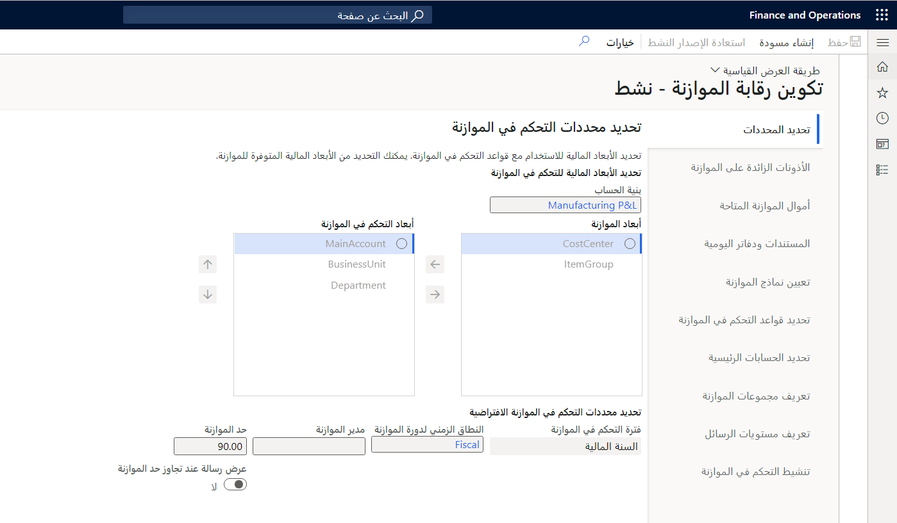
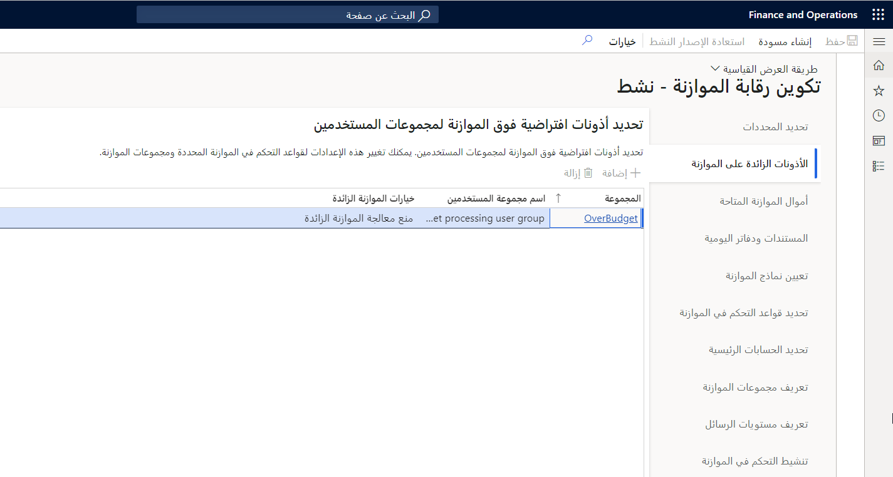
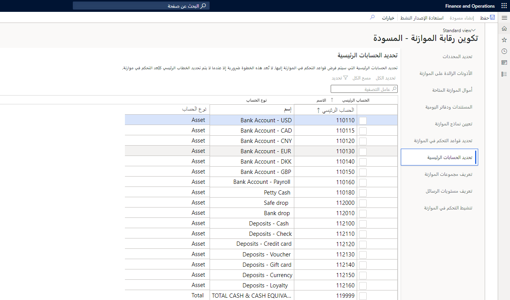
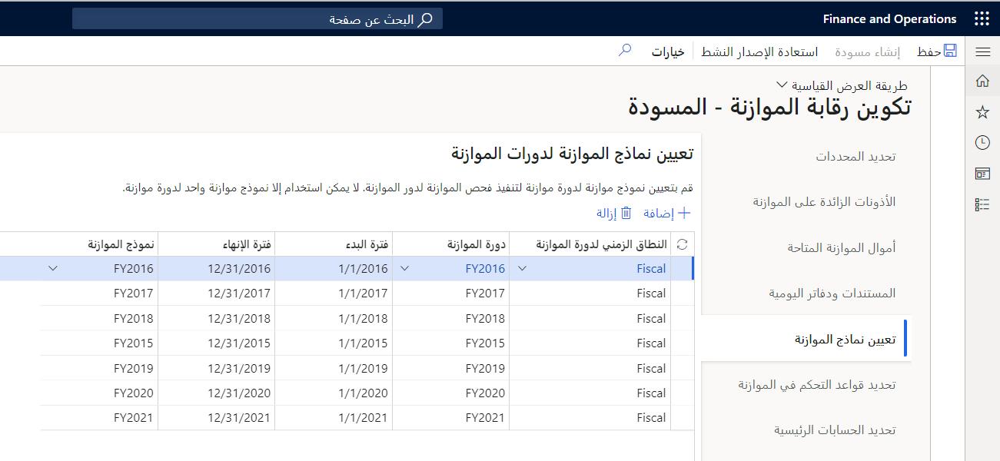
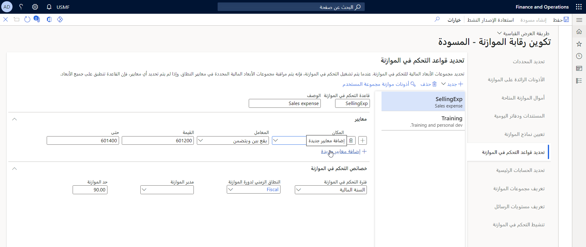

في نهاية هذه الوحدة، يعرض الفيديو الجزء الأول من تكوين التحكم في الموازنة.

تتضمن عملية تكوين التحكم في الموازنة الخطوات التالية:

-   قم بتحديد معلمات التحكم في الموازنة.
-   حدد أذونات الموازنة الزائدة.
-   حدد أموال الموازنة.
-   حدد المستندات وحركات الأعمال التي تتطلب فحص الموازنة.
-   حدد نماذج الموازنة.
-   حدد قواعد التحكم في الموازنة.
-   قم بتعريف أذونات المستخدم.

## ضع في الاعتبار السيناريو التالي

قررت Sabrina، باعتبارها المراقب، تنفيذ التحكم في الموازنة داخل الشركة. فهي تحدد المستندات ودفاتر اليومية المصدر التي يجب أن تستخدم التحكم في الموازنة وتعريف الحساب المتوفر لأموال الموازنة والأبعاد المالية التي تخضع لفحص الموازنة. كما يتعين عليها أيضاً تحديد المستخدمين، إن وجدوا، الذين يمكنهم تجاوز الميزانية.

اعتماداً على كيفية تكوين التحكم في الموازنة، يمكن منع المستندات المصدر ودفاتر اليومية المحاسبية من المعالجة الإضافية عندما يشير فحص الموازنة إلى عدم توفر المبالغ التي تمت موازنتها.

قم بإعداد الموازنة الأساسية قبل تكوين التحكم في الموازنة. إذا كنت تخطط لاستخدام مهام سير عمل إعداد الموازنة، فقم بإنشاء مهام سير العمل وتعيينها لأكواد الموازنة عند إعداد الموازنة الأساسية. قم بإعداد تكوين مراقبة الموازنة قبل البدء في إرسال إدخالات سجل الموازنة.

يوفر تكوين التحكم في الموازنة إصداراً نشطاً وإصدار مسودة. يمكنك تعديل إصدار المسودة عند تشغيل الإصدار النشط وسريان التحكم في الموازنة. يمكنك تحديد **استعادة من نشط** في أي وقت عند العمل في إصدار تمهيدي. ومع ذلك، إذا قمت بتحديد **استعاده من نشط**، فستفقد جميع التغييرات التي تم إجرائها في إصدار المسودة. إذا كان تكوين التحكم في الموازنة نشطاً، حدد **تحرير** لتعديل تكوين التحكم في الموازنة.

## النطاق الزمني لدورة الموازنة

يحدد النطاق الزمني لدورة الموازنة طول دورة الموازنة. ترتبط دورات الموازنة بالفترات الموجودة في التقويم المالي ويمكن مشاركتها عبر الكيانات القانونية. تحدد دورات الموازنة فترات البدء والانتهاء للتحكم في الموازنة. يمكنك تعيين النطاق الزمني لدوره الموازنة إلى سنه مالية، أو يمكنك تحديد عدد الفترات لجزء من السنة المالية أو لمد السنوات المالية.

يمكنك تعيين نموذج موازنة لدورة الموازنة لإجراء فحص الموازنة لدورة الموازنة. يمكن استخدام نموذج موازنة واحد فقط لدورة الموازنة. يتم إجراء فحص الموازنة عندما يكون التاريخ المحاسبي للمستند المصدر أو دفتر يومية المحاسبة الذي تم تمكينه للتحكم في الموازنة في دورة الموازنة.

بعد تكوين إعداد الموازنة الأساسي، يمكنك تحديد الوقت أو فترات البدء والانتهاء لإعداد الموازنة والتحكم في الموازنة في صفحة **النطاق الزمني لدورة الموازنة** . تتوافق دورات الموازنة غالباً مع التقويمات المالية ولكن يمكن أن تمتد إلى السنوات المالية.

يتم إكمال الخطوات التالية في التكوين في علامات التبويب المختلفة في صفحة **إعداد الموازنة > إعداد > التحكم في الموازنة > تكوين التحكم في الموازنة** .

## تحديد المعلمات

استناداً إلى الأبعاد المالية التي تم تمكينها للموازنة، يمكنك استخدام كافة الأبعاد المالية للتحكم في الموازنة أو مجموعة فرعية منها.

بالإضافة إلى ذلك، يمكنك تحديد الفاصل الزمني الافتراضي (على سبيل المثال، **السنة المالية** أو **السنة المالية إلى تاريخه** أو **الفترة المالية** أو **ربع سنوي**) التي سيتم إجراء التحكم في الموازنة لها في النطاق الزمني لدورة الموازنة المرتبطة. يمكنك أيضاً تحديد مدير موازنة افتراضي والحد الذي يتم استخدامه لإعلام المستخدمين عند الوصول إلى الحد الفاصل. سيتم استخدام القيم الموجودة في هذه الحقول كقيم افتراضية في أي قاعدة جديدة للتحكم في الموازنة أو مجموعة موازنة تم إنشاؤها. ومع ذلك، يمكن تغيير القيم الافتراضية للمجموعات الفردية أو القواعد.

تساعد الطرق التي يتم بها إنشاء الموازنات وتسجيلها في سجل الموازنة في تحديد الفترة الزمنية التي يتم تحديدها عند تقييم أموال الموازنة المتاحة. إذا تم تطوير واستخدام مبلغ سنوي لمجموعة قيم الأبعاد، فقد يكون الأسلوب الخاص بالسنة المالية أو السنة المالية إلى تاريخه منطقياً. ومع ذلك، إذا كانت المؤسسة التي تقوم بإنشاء موازنات حسب الفترة المالية أو تخصيصها للفترات المالية تريد تحكماً أكثر تفصيلاً، فقد تحتاج إلى الوضع في الاعتبار الفترة المالية أو الزمنية التي تمتد إلى تاريخ ربع سنوي.

بالإضافة إلى ذلك، تساعد ثقافة المؤسسة، والتي تتعلق بإعداد الموازنة والتحكم في الموازنة، في تحديد التكوين.

##  الأذونات الزائدة على الموازنة

في علامة التبويب **الأذونات الزائدة على الموازنة** ، يمكنك تحديد مجموعات المستخدمين. يمكنك أيضاً تحديد ما إذا كان لدى المستخدمون الأعضاء في مجموعة إذن تجاوز الموازنة. يمكنك منع المستخدمين من تجاوز الميزانية بعد حد الميزانية الذي تم تعيينه في صفحة **معلمات الموازنة** ، أو يمكنك منعهم من تجاوز الموازنة بأي مبلغ، بغض النظر عن الحد. استناداً إلى مدي تمكن المؤسسة من إدارة الإنفاق، يمكن لهذه الأذونات مساعدتها في إدارة الموارد المالية الخاصة بها.

## تحديد الحسابات الرئيسية

إذا لم يتم تحديد **الحساب الرئيسي** كبُعد للتحكم في الموازنة في صفحة **تحديد المعلمات** ، ولكن تتم إدارة نفقات محددة، فيمكنك تحديد تلك النفقات في علامة التبويب **تحديد الحسابات الرئيسية** . إذا تم تحديد **الحساب الرئيسي** كبعد للتحكم في الموازنة، فلا تلزم أية إدخالات.

## تعيين نماذج الموازنة

في علامة التبويب **تعيين نماذج الموازنة** ، يمكن تعيين نماذج الموازنة إلى نطاقات الوقت الخاصة بدورة الموازنة التي يجب تضمينها في التحكم في الموازنة.

## تحديد قواعد التحكم في الموازنة

في علامة التبويب **تحديد قواعد التحكم في الموازنة** ، يمكنك إنشاء قواعد محددة استناداً إلى الأبعاد المالية التي تم تمكينها للتحكم في الموازنة.

يلزم توفر قواعد التحكم في الموازنة من أجل التحكم في الموازنة. فهي تحدد مجموعات قيم الأبعاد المالية الخاصة بالتحكم في الموازنة. إذا قمت بتحديد الأبعاد المالية للقسم ومركز التكلفة للتحكم في الموازنة، فيمكنك تحديد قواعد لمجموعات محددة من الأقسام ومراكز التكلفة التي تخضع للتحكم في الموازنة.

علي سبيل المثال، يمكنك تحديد القسم = المبيعات ومركز التكلفة = \*، حيث تكون علامة النجمة (\*) هي حرف بدل يتضمن أي مركز تكلفة.

على سبيل المثال، إذا كان هناك تركيز على النفقات أو نطاق النفقات لقسم ما، فيمكنك استخدام الإعدادات الموجودة في علامة التبويب هذه لتحديد هذه النفقات وتقييمها. يمكنك تحديد حدود مختلفة لكل قاعدة تحكم في الموازنة.

لا يُسمح بالمعايير في قاعدتين أو أكثر تغطي نفس قيم الأبعاد المالية. إذا تم تمكين كافة مجموعات قيم الأبعاد المالية للتحكم في الموازنة، فيمكنك تحديد قاعدة التحكم في الموازنة بدون معايير.

يتم التحقق من صحة قواعد التحكم في الموازنة مقابل حسابات دفتر الأستاذ المستخدمة في التوزيعات المحاسبية للمستند المصدر ودفاتر يومية المحاسبة. إذا كانت الأبعاد المالية في حسابات دفتر الأستاذ مطابقة للأبعاد المالية في قواعد التحكم في الموازنة، فسيحدث فحص الموازنة.

سيتم تمكين التحكم في الموازنة لأي حساب رئيسي من نوع **الأرباح والخسائر** أو **المصروفات** أو **الميزانية العمومية، الالتزام، حق الملكية** أو **الأصل** . إذا كانت علامة التبويب هذه تحتوي على قاعدة بها معايير فارغة، فسيتم تمكين التحكم في الموازنة لكافة مجموعات الأبعاد المالية التي تتضمن الحسابات الرئيسية من تلك الأنواع. لذلك، تأكد من إنشاء قواعد التحكم في الموازنة التي تقوم بتعريف نطاقات مجموعات الأبعاد المالية فقط حيث يكون من المهم القيام بتشغيل التحكم في الموازنة.

شاهد هذا الفيديو للتعرف على كيفية تكوين التحكم في الموازنة - الجزء 1:

> [!VIDEO https://www.microsoft.com/videoplayer/embed/RE4bod4]
