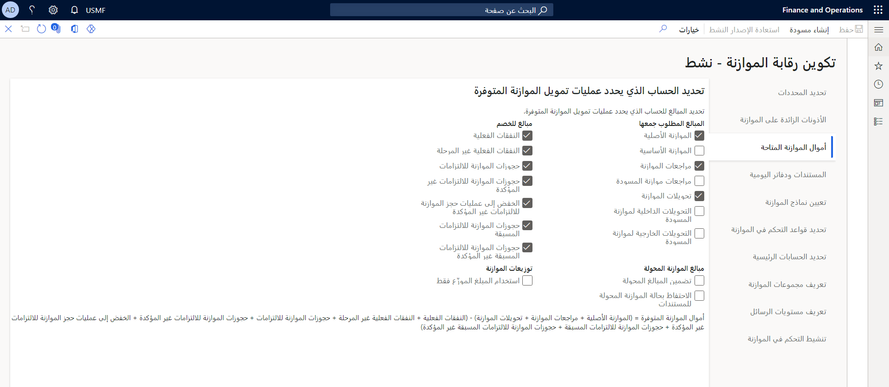
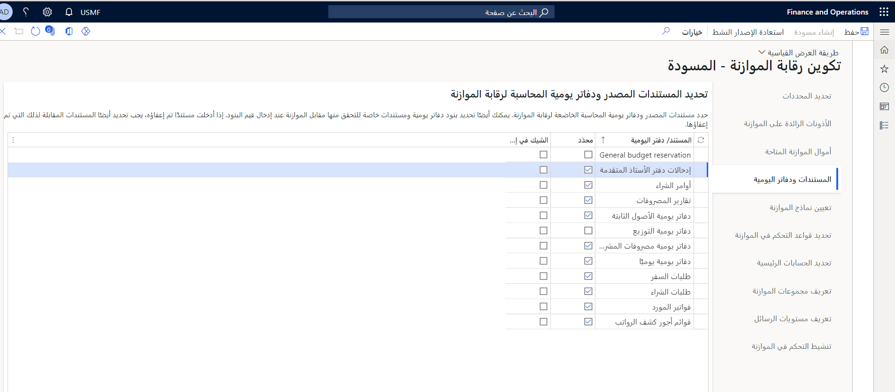
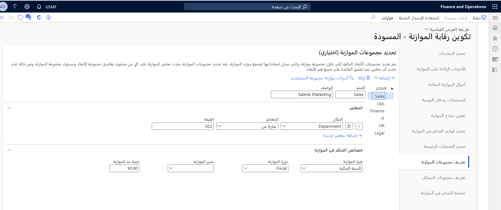
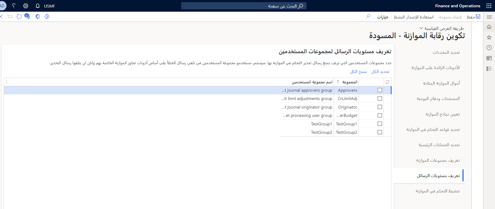
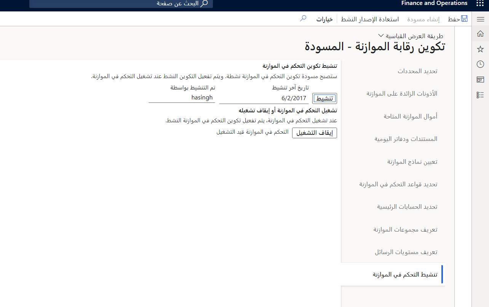

تتابع هذه الوحدة خطوات تكوين رقابة الموازنة‬ في Finance. ويوجد في نهاية هذه الوحدة مقطع فيديو يوضح هذه الخطوات.

## أموال الموازنة المتاحة

في علامة التبويب  **أموال الموازنة المتاحة** ، يمكنك تحديد الصيغة المستخدمة لحساب أموال الموازنة المتاحة. استناداً على مدى تحفظ المؤسسة في إدارة مواردها المالية، أو اعتماداً على اللوائح أو متطلبات الصناعة، يمكن أن يتضمن الحساب مسودات أو مستندات غير مُرَحلة.

إذا تم تعديل الحساب أثناء دورة الموازنة، فلن تؤثر التغييرات على أي مستندات تم اجتيازها في السابق عمليات التحقق فيما يخص رقابة الموازنة وتم ترحيلها أو إكمالها.

## المستندات ودفاتر اليومية

في علامة التبويب  **المستندات ودفاتر اليومية** ، يمكنك تحديد المستندات ودفاتر اليومية المصدر التي ستخضع لفحوصات رقابة الموازنة، وما إذا كانت ستحدث عمليات التحقق على مستوى إدخال السطر أو المستند بأكمله .

يجب أن تتطابق المستندات المصدر التي تم تحديدها مع خانات الاختيار للأرصدة التي تم تضمينها في حساب أموال الموازنة المتاحة. على سبيل المثال، إذا حددت  **حجوزات الموازنة الخاصة بالالتزامات**، يجب عليك تحديد خيار  **أوامر الشراء**. عند إجراء التحقق من الموازنة للمبالغ والحسابات في بند الشراء، فإن فئة رقابة الموازنة التي تم تعيينها للحجز هي  **التزام**. عند إجراء التحقق من الموازنة للمبالغ والحسابات في طلب الشراء، فإن فئة رقابة الموازنة التي تم تعيينها للحجز هي  **التزام مسبق**.

إذا تم تضمين  **حجوزات الموازنة الخاصة بالالتزام** و/أو  **حجوزات الموازنة الخاصة بالالتزام المسبق** في حساب أموال الموازنة المتاحة ويجب أن تنعكس من خلال الترحيلات في دفتر الأستاذ العام، ويجب تمكين محاسبة الالتزام في صفحة  **معلمات دفتر الأستاذ العام** .

## تعريف مجموعات الموازنة

في علامة التبويب  **تعريف مجموعات الموازنة** ، يمكنك تحديد مجموعات فريدة من الأبعاد المالية بشكل اختياري حيث يتم تجميع موارد الموازنة لإجراء عملية التحقق الثانوية للموازنة.

في علامة التبويب **تعريف مجموعات الموازنة** في صفحة **تكوين رقابة الموازنة**، يمكنك تحديد مجموعات موازنة اختيارية لتشكيل تجميع موازنة، أو مجموعة من قيم الأبعاد المالية الخاصة بميزانياتها التي سيتم تجميعها لإجراء عملية التحقق الثانوية للموازنة. دائماً، يتم التحقق من مجموعات الأبعاد المالية الموجودة في قاعدة رقابة الموازنة لمبالغ الموازنة. كما أنه إذا تم العثور على مجموعة أبعاد مالية في مجموعة موازنة، فسيتم إجراء تحقق ثانٍ للموازنة على مستوى مجموعة الموازنة.

يمكنك إنشاء سجل واحد يتضمن المؤسسة بأكملها، أو يمكنك تحديد مجموعات متعددة لتمثيل الأقسام الفردية أو مراكز التكلفة.
 

يمكن تحديد العديد من المعايير لمجموعه موازنة. تستخدم كافة المعايير لتحديد مجموعات الأبعاد المالية لمجموعه الموازنة. لا يُسمح بالمعايير المتداخلة عبر مجموعات الموازنة وأعضاء مجموعة الموازنة.

لإجراء عملية التحقق الثانوية للموازنة، ينبغي تعيين الخيار **تجاوز الموازنة** للإعداد **التحقق من مجموعة الموازنة** في صفحة **أذونات موازنة مجموعة المستخدم** الخاصة برقابة الموازنة إلى **تنفيذ فحص مجموعة الموازنة عندما تكون أرصدة الموازنة غير متاحة**.

إذا كان أحد المستخدمين ينتمي إلى عدة مجموعات مستخدمين وقمت بتحديد مجموعة مستخدم واحدة تتضمن المستخدم، فلن يتم عرض رسائل تحذير لهذا المستخدم.

## تعريف مستويات الرسائل

إذا كان يجب منع رسائل تحذير رقابة الموازنة لأي مجموعة مستخدمين، فيمكنك تحديد هذه المجموعات في صفحة  **تعريف مستويات الرسائل** . سيستمر أعضاء مجموعات المستخدمين في تلقي رسائل الخطأ عندما يتجاوزون أموال الموازنة المتاحة، بناءً على أذونات تجاوز الميزانية الخاصة بهم.

## تنشيط رقابة الموازنة

بعد تكوين رقابة الموازنة، يمكنك تشغيلها وتنشيطها في علامة التبويب  **تنشيط رقابة الموازنة** . سيصبح إصدار المسودة ساري النفاذ بعد ذلك.

بعد تشغيل رقابة الموازنة وتنشيطها، وبعد ترحيل الحركات، لا يجوز إيقاف تشغيلها في منتصف العام. عند إيقاف تشغيل رقابة الموازنة، لا يتم تسجيل الأنشطة لأغراض رقابة الموازنة، ولا يتم إجراء عمليات التحقق فيما يتعلق بالموازنة بعد الآن. لذا، قد لا تعكس المستندات التي تم ترحيلها بالفعل بشكل صحيح أي مبالغ أو أرصدة إعفاء في الاستعلامات والتقارير المتعلقة برقابة الموازنة.
ويتضمن ذلك إحصائيات رقابة الموازنة لأي مستندات أو دفاتر يومية أو تعديلها.

ضع في اعتبارك أن الحركات - بما في ذلك إدخالات سجل الموازنة التي تم ترحيلها قبل تشغيل رقابة الموازنة - لا تؤخذ في الاعتبار فيما يخص رقابة الموازنة. لذا، فمن الجيد تشغيل رقابة الموازنة فقط في بداية دورة موازنة جديدة. تأكد من أن إدخالات سجل الموازنة التي تحتوي على أرصدة بداية الموازنة لرقابة الموازنة قد تم تحديث أرصدة الموازنة الخاصة بها فقط بعد تشغيل رقابة الموازنة. سيتم التحقق من أي مستند مفتوح (على سبيل المثال، أمر شراء) بحثاً عن أموال الميزانية المتاحة وسيحصل على حجز ميزانية لرقابة الموازنة عند قيام المستخدم بتشغيل التحقق من رقابة الموازنة في المستند يدوياً.

لاحظ أن صيانة بيانات رقابة الموازنة يمكنها معالجة إدخالات سجل الموازنة إذا لم يتم تشغيل الرقابة أثناء الترحيل.

شاهد الفيديو التالي للتعرف على الجزء الثاني من تكوين رقابة الموازنة:

> [!VIDEO https://www.microsoft.com/videoplayer/embed/RE4blBK] 
