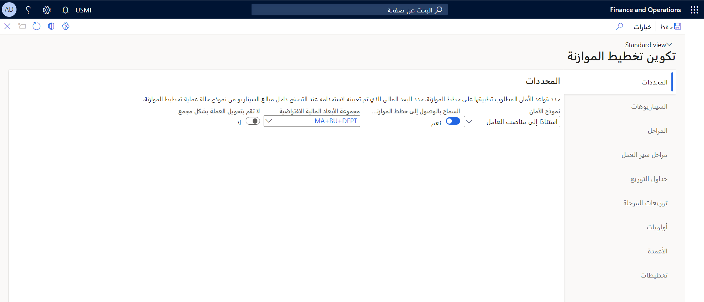
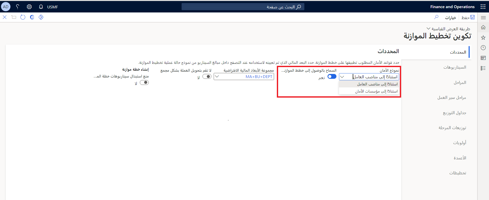
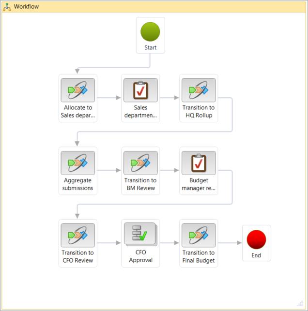
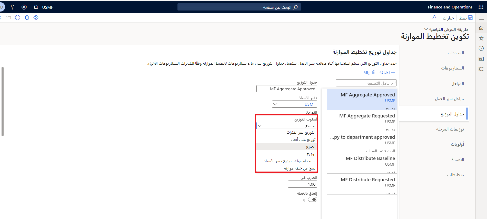
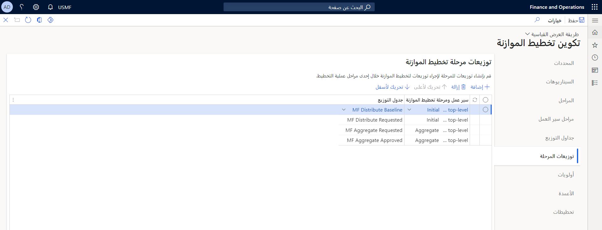
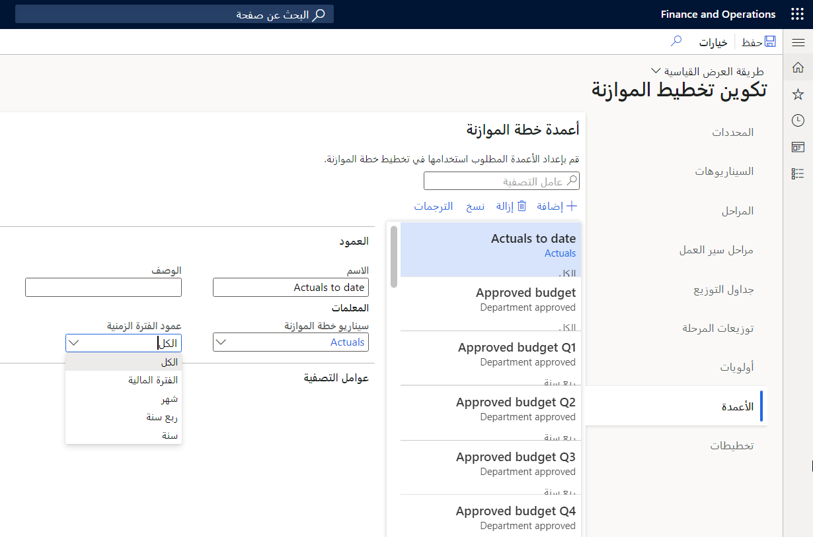
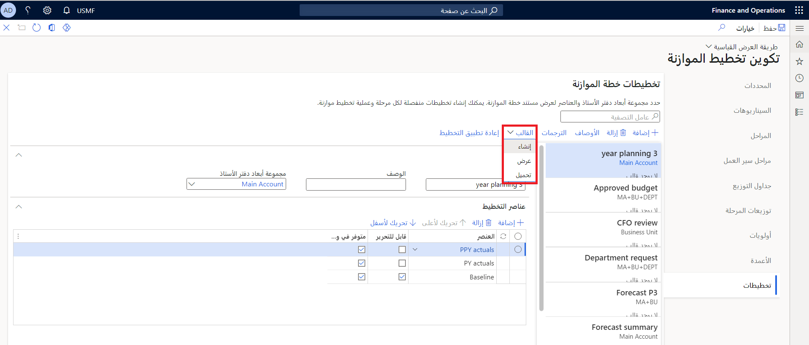
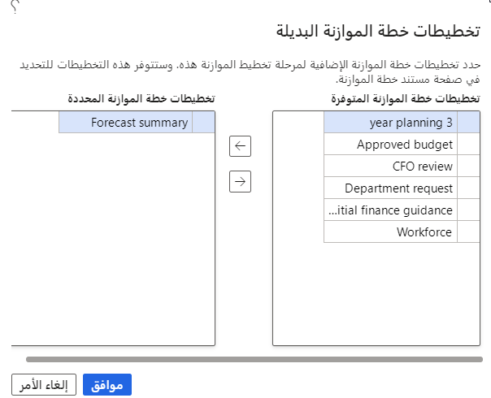

تحتوي صفحة  **تكوين تخطيط الموازنة** على معظم الإعدادات التي تحتاجها لإعداد تخطيط الموازنة. تصف الأقسام التالية بعض العوامل الرئيسية التي يجب مراعاتها عند تكوين تخطيط الموازنة. بعد الانتهاء من التكوين، يمكنك إعداد عمليات تخطيط الموازنة. يمكنك عرض تكوين تخطيط الموازنة والحفاظ عليه بالانتقال إلى **إعداد الموازنة > الإعداد > تخطيط الموازنة > تكوين تخطيط الموازنة.**

 

## إنشاء مخطط تخطيط الموازنة

الخطوة الأولى الاختيارية، ولكن موصى بها، هي إنشاء مخطط تخطيط موازنة يعرض إجراءات مؤسستك الخاصة بصياغة الميزانية. يمكنك استخدام أي طريقة تريدها لإنشاء هذا المخطط.

## التدرج الهرمي للمؤسسات لتخطيط الموازنة

في صفحة  **أغراض التدرج الهرمي للمؤسسات** ، في **إدراة المؤسسات > المؤسسات > أغراض التدرج الهرمي للمؤسسات**، يمكنك تعيين التدرج الهرمي للمؤسسات كتدرج هرمي لتخطيط الموازنة لكل عملية تخطيط موازنة. لا يلزم أن يتطابق التدرج الهرمي لتخطيط الموازنة مع التدرج الهرمي للمؤسسات القياسي الذي يتم استخدامه لأغراض أخرى.

نظراً لاستخدام هذا التدرج الهرمي لتجميع البيانات وتوزيعها، فقد ترغب في أن يكون له بنية مختلفة. في مخطط المثال، تقع أقسام المبيعات ضمن مستوى المقر الرئيسي الذي يتضمن أقسام الموازنة والتمويل. من المحتمل أن يختلف هذا الهيكل عن الهيكل المستخدم لإدارة عمليات أقسام المبيعات.
يمكن تعيين تدرج هرمي واحد فقط للمؤسسات لكل عمليه تخطيط موازنة.

يجب تعيين التسلسل الهرمي لغرض **تخطيط الميزانية** في صفحة **أغراض التدرج الهرمي للمؤسسة**.
‎ [‎‎‎](../media/budget-plan-purpose.gif#lightbox)‎‎

## أمن المستخدم

يمكن أن يتبع تخطيط الميزانية أحد نموذجي الأمان لتحديد أذونات المستخدم. لتحديد نموذج الأمان، قم بالوصول إلى **إعداد الموازنة > الإعداد > تخطيط الموازنة** لتعيين معلمة تخطيط موازنة في صفحة  **تكوين تخطيط الموازنة** .

## مراحل سير عمل تخطيط الموازنة

تُستخدم مهام سير عمل تخطيط الموازنة مع مهام سير عمل إعداد الموازنة لإدارة إنشاء خطط الموازنة وتطورها.

يتكون سير عمل تخطيط الموازنة من مجموعة مرتبة من المراحل التي تنتقل إليها خطة الموازنة. يرتبط كل سير عمل لتخطيط الموازنة بسير عمل إعداد الموازنة. تعد مهام سير عمل إعداد الموازنة أحد أنواع سير العمل المستخدمة في Finance.

لاحظ أنه يجب أن تكون هناك مهام سير عمل انتقالية لمرحلة n-1 لسير عمل إعداد الموازنة للتنقل بين المراحل. على سبيل المثال، إذا كانت هناك 6 مراحل، فيجب أن تكون هناك انتقالات من 5 مراحل.

يقوم سير عمل إعداد الموازنة بتوجيه خطط الموازنة، جنباً إلى جنب مع أوراق العمل والمبررات والمرفقات، عبر المؤسسة للمراجعة والموافقة.

يمكنك إنشاء سير عمل تخطيط الموازنة في قسم  **مراحل سير العمل** في صفحة **تكوين تخطيط الموازنة** . هناك، يمكنك تحديد المراحل وسير عمل إعداد الموازنة الذي سيتم استخدامه، وكذلك تكوين إعدادات إضافية.

تُظهر الصورة التالية مثالاً على سير عمل Headquarters.

عادةً ما يكون سير عمل تخطيط الموازنة الفريد مطلوباً لكل مستوى من مستويات التدرج الهرمي. من الممارسات الجيدة إنشاء سير عمل لتخطيط الموازنة لكل مستوى من مستويات التدرج الهرمي للموازنة. بعد ذلك، يمكنك تعيين سير عمل إعداد الموازنة الذي يحتوي على عناصر تتوافق مع المراحل في سير عمل تخطيط الموازنة. في مثال المخطط الذي يظهر سابقاً في هذه المقالة، سيتم إنشاء سير عمل تخطيط موازنة واحد لأقسام المبيعات، وسيتم إنشاء آخر لـ Headquarters. يقوم سير عمل الموازنة بنقل خطط الموازنة عبر المراحل عن طريق مهام سير عمل الانتقال المرحلي التي تضيفها في مصمم سير العمل.

يمكنك إنشاء سير عمل إعداد الموازنة لتخطيط الموازنة في صفحة  **مهام سير عمل إعداد الموازنة** . يتضمن سير العمل عناصر للتوزيع لأقسام المبيعات وتجميع تقديماتهم، والمراجعة من قِبل مدير الموازنة، والموافقة من قِبل المدير المالي، والتوزيع أو النسخ بين السيناريوهات، وانتقالات المرحلة بين كل مرحلة.

يمكنك إنشاء سير عمل إعداد الموازنة لكل سير عمل تخطيط موازنة في قسم  **مراحل سير العمل** في صفحة  **تكوين تخطيط الموازنة** .

شاهد هذا الفيديو لمعرفة المزيد حول مهام سير العمل وإعداد الموازنة.

&nbsp;
> [!VIDEO https://www.microsoft.com/videoplayer/embed/RE3Zgu0]

## المعلمات والسيناريوهات والمراحل

تتيح لك الإعدادات الأولية في صفحة  **تكوين تخطيط الموازنة** كتل الإنشاء لخطوات التكوين اللاحقة:

-   **المعلمات** - تحدد المعلمات قواعد الأمان التي تريد تطبيقها على خطط الموازنة والأبعاد المالية الافتراضية التي يجب استخدامها عندما يتنقل المستخدمون في مبالغ سيناريو خطة الموازنة.

-   **السيناريوهات** - تشمل السيناريوهات فئات البيانات التي تريدها لخطط الموازنة. يمكنك تحديد سيناريوهات خطة الموازنة لدعم الفئات النقدية ووحدات القياس الأخرى، مثل الكمية. في خطة الموازنة، تمثل السيناريوهات إصداراً واحداً من بيانات تخطيط الموازنة. تتضمن أمثلة سيناريوهات خطة الموازنة النقدية مبيعات العام السابق والعقود الموقعة. تتضمن أمثلة السيناريوهات التي تستخدم الكميات عدد مكالمات المبيعات وعدد مكافئ الوقت الكامل (FTE).

-   **المراحل** - تحدد المراحل الخطوات التي تتبعها خطة الموازنة من بدايتها إلى الموافقة النهائية. تتضمن أمثلة مراحل تخطيط الموازنة قيمة HQ المحتسبة ومراجعة المدير المالي والمرحلة النهائية.

## جداول التوزيع

في تخطيط الموازنة، يمكنك تخصيص المبالغ أو الكميات في بنود خطة الموازنة من سيناريو إلى سيناريو آخر، أو حتى لنفس السيناريو. على سبيل المثال، قد تقوم بالتخصيص لنفس السيناريو إذا كنت تريد تطبيق التغييرات على الأبعاد المالية أو تواريخ المبالغ في هذا السيناريو. يمكن إجراء تخصيص ضمن خطة موازنة أو من خطة موازنة إلى أخرى.

**إعداد الموازنة > الإعداد > تخطيط الموازنة > تكوين تخطيط الموازنة > جداول التوزيع**

تحدد جداول التوزيع كيف يجب إجراء التوزيع والسيناريوهات المتضمنة بناءً على شاشة التكوين التالية، وهي علامة التبويب **توزيعات المراحل**،  حيث يتم توزيع بنود خطة الموازنة تلقائياً أثناء معالجة سير العمل.

لاحظ أن مهمة مقابلة لتوزيع خطة الموازنة مطلوبة أيضاً في سير عمل إعداد الموازنة.

يمكنك إجراء عمليات التوزيع باستخدام أي أسلوب من الأساليب التالية في قائمة  **أسلوب التوزيع** .

-   **التوزيع عبر الفترات** - يمكنك استخدام مفتاح توزيع فترة لتوزيع بنود خطة الموازنة من سيناريو خطة الموازنة المصدر عبر الفترات في سيناريو الوجهة. قبل أن تتمكن من التخصيص عبر الفترات، قم بإعداد مفاتيح توزيع الفترة في صفحة  **فئات توزيع الفترات** .

-   **التوزيع إلى الأبعاد** - يتم توزيع بنود خطة الموازنة من سيناريو خطة الموازنة المصدر عبر الأبعاد المالية في سيناريو الوجهة.قبل أن تتمكن من التوزيع للأبعاد، قم بإعداد شروط توزيع الموازنة في صفحة  **شروط توزيع الموازنة** .

-   **التجميع** - يتم تجميع بنود خطة الموازنة من سيناريو خطة الموازنة المصدر في خطط الموازنة المرتبطة إلى سيناريو الوجهة في خطة الموازنة الأصلية.

-   **التوزيع** - يتم توزيع بنود خطة الموازنة من سيناريو خطة الموازنة المصدر في خطة الموازنة الأصلية إلى سيناريو الوجهة في خطط الموازنة المرتبطة.

-   **استخدام قواعد توزيع دفتر الأستاذ** - يتم توزيع بنود خطة الموازنة من سيناريو خطة الموازنة المصدر إلى سيناريو الوجهة، استناداً إلى قاعدة توزيع دفتر الأستاذ التي تم تحديدها.

-   **نسخ من خطة الموازنة** - يمكنك تحديد خطة موازنة أخرى لاستخدامها كمصدر للتوزيع.

## توزيعات المراحل

تُستخدم توزيعات المراحل لتحديد وقت تشغيل جداول التوزيع لبنود خطة الموازنة تلقائياً أثناء معالجة سير العمل. عند استخدام توزيعات المراحل، يمكن إنشاء بنود خطة الموازنة في سيناريو الوجهة وتعديلها دون تدخل مُعد خطة الموازنة أو مراجعها. يمكنك الوصول إلى **توزيعات المراحل** من خلال **إعداد الموازنة > تكوين تخطيط الموازنة > توزيعات المراحل**

عند إعداد توزيع المرحلة، ستقوم بربط سير عمل تخطيط الموازنة والمرحلة بجدول التخصيص. يجب أن يرتبط سير عمل تخطيط الموازنة بسير عمل إعداد الموازنة الذي يستخدم مهمة سير العمل التلقائية  **توزيع مراحل تخطيط الموازنة** . عندما يصل سير العمل إلى المرحلة المحددة، يتم التوزيع تلقائياً. يمكن استخدام هذه المهمة التلقائية لإنشاء بنود خطة الموازنة في سيناريو جديد.

## الأولويات

يمكنك استخدام أولويات خطة الموازنة اختيارياً لتحديد الفئات والأهداف لخطط الموازنة التي قمت بإعدادها. يمكنك أيضاً استخدام الأولويات لتنظيم العديد من خطط الموازنة وتصنيفها وتقييمها. على سبيل المثال، يمكنك إنشاء أولوية تخطيط الموازنة للصحة والسلامة، ثم تقييم خطط الموازنة التي تم تعيينها لتلك الأولوية. يمكنك أيضاً تعيين رقم لتصنيف خطط الموازنة عبر جميع خطط الموازنة.

## الأعمدة والتخطيطات

تظهر أرقام الموازنة في خطة الموازنة في صفوف وأعمدة. تحتاج أولاً إلى تحديد الأعمدة، وبعد ذلك يمكنك إنشاء تخطيط لتحديد عرض الأعمدة.

لتحديد عمود، حدد سيناريو خطة الموازنة. يتم عرض مبالغ البند من هذا السيناريو في خطة الموازنة. يمكنك تحديد فترة لتصفية المبلغ، ويمكنك أيضاً تطبيق عوامل التصفية التي تستند إلى حساب دفتر الأستاذ.

عندما تقوم بتعريف تخطيط، حدد مجموعة أبعاد دفتر الأستاذ لإنشاء صفوف خطة الموازنة التي تريد عرضها، وحدد الأعمدة كعناصر تخطيط. يمكنك إنشاء تخطيطات متعددة بحيث تعرض خطة الموازنة البيانات التي تريدها في مراحل مختلفة من عملية تخطيط الموازنة.

بالإضافة إلى أعمدة مبالغ الموازنة، يمكنك تحديد أعمدة للمشروع والمشروع المقترح والأصل وحقول الأصول المقترحة من خطة الموازنة. يمكنك أيضاً تحديد عمود للمناصب المدرجة في الموازنة. هذا الخيار مفيد عندما يجب عليك تحليل موازنات الموظفين.

بالإضافة إلى ذلك، يمكنك تعيين ما إذا كان كل عنصر تخطيط (عمود) قابلاً للتحرير، وما إذا كان متاحاً في أي قالب ورقة عمل تم إنشاؤه لهذا التخطيط. بالنسبة لمثال المخطط، في التخطيط المستخدم لمرحلة التقدير، يمكن تحرير أعمدة التنبؤ، بينما تكون أعمدة المبيعات والعقود في PY للقراءة فقط.

في قسم  **التخطيطات** في صفحة  **تكوين تخطيط الموازنة** ، يمكنك أيضاً إنشاء قوالب Excel أو عرضها أو تحميلها. هذه القوالب هي المصنفات المرتبطة بكل خطة موازنة لتوفير إمكانات إضافية للتحليل والتخطيط وإدخال البيانات.

يمكنك إنشاء أو عرض أو تحميل قالب لكل تخطيط. عندما يتم إنشاء قالب، يتم تأمين التخطيط ولا يمكن تحريره. يساعد هذا القفل على ضمان تطابق تنسيق القالب مع تخطيط خطة الموازنة ويتضمن نفس البيانات. بعد إنشاء النموذج، يمكن عرضه وتحريره. على سبيل المثال، يمكنك إضافة مخططات إلى القالب أو تخصيص مظهره بشكل أكبر.

يجب حفظ القالب في موقع يمكن للمستخدم الوصول إليه حتى يمكن تحميله على التخطيط بعد اكتمال التحرير.
بهذه الطريقة، سيتم استخدام القالب مع خطط الموازنة التي تستخدم التخطيط.

يمكن أن يستغرق تحديث عدد كبير من سجلات خطة الموازنة باستخدام التجربة "فتح في Excel (OData)‎ وقتاً طويلاً أثناء عملية النشر. تسمح معلمة موجودة في قوالب تخطيط الموازنة بالتحميل الشامل لسجلات خطة الموازنة من قائمة الموازنة باستخدام معالجة الدُفعات، مما يؤدي إلى إزالة وقت الانتظار هذا. ويمكن أيضاً نشر القالب نفسه باستخدام تجربة OData إذا تم إجراء تغييرات قليلة فقط. تستخدم المعلمة نهج تحميل إطار عمل إدارة البيانات (DMF) عند تمكينها. ستقوم هذه المعلمة بإنشاء مشروع DMF للمستخدمين وتمكين عنصر القائمة "تحديث شامل لبنود خطة الموازنة‬" الموجود في خطط الموازنة. سيتمكن المستخدم من فتح ورقة العمل وإما النشر باستخدام أدوات وظيفة Excel الإضافية أو حفظ ورقة العمل ليتم تحميلها باستخدام أدوات التحديث الشامل.

### الأوصاف

تُستخدم الأوصاف التي يمكنك تعيينها في قسم **التخطيطات** لعرض اسم بُعد مالي مضمن في التخطيط. على سبيل المثال، قد ترغب إحدى المؤسسات في عرض اسم الحساب الرئيسي بجوار رقم الحساب الرئيسي في خطة الموازنة، ولكن قد ترغب في حذف أسماء الأبعاد المالية الأخرى لتجنب ازدحام العرض.

## إعداد عمليات تخطيط الموازنة

بعد الانتهاء من تكوين تخطيط الميزانية، يمكنك إعداد عمليات تخطيط الميزانية في صفحة  **الموازنة > الإعداد > تخطيط الموازنة > عملية تخطيط الموازنة** .
عمليات تخطيط الموازنة هي مجموعات من القواعد التي تحدد كيفية تحديث خطط الموازنة وتوجيهها ومراجعتها والموافقة عليها في التدرج الهرمي لمؤسسات الموازنات.

لكل عملية تخطيط موازنة، عليك أولاً تحديد دورة موازنة ودفتر أستاذ. ترتبط كل عملية تخطيط موازنة بدورة موازنة واحدة ودفتر أستاذ واحد فقط. بعد ذلك، حدد التدرج الهرمي لمؤسسات الموازنة في علامة التبويب السريعة  **إدارة عملية تخطيط الموازنة** ، وقم بتعيين سير عمل تخطيط موازنة إلى جميع مراكز المسؤولية في المؤسسة التي تظهر في الشبكة.

لتعيين سير عمل تخطيط الموازنة أو تغييره لمراكز المسؤولية المماثلة، حدد  **تعيين سير العمل**، ثم حدد نوع المؤسسة ليتم استخدامها والهدف من سير عمل تخطيط الموازنة المطلوب استخدامه. يُضاف معرّف سير عمل الموازنة المرتبط بكل سير عمل لتخطيط الموازنة تلقائياً إلى الشبكة.

عند تحديد قواعد وقوالب المرحلة في علامة التبويب السريعة  **قواعد وتخطيطات مراحل تخطيط الموازنة** لخطة الموازنة، يمكنك تحديد مجموعة مختلفة من القواعد والتخطيطات الافتراضية لكل مرحلة تخطيط الميزانية. على سبيل المثال، يمكن أن تتيح مرحلة تقدير قسم المبيعات للمستخدمين تعديل البنود في خطة الموازنة ولكنها تمنع المستخدمين من إضافة البنود. يمكن أن تتيح مرحلة الإرسال للمستخدمين عرض البنود، ولكن لا يمكن إضافتها أو تعديلها، لأنه تم الانتهاء من العمل في تلك المرحلة، ويجب منع التغييرات في خطط الموازنة. لتحديد التخطيطات المتاحة لخطط الموازنة، حدد  **تخطيطات بديلة**.

يمكنك اختيارياً تحديد أولويات تخطيط الموازنة في علامة التبويب السريعة  **قيود أولوية خطة الموازنة** . يمكن تحديد الأولويات بعد ذلك في خطط الموازنة.

تتمثل الخطوة الأخيرة في تنشيط عملية تخطيط الموازنة من قائمة  **الإجراءات** . لا \' يمكن استخدام عملية تخطيط الموازنة حتى يتم تنشيطها.

في قائمة  **الإجراءات** ، يمكنك أيضاً إنشاء عملية جديدة عن طريق نسخ عملية موجودة. هذه الميزة مفيدة للمؤسسات التي تتبع نفس تدفق العملية لكل دورة موازنة وتقوم بإجراء تغييرات قليلة أو لا تقوم بإجراء تغييرات.

هناك أمر آخر مفيد في قائمة  **الإجراءات** هو  **عرض حالة عملية الموازنة**. يعرض هذا الأمر بشكل رسومي خطط الموازنة ضمن عملية ما، جنباً إلى جنب مع البيانات ذات الصلة، مثل حالة سير عمل الخطط، والملخصات حسب المبلغ والوحدة، والتنقل بنقرة واحدة إلى خطط الموازنة نفسها.
 
