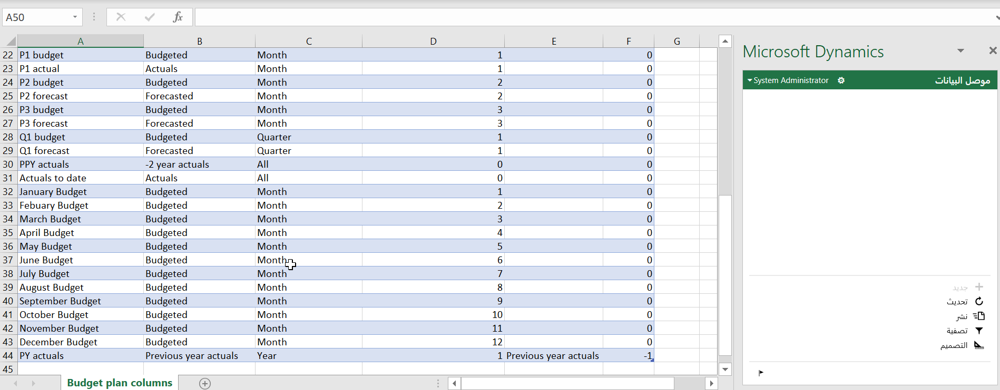

سيركز هذا التمرين بشكل خاص على العمليات أو مهام الأعمال التالية.

- إنشاء تدرج هرمي تنظيمي لتخطيط الموازنة وتكوين أمان المستخدم

- تحديد سيناريوهات خطه الموازنة وأعمدة خطة الموازنة والتخطيطات وقوالب Microsoft Excel
 
- إنشاء وتنشيط عملية تخطيط الموازنة
 
- إنشاء مستند خطة الموازنة عن طريق سحب القيم الفعلية من دفتر الأستاذ العام
 
- استخدام التخصيصات لضبط بيانات وثيقة خطة الموازنة
 
- تحرير بيانات وثيقة خطة الموازنة في Excel

## المتطلبات الأساسية

لتحقيق أقصى استفادة من هذا التمرين، نوصي بأن يكون لديك بيانات العينة القياسية المتوفرة في Dynamics 365 Finance والتي تم تثبيتها باستخدام Lifecycle Services، وأن يتم توفيرها كمسؤول في المثيل. 

لا تستخدم في وضع المستعرض الخاص لهذا التمرين ؛ قم بتسجيل الخروج من أي حساب آخر في المستعرض، إذا لزم الأمر، وقم بتسجيل الدخول باستخدام بيانات اعتماد مسؤول الشؤون المالية. عند تسجيل الدخول إلى Finance، يجب تحديد خانة الاختيار **ابقني مسجل الدخول**.

يؤدي هذا إلى إنشاء ملف تعريف ارتباط دائم يحتاجه تطبيق Excel حالياً. إذا قمت بتسجيل الدخول إلى Dynamics 365 Finance باستخدام مستعرض آخر بخلاف Internet Explorer، فستتم مطالبتك بتسجيل الدخول في تطبيق Excel. عند تحديد **تسجيل الدخول** في تطبيق Excel، سيتم فتح نافذة IE المنبثقة. عند تسجيل الدخول، يجب ليك تحديد خانة الاختيار **ابقني مسجل الدخول**. إذا لم يؤدي تحديد **تسجيل الدخول** في تطبيق Excel للقيام بأي شيء، فيجب عليك مسح ذاكره التخزين المؤقت لملفات تعريف الارتباط في IE.

## السيناريو

تعمل Julia مدير تمويل في Contoso Entertainment Systems في ألمانيا (DEMF). مع اقتراب السنة المالية 2016، تحتاج Julia العمل على إعداد موازنة الشركة للعام المقبل. يبدو إعداد الموازنة على النحو التالي:

1.  تستخدم Julia المبالغ الفعلية للعام السابق كنقطة بداية لإنشاء الموازنة.

2.  استناداً إلى القيم الفعلية للعام السابق، تقوم بإنشاء تقديرات لمدة 12 شهراً في العام المقبل.

3.  تستعرض Julia جوليا الموازنة مع المدير المالي. بعد ذلك، تقوم بإجراء التعديلات اللازمة على خطة الميزانية وتنتهي من إعداد الموازنة. تستخدم Julia قالب Excel لإعداد الموازنة.

## التكوين

### إنشاء التدرج الهرمي المؤسسي

نظراً لأن عملية إعداد الميزانية بأكملها تحدث في قسم Finance، تحتاج Julia إلى إنشاء تدرج هرمي مؤسسي بسيط يتكون من قسم الشؤون المالية فقط.

1.  انتقل إلى **إدارة المؤسسة > المؤسسات > التدرجات الهرمية للمؤسسة**.

2.  حدد الزر **جديد**.

3.  اكتب اسم التدرج الهرمي المؤسسي وحدد ارتباط **تعيين الارتباط**.

4.  حدد **تخطيط الموازنة**، وحدد الزر **إضافة**، ثم قم بتعيين التدرج الهرمي المؤسسي الذي تم إنشاؤه حديثاً.

5.  كرر الخطوة أعلاه لغرض تنظيمي للأمان.

6.  أغلق الصفحة عند إتمام العملية.

7.  في صفحة **التدرجات الهرمية للمؤسسة**، حدد الزر **عرض**. حدد **تحرير** في مصمم التدرج الهرمي وقم بإنشاء تدرج هرمي بتحديد الزر **إدراج**.

8.  حدد **القسم** و **التمويل** للتدرج الهرمي لإعداد الموازنات.

9.  عند الانتهاء، حدد **نشر وإغلاق**. حدد **1/1/2019** كتاريخ سريان للنشر الخاص بالتدرج الهرمي.

### تكوين أمان المستخدم

يستخدم تخطيط الميزانية سياسات أمان خاصة لتكوين الوصول إلى بيانات خطة الموازنة. تحتاج Julia إلى منح نفسها حق الوصول إلى خطط موازنة المالية.

1. في الشركة **DEMF**، انتقل إلى **إعداد الموازنة > الإعداد > تخطيط الموازنة > تكوين تخطيط الموازنة**.

2. في علامة التبويب **المعلمات**، قم بتعيين قيمة **نموذج الأمان** إلى **استناداً إلى مؤسسات الأمان**.

3. انقر فوق **حفظ**. 

3. انتقل إلى **إدارة النظام > المستخدمون > المستخدمون**.

4. قم بتعيين المستخدم **المسؤول** (Julia Funderburk) الدور **مدير الموازنة** من خلال تحديد **المسؤول** وضمن **أدوار المستخدم** حدد **تعيين الأدوار**.
6.  حدد **دور مدير الموازنة**.
5. قم بانتقاء دور المستخدم وحدد **تعيين المؤسسات**.

6. حدد **منح حق الوصول إلى مؤسسات محددة**.

7. قم بانتقاء التدرج الهرمي التنظيمي الذي تم إنشاؤه في الخطوة الأولى.

8. قم بانتقاء عقدة **Finance** وحدد زر **منح مع الفروع**.

لاحظ أنك قد تحتاج إلى تحديث المستعرض الخاص بك لتفعيل **سياسة أمان البيانات القابلة للتوسعة‬ (XDS)** في المرة التالية التي تقوم فيها بتسجيل الدخول إلى Dynamics 365 Finance.

### إنشاء السيناريوهات

1.  في DEMF، انتقل إلى **إعداد الموازنة > الإعداد > تخطيط الموازنة > تكوين تخطيط الموازنة**.

2.  في صفحة **السيناريوهات**، ستستخدم **القيم الفعلية والموازنة للعام السابق**.

### إنشاء أعمدة خطة موازنة

أعمدة خطة الموازنة هي أعمدة نقدية أو أعمدة قائمة على الكمية يمكن استخدامها في تخطيط مستند خطة الموازنة. في هذا المثال، تحتاج إلى إنشاء عمود موازنة للقيم الفعلية للسنة "السابقة" و12 عموداً للموازنة لتمثيل كل شهر في سنة الموازنة.

يمكن إنشاء الأعمدة إما ببساطة عن طريق تحديد الزر **إضافة** وملء القيم، أو بمساعدة كيان البيانات. في هذا التمرين، ستستخدم كيان البيانات لملء القيم.

> [!Important]
> يجب عليك استخدام Microsoft Excel ‏2016 لإكمال هذا التمرين. 

1.  في **DEMF**، انتقل إلى **إعداد الموازنة > الإعداد > تخطيط الموازنة > تكوين تخطيط الموازنة**.

2.  حدد صفحة **الأعمدة**.

3.  حدد زر **Office** في الزاوية العلوية اليمنى من الصفحة ثم حدد **أعمدة خطة الموازنة (غير مصفاة)**.

4.  سيقوم النظام بفتح مصنف Excel يمكنك استخدامه لتعبئة القيم. إذا طُلب منك، حدد **تمكين لتحرير** و **الوثوق بهذا التطبيق**.

5.  ستحتاج إلى المزيد من الأعمدة لملء القيم. حدد **تصميم** في الجزء الموجود على الجانب الأيمن لإضافة الأعمدة إلى الشبكة.

6.  حدد زر قلم الرصاص الصغير الموجود بجوار **أعمدة خطة الموازنة** لعرض الأعمدة المتوفرة لإضافتها إلى الشبكة.

7.  انقر نقراً مزدوجاً فوق كل حقل متوفر لإضافته إلى الحقول **المحددة**، ثم حدد **تحديث**.
8. لتعبئة الأسطر في Excel تلقائياً، حدد **تحديث** في "موصل البيانات".
9.  أضف 13 صفاً إلى Excel عن طريق تحديد **+جديد**.
10. في الصفوف، أدخل أعمدة الموازنة لتمثيل كل شهر من السنة المدرجة في الموازنة وصفاً للقيم الفعلية للسنة "السابقة".
11. في "موصل البيانات"، حدد **نشر** لتحديث القيم الموجودة في البيئة.
     
9.  ارجع إلى Finance وقم بتحديث الصفحة. ستظهر القيم المنشورة في Finance.

    

### إنشاء تخطيطات وقوالب وثيقة خطة الموازنة

يحدد التخطيط كيف ستبدو شبكة خطوط وثيقة خطة الموازنة عندما يفتح المستخدم مستند خطة الموازنة. من الممكن أيضاً تبديل تخطيط مستند خطة الموازنة لعرض نفس البيانات بطرق مختلفة.

الآن بعد أن حددت أعمدة يمكن استخدامها مع مستند خطة الموازنة، تحتاج Julia إلى إنشاء تخطيط مستند لخطة الموازنة، والذي سيبدو مشابهاً لجدول Excel الذي تستخدمه لإنشاء بيانات الموازنة.

1. في **DEMF**، انتقل إلى **إعداد الموازنة > الإعداد > تخطيط الموازنة > تكوين تخطيط الموازنة**.

2. حدد صفحة **التخطيطات**.

3. أنشئ تخطيطاً جديداً لإدخال الموازنة الشهرية. حدد مجموعة أبعاد **MA+BU** لتضمين الحسابات الرئيسية ووحدات الأعمال في التخطيط.
بعد ذلك، قم بإدراج جميع أعمدة خطة الموازنة، التي تم إنشاؤها في الخطوة السابقة. اجعل جميع القيم الفعلية باستثناء قيم العام السابق قابلة للتعديل.

4. حدد الزر **أوصاف** لتحديد الأبعاد المالية التي يجب أن تعرض الأوصاف في الشبكة.

    استناداً إلى تعريف تخطيط خطة الموازنة، يمكنك إنشاء قالب Excel لاستخدامه كطريقة بديلة لتحرير بيانات الموازنة. نظراً لأن قالب Excel يحتاج إلى أن يتطابق مع تعريف تخطيط خطة الموازنة، فلن تتمكن من تحرير تخطيط خطة الموازنة بعد إنشاء قالب Excel. لذلك، يجب تنفيذ هذه المهمة بعد تحديد جميع مكونات التخطيط.

5. بالنسبة للتخطيط الذي تم إنشاؤه، حدد الزر **القالب > إنشاء**.

6. قم بتأكيد رسالة التحذير.

7. لعرض القالب، حدد **القالب > طريقة العرض**.
8. قم بتحديث "موصل البيانات" لتحميل البيانات.

تأكد من تحديد **حفظ باسم** وحدد المكان الذي يجب تخزين القالب فيه بحيث يمكنك تحريره. في حاله تحديد المستخدم **فتح** في مربع الحوار دون الحفظ، لن يتم الاحتفاظ بالتغييرات التي تم اجراؤها على الملف عند إغلاقه.

## إنشاء عملية تخطيط موازنة

تحتاج Julia إلى إنشاء وتنشيط عملية تخطيط موازنة جديدة، تجمع بين جميع مهام الإعداد التي تم إجراؤها مسبقاً، لبدء إدخال خطط الموازنة. تحدد عملية تخطيط الموازنة مؤسسات الموازنة وسير العمل والتخطيطات والقوالب التي سيتم استخدامها لإنشاء خطط الموازنة.

انتقل إلى **إعداد الموازنة > الإعداد > تخطيط الموازنة > عملية تخطيط الموازنة** وأنشئ سجلاً جديداً باستخدام المعلومات التالية:

-   عملية تخطيط موازنة - إعداد موازنة العام المالي 2016 في DEMF

-   دورة الموازنة - العام المالي 2016

-   دفتر الأستاذ - DEMF

-   بنيه الحساب الافتراضية - أرباح وخسائر التصنيع

-   التدرج الهرمي للمؤسسات - اختر التدرج الهرمي الذي تم إنشاؤه في بداية التمرين

-   سير عمل تخطيط الموازنة - تعيين تلقائي - الموافقة على سير العمل لقسم Finance

-   في قواعد وتخطيطات مرحلة تخطيط الموازنة، لكل مرحلة من مراحل تخطيط ميزانية سير العمل، حدد ما إذا كانت إضافة البنود وتعديل البنود مسموحاً بها وما هو التخطيط الذي يجب استخدامه بشكل افتراضي. تأكد من تحديد إضافة خطوط وتعديل الخطوط. استخدم **التخطيط** في الخطوة السابقة.

-   في جزء الإجراء، حدد **الإجراءات**، ثم في **حالة العملية**، حدد **تنشيط**.

## إنشاء بيانات أولية لخطة الموازنة من دفتر الأستاذ العام

1.  انتقل إلى **إعداد الموازنة > دورية > إنشاء خطة موازنة من دفتر الأستاذ العام**.

2.  املأ معلمات العملية الدورية وحدد الزر **إنشاء**.

3.  انتقل إلى **إعداد الموازنة > خطط الموازنة للبحث عن خطه موازنة تم إنشاؤها بواسطة عملية الإنشاء** لرؤية الموازنة التي تم إنشاؤها.

4.  افتح تفاصيل المستند عن طريق تحديد الارتباط التشعبي لرقم المستند.
    يتم عرض خطة الموازنة على النحو المحدد في التخطيط الذي تم إنشاؤه أثناء هذا التمرين المعملي.

## إنشاء موازنة السنة الحالية بناءً على القيم الفعلية للسنة السابقة

يمكن استخدام أساليب التوزيع في خطة الموازنة لنسخ معلومات خطط الموازنة بسهولة من سيناريو إلى آخر، وتوزيعها عبر الفترات، وتوزيعها للأبعاد. في هذه المهمة، ستستخدم عمليات التوزيع لإنشاء موازنة السنة الحالية من القيم الفعلية للسنة السابقة.

1.  اختر جميع البنود في شبكة مستند خطة الموازنة وحدد زر **توزيع الموازنة**.

2.  حدد **أسلوب التوزيع**، و **مفتاح الفترة**، و **السيناريوهات المصدر والوجهة**، ثم حدد **توزيع**.

3.  سيتم نسخ المبالغ الفعلية للعام السابق إلى موازنة العام الحالي. قم بتوزيع المبالغ عبر الفترات باستخدام مفتاح **فترة منحنى المبيعات**.

## تعديل مستند خطة الموازنة باستخدام Excel وإنهاء المستند

1.  حدد الزر **ورقة العمل** لفتح محتويات المستند في Excel.

2.  عند فتح مصنف Excel، قم بتعديل الأرقام الموجودة في مستند خطه الموازنة، ثم حدد الزر **نشر**.

3.  ارجع إلى مستند خطة الموازنة في Finance. حدد **سير العمل > إرسال** للموافقة على المستند تلقائياً.

4.  عند اكتمال سير العمل، تتغير مرحلة مستند خطة الموازنة إلى **تمت الموافقة**.  
