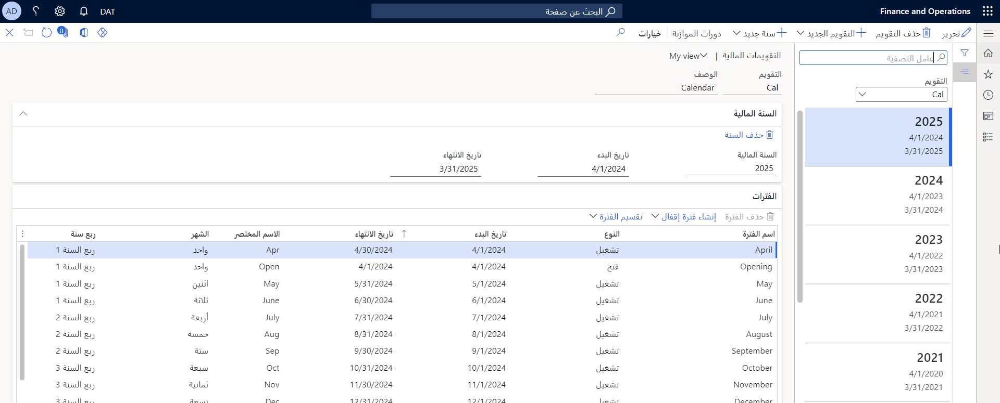

## تحديد تقويمات مالية لدفاتر الأستاذ والأصول الثابتة ودورات الموازنة 

تُستخدم التقويمات المالية بإهلاك الأصول الثابتة، والحركات المالية، ودورات الموازنة. عند إنشاء تقويم مالي، يمكن استخدامه لأغراض متعددة. يمكنك تحديد تقويم مالي لنموذج قيمة أو دفتر إهلاك لجعله تقويم أصول ثابتة. كما يمكنك تحديد تقويم مالي لدفتر أستاذ لجعله تقويم دفتر أستاذ. يمكنك أيضاً تحديد تقويم مالي لدورة موازنة لجعله تقويم موازنة. ويمكنك استخدام نفس التقويم المالي لكل ما سبق.

## تحديد تقويم مالي لكيانك القانوني 

حدد التقويم المالي الذي تريد استخدامه لدفتر الأستاذ للكيان القانوني في صفحة **دفتر الأستاذ**. ويجب تحديد تقويم مالي في صفحة **دفتر الأستاذ** لكل كيان قانوني. وبعد تحديد تقويم مالي، يمكنك إعداد حالات فترات وأذونات في صفحة **تقويم دفتر الأستاذ** في **دفتر الأستاذ العام > إعداد دفتر الأستاذ** لأي من الفترات التي تعد جزءاً من سنة مالية.

## تحديد تقويم مالي للأصول الثابتة 

يمكنك تحديد تقويم مالي لدفتر الأصول الثابتة، وسيتم استخدام هذا التقويم المالي من قبل الأصول الثابتة التي تستخدم الدفتر المحدد. يمكنك التحديد من أي تقويم مالي تم تحديده في صفحة **التقويمات المالية** في **دفتر الأستاذ العام > التقويمات**.

