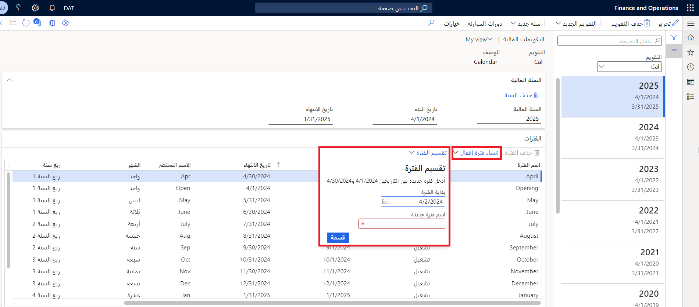

دورات الموازنة هي الفترة الزمنية التي يتم خلالها استخدام موازنة. حيث يمكن أن تتضمن دورات الموازنة جزءاً من سنة مالية أو عدة سنوات مالية، مثل دورة موازنة كل سنتين لفترة السنتين أو دورة موازنة كل ثلاث سنوات لفترة الثلاث سنوات. ويحدد النطاق الزمني لدورة الموازنة عدد الفترات التي يتم تضمينها في دورة الموازنة. لتحديد النطاق الزمني لدورة الموازنة، استخدم صفحة **النطاقات الزمنية لدورة الموازنة**.

عند إنشاء التقويم المالي، يمكنك تقسيم فترة الإقفال أو حذفها أو إنشاؤها في صفحة **التقويمات المالية** باستخدام الزر المناسب.

- لتقسيم فترة موجودة إلى فترتين، انقر على الزر **تقسيم الفترة**. أدخل تاريخ بدء الفترة الجديدة، ثم انقر على **موافق** لإنشاء الفترة الجديدة، وارجع إلى صفحة **الفترات** في **دفتر الأستاذ العام > التقويمات > التقويمات المالية**.

- لإنشاء فترة إقفال لفترة مالية، انقر على زر **إنشاء فترة إقفال**. تقوم المالية بإنشاء فترة فتح وإقفال للسنة المالية، وليس لكل فترة على حدة.
 

    

