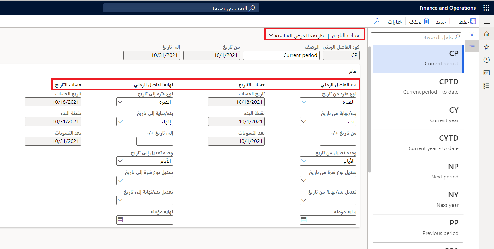
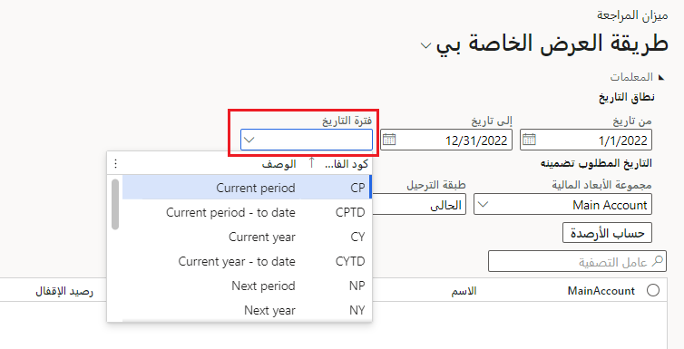

يساعدك إنشاء فترة تاريخ في Finance في تصفية البيانات والإبلاغ عنها وتحليلها استناداً إلى نطاق تاريخي. 

يمكنك إنشاء وإدارة فترات التواريخ التي يمكن استخدامها في القوائم المالية وفي التقارير. تتيح لك فترات التواريخ إنشاء تواريخ ديناميكية. عند استخدام فترات التواريخ، فسيمكنك إعداد فترات معرفة مسبقاً عند تشغيل القوائم المالية. يمكن استخدام فترات التواريخ أيضاً عند إعداد قاعدة توزيع. يمكنك إعداد فترات التواريخ في **دفتر الأستاذ العام > إعداد دفتر الأستاذ > فترات التواريخ**.
  

عندما يتم حفظ فترات التواريخ، يمكن استخدامها في تقارير مختلفة. 

على سبيل المثال، تقوم وحدة التحكم في شركة Contoso Entertainment USA بتشغيل **تقرير ميزان المراجعة** كل شهر. بدلاً من تغيير **من** و **إلى** التاريخ في كل مرة يريد فيها تشغيل هذا التقرير، يمكنه تحديد **فترة تاريخ** كما هو موضح في لقطة الشاشة أدناه. يمكن أن يجعل هذا عملية تشغيل التقارير أكثر كفاءة ويسمح بالوصول السريع إلى فترات التواريخ مختلفة مثل **الفترة الحالية**، **السنة السابقة** و **الحالية عام - حتى الآن**. 

شاهد هذا الفيديو للتعرف على كيفية إنشاء فترات التواريخ.

 > [!VIDEO https://www.microsoft.com/videoplayer/embed/RE3VmCo]
 
