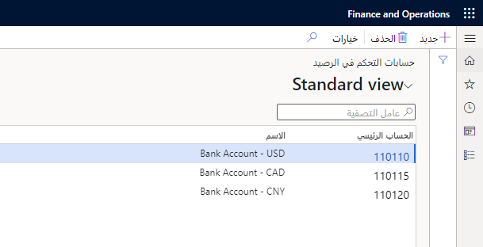
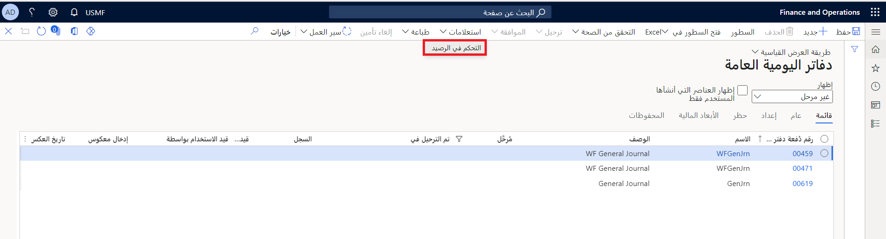

ستستخدم حسابات التحكم في الرصيد لالتحكم في الرصيد الحالي والمتوقع على الحساب أثناء إدخال الحركات في دفتر اليومية. 
 
إنه ليس إعداداً مطلوباً، ولكنه مفيد إذا كنت ترغب في العرض والتأكد من أن الأموال الموجودة في الحساب كافية لنشر الحركة. سيتم استخدام هذا فقط لتلك المجموعة الفرعية من الحسابات حيث يكون من المنطقي القيام بذلك.  الأكثر شيوعاً، للحسابات البنكية المستخدمة للمدفوعات.
  
ضع في الاعتبار السيناريو التالي.

يريد مدير محاسبة Adventure Works Cycles، جوناثان تتبع الرصيد الحالي والمتوقع لحسابات السيولة.  وهي تتضمن الحسابات البنكية والحسابات النقدية النثرية.  بعد أن قام جوناثان بإعداد حسابات التحكم في الرصيد، يقوم منسق الحسابات الدائنة بالتحقق من الرصيد المتوقع للحساب البنكي للتأكد من أن الرصيد كافٍ لدفع الفواتير. سيتضمن الرصيد المتوقع كلاً من دفاتر اليومية المُرحلة وغير المنشورة.  

لإنشاء حسابات التحكم في الرصيد، انتقل إلى **دفتر الأستاذ العام > مخطط الحسابات > الحسابات > حسابات التحكم في الرصيد**.

من المهم معرفة أن حساب التحكم في الرصيد يرتبط بحساب دفتر الأستاذ، مثل حساب المصروفات النثرية. تعتبر الحسابات البنكية التي تم إعدادها نقداً وإدارة البنك بالفعل حسابات التحكم في الرصيد، وضمنياً، تعتبر الحسابات الرئيسية المرتبطة بها بالفعل حسابات التحكم في الرصيد.
 

شاهد الفيديو لتتعلم كيف تستعمل:

- أوصاف دفتر اليومية أو نص بند دفتر اليومية.
- حقلا اقتراح الخصم والائتمان (**الخصم/الائتمان الافتراضي**) ومتطلبات الخصم والائتمان (**متطلبات الخصم/الائتمان**) في الحساب الرئيسي. 
- إعداد حساب التحكم في الرصيد والاستعلام.

> [!VIDEO https://www.microsoft.com/videoplayer/embed/RE489XA]

يمكنك عرض التحكم في الرصيد في دفاتر اليومية العامة قبل الترحيل باستخدام **الاستعلامات > التحكم في الرصيد** كما ترى أدناه:
 

تظهر نتيجة هذا الاستعلام رصيد الحسابات التي تحاول بنود دفتر اليومية ترحيل المبالغ إليها ومقارنتها بالقيم قبل وبعد ترحيل دفتر اليومية. سيعطي هذا لمحة عما سيحدث إذا رحلت دفتر اليومية. 

