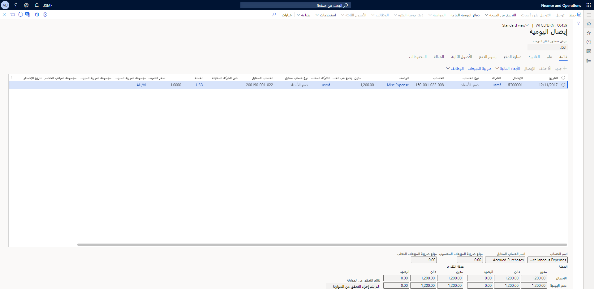
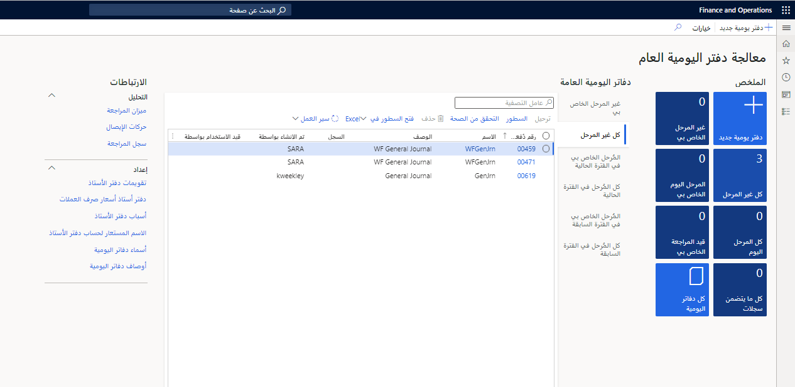
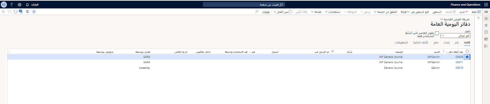

في دفتر اليومية العام، تقوم بإدخال المعلومات ذات الصلة بالحركة مثل تاريخ الترحيل والمبلغ والحسابات الرئيسية وحسابات المقابلة للترحيل إليها.  هذا هو الحد الأدنى من المعلومات التي تحتاج إلى إدخالها. يتم الخصم من حساب دفتر الأستاذ أو قيده، ثم يتم تحديد حساب مقابل.

يجب أن يكون لديك المعلومات التالية لإنشاء إدخال دفتر اليومية:

- تاريخ المحاسبة
- حساب دفتر الأستاذ
- مبلغ الخصم أو الائتمان
- الحساب المقابل (يمكن إدخاله في نفس البند أو عدة بنود)

استخدم صفحة **بنود دفتر اليومية** لإدخال حركات في دفتر يومية. حدد زر **البنود** في صفحة **معالجة دفتر اليومية العام** لفتح صفحة بنود دفتر اليومية.

**يمكنك ترحيل الحركات إلى الحسابات التالية باستخدام دفتر يومية عام**:

- **دفتر الأستاذ** - للحركات في حساب دفتر الأستاذ.
- **البنك** – في حالة تضمين حركة حساب بنكي.
- **العميل** - للحركات للعملاء.
- **المورد** - للترحيل إلى حساب مورد. على سبيل المثال، عند تسجيل مدفوعات المورد وتحديد المورد كنوع الحساب، يحدث الترحيل في حساب المورد المحدد. في الوقت نفسه، يتم الترحيل تلقائياً في حساب ملخص المورد في دفتر الأستاذ العام.
- **المشاريع** - للترحيل إلى رقم مشروع معين.
- **الأصول الثابتة** - للترحيل إلى رقم أصل محدد.
 

المعلومات التي تدخلها في دفتر اليومية العام مؤقتة ويمكن تغييرها إذا بقيت غير مرّحلة داخل دفتر اليومية.  يمكنك الخروج من دفتر يومية دون فقد أي معلومات ثم العودة وترحيله لاحقاً. 
 
لإدخال دفتر يومية عام جديد، توجد طريقتان مختلفتان للقيام بذلك في القائمة. توجد مساحة عمل **معالجة دفتر اليومية العام** فضلاً عن **دفتر الأستاذ العام > إدخالات دفتر الومية > دفاتر اليومية العامة** و **دفتر الأستاذ العام > إدخالات دفاتر اليومية > دفاتر اليومية العامة العالمية**.  

في مساحة عمل **معالجة دفتر اليومية العام‬**، يمكنك إدخال دفتر يومية عام جديد وعرض دفاتر اليومية الموجودة والانتقال إلى صفحة **دفاتر اليومية العامة** مباشرةً.  
 

عند إنشاء دفتر يومية جديد كنوع يومي، على سبيل المثال، يتكون رأس دفتر اليومية من علامات تبويب مختلفة. تم تحديد خانة الاختيار **تم الترحيل** تلقائياً بعد ترحيل دفتر اليومية. تقوم صفحة **دفتر اليومية العام** بتصفية دفاتر اليويمة بواسطة الحقل **إظهار**. يمكنك التحديد لعرض دفاتر اليومية المفتوحة أو اليومية أو المرّحلة فقط.
 

تعرض علامة التبويب **عام** معلومات متنوعة، مثل الوصف واسم دفتر اليومية وطبقة الترحيل ومستوى التفاصيل وحدود البنود وما إذا كان دفتر اليومية مخصصاً لإدخال عكسي أو لا.

تعرض علامة التبويب **إعداد** نوع الحساب، وتتحكم في ما إذا كانت **المبالغ تتضمن ضريبة المبيعات**، وتمنحك خياراً لتجاوز سعر الصرف بسعر ثابت في حالة استخدامك لعملات متعددة. قم بإعداد الحساب المقابل الافتراضي لحساب باستخدام صفحة **أسماء دفاتر اليومية**. من خلال إنشاء حساب مقابل افتراضي، يتم ملء هذا الحقل تلقائياً دون تحديد الحساب في كل مرة. 

تُظهر علامة التبويب **حظر** الحظر ما إذا تم حظر هذه المجلة بسبب خطأ، مما يؤدي إلى تشغيل خيار **مقفل بواسطة النظام** أو إذا تم حظره من قِبل مستخدم آخر. وبدلاً من ذلك، يمكنك جعل دفتر اليومية خاصاً لمستخدم أو مجموعة من المستخدمين.

يمكنك استخدام الأبعاد المالية الافتراضية في علامة التبويب **البعد المالي**. تعرض المحفوظات الشخص الذي قام بإجراء الصيانة لدفتر اليومية. 
 
يكتشف Finance الفترة المالية عندما تحدد التاريخ في إدخال بند دفتر اليومية.  إذا كانت الفترة مغلقة أو معلقة، فستتلقى رسالة خطأ تفيد بأنه لا يمكنك استخدام التاريخ في تلك الفترة.  

شاهد هذا الفيديو لمعرفة المزيد حول علامات تبويب رأس دفتر اليومية وخصائصها.

 > [!VIDEO https://www.microsoft.com/videoplayer/embed/RE489XF]

