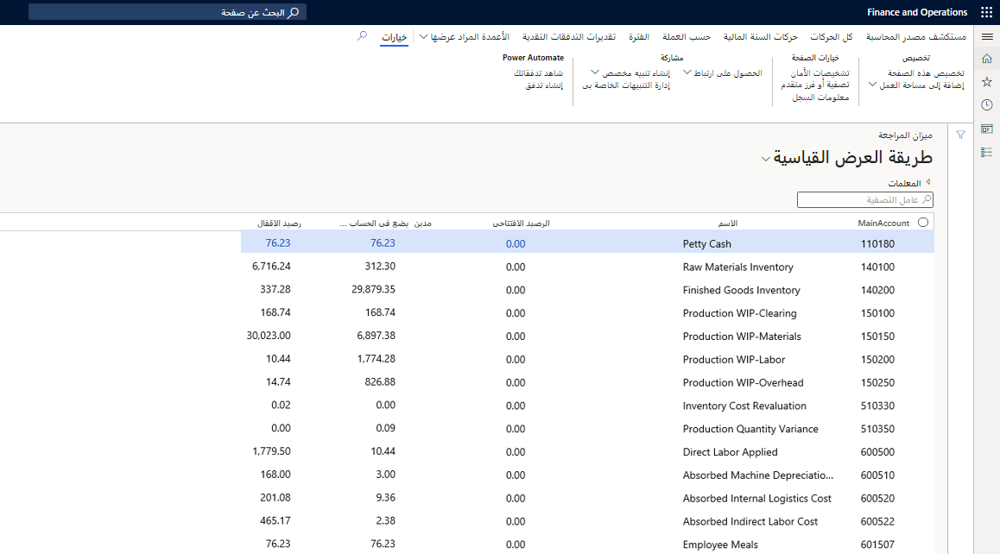

استخدم دفتر الأستاذ العام لتحديد السجلات المالية للمؤسسة وإدارتها. دفتر الأستاذ العام هو سجل إدخالات الدائن والمدين. تُصنّف هذه الإدخالات باستخدام الحسابات المدرجة في مخطط الحسابات.

يمكنك تخصيص المبالغ النقدية أو توزيعها لحساب واحد أو أكثر، أو مجموعات الأبعاد والحسابات على أساس قواعد التخصيص. هناك نوعان لعمليات التخصيص: الثابتة والمتغيرة. 

ويمكنك أيضاً تسوية الحركات بين حسابات دفتر الأستاذ وإعادة تقييم مبالغ العملة. في نهاية السنة المالية، يجب عليك إنشاء حركات الإقفال، وتحضير حساباتك للسنة المالية التالية. يمكنك استخدام وظيفة الدمج لتجميع النتائج المالية لعديد من الكيانات القانونية التابعة في نتائج لمؤسسة واحدة مدمجة. وبإمكان الشركات التابعة أن تكون في قاعدة البيانات المالية نفسها أو في قواعد بيانات منفصلة.

عادة ما يتم تسجيل الحركات في أحد دفاتر اليومية مرة واحدة في الشهر على الأقل. ويتم تمييز كل حركة برقم دفتر اليومية الذي تم تسجيله فيه، بالإضافة إلى رقم السطر.

للتأكد من حصول الحركات أيضاً علي طابع التاريخ والوقت للإدخال الخاص بها في دفتر اليومية، حدد خانة الاختيار **يومية دفتر الأستاذ الملحقة** في صفحة **محددات دفتر الأستاذ العام**.
 

ستظهر جميع الحركات الأخرى في دفتر اليومية التالي. لذلك، من المهم دائماً تضمين جميع الفترات المفتوحة في دفتر اليومية.

1.  انقر على **دفتر الأستاذ العام > المهام الدورية > تسجيل دفتر اليومية**. 
2.  لإدخال نطاق من الإيصالات أو التواريخ لتسجيل دفتر اليومية، انقر على **تحديد**. سترغب عادةً في تسجيل جميع الحركات المتوفرة في دفتر اليومية.
3.  انقر على **موافق**.
4.  إذا ظهرت رسالة تفيد بأن الإعداد قد تغير، فانقر فوق **نعم**.
5.  انقر على **موافق** لطباعة **قائمة دفاتر اليومية الملحقة**.

بغض النظر عن تسجيل دفتر اليومية، ضع في اعتبارك العمليات الأخرى التي يمكنك تنفيذها في دفتر الأستاذ العام:

- **عملية إغلاق المعاملات** - لمزيد من المعلومات، راجع [تكوين العمليات الدورية وتنفيذها في Dynamics 365 Finance](/learn/modules/configure-periodic-processes-dyn365-finance/?azure-portal=true).
- **توزيع الحركات** - لمزيد من المعلومات، راجع [تكوين تخصيصات دفتر الأستاذ والمستحقات في Dynamics 365 Finance](/learn/modules/configure-ledger-allocations-accruals-dyn365-finance/?azure-portal=true).
- **الإمساك بحسابات دفتر الأستاذ** - لمزيد من المعلومات، راجع [تكوين دليل الحسابات في Dynamics 365 Finance](/learn/modules/configure-chart-accounts-dyn365-finance/?azure-portal=true).
- **إقفال الحركات** - ‏‫لمزيد من المعلومات، [راجع تكوين العمليات الدورية وإجراؤها في Dynamics 365 Finance](/learn/modules/configure-periodic-processes-dyn365-finance/?azure-portal=true).
- **تخصيص التكاليف والإيرادات** - لمزيد من المعلومات، راجع [تكوين تخصيصات دفتر الأستاذ والمستحقات في Dynamics 365 Finance](/learn/modules/configure-ledger-allocations-accruals-dyn365-finance/?azure-portal=true).
- **توقع التدفق النقدي ومتطلبات العملة** - لمزيد من المعلومات، راجع [تكوين مخطط الحسابات في Dynamics 365 Finance](/learn/modules/configure-chart-accounts-dyn365-finance/?azure-portal=true).
- **إزالة الحركات** - ‏‫لمزيد من المعلومات، راجع [تكوين العمليات الدورية وإجراؤها في Dynamics 365 Finance](/learn/modules/configure-periodic-processes-dyn365-finance/?azure-portal=true).
- **إعادة تقييم مبالغ العملة** - لمزيد من المعلومات، راجع [تكوين العمليات الدورية وتنفيذها في Dynamics 365 Finance](/learn/modules/configure-periodic-processes-dyn365-finance/?azure-portal=true).
- **تحويل عملة المحاسبة** - لمزيد من المعلومات، راجع [تكوين العملات في Dynamics 365 Finance](/learn/modules/configure-currencies-dyn365-finance/?azure-portal=true).
- **إعداد تقارير ما قبل الإقفال** - لمزيد من المعلومات، راجع [تكوين العمليات الدورية وتنفيذها في Dynamics 365 Finance](/learn/modules/configure-periodic-processes-dyn365-finance/?azure-portal=true).
- **إنشاء مستندات إلكترونية** -     لمزيد من المعلومات، راجع [تكوين التقارير الإلكترونية في Dynamics 365 Finance](/learn/modules/configure-electronic-reporting-finance-operations/?azure-portal=true).
- **إغلاق الدفاتر** - ‏‫لمزيد من المعلومات، راجع [تكوين العمليات الدورية وإجراؤها في Dynamics 365 Finance](/learn/modules/configure-periodic-processes-dyn365-finance/?azure-portal=true).
- **إغلاق الشهر والفترة والسنة المالية** - ‏‫لمزيد من المعلومات، راجع [تكوين العمليات الدورية وإجراؤها في Dynamics 365 Finance](/learn/modules/configure-periodic-processes-dyn365-finance/?azure-portal=true).

## العملة المزدوجة 

عملة التقارير هي عملة محاسبة ثانية صحيحة. من منظور دفتر الأستاذ العام، يعني هذا أنه يتم حساب عملة التقارير لكل حركة يتم ترحيلها إلى دفتر الأستاذ العام. تتم إضافة دفتر يومية جديد لترحيل الحركات بعملة التقارير فقط. 

بالنسبة إلى دفاتر الأستاذ الفرعية المختلفة، مثل الأصول الثابتة، يمكنك الاحتفاظ بجميع الحركات في دفتر الأستاذ الفرعي لعملة التقارير. عند تشغيل الإهلاك، فإنه يُخفّض مبالغ عملة التقارير باستخدام طرق الإهلاك، تماماً كما هو الحال مع عملة المحاسبة. 

## إدخال البيانات لقيم الأبعاد 

عندما يحتوي أحد الأبعاد على كيان مساعد مثل العميل أو المورد، فإن قيمة البُعد ستكون افتراضية على القيمة المدخلة في النموذج المقترن. على سبيل المثال، يتم تعيين بُعد العميل تلقائياً على قيمة العميل المستخدمة عند إنشاء عميل. تتوفر خيارات لتمكين بُعد واحد أو أكثر ليكون البُعد الافتراضي. على سبيل المثال، قد تكون وحدة عمل هي الوحدة الافتراضية عند إدخال مركز التكلفة.

## عملة التقارير في إعداد التقارير المالية 

تتوفر عملة التقارير في إعداد دفتر الأستاذ بدفتر الأستاذ العام كعرض عملة في تعريف العمود في إعداد التقارير المالية. ويتيح لك ذلك الاستفادة من إمكانيات تحويل العملة الفعالة في إعداد التقارير المالية، بالإضافة إلى الإبلاغ عن عملة التقارير من Finance. 

تصف تسميات القائمة المنسدلة لعرض العملة ما يتم الإبلاغ عنه: عملة المحاسبة من إعداد دفتر الأستاذ، أو عملة التقارير من إعداد دفتر الأستاذ، أو عملة المعاملة، أو تحويل إلى.

## دفاتر يومية دفتر الأستاذ العام العمومي 

استخدم **دفتر الأستاذ العام > إدخالات دفتر اليومية > دفاتر اليومية العامة** لتعيين دور الأمان من أجل الوصول إلى جميع دفاتر اليومية العامة وكل الشركات.  إذا أنشأت دفتر يومية في شركة محددة، وقمت بالتبديل إلى شركة أخرى، سيكون لديك إمكانية رؤية جميع دفاتر اليومية العامة.
 

شاهد هذا الفيديو لمعرفة كيفية العمل مع دفاتر اليومية العامة.

> [!VIDEO https://www.microsoft.com/videoplayer/embed/RE487oa]

## ترحيل دفاتر يومية متعددة 

يمكن لتطبيقات Finance ترحيل دفاتر يومية متعددة تضم عمليات كبيرة بالوضع الدفعي.  كما يمكنك ترحيل العديد من دفاتر اليومية التي قمت بإنشائها ليس فقط في دفتر الأستاذ العام ولكن أيضاً في حسابات المقبوضات والحسابات الدائنة‏‎ والمشروعات والأصول الثابتة.  يمكنك ترحيل دفاتر اليومية فوراً أو إعدادها كوظيفة لمعالجة الدفعات.

يمكنك استخدام خيار القائمة **ترحيل دفاتر اليومية** لترحيل دفاتر يومية متعددة تضم عمليات كبيرة بالوضع الدفعي. كما يمكن ترحيل العديد من دفاتر اليومية التي قمت بإنشائها في الوحدات النمطية التالية من خلال تحديد خيار القائمة **ترحيل دفاتر اليومية**:

- دفتر الأستاذ العام
- الحسابات المدينة
- الحسابات الدائنة‏‎
- المشروع

إذا كنت تستخدم معالجة الوظيفة الدُفعية، انقر على خانة الاختيار **التحديد لاحقاً** لإنشاء استعلام، ولجعل النظام يستخدم جميع دفاتر اليومية التي تستوفي المعايير الخاصة بالترحيل عند تشغيل الدفعة. بتحديد خانة الاختيار هذه، لا يلزم وجود دفتر اليومية قبل أن يتم تحديده لوظيفة معالجة الدُفعة.

## حدود السطر 

في حال إعداد حد السطور في صفحة **أسماء دفتر اليومية**، فقد تحتاج إلى إنشاء عدة دفاتر يومية في أثناء الترحيل. يتم حفظ رقم دفتر اليومية الأول الذي تم ترحيله تلقائياً في كل دفتر يومية مقترن.

## ترحيل ونقل 

إذا كان دفتر يومية يحتوي على إيصالات بها أخطاء، فلا يزال بإمكانك ترحيل دفاتر اليومية لهذه الإيصالات، والتي يتم التحقق من صحتها قبل نقلها مع وجود أخطاء.

قد تكون السطور المختلفة في تواريخ مختلفة.  يتم تعيين رقم الإيصال الخاص بالسطر استناداً إلى معايير التسلسل الرقمي في اسم دفتر اليومية.
  
عند تحديد **الوظائف > ترحيل ونقل** من قائمة رأس دفتر اليومية، تقوم تطبيقات Finance بترحيل جميع دفاتر اليومية التي لا تحتوي على أخطاء، ونقل هذه الإيصالات التي تحتوي على أخطاء إلى دفتر يومية جديد، حيث يمكنك تصحيح الخطأ وترحيله لاحقاً.  

 
## دفاتر اليومية مع الموافقة على سير العمل 

توفر تطبيقات Finance عمليات سير عمل جاهزة لدفاتر يومية دفتر الأستاذ العام.  يجب أولاً إنشاء سير عمل لدفتر يومية دفتر الأستاذ اليومي، ثم معالجة دفتر اليومية والمضي في عملية الموافقة.  

## دفاتر اليومية الدورية 

يحتوي دفتر اليومية الدوري على البيانات التي تم إدخالها دورياً فقط.  على سبيل المثال، خلال كل شهر عند إقفال المحاسبة، يقوم مستخدم ما بإجراء نفس الإدخال بأرقام الحسابات نفسها باستخدام مبالغ العملة.  يقوم المستخدم بإعداد دفتر يومية دوري لتسريع هذه العملية.  ثم يقوم المستخدم كل شهر باسترداد دفتر اليومية وترحيله مع التاريخ المحاسبي المناسب.
  

## أرصدة حساب دفتر الأستاذ العام 

ميزان المراجعة هو صفحة قائمة تُظهر جميع أرصدة الحساب و/أو الأبعاد لفترة معينة من الوقت. للاطلاع على **صفحة ميزان المراجعة**، انتقل إلى **دفتر الأستاذ العام > الاستعلامات والتقارير > ميزان المراجعة**. وعند فتح ميزان المراجعة لأول مرة، يتم تحديثه بالأرصدة للتواريخ والخصائص التي تم تعيينها في المحددات. والخصائص التي يمكن تغييرها في المحددات هي التواريخ، وطبقة الترحيل، وكيف يجب أن تظهر الأرصدة الافتتاحية، وأنواع حركات الإقفال التي يجب عرضها. يجب أن تكون التواريخ المحددة في نفس السنة المالية عند حساب ميزان المراجعة.

عند قيامك بتغيير المحددات، يتم تحديث الأرصدة. ويمكنك أيضاً انتقاء مجموعة الأبعاد التي ترغب في عرض الأرصدة لها وما إذا كان كل بُعد من الأبعاد يظهر في أعمدة منفصلة.
يمكنك التنقل لأسفل في الأرصدة لعرض الحركات التي تُشكّل الرصيد.
 

