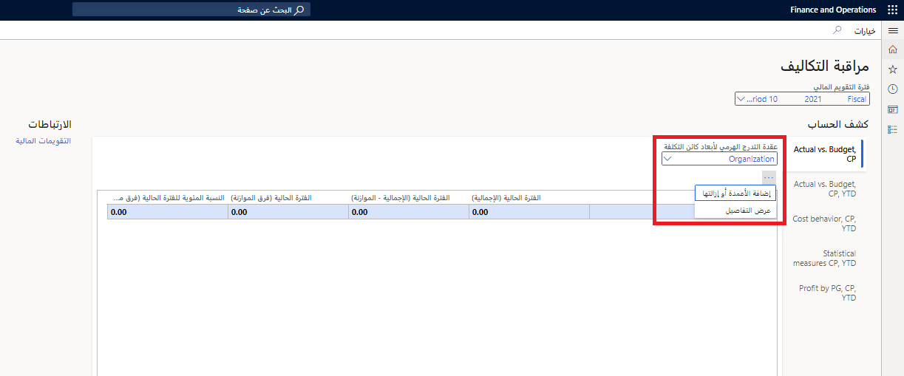
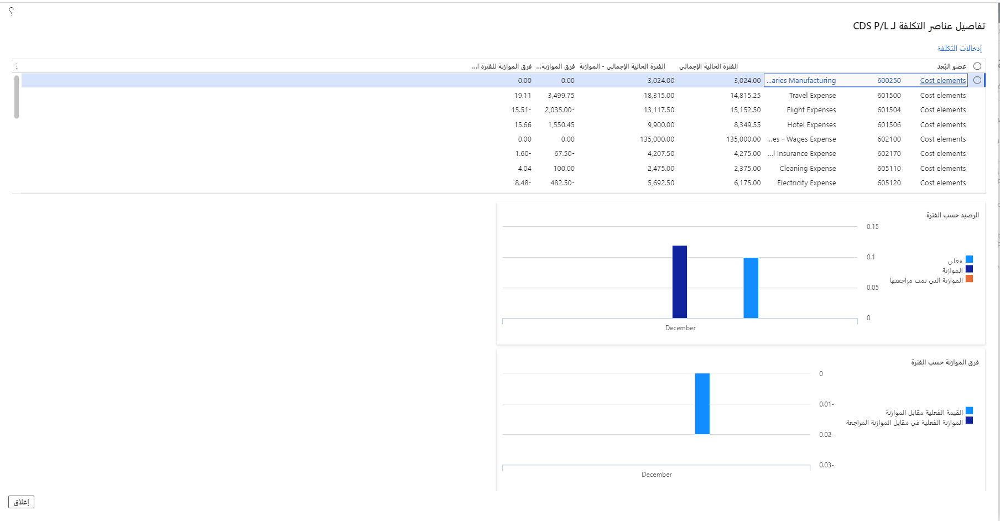
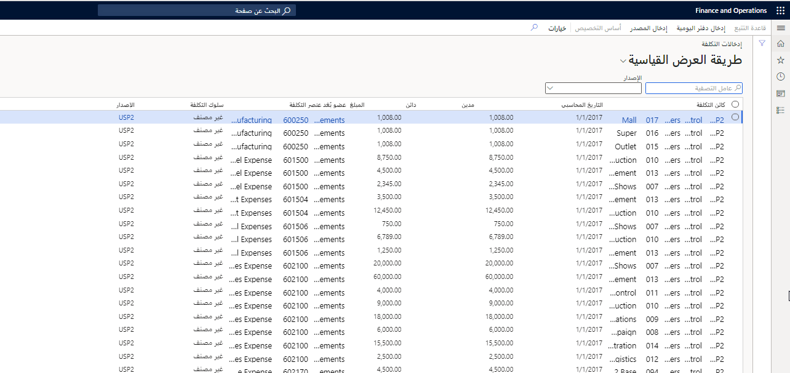
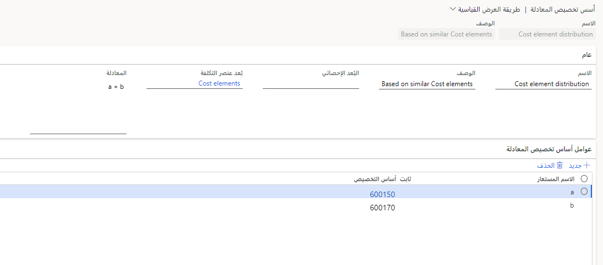
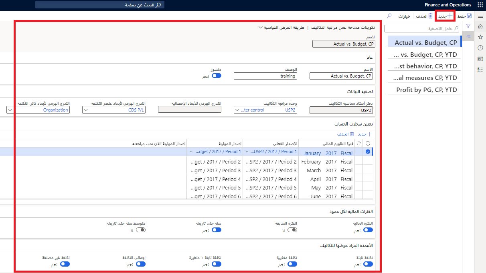

نظراً لأن محتوى تحليل محاسبة التكاليف يسلط الضوء على الفروق بين التكاليف الفعلية والتكاليف المدرجة في الموازنة، يمكن إخطار المديرين بالاتجاهات الإيجابية والسلبية لوحداتهم التشغيلية. يمكن للمديرين الانتقال إلى التدرجات الهرمية لعناصر التكلفة أو عناصر التكلفة الفردية. بهذه الطريقة، يمكن للمديرين الحصول على رؤية تفصيلية حول كيفية حدوث فروق التكاليف، ثم اتخاذ إجراءات فعالة.

تم تصميم مساحة عمل **التحكم في التكلفة** في **محاسبة التكاليف > التحكم في التكلفة** كصفحة. لذلك، يمكن منح حق الوصول لجميع المديرين المسؤولين عن كائن التكلفة. يمكن التحكم في الوصول إلى الصفحة والبيانات الموجودة في النموذج.

يتم التحكم في قائمة التقارير المتوفرة للمستخدمين، مثل المديرين، من خلال إعداد خيار **تم النشر** في صفحة **تكوينات مساحة عمل التحكم في التكلفة**.

يمكن للمدير تحديد فترة التقويم المالي لعرضها. يتم استخدام تاريخ الجلسة لتحديد الفترة الحالية الافتراضية.

يتم تحديد القيم في فترة التقويم المالي حسب اسم التقرير والتقويم المالي الذي تم تحديده لدفتر أستاذ محاسبة التكاليف المرتبط باسم التقرير في صفحة **تكوينات مساحة عمل التحكم في التكلفة**.

في التدرج الهرمي لأبعاد كائن التكلفة، يمكن للمستخدمين تحديد مستوى التجميع الذي يجب أن تظهر فيه الأرصدة. من خلال تمكين الأمان على مستوى الوصول، يمكنك التحكم في الأذونات حتى يتمكن المستخدمون من عرض التدرج الهرمي بالكامل. ومع ذلك، يمكن للمستخدمين فقط عرض أرصدة الرؤساء التنفيذيين، مثل الرئيس التنفيذي والمدراء الماليين، الذين تم منحهم حق الوصول.

يمكن للمستخدمين تخصيص الأعمدة في التقرير لتلائم متطلباتهم.
  

## عرض التفاصيل 

يستطيع المستخدمون التنقل لأسفل في التفاصيل خلف الموازنات المعروضة في مساحة العمل. إذا حدد المستخدمون عقدة التدرج الهرمي لبعد عنصر التكلفة، ثم حددوا **عرض التفاصيل**، يعرض مربع حوار **تفاصيل عنصر التكلفة** المعلومات التفصيلية للعقدة. 

تعرض الشبكة كل عنصر تكلفة مقترن بعقدة التدرج الهرمي لبعد عنصر التكلفة وقيمها. تتوافق الأعمدة التي تظهر في الشبكة مع إعدادات مساحة العمل. يُظهر مخططان ملخصاً للفرق الفعلي في مقابل الموازنة وتباين الموازنة حسب الفترة.

 

يمكن للمستخدمين تحديد **إدخالات التكلفة** للتعمق في تفاصيل الإدخال كما هو مطلوب في **محاسبة التكاليف > التحكم في التكلفة > عرض التفاصيل> إدخالات التكلفة**.

على سبيل المثال، الإيجار عبارة عن نفقات يتم توزيعها على مراكز التكلفة. يمكن للمستخدم الذي يريد فهم تكلفة الإيجار التي يجب أن يتحملها مركز التكلفة الخاص به أو بها التنقل لأسفل لعرض كيفية حساب الإيجار.

إذا حدد المستخدمون **أساس التوزيع** في صفحة **إدخالات التكاليف**، يظهر مربع حوار. ويمكن للمستخدمين في ذلك الوقت تعيين قاعدة التخصيص للقاعدة وعرض القياسات الإحصاءات المقابلة المسجلة لهذه الفترة.

في المثال التالي، يكون أساس التوزيع من النوع **أساس توزيع المعادلة**، ويتم عرض المعادلة. يتم سرد العوامل التي تحدد المعادلة في **محاسبة التكاليف > التحكم في التكلفة > عرض التفاصيل > إدخالات التكاليف > أساس التوزيع**. بالإضافة إلى ذلك، تعرض الشبكة العملية الحسابية التي تم إجراؤها لكل كائن تكلفة.
 
 

## تكوين معلمات مساحة عمل مراقبة التكلفة 

استخدم الإجراء التالي لتكوين مساحة عمل **التحكم في التكلفة** بحيث يمكن للمديرين على مستويات مختلفة في المؤسسة الحصول على نظرة ثاقبة حول كائنات التكلفة الخاصة بهم، مثل مراكز التكلفة ومجموعات المنتجات.

1.  انتقل إلى **محاسبة التكاليف > الإعداد > تكوينات مساحة عمل التحكم في التكلفة**.
2.  حدد **جديد**.
3.  في الحقل **الاسم**، اكتب قيمة‎.
4.  في حقل **الوصف** أدخل قيمة.
5.  حدد **نعم** في حقل **تم النشر**.

    إذا قمت بتعيين هذا الخيار إلى **نعم**، يمكن فقط للمستخدمين الذين تم تعيين أحد هذه الأدوار لهم عرض التقرير في مساحة العمل **التحكم في التكلفة**: مدير محاسبة التكاليف أو محاسب التكاليف أو كاتب محاسب التكاليف أو مراقب كائنات التكاليف؟ 

    إذا قمت بتعيين هذا الخيار إلى **لا**، يمكن فقط للمستخدمين الذين تم تعيين أحد هذه الأدوار لهم عرض التقرير في مساحة العمل **التحكم في التكلفة**: مدير محاسبة التكاليف أو محاسب التكاليف أو كاتب محاسب التكاليف.
6.  قم بتوسيع قسم **تصفية البيانات**.
7.  في حقل **وحدة التحكم في التكلفة**، أدخل أو حدد قيمة.
8.  حقل **إصدار الموازنة الأصلي**، أدخل أو حدد قيمة.
9.  في حقل **التدرج الهرمي لبعد عنصر التكلفة**، أدخل أو حدد قيمة.
10. في حقل **التدرج الهرمي لبعد كائن التكلفة**، أدخل أو حدد قيمة.
11. قم بتوسيع قسم **تعيين سجلات العملية الحسابية**.
12. حدد **جديد**.
13. في القائمة، قم بتمييز الصف المحدد.
14. في حقل **فترة التقويم المالي**، أدخل أو حدد قيمة.
15. في حقل **الإصدار الفعلي**، أدخل أو حدد قيمة.
16. قم بتوسيع قسم **الفترات المالية لكل عمود**.
17. حدد **نعم** في حقل **الفترة المالية**.
18. قم بتوسيع قسم **الأعمدة المراد عرضها للتكاليف**.
19. حدد **نعم** في حقل **التكلفة الثابتة**.
20. حدد **نعم** في حقل **التكلفة المتغيرة**.
21. حدد **نعم** في حقل **التكلفة الإجمالية**.
22. حدد **حفظ**.
23. أغلق الصفحة.
24. انتقل إلى **محاسبه التكاليف > مساحات العمل > التحكم في التكلفة**.
26. في حقل **فترة التقويم المالي**، أدخل أو حدد قيمة.
27. في حقل **عقدة التدرج الهرمي لبعد كائن التكلفة**، أدخل أو حدد قيمة.

بعد تحديد التدرج الهرمي لبعد كائن التكلفة، قم بتوسيع **التدرج الهرمي لبعد عنصر التكلفة** في **محاسبة التكاليف > الإعداد > تكوين مساحة عمل التحكم في التكلفة** لعرض قيم التكاليف المطلوبة. على سبيل المثال، يمكنك توسيع التدرج الهرمي إلى **النفقات العامة للتصنيع** للاطلاع على القيمة.
 
  

