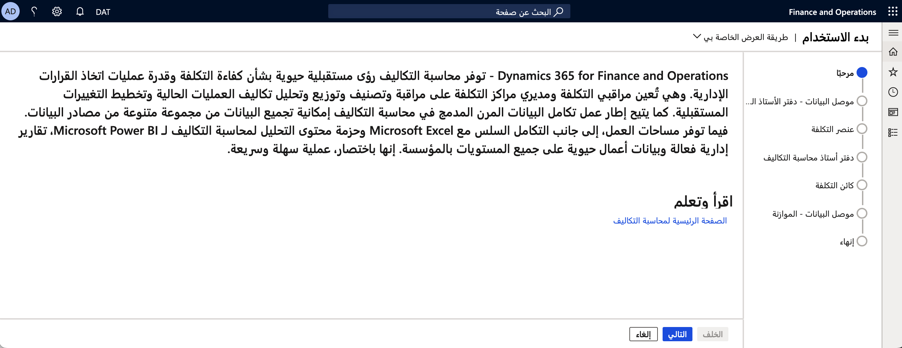
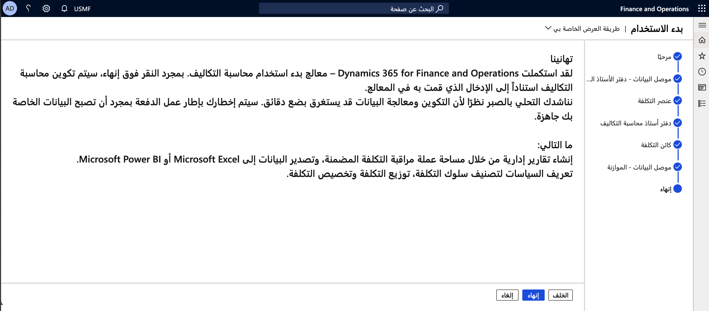

توفر محاسبة التكاليف في Finance رؤى مهمة حول كفاءة التكلفة وقدرة عمليات اتخاذ القرار الإداري. إنه يمكّن مراقبي التكلفة ومديري مراكز التكلفة من التحكم في تكاليف العمليات الحالية وتصنيفها وتخصيصها وتحليلها والتخطيط للتغييرات المستقبلية. 

باستخدام إطار عمل تكامل البيانات المرن المدمج في محاسبة التكاليف، يمكنك جمع البيانات عبر مجموعة واسعة من مصادر البيانات. توفر مساحات العمل، جنباً إلى جنب مع التكامل السلس مع Microsoft Excel وحزمة محتوى تحليل محاسبة التكاليف لـ Microsoft Power BI تقارير إدارية قوية وبيانات أعمال مهمة على جميع المستويات التنظيمية. 

يمكنك استيراد البيانات، مثل إدخالات دفتر الأستاذ العام وإدخالات الميزانية، إلى محاسبة التكاليف من خلال موصلات البيانات. يمكنك استخدام الموصلات المكونة مسبقاً أو الموصلات المخصصة لاستيراد البيانات.

باستخدام معالج **الشرو في العمل لمحاسبة التكاليف** في **محاسبة التكاليف > الإعداد > الشروع في العمل**، يمكنك تحديد الكيان القانوني الذي تريد استيراد البيانات منه إلى محاسبة التكاليف. يمكن التعامل مع كيان قانوني واحد فقط في كل مرة. يمكنك تشغيل هذا المعالج مرة أخرى لكيان قانوني مختلف.

إذا فتحت مساحة عمل **محاسبة التكاليف الإدارية** قبل إعداد محاسبة التكاليف، ستظهر الصفحة التالية، حيث يمكنك الوصول إلى المعالج.

تصف الشاشة الأولى عمليات محاسبة التكاليف في Finance. 

> [!div class="mx-imgBorder"]
>  
 
حدد الزر **التالي** لبدء الإعداد. حدد كياناً قانونياً من القائمة المنسدلة، ثم حدد **التالي**.

يمكنك إنشاء محاسبة تكاليف لكيان قانوني معين من أي شركة أخرى في مؤسستك، بافتراض أنك قد حصلت على أدوار أمان كافية. 
 
> [!div class="mx-imgBorder"]
>  

يتوافق عنصر التكلفة مع عنصر متعلق بالتكلفة في مخطط الحسابات. بشكل أساسي، يمكن أن يكون أي نوع من العناصر عند أدنى مستوى في الشركة لتقدير التكاليف والتحكم فيها وإعداد التقارير عنها. تتراوح عناصر التكلفة من حسابات دفتر الأستاذ إلى جميع الموارد ذات الصلة بالتكلفة. تدعم محاسبة التكاليف في Finance حسابات دفتر الأستاذ.

بناءً على الكيان القانوني المحدد، يتم تحديد مخطط الحسابات لك. بشكل افتراضي، الحسابات الرئيسية من نوع **الربح والخسارة**، و **المصروفات**، و **الإيرادات** سيتم تحويلها إلى عناصر التكلفة. يمكنك تحديث هذه التحديدات إذا لزم الأمر. إذا كنت تريد إضافة المزيد من أنواع الحسابات، فحدد **جديد**.
 
> [!div class="mx-imgBorder"]
>  

يتم تعريف دفتر أستاذ محاسبة التكاليف من خلال سماته: 

- التقويم المالي
- عملة المحاسبة
- بُعد عنصر التكلفة
- بُعد العنصر الإحصائي
- السياسات 

دفتر أستاذ محاسبة التكاليف هو ملخص لجميع المعاملات المقاسة من حيث المبلغ النقدي أو المقدار، اعتماداً على نوع العنصر، مثل عنصر التكلفة أو العنصر الإحصائي. 

يتم حساب جميع الإدخالات (إدخالات التكلفة أو الإدخالات الإحصائية) عن طريق دفاتر اليومية، والتي تسرد جميع الحركات حسب التاريخ. يتم إنشاء البيانات الإدارية بناءً على الإجماليات الموجزة في دفتر أستاذ محاسبة التكاليف.

يمكنك تحديد التقويم المالي ونوع سعر الصرف وعملة المحاسبة لتكون مختلفة عن تلك القيم التي تم إهمالها من الكيان القانوني المحدد. ستستخدم البيانات من الكيانات القانونية الفردية العملة المحددة ونوع سعر الصرف للتحويل من عملة الكيان القانوني إلى التحديد.
 
> [!div class="mx-imgBorder"]
>  

حدد الأبعاد المالية التي ترغب في تحليلها في دفتر أستاذ محاسبة التكاليف. يجب تحديد عناصر بنية الحساب فقط التي تستخدمها دفاتر الأستاذ للكيانات القانونية التي تقوم باستيرادها. 

يمكن أن يكون كائن التكلفة أي نوع من العناصر التي تريد تقديرها أو تخصيص التكلفة لها أو قياسها مباشرةً. تتضمن كائنات التكلفة النموذجية المنتجات والمشاريع والموارد والأقسام ومراكز التكلفة والمناطق الجغرافية. يمكنك تحديد البعد المالي للأعضاء الذين تريد إجراء مراقبة التكاليف عليهم.

يمكنك تحديد بُعد واحد فقط باستخدام المعالج. ستحتاج إلى إنشاء أبعاد أخرى خارج المعالج.

> [!div class="mx-imgBorder"]
>  

إذا لم تقم بإعداد بيانات الموازنة بشكل صحيح، أو إذا لم تكن بيانات الموازنة مهمة بالنسبة لك، فيمكنك تعيين قيمة الخيار **إنشاء موصل بيانات الموازنة** إلى **لا**. يمكنك إضافة موصلات البيانات لاستيراد بيانات الموازنة في أي وقت.

إذا اخترت تضمين الموازنة، فاترك خيار **إنشاء موصل بيانات الموازنة** معيناً إلى **نعم**، ثم حدد **جديد** لتحديد نماذج الموازنة الخاصة بك. يمكنك تضمين بيانات **المصروفات** أو **الإيرادات**، ثم تحديد نوع موازنة. يمكنك أيضاً تحديد الموازنات الأصلية والمعدلة للتحليل. سيقوم النظام باستيراد بيانات الموازنة التي تم ترحيلها فقط. بالنسبة لكل نموذج موازنة، تحتاج إلى تحديد **نوع الموازنة** و **نوع إدخال الموازنة**. 

يمكنك إضافة نموذج موازنة واحد عدة مرات، بشرط اختلاف قيم **نوع الموازنة** و **نوع إدخال الموازنة**. 

> [!div class="mx-imgBorder"]
>  

حدد **إنهاء** للسماح للنظام بمعالجة طلبك وإنشاء الكائنات. سيخطرك النظام عند اكتمال المهمة المجمعة، وسيعرض رسالة **التهاني**.

> [!div class="mx-imgBorder"]
> 

بإكمال معالج **بدء محاسبة التكاليف**، يمكنك إنشاء تقارير إدارية من خلال مساحة العمل **مراقبة التكلفة** المدمجة وتصدير البيانات إلى Excel أو Power BI، وتحديد السياسات لتصنيف سلوك التكلفة وتوزيع التكلفة وتخصيص التكلفة.
