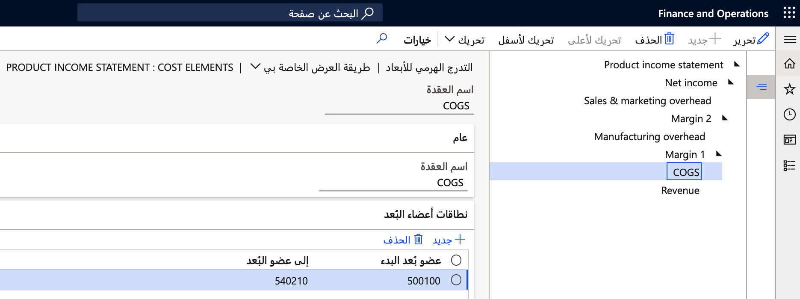

كائنات التكلفة هي أبعاد مالية تقوم بتحليلها ضمن محاسبة التكاليف. تساعد تعيينات الأبعاد عندما تقوم بدمج كيانات قانونية متعددة. يمكنك تعيين قيم الأبعاد المستخدمة في الكيانات القانونية المختلفة إلى قيمة واحدة لتوفير عرض متناسق للبيانات. بالإضافة إلى ذلك، يمكنك تحديد التدرجات الهرمية للأبعاد على كائنات التكلفة لاستخدامها في إعداد التقارير وللمساعدة في جعل العقد الفردية داخل التدرج الهرمي أكثر أماناً.

كائن التكلفة هو أداة تجميع للتكاليف. إنه بُعد مالي. يتم استيراد قائمة الأعضاء في كائن التكلفة من قيم البُعد المالي. ما يجعل كائنات التكلفة مختلفة عن الأبعاد هو القدرة على ربط القيم أو تعيينها من كائن تكلفة واحد (بُعد) إلى كائن تكلفة آخر (بُعد). يمكن أن تساعد هذه التعيينات في ربط القيم التي يجب دمجها من أجل التوحيد. يتم استخدام كائنات التكلفة في التدرجات الهرمية للأبعاد والسياسات.

## إنشاء كائن تكلفة
لإنشاء كائن تكلفة، اتبع هذه الخطوات.

1. انتقل إلى **وحدة محاسبة التكاليف > الأبعاد > أبعاد كائن التكلفة**.
2. عند إعداد كائن تكلفة، حدد البيانات المقدمة في صفحة **كائن التكلفة**. قم بتقديم **الاسم** و **الوصف**.

    > [!div class="mx-imgBorder"]
    > 
    
1. قم بإعداد مزود البيانات عن طريق تحديد عنصر قائمة **تكوين مزود البيانات**. 
2. حدد البُعد المالي الذي تم تعيين كائن التكلفة إليه. يمكنك إنشاء كائنات تكلفة متعددة لنفس البعد المالي.
3. قم باستيراد أعضاء الأبعاد (قيم الأبعاد). حدد عنصر قائمة **استيراد أعضاء البعد**. ما لم يكن لديك العديد من قيم الأبعاد، يمكنك تشغيل هذه العملية دون إنشاء وظيفة دُفعة.

    > [!div class="mx-imgBorder"]
    > 

1. عند استيراد أعضاء البُعد، يمكنك عرض الأعضاء باستخدام عنصر قائمة **عرض أعضاء البُعد**. لا يمكنك تغيير هذه القائمة.

    > [!div class="mx-imgBorder"]
    > 
 
1. يمكنك تحديد كائن تكلفة غير مرتبط بأحد الأبعاد عن طريق تحديد خيار **أعضاء البُعد المستوردين** في حقل **مزود البيانات**.

    > [!div class="mx-imgBorder"]
    > 
     
1. حدد قائمة **تكوين مزود البيانات**.
 
يمكنك استيراد القيم لأعضاء البُعد الذي تم استيراده باستخدام "إطار عمل إدارة البيانات". يستخدم إطار العمل عنصر بيانات **أعضاء أبعاد كائن التكلفة المستوردين**. يتيح لك هذا الكيان تحديد العناصر الإحصائية وتجميع كائنات التكلفة لتقليل مقدار التفاصيل التي تظهر في التقارير. 

## تعيينات الأبعاد
تسمح لك تعيينات الأبعاد بربط قيم أبعاد متعددة بقيمة واحدة لإعداد التقارير. هذا السيناريو شائع عندما تحتفظ العناصر القانونية المختلفة بالبيانات باستخدام مستويات تفاصيل مختلفة وتحتاج إلى دمج البيانات لإعداد التقارير. يقدم البُعد **الذي تم تعيينه إلى** قيمة متسقة يمكن استخدامها بغض النظر عن العنصر القانوني.

لإنشاء تعيينات الأبعاد، حدد عنصر قائمة **تعيينات الأبعاد** من صفحة **بُعد كائن التكلفة**، ثم حدد **تكوين التعيينات من هذا البُعد** أو **تكوين التعيينات لهذا البُعد**.
 
إذا كان يجب تجميع وحدات التكلفة في إحدى الشركات لتصل إلى وحدات التكلفة في شركة أخرى، فحدد **تكوين التعيينات لهذا البعد** بعد أن تحدد بعد وحدة التكلفة. حدد زر **جديد**، وحدد **مجموعات مركز التكلفة** باعتباره **إلى البُعد**. بعد ذلك، أضف جميع التعيينات التي تريد العمل بها. 

في هذا المثال، افترض أن عنصراً قانونياً واحداً سيسجل خدمة العملاء مقابل القنوات الفردية بينما سيسجل العنصر الآخر في مركز تكلفة واحد لعمليات الخدمة. يمكنك ربط جميع القنوات الفردية بمجموعة مركز التكلفة نفسها لتحليلها.

> [!div class="mx-imgBorder"]
> 

يتم إجراء هذا النوع من التعيين بشكل شائع مع الحسابات الرئيسية للدمج. يسمح بإعداد التقارير عبر الشركات مع مجموعة موحدة من الحسابات الرئيسية (ممثلة كعناصر تكلفة). تسمح لك محاسبة التكاليف أيضاً بتعيين الأبعاد المالية (ممثلة كعناصر تكلفة). يمكنك إنشاء العديد من التعيينات حسب حاجتك عن طريق إنشاء المزيد من عناصر التكلفة وعناصر التكلفة من نفس البيانات ثم تحديد تعيينات مختلفة لكل منها. يمكنك استخدام هذا التعيين لعنصر التكلفة لدعم دمج سيناريو المحاسبة عبر الشركات.

## التدرجات الهرمية للأبعاد
التدرج الهرمي عبارة عن شجرة ذات قيم/نطاقات قيم محددة للبُعد المحدد لكل عقدة طرفية. لقطة الشاشة التالية عبارة عن تدرج هرمي بسيط لكشف الأرباح والخسائر استناداً إلى الحسابات الرئيسية (عناصر التكلفة). يمكن إنشاء نفس النوع من الهيكل الهرمي لأي كائن تكلفة (البُعد المالي).

> [!div class="mx-imgBorder"]
> 
 
يمكنك استخدام التدرجات الهرمية للأبعاد لعناصر التكلفة والعناصر الإحصائية وكائنات التكلفة. تعتبر هذه التدرجات الهرمية أبعاداً لأغراض التحليل. 

هناك نوعان من التدرجات الهرمية للأبعاد:

- **التدرجات الهرمية للتصنيف** - استخدم هذا النوع للقواعد وإعداد التقارير. تحتاج إلى تحديد قيمة كل بُعد داخل التدرج الهرمي. 
- **التدرجات الهرمية للتصنيف** - السماح بتحديد قيمة البُعد عدة مرات في التدرج الهرمي أو عدم السماح بذلك على الإطلاق. يتم استخدام هذه التدرجات الهرمية لإعداد التقارير فقط.

لإنشاء تدرج هرمي، انتقل إلى وحدة محاسبة التكاليف، وحدد مجموعة **الأبعاد**، ثم حدد **التدرجات الهرمية للأبعاد**. حدد زر **جديد** لإنشاء تدرج هرمي ثم حدد نوع التدرج الهرمي. 

> [!NOTE]
> يمكن أن تستخدم كائنات التكلفة فقط نوع التدرج الهرمي **التصنيف**.

## تأمين التدرج الهرمي
إذا كنت تريد تقييد الوصول إلى عقد معينة في التدرج الهرمي لمستخدمين محددين، فيمكنك إضافة المستخدمين إلى علامة التبويب السريعة **المستخدم** للتدرج الهرمي. تكون علامة التبويب هذه مرئية فقط إذا قمت بتعيين قيمة الخيار **التدرج الهرمي لقائمة الوصول** إلى **نعم**.
 
يمكنك فقط إضافة مستخدمين فرديين (وليس مجموعات مستخدمين) في علامة التبويب هذه. سيتمكن المستخدمون الذين تحددهم فقط من الوصول إلى العقدة المحددة وأي عقد فرعية.
 
