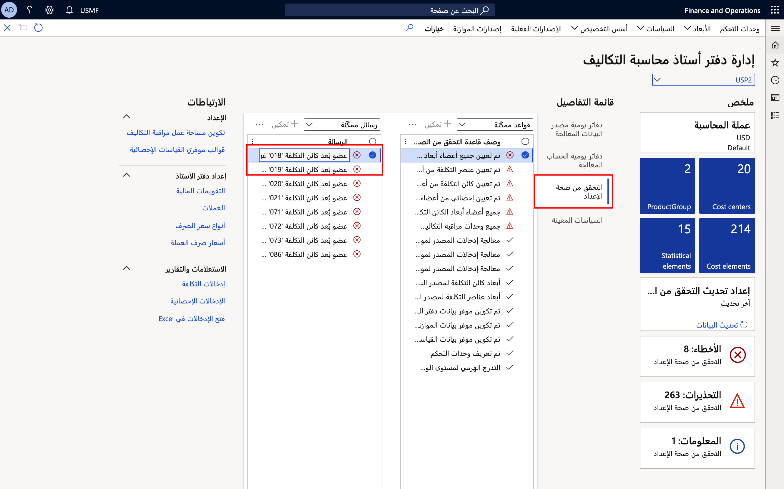
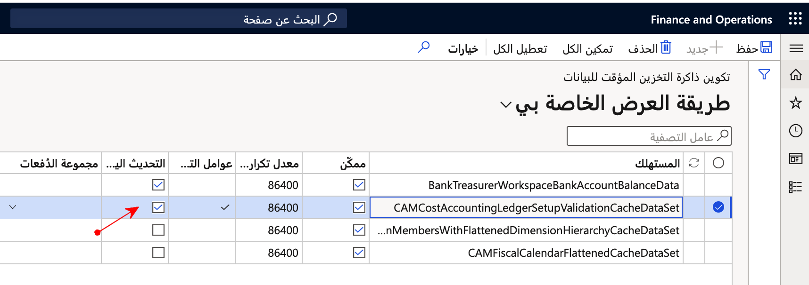
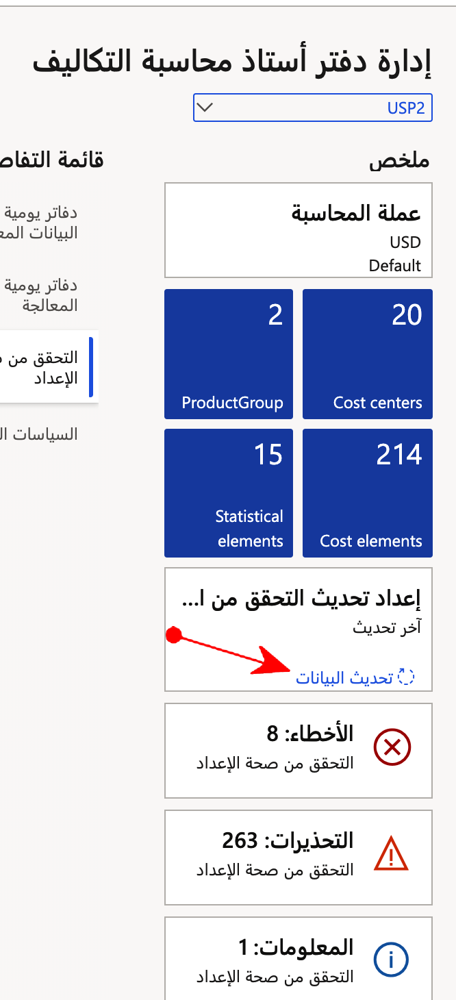

ستحتاج إلى إكمال خطوات الإعداد الأخرى بعد تشغيل المعالج، بما في ذلك:

- عناصر التكلفة
- كائنات التكلفة
- التدرجات الهرمية للأبعاد
- العناصر الإحصائية
- استيراد البَيانات
- تحديد السياسات
- تكوين مساحة عمل التحكم فِي التكلفة

## عناصر التكلفة
يقوم المعالج بإنشاء عنصر تكلفة واحد. يمثل عنصر التكلفة هذا جميع الحسابات الرئيسية ويستخدم أنواع الحسابات الرئيسية المحددة. يُمكنك إنشاء المزيد من عناصر التكلفة باستخدام مجموعات فرعية من الحسابات الرئيسية. يستخدم النظام عناصر التكلفة لتشكيل عرض البَيانات وتطبيق السياسات.

## كائنات التكلفة والتدرجات الهرمية للأبعاد
سترغب فِي استخدام أكثر من عنصر تكلفة واحد. أضف المزيد من كائنات التكلفة باستخدام العملية المحددة لاحقًا فِي هذه الوحدة. تسمح لك التدرجات الهرمية للأبعاد بإنشاء العديد من التدرجات الهرمية التي قد تحتاجها للمساعدة في تأمين كائنات التكلفة وتجميعها.

## العناصر الإحصائية
عادة، تكون العناصر الإحصائية عبارة عن كميات مثل عدد الموظفين. يُمكنك استيراد البَيانات الإحصائية إلى إدارة التكلفة وإجراء عمليات تخصيص داخل إدارة التكلفة للتقارير الداخلية بدلاً من أو بالإضافة إلى عمليات التخصيص التي يتم تشغيلها فِي دفتر الأستاذ العام.

## استيراد البَيانات
يتم استيراد بَيانات دفتر الأستاذ العام والميزانية. يجب عليك استيراد البَيانات عندما تريد إجراء التحليلات. ستحتاج إلى استيراد البَيانات مرة أخرى إذا تغيرت البَيانات.

## السياسات
تصف السياسات كيفية تغيير البَيانات الموجودة فِي دفتر أستاذ محاسبة التكاليف أثناء التوزيعات والتخصيصات. يُمكنك إنشاء أنواع السياسات التالية:  

- سلوك التكلفة
- توزيع التكلفة
- زيادة التكلفة
- توزيع التكلفة
- معدل النفقات العامة

لإنشاء السياسات، انتقل إلى وحدة محاسبة التكاليف ثم حدد **مجموعة السياسات**.

## مساحة عمل إدارة دفتر أستاذ محاسبة التكاليف
تتيح لك مساحة عمل **إدارة دفتر أستاذ محاسبة التكاليف** مراجعة محفوظات استيراد البَيانات واستيراد المزيد من البَيانات. تتوفر مساحة العمل من قسم **مساحات العمل** فِي جزء التنقل وأعلى وحدة محاسبة التكاليف. تحدث الإدارة المستمرة لبَيانات بيئة التكلفة داخل مساحة العمل هذه.

## تحقق من صحة التكوين 
توفر مساحة عمل **إدارة دفتر أستاذ محاسبة التكاليف** رسائل التحقق من الصحة لمساعدتك فِي إعداد محاسبة التكاليف. راجع الرسائل وقم بإجراء التصحيحات بالشكل المناسب. 

> [!div class="mx-imgBorder"]
> 
 
بالنسبة إلى التدرج الهرمي للتصنيف، يجب عليك تحديد كل قيمة. تشير الرسالة التي تظهر في الصورة السابقة إلى أن قيمة البُعد مفقودة في التدرج الهرمي. 

لتمكين تحديث التحقق:

1. انتقل إلى **إدارة النظام > الإعداد > ذاكرة التخزين المؤقت للبَيانات > تكوين ذاكرة التخزين المؤقت للبَيانات**.
2. حدد **CAMCostAccountingLedgerSetupValidationCacheDataSet** في العمود **المستهلك**.
3. حدد خانة الاختيار **تمكين التحديث اليدوي**.

    > [!div class="mx-imgBorder"]
    > 

يتيح هذا الإجراء الارتباط **تحديث البَيانات** فِي الإطار المتجانب **تحديث إعداد التحقق من الصحة**.

> [!div class="mx-imgBorder"]
> 
