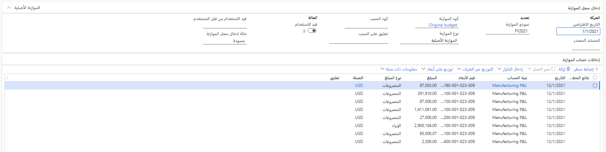

يقوم الشخص المسؤول عن حسابات المقبوضات بإنشاء الموازنات وصيانتها، وذلك بالإضافة إلى إدارة التنبؤات بالتدفقات النقدية لشركة Contoso. لم تقم أي قسم من الأقسام في السابق بتنفيذ العديد من التغييرات. وقد تم عزو هذا النقص في التغيير إلى غياب تقييمات أداء نهاية العام، التي تساعد في إجراء تسويات الموازنة الضرورية للعام التالي.

يوفر Finance insights نهجًا بديهيًا لمعالجة الموازنات باستخدام البيانات المحفوظة لإنشاء نموذج تعلم آلي يقوم بإنشاء موازنات دقيقة. بعض الأقسام التي يقوم فيها الشخص المسؤول عن حسابات المقبوضات بإعداد الموازنات لها ستتقلب بدرجة أقل من الأقسام الأخرى، مثل كشف الرواتب. ومع ذلك، بفضل النتائج التنبؤية لـ Finance insights، يمكنهم التنبؤ بدقة، بغض النظر عن مقدار التغيير الذي تجريه الأقسام كل عام.

> [!div class="mx-imgBorder"]
> 

من الآن، يمكن للشخص المسؤول عن حسابات المقبوضات إجراء التسويات اليدوية الضرورية، ثم تقديم هذه المعلومات إلى الأشخاص الذين سيقومون باعتماد الموازنات لشركة Contoso.
