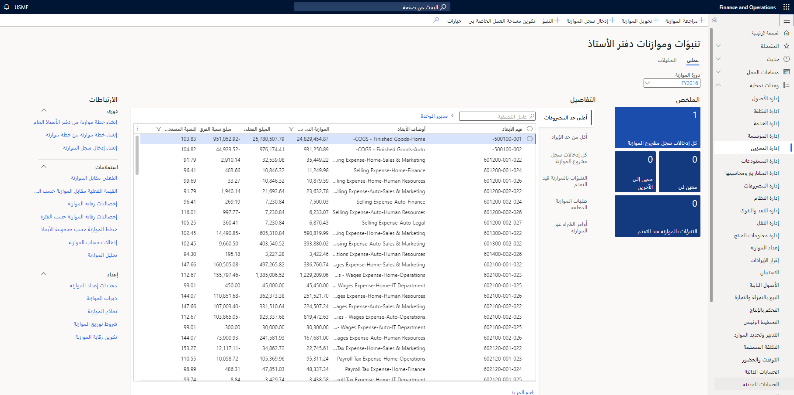

باستخدام عملية إعداد موازنة مناسبة، يمكن للشركات الاستفادة من التنبؤ واستخدام الرؤى المالية لمقارنة القيم الفعلية بالموازنة المخصصة.
ويمكنك استخدام الوحدة النمطية "إعداد الموازنة في Finance" لإعداد الموازنة الأساسية وتخطيط الموازنة ومراقبتها.

بعد إنشاء الموازنة والموافقة عليها في Finance، يمكنك تحويل خطة الموازنة إلى "إدخال سجل موازنة". توفر إدخالات سجل الموازنة أدوات للاحتفاظ بالموازنة والمحافظة على تعقب المبالغ عن طريق رموز الموازنة.

تتيح لك إدخالات سجل الموازنة مراجعة الموازنات الأصلية وتنفيذ التحويلات وترحيل مبالغ الموازنة من العام السابق.
تبعًا للموازنة التي تم إنشاؤها، يمكن للشركة تمكين التحكم في الموازنة.
يعتمد مستوى التحكم على الثقافة التنظيمية ومستوى نضج المؤسسة.

تشمل Finance إطار عمل التحكم في الموازنة، والذي يتيح لإدارة الشركة اختيار إما التحكم الصارم (الذي يمنع الترحيلات التي تتجاوز الموازنة) أو التحكم المرن (حيث يتم تحذير المستخدمين من أنهم سيتجاوزون أموال الموازنة المتاحة، ولكن يمكنهم أن يقرروا بأنفسهم كيفية المتابعة).

في النهاية، يمكنك استخدام التنبؤات المتداولة. التنبؤ الدوار هو مقارنة عادية للموازنة بالمبالغ الفعلية ويُستخدم لتحديد مدى قدرة الشركة على العمل مقابل الموازنة. يُستخدم التنبؤ المتداول أيضاً لتحديد التوجهات. في Finance، يتم دعم التنبؤات المتداولة من خلال مستند خطة الموازنة كأنشطة تخطيط أولية. يمكن تنفيذ التنبؤات المتداولة بالتوازي مع التخطيط لدورة الموازنة القادمة.
