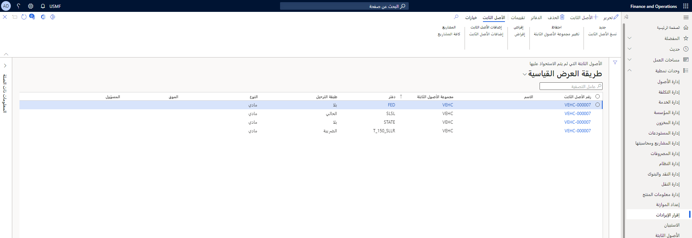

الأصول الثابتة هي أصناف لها قيمة، مثل المباني والمركبات والأراضي والمعدات، التي يمتلكها أحد الأفراد أو إحدى الشركات.

يمكن إعداد وإدخال معلومات الامتلاك للأصول الثابتة، ثم إدارتها بواسطة إهلاكها وتعيين حد رسملة لتحديد الإهلاك.

فيما يلي أمثلة على المهام التي يمكنك تنفيذها في الوحدة النمطية الخاصة بالأصول الثابتة:

-   إنشاء أصول ثابتة
-   رسملة الأصول الثابتة
-   تحويل أو إقراض الأصول الثابتة
-   إعادة تقييم الأصول الثابتة أو تحديثها
-   تقسيم الأصول الثابتة
-   إهلاك الأصول الثابتة أو استهلاكها
-   التخلص أو التقاعد من الأصول الثابتة

عند استخدام دفتر الأستاذ العام مع الأصول الثابتة، فإنه يمكن عرض القيمة الحالية لكل الأصول الثابتة.

يجب أن تتوافق طريقة التعامل مع الأصول الثابتة مع كلٍ من معايير المحاسبة العالمية وقوانين المحاسبة في كل بلد أو منطقة. وقد تتضمن المتطلبات قواعد لتسجيل حركات الامتلاك والتخلص، والإهلاك ومدة البقاء وعمليات رفع وخفض قيمة الأصول الثابتة.

تتضمن وظيفة الأصول الثابتة في Finance العديد من هذه المعايير والقواعد.
