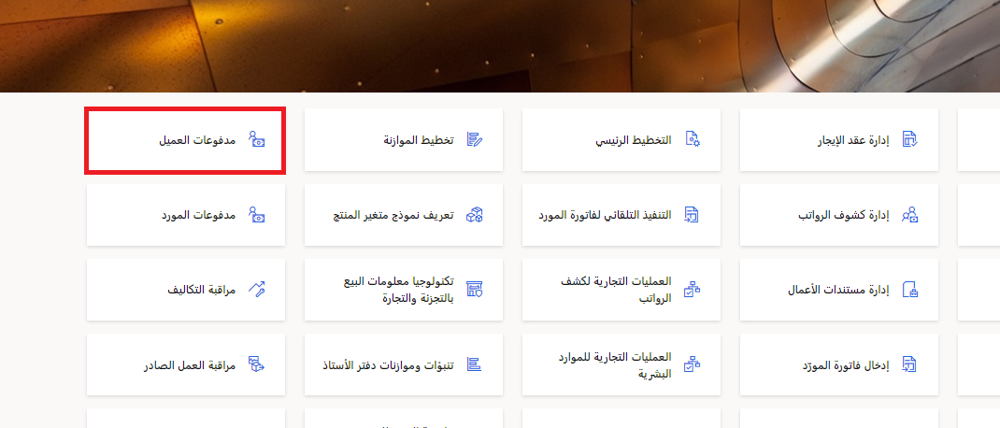
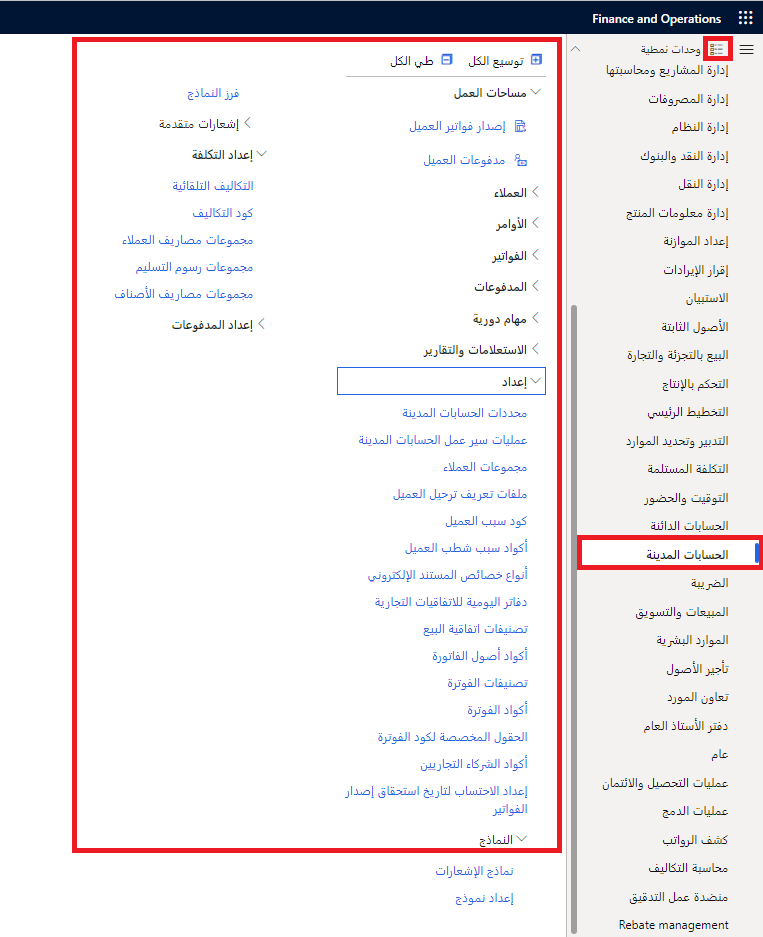

## السيناريو
الآن بعد أن تعرفت على أساسيات Dynamics 365 Finance والوحدات والميزات التي يتضمنها، حان دورك للاستكشاف.

1.  بعد أن تقوم بتسجيل الدخول إلى بيئة معملية باتباع الإرشادات المذكورة أعلاه، يمكنك تحديد الإطارات المتجانبة الموجودة في **الصفحة الرئيسية** لفتح مساحات العمل. على سبيل المثال، ستقوم **مدفوعات العميل** بفتح مساحة عمل **مدفوعات العميل**.

    
 
    قم بإغلاق مساحة العمل بتحديد العلامة **X** في أعلى اليسار من الصفحة.
2.  حدد أيقونة **الوحدات النمطية** في جزء التنقل على اليمين، وافتح وحدة نمطية، واستكشف العديد من الصفحات في تلك الوحدة النمطية. على سبيل المثال، **الحسابات المدينة**.

    
 
    > [!NOTE]
    > في بيئة المعمل هذه، يوجد مزيد من تطبيقات Dynamics 365 المثبتة أكثر من Dynamics 365 Finance. لذلك، سترى أيضاً وحدات ليست جزءاً من Finance. 

3.  عند الانتهاء من استكشاف Dynamics 365 Finance، يمكنك إغلاق بيئة المختبر والعودة إلى وحدة Microsoft Learn.
