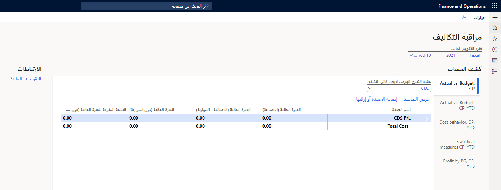

تتيح لك محاسبة التكاليف جمع البيانات من مصادر مختلفة، مثل دفتر الأستاذ العام ودفاتر الأستاذ الفرعية والموازنات والمعلومات الإحصائية. ويمكنك تحليل بيانات التكلفة وتلخيصها وتقييمها لتمكين الإدارة لاتخاذ أفضل القرارات الممكنة للمهمة التالية، بما في ذلك القرارات الأخرى:

- تحديثات الأسعار
- الموازنات
- مراقبة التكاليف

مساحة عمل  **التحكم في التكاليف**  هي نقطة مركزية حيث يمكن للمديرين المسؤولين عن التحكم في كائن تكلفة أو مجموعة من كائنات تكلفة داخل بعد أو عبر الأبعاد (على سبيل المثال، مراكز التكلفة ومجموعات المنتجات) الوصول إلى التقارير. تتم أداره التقارير الموجودة في مساحة عمل **التحكم في التكلفة** بمحاسبي التكلفة بحيث يكون التخطيط والبيانات المستخدمة لإعداد التقارير متسقة عبر المؤسسة.

